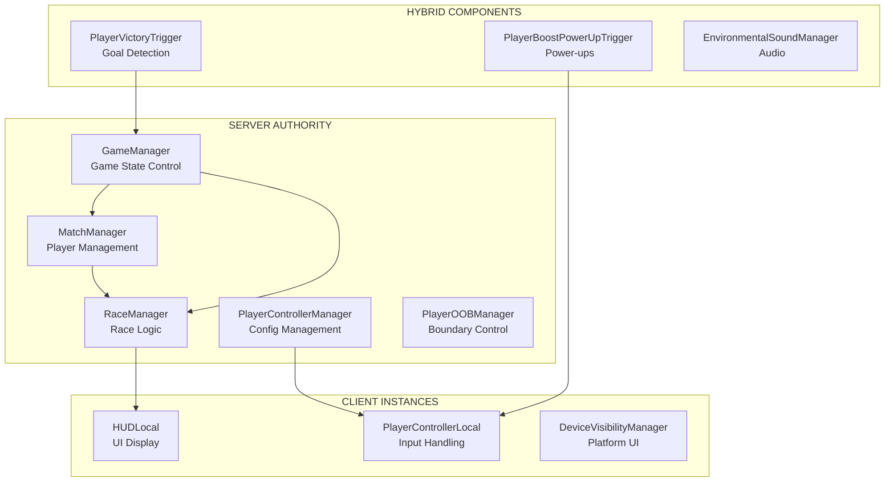
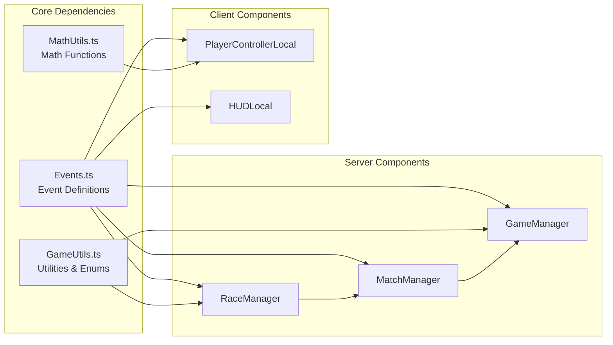

This file is a merged representation of a subset of the codebase, containing specifically included files, combined into a single document by Repomix.
The content has been processed where comments have been removed.

# File Summary

## Purpose
This file contains a packed representation of the entire repository's contents.
It is designed to be easily consumable by AI systems for analysis, code review,
or other automated processes.

## File Format
The content is organized as follows:
1. This summary section
2. Repository information
3. Directory structure
4. Repository files (if enabled)
5. Multiple file entries, each consisting of:
  a. A header with the file path (## File: path/to/file)
  b. The full contents of the file in a code block

## Usage Guidelines
- This file should be treated as read-only. Any changes should be made to the
  original repository files, not this packed version.
- When processing this file, use the file path to distinguish
  between different files in the repository.
- Be aware that this file may contain sensitive information. Handle it with
  the same level of security as you would the original repository.

## Notes
- Some files may have been excluded based on .gitignore rules and Repomix's configuration
- Binary files are not included in this packed representation. Please refer to the Repository Structure section for a complete list of file paths, including binary files
- Only files matching these patterns are included: **/*
- Files matching patterns in .gitignore are excluded
- Files matching default ignore patterns are excluded
- Code comments have been removed from supported file types
- Files are sorted by Git change count (files with more changes are at the bottom)

# Directory Structure
```
719949204531018/scripts/.editor
719949204531018/scripts/.gitignore
719949204531018/scripts/.vscode/settings.json
719949204531018/scripts/DeviceVisibilityManager.ts
719949204531018/scripts/EnvironmentalSoundManager.ts
719949204531018/scripts/Events.ts
719949204531018/scripts/GameManager.ts
719949204531018/scripts/GameUtils.ts
719949204531018/scripts/HideTeachingObjects.ts
719949204531018/scripts/HUDLocal.ts
719949204531018/scripts/HUDManager.ts
719949204531018/scripts/MatchManager.ts
719949204531018/scripts/MathUtils.ts
719949204531018/scripts/package.json
719949204531018/scripts/PlayerBoostPowerUpTrigger.ts
719949204531018/scripts/PlayerControllerLocal.ts
719949204531018/scripts/PlayerControllerManager.ts
719949204531018/scripts/PlayerEventTriggerBase.ts
719949204531018/scripts/PlayerOOBManager.ts
719949204531018/scripts/PlayerOOBRespawner.ts
719949204531018/scripts/PlayerOOBTrigger.ts
719949204531018/scripts/PlayerRegisterMatchTrigger.ts
719949204531018/scripts/PlayerVictoryTrigger.ts
719949204531018/scripts/RaceManager.ts
719949204531018/scripts/TECHNICAL_DOCUMENTATION.md
719949204531018/scripts/TeleportToSpawnPointTrigger.ts
719949204531018/scripts/ToggleGatesOnGameStateChange.ts
719949204531018/scripts/ToggleTrailTrigger.ts
719949204531018/scripts/tsconfig.json
719949204531018/scripts/types/CreateClasses.d.ts
719949204531018/scripts/types/horizon_core.d.ts
719949204531018/scripts/types/horizon_ui.d.ts
719949204531018/scripts/types/HorizonGlobal.d.ts
719949204531018/scripts/types/HorizonI18nUtils.d.ts
719949204531018/scripts/types/HorizonUIUtils.d.ts
repomix-output.xml
repomix.config.json
```

# Files

## File: repomix-output.xml
````xml
This file is a merged representation of a subset of the codebase, containing specifically included files, combined into a single document by Repomix.

<file_summary>
This section contains a summary of this file.

<purpose>
This file contains a packed representation of the entire repository's contents.
It is designed to be easily consumable by AI systems for analysis, code review,
or other automated processes.
</purpose>

<file_format>
The content is organized as follows:
1. This summary section
2. Repository information
3. Directory structure
4. Repository files (if enabled)
5. Multiple file entries, each consisting of:
  - File path as an attribute
  - Full contents of the file
</file_format>

<usage_guidelines>
- This file should be treated as read-only. Any changes should be made to the
  original repository files, not this packed version.
- When processing this file, use the file path to distinguish
  between different files in the repository.
- Be aware that this file may contain sensitive information. Handle it with
  the same level of security as you would the original repository.
</usage_guidelines>

<notes>
- Some files may have been excluded based on .gitignore rules and Repomix's configuration
- Binary files are not included in this packed representation. Please refer to the Repository Structure section for a complete list of file paths, including binary files
- Only files matching these patterns are included: **/*
- Files matching patterns in .gitignore are excluded
- Files matching default ignore patterns are excluded
- Files are sorted by Git change count (files with more changes are at the bottom)
</notes>

</file_summary>

<directory_structure>
719949204531018/scripts/.editor
719949204531018/scripts/.gitignore
719949204531018/scripts/.vscode/settings.json
719949204531018/scripts/DeviceVisibilityManager.ts
719949204531018/scripts/EnvironmentalSoundManager.ts
719949204531018/scripts/Events.ts
719949204531018/scripts/GameManager.ts
719949204531018/scripts/GameUtils.ts
719949204531018/scripts/HideTeachingObjects.ts
719949204531018/scripts/HUDLocal.ts
719949204531018/scripts/HUDManager.ts
719949204531018/scripts/MatchManager.ts
719949204531018/scripts/MathUtils.ts
719949204531018/scripts/package.json
719949204531018/scripts/PlayerBoostPowerUpTrigger.ts
719949204531018/scripts/PlayerControllerLocal.ts
719949204531018/scripts/PlayerControllerManager.ts
719949204531018/scripts/PlayerEventTriggerBase.ts
719949204531018/scripts/PlayerOOBManager.ts
719949204531018/scripts/PlayerOOBRespawner.ts
719949204531018/scripts/PlayerOOBTrigger.ts
719949204531018/scripts/PlayerRegisterMatchTrigger.ts
719949204531018/scripts/PlayerVictoryTrigger.ts
719949204531018/scripts/RaceManager.ts
719949204531018/scripts/TECHNICAL_DOCUMENTATION.md
719949204531018/scripts/TeleportToSpawnPointTrigger.ts
719949204531018/scripts/ToggleGatesOnGameStateChange.ts
719949204531018/scripts/ToggleTrailTrigger.ts
719949204531018/scripts/tsconfig.json
719949204531018/scripts/types/CreateClasses.d.ts
719949204531018/scripts/types/horizon_core.d.ts
719949204531018/scripts/types/horizon_ui.d.ts
719949204531018/scripts/types/HorizonGlobal.d.ts
719949204531018/scripts/types/HorizonI18nUtils.d.ts
719949204531018/scripts/types/HorizonUIUtils.d.ts
repomix.config.json
</directory_structure>

<files>
This section contains the contents of the repository's files.

<file path="repomix.config.json">
{
  "output": {
    "file": "repomix-output.md"
  },
  "include": [
    "**/*"
  ],
  "exclude": [
    "**/.backups/**",
    "**/.vscode/**",
    "**/node_modules/**",
    "**/*.md"
  ]
}
</file>

<file path="719949204531018/scripts/.editor">
{"PlayerControllerManager":"6be57798cd3061f6ed0bf48a20af41fb","PlayerControllerLocal":"10e7c0038e0f0b728bc8aba3b298e649","HUDLocal":"096075cb2d256bfbb289faab47c6de22","GameUtils":"c5fd4530dac605a96dbe927bcfcd1ed6","GameManager":"a3db21fd8828393924b885bc34051582","MathUtils":"b7f5849293ab7826ca15970a4c42ce85","PlayerOOBManager":"d8300a04ef5668f7c131009668de4732","PlayerOOBTrigger":"9961cf85721ee999236249a0660a1a8e","RaceManager":"948ea96aa1820bfb2732bc352d6e475c","PlayerVictoryTrigger":"f620522bb7b2c8cf4cc505564c8c0703","PlayerEventTriggerBase":"1cde03c4433c94a69ec97bc9c293398d","PlayerRegisterMatchTrigger":"042dccb504f7d679abcf46181a552903","MatchManager":"41a1247cea3ccdd95ffe8258f3a53247","ToggleTrailTrigger":"7e92e9261e4e5dfa23d364534c1989d1","HUDManager":"1857a17375751747c64ef497d1d6d178","TeleportToSpawnPointTrigger":"92bbb376ba2003b27853d24aaedc2bea","PlayerBoostPowerUpTrigger":"69b1bd2e03da7b75f4699ec4d5bd3ec4","Events":"552a7a711dff922e4f5b0f7358c974bf","EnvironmentalSoundManager":"85add5213c8aa0279a6a8cdd3114e141","PlayerOOBRespawner":"c4b51834d7a1bf8f02b92434565414e9","ToggleGatesOnGameStateChange":"f66d0f571a8997d856cbfa7abf254ce5","HideTeachingObjects":"c26a303c95d193f573646ebb5535d69f","DeviceVisibilityManager":"cd0038487c49bbb6053176cbaa1a4a9e"}
</file>

<file path="719949204531018/scripts/.gitignore">
.backups/
.operations.log
</file>

<file path="719949204531018/scripts/.vscode/settings.json">
{
  "typescript.enablePromptUseWorkspaceTsdk": true,
  "typescript.tsdk": "./node_modules/typescript/lib"
}
</file>

<file path="719949204531018/scripts/DeviceVisibilityManager.ts">
import * as hz from 'horizon/core';

type Props = {
  showOnVR:boolean,
  showOnDesktop:boolean,
  showOnMobile:boolean,
};

class VisiblePerPlatform extends hz.Component<Props> {
  static propsDefinition = {
    showOnVR:{type:hz.PropTypes.Boolean, default:false},
    showOnDesktop:{type:hz.PropTypes.Boolean, default:false},
    showOnMobile:{type:hz.PropTypes.Boolean, default:false},
  };

  private readonly visibleToList: hz.Player[] = [];

  preStart() {

    this.connectCodeBlockEvent(this.entity, hz.CodeBlockEvents.OnPlayerEnterWorld, (player:hz.Player) => {
      let canSee = false;

      const deviceType = player.deviceType.get();
      canSee ||= (this.props.showOnVR && deviceType == hz.PlayerDeviceType.VR);
      canSee ||= (this.props.showOnDesktop && deviceType == hz.PlayerDeviceType.Desktop);
      canSee ||= (this.props.showOnMobile && deviceType == hz.PlayerDeviceType.Mobile);

      if(canSee){
        this.visibleToList.push(player);
      }

      this.setVisibilityForPlayers(this.visibleToList)
    });

    this.connectCodeBlockEvent(this.entity, hz.CodeBlockEvents.OnPlayerExitWorld, (player:hz.Player) => {
      const indexToRemove = this.visibleToList.findIndex((p) => p.id == player.id);

      if(indexToRemove != -1){
        this.visibleToList.splice(indexToRemove, 1);
      }

    });
  }

  start() {}

  setVisibilityForPlayers(players: hz.Player[], visibleTo: boolean = true) {
    this.entity.setVisibilityForPlayers(players, visibleTo ? hz.PlayerVisibilityMode.VisibleTo : hz.PlayerVisibilityMode.HiddenFrom);
  }
}
hz.Component.register(VisiblePerPlatform);
</file>

<file path="719949204531018/scripts/EnvironmentalSoundManager.ts">
/**
 * Controls the playing of sounds that are heard by all players throughout the world, based on the game state.
 * Examples include the countdown to race start.
 */
import * as hz from 'horizon/core';
import { GameState, Pool } from 'GameUtils';
import { Events } from "Events";

export class EnvironmentalSoundManager extends hz.Component<typeof EnvironmentalSoundManager> {
  static propsDefinition = {
    LobbyBGAudio: { type: hz.PropTypes.Entity },
    LobbyReadyUpBGAudio: { type: hz.PropTypes.Entity },
    RaceBGAudio: { type: hz.PropTypes.Entity },

    countdown10VO: { type: hz.PropTypes.Entity },
    countdown3VO: { type: hz.PropTypes.Entity },
    countdown2VO: { type: hz.PropTypes.Entity },
    countdown1VO: { type: hz.PropTypes.Entity },

    matchStartedVO: { type: hz.PropTypes.Entity }, //plays when transiting from StartingMatch to PlayingMatch
    matchEndingVO: { type: hz.PropTypes.Entity },  //plays when transiting from PlayingMatch to EndingMatch (firstPlayer has reached)
    matchEndedVO: { type: hz.PropTypes.Entity },   //plays when transiting from EndingMatch to CompletedMatch
  };

  private static s_instance: EnvironmentalSoundManager
  public static getInstance(): EnvironmentalSoundManager {
    return EnvironmentalSoundManager.s_instance;
  }

  constructor() {
    super();
    if (EnvironmentalSoundManager.s_instance === undefined) {
      EnvironmentalSoundManager.s_instance = this;
    }
    else {
      console.error(`There are two ${this.constructor.name} in the world!`)
      return;
    }
  }

  LobbyBGAudio: hz.AudioGizmo | null = null;
  LobbyReadyUpBGAudio: hz.AudioGizmo | null = null;
  RaceBGAudio: hz.AudioGizmo | null = null;

  countdown1VO: hz.AudioGizmo | null = null;
  countdown2VO: hz.AudioGizmo | null = null;
  countdown3VO: hz.AudioGizmo | null = null;
  countdown10VO: hz.AudioGizmo | null = null;

  matchStartedVO: hz.AudioGizmo | null = null;
  matchEndedVO: hz.AudioGizmo | null = null;

  matchEndingVO: hz.AudioGizmo | null = null;

  readonly BGMAudioOptions: hz.AudioOptions = { fade: 2 };
  readonly VOAudioOptions: hz.AudioOptions = { fade: 0 };

  preStart() {
    this.LobbyBGAudio = this.props.LobbyBGAudio?.as(hz.AudioGizmo) ?? null;
    this.LobbyReadyUpBGAudio = this.props.LobbyReadyUpBGAudio?.as(hz.AudioGizmo) ?? null;
    this.RaceBGAudio = this.props.RaceBGAudio?.as(hz.AudioGizmo) ?? null;

    this.countdown10VO = this.props.countdown10VO?.as(hz.AudioGizmo) ?? null;
    this.countdown3VO = this.props.countdown3VO?.as(hz.AudioGizmo) ?? null;
    this.countdown2VO = this.props.countdown2VO?.as(hz.AudioGizmo) ?? null;
    this.countdown1VO = this.props.countdown1VO?.as(hz.AudioGizmo) ?? null;

    this.matchStartedVO = this.props.matchStartedVO?.as(hz.AudioGizmo) ?? null;
    this.matchEndingVO = this.props.matchEndingVO?.as(hz.AudioGizmo) ?? null;
    this.matchEndedVO = this.props.matchEndedVO?.as(hz.AudioGizmo) ?? null;

    this.LobbyBGAudio?.play(this.BGMAudioOptions);
    this.connectLocalBroadcastEvent(Events.onGameStateChanged, (data) => {

      if (data.fromState === GameState.ReadyForMatch && data.toState === GameState.StartingMatch) {
        this.RaceBGAudio?.stop(this.BGMAudioOptions);
        this.LobbyReadyUpBGAudio?.play(this.BGMAudioOptions);
        this.LobbyBGAudio?.stop(this.BGMAudioOptions);

      }
      else if (data.fromState === GameState.StartingMatch && data.toState === GameState.PlayingMatch) {

        this.RaceBGAudio?.play(this.BGMAudioOptions);
        this.LobbyReadyUpBGAudio?.stop(this.BGMAudioOptions);
        this.LobbyBGAudio?.stop(this.BGMAudioOptions);

        this.matchStartedVO?.play(this.VOAudioOptions);

      }
      else if (data.toState === GameState.ReadyForMatch) {
        this.RaceBGAudio?.stop(this.BGMAudioOptions);
        this.LobbyReadyUpBGAudio?.stop(this.BGMAudioOptions);
        this.LobbyBGAudio?.play(this.BGMAudioOptions);

      } else if (data.toState === GameState.EndingMatch) {
        this.matchEndingVO?.play(this.VOAudioOptions);

      } else if (data.toState === GameState.CompletedMatch) {
        this.matchEndedVO?.play(this.VOAudioOptions);

      }
    });

    this.connectLocalBroadcastEvent(Events.onGameStartTimeLeft, (data) => {
      const timeLeftMS = data.timeLeftMS;
      if (timeLeftMS <= 3500 && timeLeftMS > 2500) {
        this.countdown3VO?.play(this.VOAudioOptions);
      }
      else if (timeLeftMS <= 2500 && timeLeftMS > 1500) {
        this.countdown2VO?.play(this.VOAudioOptions);
      }
      else if (timeLeftMS <= 1500) {
        this.countdown1VO?.play(this.VOAudioOptions);
      }
    });

    this.connectLocalBroadcastEvent(Events.onGameEndTimeLeft, (data) => {
      const timeLeftMS = data.timeLeftMS;
      if (timeLeftMS <= 10500 && timeLeftMS > 9500) {
        this.countdown10VO?.play(this.VOAudioOptions);
      }
      else
        if (timeLeftMS <= 3500 && timeLeftMS > 2500) {
          this.countdown3VO?.play(this.VOAudioOptions);
        }
        else if (timeLeftMS <= 2500 && timeLeftMS > 1500) {
          this.countdown2VO?.play(this.VOAudioOptions);
        }
        else if (timeLeftMS <= 1500) {
          this.countdown1VO?.play(this.VOAudioOptions);
        }
    });
  }

  start() {
  }
}

hz.Component.register(EnvironmentalSoundManager);
</file>

<file path="719949204531018/scripts/Events.ts">
/**
 * Contains the event container for the entire world
 */
import { GameState, PlayerGameStatus } from "GameUtils";
import * as hz from "horizon/core";

export const Events = {
    onGameStateChanged: new hz.LocalEvent<{ fromState: GameState; toState: GameState; }>("onGameStateChanged"),

    onRegisterPlayerForMatch: new hz.LocalEvent<{ player: hz.Player }>("onRegisterPlayerForMatch"),
    onDeregisterPlayerForMatch: new hz.LocalEvent<{ player: hz.Player }>("onDeregisterPlayerForMatch"),

    onPlayerJoinedStandby: new hz.LocalEvent<{ player: hz.Player }>("onPlayerJoinedStandby"),
    onPlayerLeftMatch: new hz.LocalEvent<{ player: hz.Player }>("onPlayerLeftMatch"),
    onPlayerLeftStandby: new hz.LocalEvent<{ player: hz.Player }>("onPlayerLeftStandby"),
    onPlayerReachedGoal: new hz.LocalEvent<{ player: hz.Player }>("onPlayerReachedGoal"),

    onResetLocalObjects: new hz.NetworkEvent("onResetLocalObjects"),

    onResetWorld: new hz.NetworkEvent("onResetWorld"),

    onGameEndTimeLeft: new hz.LocalEvent<{ timeLeftMS: number }>("onGameEndTimeLeft"),
    onGameStartTimeLeft: new hz.LocalEvent<{ timeLeftMS: number }>("onGameStartTimeLeft"),

    onRegisterPlyrCtrl: new hz.LocalEvent<{ caller: hz.Entity }>("onRegisterPlyrCtrl"),
    onGetPlyrCtrlData: new hz.NetworkEvent<{ caller: hz.Player }>("onGetPlyrCtrlData"),
    onSetPlyrCtrlData: new hz.NetworkEvent<{ doubleJumpAmount: number; boostJumpAmount: number; boostJumpAngle: number; }>("onSetPlyrCtrlData"),

    onPlayerGotBoost: new hz.NetworkEvent("onPlayerGotBoost"),  //The server needs to tell the local player controller that they have a boost
    onPlayerUsedBoost: new hz.LocalEvent("onPlayerUsedBoost"),  //this can be a local event given that we are only running it from the local player
    onPlayerUsedDoubleJump: new hz.LocalEvent("onPlayerUsedDoubleJump"),  //this can be a local event given that we are only running it from the local player

    onRegisterOOBRespawner: new hz.LocalEvent<{ caller: hz.Entity }>("onRegisterOOBRespawner"),
    onGetOOBRespawnerData: new hz.NetworkEvent<{ caller: hz.Entity }>("onGetOOBRespawnerData"),
    onSetOOBRespawnerData: new hz.NetworkEvent<{ intervalMS: number, OOBWorldYHeight: number }>("onSetOOBRespawnerData"),

    onPlayerOutOfBounds: new hz.NetworkEvent("onPlayerOutOfBounds"),
    onRegisterRaceHUD: new hz.LocalEvent<{ caller: hz.Entity }>("onRegisterRaceHUD"),

    onRacePosUpdate: new hz.NetworkEvent<{ playerPos: number, totalRacers: number, matchTime: number }>('onRacePosUpdate'),
    onStopRacePosUpdates: new hz.NetworkEvent('onStopRacePosUpdates'),

    //onPlayerListInStatusChanged : new hz.LocalEvent<{ pgs: PlayerGameStatus , player: hz.Player[]}>('onPlayerListInStatusChanged'),
};
</file>

<file path="719949204531018/scripts/GameManager.ts">
/**
 * Controls the overall game state of the world, listening to events occurring and transiting the game state accordingly
 */
import * as hz from 'horizon/core';
import { Events } from "Events";
import { timedIntervalActionFunction, GameState, PlayerGameStatus } from 'GameUtils';
import { MatchManager } from 'MatchManager';

export class GameManager extends hz.Component<typeof GameManager> {

  static propsDefinition = {
    startLineGameStateUI: { type: hz.PropTypes.Entity },
    finishLineGameStateUI: { type: hz.PropTypes.Entity },

    timeToMatchStartMS: { type: hz.PropTypes.Number, default: 3000 },
    timeToMatchEndMS: { type: hz.PropTypes.Number, default: 3000 },
    timeNewMatchReadyMS: { type: hz.PropTypes.Number, default: 3000 },

    minTimeToShowStartPopupsMS: { type: hz.PropTypes.Number, default: 3000 },
    minTimeToShowEndPopupsMS: { type: hz.PropTypes.Number, default: 10000 },

    playersNeededForMatch: { type: hz.PropTypes.Number, default: 1 },
  };

  private currentGameState = GameState.ReadyForMatch;
  private startMatchTimerID = 0;
  private endMatchTimerID = 0;
  private newMatchTimerID = 0;

  private startLineGameStateUI: hz.TextGizmo | null = null;
  private finishLineGameStateUI: hz.TextGizmo | null = null;

  static s_instance: GameManager

  constructor() {
    super();
    if (GameManager.s_instance === undefined) {
      GameManager.s_instance = this;
    }
    else {
      console.error(`There are two ${this.constructor.name} in the world!`)
      return;
    }
  }

  preStart() {
    this.currentGameState = GameState.ReadyForMatch;
    this.startLineGameStateUI = this.props.startLineGameStateUI!.as(hz.TextGizmo)!;
    this.finishLineGameStateUI = this.props.finishLineGameStateUI!.as(hz.TextGizmo)!;

    this.connectLocalBroadcastEvent(Events.onPlayerJoinedStandby,
      () => {
        const totalPlayerStandby = MatchManager.getInstance().getPlayersWithStatus(PlayerGameStatus.Standby).length;
        if (totalPlayerStandby >= this.props.playersNeededForMatch) {
          this.transitFromReadyToStarting();
        }
      });


    //If players leave the match and are in standby, if there are too little players to start the match, we need to transit to ready
    this.connectLocalBroadcastEvent(Events.onPlayerLeftStandby,
      () => {
        const totalPlayerInStandby = MatchManager.getInstance().getPlayersWithStatus(PlayerGameStatus.Standby).length;
        if (totalPlayerInStandby < this.props.playersNeededForMatch) {

          if (this.currentGameState === GameState.StartingMatch) {
            this.transitFromStartingToReady();
          }
          else {
            console.error("invalid state to transition from");
          }
        }
      });

    //handle the case where there the last player leaves the world
    this.connectCodeBlockEvent(this.entity, hz.CodeBlockEvents.OnPlayerExitWorld, (player: hz.Player) => {

      if (this.world.getPlayers().length === 0) {
        this.sendNetworkBroadcastEvent(Events.onResetWorld, {});
        console.warn("All players left, resetting world");
      }

      this.reset();
    });

    this.connectLocalBroadcastEvent(Events.onPlayerReachedGoal,
      () => {
        this.transitFromPlayingToEnding();
      });
  }

  start() { }

  private transitGameState(fromState: GameState, toState: GameState) {

    if (fromState === toState) {
      console.warn(`Trying to transit to the same state ${GameState[fromState]}, skipping`)
      return false;
    }
    else if (fromState !== this.currentGameState) {
      console.warn(`Trying to transit from ${GameState[fromState]} when Current state is ${GameState[this.currentGameState]} `)
      return false;
    }
    else {
      console.log(`transiting from ${GameState[fromState]} to ${GameState[toState]}`)
      this.currentGameState = toState;
      this.sendLocalBroadcastEvent(Events.onGameStateChanged, { fromState, toState });
      return true;
    }
  }

  private transitFromStartingToReady(): void {
    const transited = this.transitGameState(GameState.StartingMatch, GameState.ReadyForMatch);
    if (!transited) return;

    this.reset();
  }

  private transitFromCompletedToReady(): void {
    const transited = this.transitGameState(GameState.CompletedMatch, GameState.ReadyForMatch);
    if (!transited) return;

    this.reset();
  }

  private transitFromReadyToStarting(): void {
    const transited = this.transitGameState(GameState.ReadyForMatch, GameState.StartingMatch);
    if (!transited) return;

    this.startMatchTimerID = timedIntervalActionFunction(this.props.timeToMatchStartMS, this,
      (timerMS) => {
        const infoStr = `Match Starting in ${timerMS / 1000}!`;
        this.updateGameStateUI(infoStr);
        this.sendLocalBroadcastEvent(Events.onGameStartTimeLeft, { timeLeftMS: timerMS });
        if (timerMS < this.props.minTimeToShowStartPopupsMS) {
          this.world.ui.showPopupForEveryone(infoStr, 1);
        }
      },
      this.transitFromStartingToPlaying.bind(this)
    );
  }

  private transitFromStartingToPlaying(): void {
    const transited = this.transitGameState(GameState.StartingMatch, GameState.PlayingMatch);
    if (!transited) return;

    this.updateGameStateUI(`Game On!`);
  }

  private transitFromPlayingToEnding(): void {
    const transited = this.transitGameState(GameState.PlayingMatch, GameState.EndingMatch);

    if (!transited) return;

    this.endMatchTimerID = timedIntervalActionFunction(this.props.timeToMatchEndMS, this,
      (timerMS) => {
        const infoStr = `Match Ending in ${timerMS / 1000}!`;
        this.updateGameStateUI(infoStr);
        if (timerMS < this.props.minTimeToShowEndPopupsMS) {
          this.world.ui.showPopupForEveryone(infoStr, 1);
        }

        this.sendLocalBroadcastEvent(Events.onGameEndTimeLeft, { timeLeftMS: timerMS });
      },
      this.transitFromEndingToCompleted.bind(this)
    );
  }

  private transitFromEndingToCompleted(): void {
    const transited = this.transitGameState(GameState.EndingMatch, GameState.CompletedMatch);
    if (!transited) return;

    //now transit from Completed to Ready
    this.newMatchTimerID = timedIntervalActionFunction(this.props.timeNewMatchReadyMS, this,
      (timerMS) => {
        const infoStr = `New Match Available in  ${timerMS / 1000}!`;
        this.updateGameStateUI(infoStr);
        this.world.ui.showPopupForEveryone(infoStr, this.props.timeNewMatchReadyMS / 1000);

      },
      this.transitFromCompletedToReady.bind(this)
    );
  }

  private updateGameStateUI(text: string): void {
    this.startLineGameStateUI?.text.set(text);
    this.finishLineGameStateUI?.text.set(text);
  }

  private reset() {
    this.currentGameState = GameState.ReadyForMatch;
    this.updateGameStateUI('Ready');
    this.async.clearInterval(this.startMatchTimerID);
    this.async.clearInterval(this.endMatchTimerID);
    this.async.clearInterval(this.newMatchTimerID);
  }

  dispose() { this.reset(); }
}

hz.Component.register(GameManager);
</file>

<file path="719949204531018/scripts/GameUtils.ts">
/**
 * Game-wide enums and constants. Advanced curve functions and their visualizer
 */

import * as hz from "horizon/core";

export enum GameState {
  "ReadyForMatch",    // Default, nothing is going on, we can start a match
  "StartingMatch",    //A match has been started by players
  "PlayingMatch",     //A match is ongoing
  "EndingMatch",      //A match is ending
  "CompletedMatch",   //A match has just been completed
}

export enum PlayerGameStatus {
  "Lobby",
  "Standby",
  "Playing",
}

// Pool Class
export class Pool<T> {
  all: T[] = [];
  available: T[] = [];
  active: T[] = [];

  hasAvailable(): boolean {
    return this.available.length > 0;
  }
  hasActive(): boolean {
    return this.active.length > 0;
  }

  isAvailable(t: T): boolean {
    return this.available.includes(t);
  }

  getNextAvailable(): T | null {
    if (this.hasAvailable()) {
      const available = this.available.shift()!;
      if (!this.active.includes(available)) {
        this.active.push(available);
      }
      return available;
    } else {
      return null;
    }
  }

  getRandomAvailable(): T | null {
    if (this.hasAvailable()) {
      const rand = Math.floor(Math.random() * this.available.length);
      const available = this.available.splice(rand, 1)[0]!;
      if (!this.active.includes(available)) {
        this.active.push(available);
      }
      return available;
    } else {
      return null;
    }
  }

  getRandomActive(): T | null {
    if (this.hasActive()) {
      const rand = Math.floor(Math.random() * this.active.length);
      const active = this.active.splice(rand, 1)[0]!;
      return active;
    } else {
      return null;
    }
  }

  addToPool(t: T): void {
    if (!this.all.includes(t)) {
      this.all.push(t);
    }

    if (!this.available.includes(t)) {
      this.available.push(t);
    }

    if (this.active.includes(t)) {
      this.active.splice(this.active.indexOf(t), 1);
    }
  }

  removeFromPool(t: T): void {
    if (this.active.includes(t)) {
      this.active.splice(this.active.indexOf(t), 1);
    }

    if (this.available.includes(t)) {
      this.available.splice(this.available.indexOf(t), 1);
    }

    if (this.all.includes(t)) {
      this.all.splice(this.all.indexOf(t), 1);
    }
  }

  resetAvailability(): void {
    this.available = this.all.slice();
  }
}

export function msToMinutesAndSeconds(time: number): string {
  const baseTime = Math.floor(time);
  let minutes = Math.floor(baseTime / 60);
  let seconds = baseTime % 60;
  let ms = time % 1;
  seconds = seconds === 60 ? 0 : seconds;
  return `${(minutes < 10 ? '0' : '') + minutes} : ${(seconds < 10 ? '0' : '') + seconds.toFixed(0)} : ${ms.toFixed(2).substring(2)}`;
}

export function timedIntervalActionFunction(
  timerMS: number,
  component: hz.Component,
  onTickAction: (timerMS: number) => void, // Function to be run during the timer tick
  onEndAction: () => void // Function to be run at the end of the timer
): number {
  let timerID = component.async.setInterval(() => {
    if (timerMS > 0) {
      onTickAction(timerMS); // Call the onTick function
      timerMS -= 1000;
    } else {
      if (timerID !== undefined) {
        onEndAction();
        component.async.clearInterval(timerID);
      }
    }
  }, 1000);

  return timerID;
}

export class Curve {

  //not ideal as the array itself can still be changed
  private _controlPoints: hz.Vec3[] = [];
  public get controlPoints(): hz.Vec3[] {
    return this._controlPoints;
  }
  private set controlPoints(value: hz.Vec3[]) {
    this._controlPoints = value;
  }

  constructor(controlPoints: hz.Vec3[]) {
    this.controlPoints = controlPoints;
  }

  interpolate(t: number): hz.Vec3 {
    const n = this.controlPoints.length - 1;
    const index = Math.floor(t * n);
    const t0 = index > 0 ? index / n : 0;
    const t1 = (index + 1) / n;
    //console.log("index:", index);

    const p0 = this.controlPoints[Math.max(0, index > 1 ? index - 1 : 0)];
    const p0a =
      index > 1
        ? this.controlPoints[index - 1]
        : this.controlPoints[0].add(
          this.controlPoints[0].sub(this.controlPoints[1])
        ); //deal with negative index, should project missing control points instead
    const p1 = this.controlPoints[index];
    const p2 =
      this.controlPoints[
      Math.min(n, index < n ? index + 1 : this.controlPoints.length - 1)
      ]; //deal with out of bounds index, should project missing control points instead
    const p2a =
      index + 1 < n ? this.controlPoints[index + 1] : this.controlPoints[n]; //deal with negative index, should project missing control points instead
    const p3 =
      this.controlPoints[
      Math.min(n, index < n - 1 ? index + 2 : this.controlPoints.length - 1)
      ];
    const p3a =
      index + 2 < n ? this.controlPoints[index + 2] : this.controlPoints[n];
    /*: this.controlPoints[n].add(
            this.controlPoints[n].sub(this.controlPoints[n - 1])
          ); //deal with negative index, should project missing control points instead*/

    const tNormalized = (t - t0) / (t1 - t0);

    return this.interpolateCatmullRom(p0a, p1, p2a, p3, tNormalized);
  }


  //0.0 to 1.0
  findClosestPointCurveProgress(target: hz.Vec3): number {
    const f = (t: number) => {
      const point = this.interpolate(t);
      return this.calculateDistance(target, point);
    };
    const tMin = this.goldenSectionSearch(f, 0, 1, 1e-4); // adjust tolarence value as needed, smaller values increases precision and runtime cost
    return tMin;
  }

  private interpolateCatmullRom(
    //uses a Catmull-Rom algorithm for the spline
    p0: hz.Vec3,
    p1: hz.Vec3,
    p2: hz.Vec3,
    p3: hz.Vec3,
    t: number
  ): hz.Vec3 {
    const t2 = t * t;
    const t3 = t2 * t;

    const v0 = (p2.x - p0.x) * 0.5;
    const v1 = (p3.x - p1.x) * 0.5;
    const a = 2 * p1.x - 2 * p2.x + v0 + v1;
    const b = -3 * p1.x + 3 * p2.x - 2 * v0 - v1;
    const c = v0;
    const d = p1.x;

    const x = a * t3 + b * t2 + c * t + d;

    const v0y = (p2.y - p0.y) * 0.5;
    const v1y = (p3.y - p1.y) * 0.5;
    const ay = 2 * p1.y - 2 * p2.y + v0y + v1y;
    const by = -3 * p1.y + 3 * p2.y - 2 * v0y - v1y;
    const cy = v0y;
    const dy = p1.y;

    const y = ay * t3 + by * t2 + cy * t + dy;

    const v0z = (p2.z - p0.z) * 0.5;
    const v1z = (p3.z - p1.z) * 0.5;
    const az = 2 * p1.z - 2 * p2.z + v0z + v1z;
    const bz = -3 * p1.z + 3 * p2.z - 2 * v0z - v1z;
    const cz = v0z;
    const dz = p1.z;

    const z = az * t3 + bz * t2 + cz * t + dz;

    return new hz.Vec3(x, y, z);
  }

  //Golden Section search is statistically a little more efficient than a binary seive when trying to find a number using an over/under check
  private goldenSectionSearch(
    f: (x: number) => number,
    a: number,
    b: number,
    tol: number
  ): number {
    const gr = 1.6180339887498948482; //Aproximation of phi to avoid the classic (1+sqrt(5))/2 being called thousands of times
    let c = b - (b - a) / gr;
    let d = a + (b - a) / gr;
    while (Math.abs(b - a) > tol) {
      if (f(c) < f(d)) {
        b = d;
        d = c;
        c = b - (b - a) / gr;
      } else {
        a = c;
        c = d;
        d = a + (b - a) / gr;
      }
    }
    return (b + a) / 2;
  }

  private calculateDistance(point1: hz.Vec3, point2: hz.Vec3): number {
    return point1.sub(point2).magnitudeSquared(); //using squared to avoid unnecessary sqrt call, don't need the actual distance, just the smallest
  }
}

export class CurveVisualizer extends hz.Component<typeof CurveVisualizer> {
  // define the inputs available in the property panel in the UI as well as default values
  static propsDefinition = {
    showPath: { type: hz.PropTypes.Boolean },
    trailRenderer: { type: hz.PropTypes.Entity },
  };

  public static SetCurve = new hz.LocalEvent<{ curve: Curve }>("SetCurve");
  public static StartDrawingCurve = new hz.LocalEvent("StartDrawingCurve");
  public static StopDrawingCurve = new hz.LocalEvent("StopDrawingCurve");

  private splineProgress: number = 0;
  private curve!: Curve;
  private showPath: boolean = false;

  preStart() {
    this.showPath = this.props.showPath;

    this.connectLocalBroadcastEvent(
      CurveVisualizer.SetCurve,
      (data) => {
        this.curve = data.curve;
      });

    this.connectLocalBroadcastEvent(
      CurveVisualizer.StartDrawingCurve,
      () => {
        this.showPath = true;
        this.entity.as(hz.TrailGizmo)!.play();
      });

    this.connectLocalBroadcastEvent(
      CurveVisualizer.StopDrawingCurve,
      () => {
        this.showPath = false;
        this.entity.as(hz.TrailGizmo)!.stop();
      });

    //For drawing the curve
    this.connectLocalBroadcastEvent(
      hz.World.onUpdate,
      (data) => {

        if (this.showPath && this.curve && this.props.trailRenderer) {
          this.splineProgress = this.drawTrackWithProgress(
            this.props.trailRenderer!,
            this.splineProgress,
            data.deltaTime,
            this.curve);
        }
      });
  }

  start() { }

  private drawTrackWithProgress(trailRenderer: hz.Entity, splineProgress: number, deltaTime: number, curve: Curve) {
    splineProgress = (splineProgress + deltaTime * 0.1) % 1;

    // Edit mode visuals
    const interpolatedPoint = curve.interpolate(splineProgress);
    trailRenderer.position.set(interpolatedPoint); // this currently moves self, might want to split the debug visuals from the script container

    return splineProgress;
  }
}
hz.Component.register(CurveVisualizer);
</file>

<file path="719949204531018/scripts/HideTeachingObjects.ts">
import * as hz from 'horizon/core';
import { PropTypes} from 'horizon/core';

class HideTeachingObjects extends hz.Component<typeof HideTeachingObjects> {
  static propsDefinition = {
    target: { type: PropTypes.Entity },
    visible: { type: PropTypes.Boolean, default: false }
  };

  start() {
    const target = this.props.target!;
    target.visible.set(this.props.visible)
  }
}
hz.Component.register(HideTeachingObjects);
</file>

<file path="719949204531018/scripts/HUDLocal.ts">
/**
 *  Local Player UI script that tells the player which race position they are and the race timings
 */
import * as hz from "horizon/core";
import { Events } from "Events";
import { msToMinutesAndSeconds } from "GameUtils";

class HUDLocal extends hz.Component<typeof HUDLocal> {
  static propsDefinition = {
    superIcon: { type: hz.PropTypes.Entity },
    timerText: { type: hz.PropTypes.Entity },
    positionText: { type: hz.PropTypes.Entity },
    iconColorEntity: { type: hz.PropTypes.Entity },
    vfx: { type: hz.PropTypes.Entity },
    // UIHolder: { type: hz.PropTypes.Entity },
  };

  private owner!: hz.Player;
  private localMatchTime = 0;
  private updateUI = false;

  private playerBoostSub: hz.EventSubscription | null = null;
  private stopRacePosUpdatesSub: hz.EventSubscription | null = null;
  private racePosUpdateSub: hz.EventSubscription | null = null;
  private playerUsedBoostSub: hz.EventSubscription | null = null;
  private worldUpdateSub: hz.EventSubscription | null = null;
  private racePosition: string = "";
  private matchTime: string = "";

  private boostInactiveColor = new hz.Color(1, 0, 0);
  private boostActiveColor = new hz.Color(0, 1, 0);
  private iconGroup: hz.Entity | null = null;
  private innerIcon: hz.Entity | null = null;
  private timerTextGizmo: hz.TextGizmo | null = null;
  private positionTextGizmo: hz.TextGizmo | null = null;
  private shouldSpinStar: boolean = false;
  private spinCounter: number = 0;
  private spinDuration: number = 2;
  private spinSpeed: number = 5;
  private fromRotation: hz.Quaternion = hz.Quaternion.fromEuler(new hz.Vec3(180, 0, 90), hz.EulerOrder.XYZ)
  private toRotation: hz.Quaternion = hz.Quaternion.fromEuler(new hz.Vec3(0, 0, 90), hz.EulerOrder.XYZ);

  preStart() {
    if (!this.innerIcon) {
      this.innerIcon = this.props.iconColorEntity!;
    }
    if (!this.iconGroup) {
      this.iconGroup = this.props.superIcon!;
      this.iconGroup?.transform.localRotation.set(this.fromRotation);
    }
    if (!this.timerTextGizmo) {
      this.timerTextGizmo = this.props.timerText!.as(hz.TextGizmo);
    }
    if (!this.positionTextGizmo) {
      this.positionTextGizmo = this.props.positionText!.as(hz.TextGizmo);
    }

    this.owner = this.entity.owner.get(); //get owner, init fires when ownership changes
    if (this.owner === this.world.getServerPlayer()) {
      this.cleanup();
      this.entity.as(hz.AttachableEntity)?.detach();
      this.entity.visible.set(false);
    }
    else {
      this.setInactiveBoostColor();
      this.playerBoostSub = this.connectNetworkEvent(
        this.owner,
        Events.onPlayerGotBoost,
        () => {
          this.activateBoostAbility();
        }
      );
      this.stopRacePosUpdatesSub = this.connectNetworkEvent(
        this.owner,
        Events.onStopRacePosUpdates,
        () => {
          this.updateUI = false;
        }
      );
      this.racePosUpdateSub = this.connectNetworkEvent(
        this.owner,
        Events.onRacePosUpdate,
        (data) => {
          this.updateUI = true;
          this.racePosition = `${data.playerPos} of ${data.totalRacers}`;
          this.localMatchTime = data.matchTime; //We update the local match time to follow the server's
        }
      );
      this.playerUsedBoostSub = this.connectLocalEvent(
        this.owner,
        Events.onPlayerUsedBoost,
        () => {
          this.props.vfx?.as(hz.ParticleGizmo)?.play();
          this.setInactiveBoostColor();
        }
      );
      this.worldUpdateSub = this.connectLocalBroadcastEvent(
        hz.World.onUpdate,
        (data) => {
          if (!this.updateUI) {
            return;
          }

          this.localMatchTime += data.deltaTime;
          this.timerTextGizmo?.text.set(`<line-height=75%>${msToMinutesAndSeconds(this.localMatchTime)}`);
          this.positionTextGizmo?.text.set(`<line-height=75%>${this.racePosition}`);

          /** Star spin effect in HUD */
          if (this.shouldSpinStar === true) {
            const current = this.iconGroup?.transform.localRotation.get();
            if (current != undefined) {
              if (this.spinCounter < this.spinDuration) {
                this.iconGroup?.transform.localRotation.set(hz.Quaternion.slerp(current, this.toRotation, this.spinCounter));
                this.spinCounter += data.deltaTime * this.spinSpeed;
              }
            }
            if (this.spinCounter >= this.spinDuration) {
              this.shouldSpinStar = false;
              this.iconGroup?.transform.localRotation.set(this.fromRotation);
            }
          }
        }
      );

      this.connectLocalEvent(
        this.owner,
        Events.onResetLocalObjects,
        (data) => {
          this.reset();
        }
      );

      let attachableEnt = this.entity.as(hz.AttachableEntity);

      attachableEnt?.detach();
      attachableEnt?.visible.set(true);
      attachableEnt?.setVisibilityForPlayers([this.owner], hz.PlayerVisibilityMode.VisibleTo);
      attachableEnt?.attachToPlayer(this.owner, hz.AttachablePlayerAnchor.Head);
    }
  }

  start() {
    if (this.owner === this.world.getServerPlayer()) {
      this.sendLocalBroadcastEvent(Events.onRegisterRaceHUD, {
        caller: this.entity,
      });
    }
  }

  private setActiveBoostColor(): void {
    const star = this.innerIcon?.as(hz.MeshEntity)!;
    star.style.tintColor.set(this.boostActiveColor);
    star.style.tintStrength.set(1);
    star.style.brightness.set(5);
  }

  private setInactiveBoostColor(): void {
    const star = this.innerIcon?.as(hz.MeshEntity)!;
    star.style.tintColor.set(this.boostInactiveColor);
    star.style.tintStrength.set(1);
    star.style.brightness.set(5);
  }

  private activateBoostAbility(): void {
    this.setActiveBoostColor();
    this.spinCounter = 0;
    this.iconGroup?.transform.localRotation.set(this.fromRotation);
    this.shouldSpinStar = true;
  }

  private cleanup(): void {
    this.playerBoostSub?.disconnect();
    this.stopRacePosUpdatesSub?.disconnect();
    this.racePosUpdateSub?.disconnect();
    this.playerUsedBoostSub?.disconnect();
    this.worldUpdateSub?.disconnect();

    this.playerBoostSub = null;
    this.stopRacePosUpdatesSub = null;
    this.racePosUpdateSub = null;
    this.playerUsedBoostSub = null;
    this.worldUpdateSub = null;
    this.reset();
  }

  private reset(): void {
    this.setInactiveBoostColor();
    this.racePosition = "";
    this.matchTime = "";
    this.timerTextGizmo?.text.set(`<line-height=75%>${this.matchTime}`);
    this.positionTextGizmo?.text.set(`<line-height=75%>${this.racePosition}`);
    this.entity.position.set(hz.Vec3.zero);
  }
}

hz.Component.register(HUDLocal);
</file>

<file path="719949204531018/scripts/HUDManager.ts">
/**
 * Initializes the player local HUDs and passes information to each player about the state of the race
 */
import * as hz from "horizon/core";
import { Pool } from "GameUtils";
import { Events } from "Events";

export class HUDManager extends hz.Component {
  static propsDefinition = {};
  private HUDPool: Pool<hz.Entity> = new Pool<hz.Entity>();
  private playerHUDCtrlMap: Map<number, hz.Entity> = new Map<number, hz.Entity>();

  private static s_instance: HUDManager;
  public static getInstance(): HUDManager {
    return HUDManager.s_instance;
  }

  constructor() {
    super();
    if (HUDManager.s_instance === undefined) {
      HUDManager.s_instance = this;
    }
    else {
      console.error(`There are two ${this.constructor.name} in the world!`)
      return;
    }
  }

  preStart() {
    this.connectLocalBroadcastEvent(
      Events.onRegisterRaceHUD,
      (data) => {
        this.HUDPool.addToPool(data.caller);
      });

    this.connectCodeBlockEvent(
      this.entity,
      hz.CodeBlockEvents.OnPlayerEnterWorld,
      (player: hz.Player) => {
        this.handleOnPlayerEnterWorld(player);
      }
    );

    this.connectCodeBlockEvent(
      this.entity,
      hz.CodeBlockEvents.OnPlayerExitWorld,
      (player: hz.Player) => {
        this.handleOnPlayerExitWorld(player);
      }
    );

  }

  start() { }

  private handleOnPlayerExitWorld(player: hz.Player): void {
    const playerHC = this.playerHUDCtrlMap.get(player.id);
    if (playerHC) {
      playerHC.owner.set(this.world.getServerPlayer());
      this.HUDPool.addToPool(playerHC);
    }
    this.playerHUDCtrlMap.delete(player.id);
  }

  private handleOnPlayerEnterWorld(player: hz.Player): void {
    const availableHC = this.HUDPool.getNextAvailable();
    if (availableHC) {
      console.log(`${this.constructor.name} Attached HUD Local to ${player.name.get()}`);
      availableHC.owner.set(player);
      this.playerHUDCtrlMap.set(player.id, availableHC);
    }
  }

}
hz.Component.register(HUDManager);
</file>

<file path="719949204531018/scripts/MatchManager.ts">
/**
 * Moves players between match states, based on that match state, teleports them around as needed
 */
import * as hz from 'horizon/core';
import { GameState, PlayerGameStatus } from 'GameUtils';
import { Events } from "Events";

export interface PlayerData {
  player: hz.Player;
  playerGameStatus: PlayerGameStatus;
}

export class MatchManager extends hz.Component<typeof MatchManager> {
  static propsDefinition = {
    lobbySpawnPoint: { type: hz.PropTypes.Entity },
    matchSpawnPoint: { type: hz.PropTypes.Entity },
  };
  private lastKnownGameState = GameState.ReadyForMatch;
  private playerMap: Map<number, PlayerData> = new Map<number, PlayerData>();
  private static s_instance: MatchManager
  public static getInstance(): MatchManager {
    return MatchManager.s_instance;
  }

  constructor() {
    super();
    if (MatchManager.s_instance === undefined) {
      MatchManager.s_instance = this;
    }
    else {
      console.error(`There are two ${this.constructor.name} in the world!`)
      return;
    }
  }

  subscriptions: Array<hz.EventSubscription> = [];

  preStart() {
    this.connectCodeBlockEvent(this.entity, hz.CodeBlockEvents.OnPlayerEnterWorld, (player: hz.Player) => {
      this.handleOnPlayerEnterWorld(player);
    });

    this.connectCodeBlockEvent(this.entity, hz.CodeBlockEvents.OnPlayerExitWorld, (player: hz.Player) => {
      this.handleOnPlayerExitWorld(player);
    });

    this.connectLocalBroadcastEvent(Events.onGameStateChanged, (data) => {
      this.handleGameStateTransit(data.fromState, data.toState);
    });

    this.connectLocalBroadcastEvent(Events.onRegisterPlayerForMatch, (data) => {
      this.handlePlayerRegisterStandby(data.player);
    });

    this.connectLocalBroadcastEvent(Events.onDeregisterPlayerForMatch, (data) => {
      this.handlePlayerDeregisterStandby(data.player);
    });

    this.connectNetworkBroadcastEvent(Events.onResetWorld, (data) => {
      this.reset();
      this.playerMap.forEach((pd) => {
        this.sendNetworkEvent(pd.player, Events.onResetLocalObjects, {})
      });
    });

  }

  start() { }

  public getPlayersWithStatus(playerGameStatus: PlayerGameStatus): Array<hz.Player> {
    return Array.from(this.playerMap.values()).filter(value => value.playerGameStatus === playerGameStatus).map(value => value.player);
  }

  private handleGameStateTransit(fromState: GameState, toState: GameState) {

    this.lastKnownGameState = toState;

    //Game is starting
    if (fromState === GameState.StartingMatch && toState === GameState.PlayingMatch) {
      const matchSpawnPointGiz = this.props.matchSpawnPoint!.as(hz.SpawnPointGizmo)

      if (matchSpawnPointGiz) {
        //players in standby already should not be teleported.
        this.teleportPlayersWithStatusToSpawnPoint(PlayerGameStatus.Lobby, matchSpawnPointGiz);

        this.transferAllPlayersWithStatus(PlayerGameStatus.Standby, PlayerGameStatus.Playing);
        this.transferAllPlayersWithStatus(PlayerGameStatus.Lobby, PlayerGameStatus.Playing);
      }

    }
    //Game has ended
    else if (toState === GameState.CompletedMatch) {

      const lobbySpawnPointGiz = this.props.lobbySpawnPoint!.as(hz.SpawnPointGizmo)
      if (lobbySpawnPointGiz) {
        this.playerMap.forEach((playerD: PlayerData) => {
          lobbySpawnPointGiz.teleportPlayer(playerD.player);
          playerD.playerGameStatus = PlayerGameStatus.Lobby;
        });
      }
    } else if (toState === GameState.ReadyForMatch) {
      this.playerMap.forEach((pd) => {
        this.sendNetworkEvent(pd.player, Events.onResetLocalObjects, {})
      });
    }
  }

  private handleOnPlayerExitWorld(player: hz.Player): void {
    const playerData = this.playerMap.get(player.id);
    if (!playerData) {
      console.error(`player ${player.name.get()} not found in playerMap`);
      return;
    }
    this.playerMap.delete(player.id);

    switch (playerData.playerGameStatus) {
      case PlayerGameStatus.Standby:
        this.sendLocalBroadcastEvent(Events.onPlayerLeftStandby, { player });
        break;
      case PlayerGameStatus.Playing:
        this.sendLocalBroadcastEvent(Events.onPlayerLeftMatch, { player });
        break;
      case PlayerGameStatus.Lobby:
        break;
    }
  };

  private handleOnPlayerEnterWorld(player: hz.Player): void {
    this.playerMap.set(
      player.id,{
        player,
        playerGameStatus: PlayerGameStatus.Lobby,
      }
    );
  };

  private handlePlayerRegisterStandby(player: hz.Player): void {
    if (this.lastKnownGameState === GameState.StartingMatch || this.lastKnownGameState === GameState.ReadyForMatch) {
      this.transferPlayerWithStatus(player, PlayerGameStatus.Lobby, PlayerGameStatus.Standby);
      this.sendLocalBroadcastEvent(Events.onPlayerJoinedStandby, { player });
    }
  }

  private handlePlayerDeregisterStandby(player: hz.Player): void {
    if (this.lastKnownGameState === GameState.StartingMatch || this.lastKnownGameState === GameState.ReadyForMatch) {
      this.transferPlayerWithStatus(player, PlayerGameStatus.Standby, PlayerGameStatus.Lobby);
    }
  }

  private transferAllPlayersWithStatus(fromState: PlayerGameStatus, toState: PlayerGameStatus) {
    this.playerMap.forEach((playerData: PlayerData) => {
      if (playerData.playerGameStatus === fromState) {
        playerData.playerGameStatus = toState;
      }
    });
  }

  private transferPlayerWithStatus(player: hz.Player, fromState: PlayerGameStatus, toState: PlayerGameStatus): void {
    if (fromState === toState) {
      console.warn(`You are trying to move player ${player.name.get()} into the same state ${PlayerGameStatus[fromState]}. Skipping`);
      return;
    }

    const playerData = this.playerMap.get(player.id);
    if (!playerData) {
      console.error(`player ${player.name.get()} not found in playerMap`);
      return;
    }

    if (playerData.playerGameStatus !== fromState) {
      console.warn(`You are trying to move player ${player.name.get()} into the same state ${fromState}. Skipping`);
    }
    playerData.playerGameStatus = toState;
  }

  //While you can move players by moving their location, it is better to move them using spawnpoint as it provides
  //+ Fading in and out on VR
  //+ Solves having multiple players spawn in the same location
  private teleportPlayersWithStatusToSpawnPoint(status: PlayerGameStatus, spawnPoint: hz.SpawnPointGizmo) {
    this.playerMap.forEach((playerD: PlayerData) => {

      if (playerD.playerGameStatus === status) {
        spawnPoint.teleportPlayer(playerD.player);
      }
    });
  }

  private reset() {
    this.lastKnownGameState = GameState.ReadyForMatch;
    this.playerMap.clear();
  }

  dispose() { this.reset(); }

}
hz.Component.register(MatchManager);
</file>

<file path="719949204531018/scripts/MathUtils.ts">
/**
 * Contains helper classes for advanced Math functions
 */
import { Quaternion, Vec3 } from "horizon/core";

export const Deg2Rad: number = Math.PI / 180;   //mutiply by this to convert degrees to radians
export const Rad2Deg: number = 180 / Math.PI;   //mutiply by this to convert radians to degrees

export function acuteAngleBetweenVecs(v1: Vec3, v2: Vec3): number {
  return Math.acos(v1.dot(v2));
}

export function getClockwiseAngle(v1: Vec3, v2: Vec3): number {
  let dot = v1.x * v2.x + v1.z * v2.z;      // dot product
  let det = v1.x * v2.z - v1.z * v2.x;      // determinant
  let angle = Math.atan2(det, dot);         // atan2(y, x) or atan2(sin, cos)
  // atan2 returns counterclockwise angles from -180 to 180,
  // so convert to clockwise and make sure it's from 0 to 360
  angle = (-angle + (2 * Math.PI)) % (2 * Math.PI);
  return angle;
}

export function getForward(rotation: Quaternion): Vec3 {
  return Quaternion.mulVec3(rotation, Vec3.forward).normalize();
}
</file>

<file path="719949204531018/scripts/package.json">
{
  "devDependencies": {
    "typescript": "4.7.4"
  }
}
</file>

<file path="719949204531018/scripts/PlayerBoostPowerUpTrigger.ts">
/**
 * Extended class that sends an event to the players local controller to allow boosting
 */
import * as hz from 'horizon/core';
import { Events } from "Events";
import { PlayerFireEventOnTriggerBase } from 'PlayerEventTriggerBase';

class PlayerBoostPowerUpTrigger extends PlayerFireEventOnTriggerBase<typeof PlayerBoostPowerUpTrigger> {
  protected onEntityEnterTrigger(_enteredBy: hz.Entity): void { }
  protected onEntityExitTrigger(_exitedBy: hz.Entity): void { }
  protected onPlayerExitTrigger(_exitedBy: hz.Player): void { }

  protected onPlayerEnterTrigger(enteredBy: hz.Player): void {
    this.sendNetworkEvent(enteredBy, Events.onPlayerGotBoost, {});
  }

}
hz.Component.register(PlayerBoostPowerUpTrigger);
</file>

<file path="719949204531018/scripts/PlayerControllerLocal.ts">
/**
 * Local Script that takes the Players input and allows for doublejump and boost jumping.
 * Additionally, for responsiveness of game effects, it also plays SFX and VFX for players.
 */
import { Events } from "Events";
import * as hz from "horizon/core";
import * as MathUtils from "MathUtils";

export class PlayerControllerLocal extends hz.Component<
  typeof PlayerControllerLocal
> {
  static propsDefinition = {
    doubleJumpSFX: { type: hz.PropTypes.Entity },
    boostUsedSFX: { type: hz.PropTypes.Entity },
    boostReceivedSFX: { type: hz.PropTypes.Entity },
    respawnSFX: { type: hz.PropTypes.Entity },

    boostUsedParticleVFX: { type: hz.PropTypes.Entity },
  };

  private doubleJumpSFX!: hz.AudioGizmo;
  private boostUsedSFX!: hz.AudioGizmo;
  private boostReceivedSFX!: hz.AudioGizmo;
  private respawnSFX!: hz.AudioGizmo;
  private localSFXSettings!: hz.AudioOptions;

  private boostUsedParticleVFX: hz.ParticleGizmo | null = null;

  private owner!: hz.Player;
  private hasJumped: boolean = false;

  // Double Jump vars
  private jump1: boolean = false;
  private jump2: boolean = false;

  // Boosted Jump vars
  private isBoosted: boolean = false;
  private canBoost: boolean = false;
  private boostJumpAmount = 12;
  private boostJumpRadians = 1.5;
  private doubleJumpAmount = 5;

  private connectedJumpInput: hz.PlayerInput | null = null;
  private connectedBoostInput: hz.PlayerInput | null = null;
  private connectLocalControlX: hz.PlayerInput | null = null;
  private connectLocalControlY: hz.PlayerInput | null = null;

  private onUpdateSub: hz.EventSubscription | null = null;
  private setJumpCtrlDataSub: hz.EventSubscription | null = null;
  private onPlayerOOBSub: hz.EventSubscription | null = null;
  private stopRacePosUpdatesSub: hz.EventSubscription | null = null;
  private playerGotBoostSub: hz.EventSubscription | null = null;

  preStart() {
    this.owner = this.entity.owner.get(); //set owner
    if (this.owner !== this.world.getServerPlayer()) {
      this.localPreStart();
    }
  }

  start() {
    if (this.owner === this.world.getServerPlayer()) {
      this.serverStart();
    } else {
      this.localStart();
    }
  }

  private serverStart() {
    this.cleanup();
    this.sendLocalBroadcastEvent(Events.onRegisterPlyrCtrl, {
      caller: this.entity,
    });
  }

  private localPreStart() {
    this.connectDoubleJumpInputs();
    this.connectBoostJumpInputs();
    this.doubleJumpSFX = this.props.doubleJumpSFX?.as(hz.AudioGizmo)!;
    this.boostUsedSFX = this.props.boostUsedSFX?.as(hz.AudioGizmo)!;
    this.boostReceivedSFX = this.props.boostReceivedSFX?.as(hz.AudioGizmo)!;
    this.respawnSFX = this.props.respawnSFX?.as(hz.AudioGizmo)!;
    this.localSFXSettings = { fade: 0, players: [this.owner] }  //optimization to create the a local only sound setting

    this.boostUsedParticleVFX = this.props.boostUsedParticleVFX?.as(hz.ParticleGizmo)!;

    this.onUpdateSub = this.connectLocalBroadcastEvent(
      hz.World.onUpdate,
      () => {
        //reset ability to double jump or boost when player is grounded
        if (this.hasJumped && this.owner.isGrounded.get()) {
          this.hasJumped = false;
          this.jump1 = false;
          this.jump2 = false;
          this.isBoosted = false;
        }
      }
    );

    this.playerGotBoostSub = this.connectNetworkEvent(
      this.owner,
      Events.onPlayerGotBoost,
      () => {
        this.canBoost = true;
        this.boostReceivedSFX?.play(this.localSFXSettings!);
      }
    );

    this.setJumpCtrlDataSub = this.connectNetworkEvent(
      this.owner,
      Events.onSetPlyrCtrlData,
      (data) => {
        this.boostJumpAmount = data.boostJumpAmount;
        this.boostJumpRadians = data.boostJumpAngle * MathUtils.Deg2Rad;
        this.doubleJumpAmount = data.doubleJumpAmount;
      }
    );

    this.onPlayerOOBSub = this.connectNetworkEvent(
      this.owner,
      Events.onPlayerOutOfBounds,
      () => {
        this.respawnSFX?.play(this.localSFXSettings!);
      }
    );

    this.connectLocalEvent(
      this.owner,
      Events.onResetLocalObjects,
      () => {
        this.reset();
      }
    );
  }

  private localStart() {
    this.sendNetworkBroadcastEvent(Events.onGetPlyrCtrlData, {
      caller: this.owner,
    });
  }

  private connectDoubleJumpInputs() {
    this.connectedJumpInput = hz.PlayerControls.connectLocalInput(
      hz.PlayerInputAction.Jump,
      hz.ButtonIcon.Jump,
      this
    );
    this.connectedJumpInput.registerCallback((input, pressed) => {
      if (!pressed) {
        return;
      }
      this.hasJumped = true;

      if (!this.jump1 && !this.jump2) {
        this.jump1 = true;
      } else if (this.jump1 && !this.jump2) {
        this.jump2 = true;
        let ownerVel = this.owner.velocity.get();
        this.owner.velocity.set(
          new hz.Vec3(ownerVel.x, this.doubleJumpAmount, ownerVel.z)
        );

        this.doubleJumpSFX?.play(this.localSFXSettings!);
        this.sendNetworkEvent(this.owner, Events.onPlayerUsedDoubleJump, {});
      }
    });
  }

  private connectBoostJumpInputs() {
    this.connectedBoostInput = hz.PlayerControls.connectLocalInput(
      hz.PlayerInputAction.RightSecondary,
      hz.ButtonIcon.RocketJump,
      this,
      { preferredButtonPlacement: hz.ButtonPlacement.Default }
    );
    this.connectLocalControlX = hz.PlayerControls.connectLocalInput(
      hz.PlayerInputAction.LeftXAxis,
      hz.ButtonIcon.RocketJump,
      this,
    );
    this.connectLocalControlY = hz.PlayerControls.connectLocalInput(
      hz.PlayerInputAction.LeftYAxis,
      hz.ButtonIcon.RocketJump,
      this,
    );

    this.connectedBoostInput.registerCallback((input, pressed) => {
      if (!pressed) {
        return;
      }
      this.hasJumped = true;

      if (!this.isBoosted && this.canBoost) {
        this.canBoost = false;
        let XAxis = this.connectLocalControlX?.axisValue.get();
        let YAxis = this.connectLocalControlY?.axisValue.get();

        //If there is no player movement, default to boosting forward by taking the Y axis
        if (
          XAxis === undefined ||
          YAxis === undefined ||
          (XAxis === 0 && YAxis === 0)
        ) {
          XAxis = 0;
          YAxis = 1;
        }

        //Get the boost XZ vector, then rotate it by the provided angle
        const boostJump = this.getBoostVectorBasedOnInput(
          XAxis,
          YAxis,
          this.owner.forward.get(),
          this.boostJumpRadians,
          this.boostJumpAmount
        );

        //instead of adding, we just set the velocity to the boost jump vector so as to be more responsive
        this.owner.velocity.set(boostJump);
        this.isBoosted = true;

        this.boostUsedSFX?.play(this.localSFXSettings!);
        this.entity.position.set(this.owner.position.get());
        this.boostUsedParticleVFX?.play();
        this.sendLocalEvent(this.owner, Events.onPlayerUsedBoost, {});
      }
    });
  }

  private getBoostVectorBasedOnInput(
    XaxisInput: number,
    YaxisInput: number,
    ownerfacing: hz.Vec3,
    boostAngle: number,
    boostForce: number
  ) {
    const facingXZ = new hz.Vec3(ownerfacing.x, 0, ownerfacing.z).normalizeInPlace();

    //based on the player's XZ facing, rotate the input to their facing, Yaxis being equal to their forward
    const angleRads = MathUtils.getClockwiseAngle(hz.Vec3.forward, facingXZ);
    const quartForControl = hz.Quaternion.fromAxisAngle(hz.Vec3.up, angleRads).normalizeInPlace();

    const movementDir = new hz.Vec3(
      XaxisInput,
      0,
      YaxisInput
    ).normalizeInPlace();
    //Get the final XZ direction for the boost vector
    const boostFlatDir = hz.Quaternion.mulVec3(quartForControl, movementDir);

    //Rotate the boost direction by the angle in the direction of facing
    const rotation = hz.Quaternion.fromAxisAngle(
      boostFlatDir.cross(hz.Vec3.up),
      boostAngle
    );
    const boostJump = hz.Quaternion.mulVec3(rotation, boostFlatDir).mulInPlace(boostForce);
    return boostJump;
  }

  private reset() {
    this.hasJumped = false;
    this.jump1 = false;
    this.jump2 = false;
    this.isBoosted = false;
    this.canBoost = false;
  }

  private cleanup() {
    this.connectedJumpInput?.unregisterCallback();
    this.connectedJumpInput?.disconnect();
    this.connectedJumpInput = null;

    this.connectedBoostInput?.unregisterCallback();
    this.connectedBoostInput?.disconnect();
    this.connectedBoostInput = null;

    this.connectLocalControlX?.unregisterCallback();
    this.connectLocalControlX?.disconnect();
    this.connectLocalControlX = null;

    this.connectLocalControlY?.unregisterCallback();
    this.connectLocalControlY?.disconnect();
    this.connectLocalControlY = null;

    this.onUpdateSub?.disconnect();
    this.onUpdateSub = null;

    this.playerGotBoostSub?.disconnect();
    this.playerGotBoostSub = null;

    this.setJumpCtrlDataSub?.disconnect();
    this.setJumpCtrlDataSub = null;

    this.onPlayerOOBSub?.disconnect();
    this.onPlayerOOBSub = null;

    this.stopRacePosUpdatesSub?.disconnect();
    this.stopRacePosUpdatesSub = null;
  }
}
hz.Component.register(PlayerControllerLocal);
</file>

<file path="719949204531018/scripts/PlayerControllerManager.ts">
/**
 * Manages the local player control inputs, initializing them and managing ownership
 */
import * as hz from 'horizon/core';
import { Pool, } from 'GameUtils';
import { Events } from "Events";

export interface PlayerControllerManagerProps {
  doubleJumpAmount: number,
  boostJumpAmount: number,
  boostJumpAngle: number
}

export class PlayerControllerManager extends hz.Component<typeof PlayerControllerManager> {
  static propsDefinition = {
    doubleJumpAmount: { type: hz.PropTypes.Number, default: 5 },
    boostJumpAmount: { type: hz.PropTypes.Number, default: 12 },
    boostJumpAngle: { type: hz.PropTypes.Number, default: 90 }
  };

  private ctrlPool: Pool<hz.Entity> = new Pool<hz.Entity>();
  private playerCtrlMap: Map<number, hz.Entity> = new Map<number, hz.Entity>();

  private static s_instance: PlayerControllerManager
  public static getInstance(): PlayerControllerManager {
    return PlayerControllerManager.s_instance;
  }

  constructor() {
    super();
    if (PlayerControllerManager.s_instance === undefined) {
      PlayerControllerManager.s_instance = this;
    }
    else {
      console.error(`There are two ${this.constructor.name} in the world!`)
      return;
    }
  }

  preStart() {
    this.connectCodeBlockEvent(this.entity, hz.CodeBlockEvents.OnPlayerEnterWorld, (player: hz.Player) => {
      this.handleOnPlayerEnterWorld(player);
    });

    this.connectCodeBlockEvent(this.entity, hz.CodeBlockEvents.OnPlayerExitWorld, (player: hz.Player) => {
      this.handleOnPlayerExitWorld(player);
    });

    this.connectLocalBroadcastEvent(Events.onRegisterPlyrCtrl, (data) => { this.ctrlPool.addToPool(data.caller) })

    this.connectNetworkBroadcastEvent(
      Events.onGetPlyrCtrlData, (data) => {

        this.sendNetworkEvent(
          data.caller,
          Events.onSetPlyrCtrlData,
          {
            doubleJumpAmount: this.props.doubleJumpAmount,
            boostJumpAmount: this.props.boostJumpAmount,
            boostJumpAngle: this.props.boostJumpAngle,
          });
      }
    );
  }

  start() { };

  private handleOnPlayerExitWorld(player: hz.Player): void {
    const playerCtrl = this.playerCtrlMap.get(player.id);
    if (playerCtrl) {
      console.log(`${this.constructor.name} Removed Local Controller from ${player.name.get()}`);

      playerCtrl.owner.set(this.world.getServerPlayer());
      this.ctrlPool.addToPool(playerCtrl);
    }
    this.playerCtrlMap.delete(player.id);
  };

  private handleOnPlayerEnterWorld(player: hz.Player): void {
    const availableCtrl = this.ctrlPool.getNextAvailable();
    if (availableCtrl) {
      console.log(`${this.constructor.name} Attached Local Controller to ${player.name.get()}`);

      availableCtrl.owner.set(player);
      this.playerCtrlMap.set(player.id, availableCtrl);
    }
  };

}
hz.Component.register(PlayerControllerManager);
</file>

<file path="719949204531018/scripts/PlayerEventTriggerBase.ts">
/**
 * Base class that provides functionality that fires on players and entities entering and/or exiting triggers
 */
import * as hz from 'horizon/core';

export abstract class PlayerFireEventOnTriggerBase<TProps> extends hz.Component<TProps> {
  private onEntityEnterTriggerEvent: hz.EventSubscription | null = null;
  private onEntityExitTriggerEvent: hz.EventSubscription | null = null;
  private onPlayerEnterTriggerEvent: hz.EventSubscription | null = null;
  private onPlayerExitTriggerEvent: hz.EventSubscription | null = null;

  preStart() {
    this.onEntityEnterTriggerEvent = this.connectCodeBlockEvent(this.entity, hz.CodeBlockEvents.OnEntityEnterTrigger, this.onEntityEnterTrigger.bind(this));
    this.onEntityExitTriggerEvent = this.connectCodeBlockEvent(this.entity, hz.CodeBlockEvents.OnEntityExitTrigger, this.onEntityExitTrigger.bind(this));
    this.onPlayerEnterTriggerEvent = this.connectCodeBlockEvent(this.entity, hz.CodeBlockEvents.OnPlayerEnterTrigger, this.onPlayerEnterTrigger.bind(this));
    this.onPlayerExitTriggerEvent = this.connectCodeBlockEvent(this.entity, hz.CodeBlockEvents.OnPlayerExitTrigger, this.onPlayerExitTrigger.bind(this));
  }

  start() { }

  dispose() {
    this.onEntityEnterTriggerEvent?.disconnect();
    this.onEntityEnterTriggerEvent = null;

    this.onEntityExitTriggerEvent?.disconnect();
    this.onEntityExitTriggerEvent = null;

    this.onPlayerEnterTriggerEvent?.disconnect();
    this.onPlayerEnterTriggerEvent = null;

    this.onPlayerExitTriggerEvent?.disconnect();
    this.onPlayerExitTriggerEvent = null;
  }

  protected abstract onEntityEnterTrigger(enteredBy: hz.Entity): void;

  protected abstract onEntityExitTrigger(exitedBy: hz.Entity): void;

  protected abstract onPlayerEnterTrigger(enteredBy: hz.Player): void;

  protected abstract onPlayerExitTrigger(exitedBy: hz.Player): void;
}
</file>

<file path="719949204531018/scripts/PlayerOOBManager.ts">
/**
 * Manages the player local OOB controllers, initializing them and controlling ownership
 */
import * as hz from 'horizon/core';
import { GameState, Pool } from 'GameUtils';
import { Events } from "Events";

export class PlayerOOBManager extends hz.Component<typeof PlayerOOBManager> {
    static propsDefinition = {
        recordIntervalMS: { type: hz.PropTypes.Number, default: 500 },
        OOBWorldYHeight: { type: hz.PropTypes.Number, default: 50 },
        bufferRespawnYHeight: { type: hz.PropTypes.Number, default: 3 },
        lobbyStartRespawnGizmo: { type: hz.PropTypes.Entity },
    };

    private asyncIntervalID: number = 0;
    private localRespawnerPool = new Pool<hz.Entity>();
    private playerMap = new Map<number, {
        player: hz.Player,
        spawner: hz.SpawnPointGizmo,
        eventSub: hz.EventSubscription
    }>();

    private respawnVecBuffer: hz.Vec3 | null = null;
    private lastKnownGameState = GameState.ReadyForMatch;

    private lobbyStartRespawnGizmo: hz.SpawnPointGizmo | null = null;

    private static s_instance: PlayerOOBManager
    public static getInstance(): PlayerOOBManager {
        return PlayerOOBManager.s_instance;
    }

    constructor() {
        super();
        if (PlayerOOBManager.s_instance === undefined) {
            PlayerOOBManager.s_instance = this;
        }
        else {
            console.error(`There are two ${this.constructor.name} in the world!`)
            return;
        }
    }

    preStart() {
        //Potential for players to stand really close to edge and fall off easily when respawning,
        //to counteract that we respawn slightly higher that the ground position
        this.respawnVecBuffer = new hz.Vec3(0, this.props.bufferRespawnYHeight, 0);
        this.lobbyStartRespawnGizmo = this.props.lobbyStartRespawnGizmo!.as(hz.SpawnPointGizmo);

        this.connectCodeBlockEvent(
            this.entity,
            hz.CodeBlockEvents.OnPlayerEnterWorld,
            (player: hz.Player) => {
                this.handleOnPlayerEnterWorld(player, this.localRespawnerPool, this.playerMap);
            });

        this.connectCodeBlockEvent(
            this.entity,
            hz.CodeBlockEvents.OnPlayerExitWorld,
            (player: hz.Player) => {
                this.handleOnPlayerExitWorld(player, this.localRespawnerPool, this.playerMap);
            });

        this.connectLocalBroadcastEvent(Events.onRegisterOOBRespawner,
            (data) => {
                this.localRespawnerPool.addToPool(data.caller);
            });

        this.connectLocalBroadcastEvent(Events.onGameStateChanged,
            (data) => {
                this.lastKnownGameState = data.toState;
            });


        this.asyncIntervalID = this.async.setInterval(
            () => {
                this.playerMap.forEach((value) => {
                    let owner = value.player;
                    let pairedRespawnGizmo = value.spawner;

                    const ownerPos = owner.position.get();
                    const ownerRot = owner.rotation.get();

                    if (ownerPos.y < this.props.OOBWorldYHeight) {
                        pairedRespawnGizmo!.teleportPlayer(owner);
                    }
                    //follow owner around and save their last known ground position
                    else if (owner.isGrounded.get()) {

                        pairedRespawnGizmo.position.set(ownerPos.addInPlace(this.respawnVecBuffer!));
                        pairedRespawnGizmo.rotation.set(ownerRot);
                    }
                });
            },
            this.props.recordIntervalMS);
    }

    start() { }

    private handleOnPlayerEnterWorld(
        player: hz.Player,
        objPool: Pool<hz.Entity>,
        playerMap: Map<number, {
            player: hz.Player,
            spawner: hz.SpawnPointGizmo,
            eventSub: hz.EventSubscription}>): void {
        const playerRespawner = objPool.getNextAvailable();
        if (playerRespawner) {
            const spawnGiz = playerRespawner.as(hz.SpawnPointGizmo)!;
            console.log(`${this.constructor.name} Attached Respawner to ${player.name.get()}`);

            const sub = this.connectNetworkEvent(
                player,
                Events.onPlayerOutOfBounds,
                () => {
                    //The player should only respawn on the last known ground spot if the game is in progress
                    //If they happens to fall out of bounds when the game is over/starting,
                    //we want to respawn them in the lobby, not where they fell, otherwise they are stuck out of match
                    if (this.lastKnownGameState === GameState.PlayingMatch || this.lastKnownGameState === GameState.EndingMatch) {
                        spawnGiz.teleportPlayer(player);
                    }
                    else {
                        this.lobbyStartRespawnGizmo!.teleportPlayer(player);
                    }
                });
            playerMap.set(player.id, { player: player, spawner: spawnGiz, eventSub: sub });

        }
    };

    private handleOnPlayerExitWorld(
        player: hz.Player,
        objPool: Pool<hz.Entity>,
        playerMap: Map<number, {
            player: hz.Player,
            spawner: hz.SpawnPointGizmo,
            eventSub: hz.EventSubscription
        }>): void {
        const playerRespawner = playerMap.get(player.id)?.spawner;
        if (playerRespawner) {
            console.log(`${this.constructor.name} Removed Respawner from ${player.name.get()}`);

            objPool.addToPool(playerRespawner);
            playerMap.get(player.id)!.eventSub.disconnect();
            playerMap.delete(player.id);
        }
    };

    dispose() {
        this.async.clearInterval(this.asyncIntervalID);
    }

}
hz.Component.register(PlayerOOBManager);
</file>

<file path="719949204531018/scripts/PlayerOOBRespawner.ts">
/**
 * Simple script to register the spawner to the manager
 */
import { Events } from "Events";
import * as hz from 'horizon/core';

export class PlayerOOBRespawner extends hz.Component<typeof PlayerOOBRespawner> {
    start() {
        this.sendLocalBroadcastEvent(Events.onRegisterOOBRespawner, { caller: this.entity });
    }
}
hz.Component.register(PlayerOOBRespawner);
</file>

<file path="719949204531018/scripts/PlayerOOBTrigger.ts">
/**
 * Extended class that informs the players local OOB controller to respawn it when OOB
 */
import * as hz from 'horizon/core';
import { Events } from "Events";
import { PlayerFireEventOnTriggerBase } from 'PlayerEventTriggerBase';

class PlayerOOBTrigger extends PlayerFireEventOnTriggerBase<typeof PlayerOOBTrigger> {
  protected onEntityEnterTrigger(_enteredBy: hz.Entity): void { }
  protected onEntityExitTrigger(_exitedBy: hz.Entity): void { }
  protected onPlayerExitTrigger(_exitedBy: hz.Player): void { }

  protected onPlayerEnterTrigger(enteredBy: hz.Player): void {
    this.sendNetworkEvent(enteredBy, Events.onPlayerOutOfBounds, {});
  }

}
hz.Component.register(PlayerOOBTrigger);
</file>

<file path="719949204531018/scripts/PlayerRegisterMatchTrigger.ts">
/**
 * Extended class for new lobby players to join or leave a match
 */
import * as hz from 'horizon/core';
import { Events } from "Events";
import { PlayerFireEventOnTriggerBase } from 'PlayerEventTriggerBase';

class PlayerRegisterMatchTrigger extends PlayerFireEventOnTriggerBase<typeof PlayerRegisterMatchTrigger> {
  protected onEntityEnterTrigger(_enteredBy: hz.Entity): void { }
  protected onEntityExitTrigger(_exitedBy: hz.Entity): void { }

  // We do not make the player deregister from standby as we want to reduce trolling from players leaving and entering the zone
  // also encourages more race starts
  protected onPlayerExitTrigger(exitedBy: hz.Player): void {
    this.sendLocalBroadcastEvent(Events.onDeregisterPlayerForMatch, { player: exitedBy });
  }

  protected onPlayerEnterTrigger(enteredBy: hz.Player): void {
    this.sendLocalBroadcastEvent(Events.onRegisterPlayerForMatch, { player: enteredBy });
  }
}
hz.Component.register(PlayerRegisterMatchTrigger);
</file>

<file path="719949204531018/scripts/PlayerVictoryTrigger.ts">
/**
 * Extended class for setting Player victory state info
 */
import * as hz from 'horizon/core';
import { Events } from "Events";
import { PlayerFireEventOnTriggerBase } from 'PlayerEventTriggerBase';

class PlayerVictoryTrigger extends PlayerFireEventOnTriggerBase<typeof PlayerVictoryTrigger> {

  static propsDefinition = {
    particle1: { type: hz.PropTypes.Entity },
    particle2: { type: hz.PropTypes.Entity },
  };

  protected onEntityEnterTrigger(_enteredBy: hz.Entity): void { }
  protected onEntityExitTrigger(_exitedBy: hz.Entity): void { }
  protected onPlayerExitTrigger(_exitedBy: hz.Player): void { }

  protected onPlayerEnterTrigger(enteredBy: hz.Player): void {
    console.warn('Player entered victory trigger', enteredBy.name.get());
    this.sendLocalBroadcastEvent(Events.onPlayerReachedGoal, { player: enteredBy });
    if (this.props.particle1 && this.props.particle2) {
      this.props.particle1.as(hz.ParticleGizmo)?.play();
      this.props.particle2.as(hz.ParticleGizmo)?.play();
    }
  }
}
hz.Component.register(PlayerVictoryTrigger);
</file>

<file path="719949204531018/scripts/RaceManager.ts">
/**
 * This manager is responsible for tracking the player progress around the race and the race UI
 */
import * as hz from 'horizon/core';

import { Curve, PlayerGameStatus, CurveVisualizer, GameState, msToMinutesAndSeconds } from 'GameUtils';
import { Events } from "Events";
import { MatchManager } from 'MatchManager';

type RaceParticipant = { player: hz.Player, lastKnownRaceTime: number, lastKnownRaceProgress: number, lastKnownPosition: hz.Vec3 };

export class RaceManager extends hz.Component<typeof RaceManager> {

  static propsDefinition = {
    startLineRaceUI: { type: hz.PropTypes.Entity },
    finishLineRaceUI: { type: hz.PropTypes.Entity },
    trackPointsParent: { type: hz.PropTypes.Entity },
    curveVisualizer: { type: hz.PropTypes.Entity },
  };

  private raceUpdateIntervalID: number = 0;

  private raceCurve!: Curve;
  private raceParticipants = new Map<number, RaceParticipant>();
  private raceWinners = new Set<RaceParticipant>();
  private matchTime = 0;

  private startLineRaceUI: hz.TextGizmo | null = null;
  private finishLineRaceUI: hz.TextGizmo | null = null;

  private readonly defaultRaceUIText = "";

  private static s_instance: RaceManager
  public static getInstance(): RaceManager {
    return RaceManager.s_instance;
  }

  constructor() {
    super();
    if (RaceManager.s_instance === undefined) {
      RaceManager.s_instance = this;
    }
    else {
      console.error(`There are two ${this.constructor.name} in the world!`)
      return;
    }
  }

  preStart() {
    this.startLineRaceUI = this.props.startLineRaceUI!.as(hz.TextGizmo)!;
    this.finishLineRaceUI = this.props.finishLineRaceUI!.as(hz.TextGizmo)!;

    this.connectLocalBroadcastEvent(Events.onPlayerReachedGoal,
      (data) => {
        this.playerFinishedRace(data.player);
      });

    this.connectLocalBroadcastEvent(Events.onPlayerLeftMatch, (data) => {
      this.handleOnPlayerLeftMatch(data.player);
    });

    this.connectLocalBroadcastEvent(Events.onGameStateChanged, (data) => {
      if (data.fromState === GameState.EndingMatch && data.toState === GameState.CompletedMatch) {
        this.handleOnMatchEnd();
      }
      else if (data.fromState === GameState.StartingMatch && data.toState === GameState.PlayingMatch) {
        this.handleOnMatchStart();
      }
    });

    this.connectLocalBroadcastEvent(
      hz.World.onUpdate,
      (data) => {
        //match started
        if (this.raceParticipants.size > 0) {
          this.matchTime += data.deltaTime;
        }
      }
    );

    this.connectNetworkBroadcastEvent(Events.onResetWorld, (data) => { this.reset() });

    this.raceCurve = this.initCurve(this.props.trackPointsParent!.children.get()!);
    this.handleUpdateRaceUI(this.defaultRaceUIText);
    this.reset();
  }

  start() {
    this.sendLocalBroadcastEvent(CurveVisualizer.SetCurve, { curve: this.raceCurve });
  }

  private handleOnMatchStart() {
    this.handleUpdateRaceUI(this.defaultRaceUIText);

    const distThresholdCheckProgress = 0.5;
    const players = MatchManager.getInstance().getPlayersWithStatus(PlayerGameStatus.Playing);

    for (let i = 0; i < players.length; i++) {
      this.raceParticipants.set(
        players[i].id,
        {
          player: players[i],
          lastKnownRaceTime: 0,
          lastKnownRaceProgress: 0,
          lastKnownPosition: hz.Vec3.zero
        });

    }
    //start to regularly calculate the race progress of the players
    this.raceUpdateIntervalID = this.async.setInterval(() => {
      this.updateAllRacerCurveProgress(distThresholdCheckProgress);

      //sort the players by their progress, descending curve progress order
      const racePositions = Array.from(this.raceParticipants.values()).sort((a, b) => {
        return b.lastKnownRaceProgress - a.lastKnownRaceProgress;
      });

      racePositions.forEach((entry, index) => {
        if (entry.player && !this.raceWinners.has(entry)) {
          this.sendNetworkEvent(entry.player,
            Events.onRacePosUpdate, {
            playerPos: (index + 1),
            totalRacers: this.raceParticipants.size,
            matchTime: this.matchTime
          });
        }
      });
    }, 500);
  }

  private updateAllRacerCurveProgress(distThresholdCheckProgress: number) {
    this.raceParticipants.forEach((participant) => {
      const plyr = participant.player;
      if (!plyr || this.raceWinners.has(participant)) { return; }
      const plyrPos = participant.player.position.get();

      //Player has appreciably moved since last position, update the process
      if (plyrPos.distanceSquared(participant.lastKnownPosition) > distThresholdCheckProgress) {
        participant.lastKnownRaceProgress = this.raceCurve.findClosestPointCurveProgress(plyrPos);
        participant.lastKnownRaceTime = this.matchTime;
        participant.lastKnownPosition = plyrPos;
      }
    });
  }

  private handleOnMatchEnd() {

    //Add the missing players to the roll call  as did not finish
    let rollCall = this.getWinnerRollCallString(Array.from(this.raceWinners.keys()));
    const raceParticipants = Array.from(this.raceParticipants.values());
    for(let rp of raceParticipants){

      if(!this.raceWinners.has(rp))
      {
        rollCall += `Did Not Finish\t${rp.player.name.get()}\t[${msToMinutesAndSeconds(rp.lastKnownRaceTime)}]\n`;
      }
    }
    this.handleUpdateRaceUI(rollCall);

    this.reset();
  }

  private handleOnPlayerLeftMatch(player: hz.Player): void {
    if (player) {
      const rp = this.raceParticipants.get(player.id);
      if (rp) {
        this.raceWinners.delete(rp);
        this.raceParticipants.delete(player.id);
      }
      console.log(`${this.constructor.name} Removed player ${player.name.get()}`);
    }
    else {
      console.warn(`${this.constructor.name} Removed null player`);
    }
  }

  private initCurve(chckObjs: hz.Entity[]): Curve {
    let points: hz.Vec3[] = [];
    chckObjs!.forEach((checkpoint) => {
      points.push(checkpoint.position.get());
    });

    return new Curve(points);
  }

  private handleUpdateRaceUI(text: string): void {
    this.startLineRaceUI!.text.set(text);
    this.finishLineRaceUI!.text.set(text);
  }

  private playerFinishedRace(player: hz.Player) {
    if (!player) { return; }

    const rp = this.raceParticipants.get(player.id);
    if (rp! && !this.raceWinners.has(rp)) {
      this.sendNetworkEvent(player, Events.onStopRacePosUpdates, {});

      this.raceWinners.add(rp);

      rp.lastKnownRaceProgress = 1;
      rp.lastKnownRaceTime = this.matchTime;

      this.handleUpdateRaceUI(
        this.getWinnerRollCallString(Array.from(this.raceWinners.keys()))
      );
    }
  }

  private getWinnerRollCallString(winningPlayers: Array<RaceParticipant>) {
    let rollCall = this.defaultRaceUIText;
    const winString = ["1st: ", "2nd: ", "3rd: ", "4th: ", "5th: ", "6th: ", "7th: ", "8th: "];

    const maxNumOfWinners = Math.min(winString.length, winningPlayers.length);
    for (let i = 0; i < maxNumOfWinners; i++) {
      const rp = winningPlayers[i];
      rollCall += `${winString[i]}\t${rp.player.name.get()}\t[${msToMinutesAndSeconds(rp.lastKnownRaceTime)}]\n`;
    }

    return rollCall;
  }

  private reset() {
    console.warn("RACE RESET");

    this.async.clearInterval(this.raceUpdateIntervalID);

    this.raceParticipants.forEach((data) => { this.sendNetworkEvent(data.player, Events.onStopRacePosUpdates, {}) });

    this.raceUpdateIntervalID = 0;
    this.raceParticipants.clear();
    this.raceWinners.clear();
    this.matchTime = 0;
  }

  dispose() { this.reset(); }
}

hz.Component.register(RaceManager);
</file>

<file path="719949204531018/scripts/TECHNICAL_DOCUMENTATION.md">
#  TECHNICAL DOCUMENTATION - HORIZON WORLDS RACING GAME

##  TABLE OF CONTENTS
1. [Project Overview](#project-overview)
2. [Architecture Overview](#architecture-overview)
3. [Server vs Client Scripts](#server-vs-client-scripts)
4. [Multiplayer System](#multiplayer-system)
5. [Input Flow & Latency Handling](#input-flow--latency-handling)
6. [Animation System](#animation-system)
7. [Code Structure](#code-structure)
8. [Development Guidelines](#development-guidelines)

---

##  PROJECT OVERVIEW

### **Project Type**
Multiplayer VR Racing Game built for **Meta Horizon Worlds** platform

### **Technology Stack**
- **Platform**: Meta Horizon Worlds (VR/Desktop/Mobile)
- **Language**: TypeScript 4.7.4
- **API**: Horizon Core API 2.0.0
- **Architecture**: Component-based with Event-driven communication
- **Networking**: Client-Server with Client-Side Prediction

### **Core Features**
-  **Multiplayer Racing**: Up to multiple players simultaneously
-  **Real-time Ranking**: Live position updates every 500ms
-  **Advanced Track System**: Catmull-Rom spline-based curved tracks
-  **Player Abilities**: Double jump, boost mechanics
-  **State Management**: Comprehensive game flow control
-  **Cross-platform**: VR, Desktop, Mobile support

---

##  ARCHITECTURE OVERVIEW

### **System Architecture Diagram**


### **Core Managers (Singleton Pattern)**

#### ** GameManager** (Server Authority)
- **Purpose**: Controls overall game state transitions
- **Responsibilities**:
  - Game state flow: `ReadyForMatch`  `StartingMatch`  `PlayingMatch`  `EndingMatch`  `CompletedMatch`
  - Timer management for each phase
  - UI updates and player notifications
  - World reset coordination

#### ** MatchManager** (Server Authority)
- **Purpose**: Manages player states and teleportation
- **Responsibilities**:
  - Player state tracking: `Lobby`  `Standby`  `Playing`
  - Spawn point teleportation
  - Player join/leave handling
  - State synchronization

#### ** RaceManager** (Server Authority)
- **Purpose**: Handles race progress and ranking
- **Responsibilities**:
  - Real-time position calculation using curve mathematics
  - Player ranking and leaderboard
  - Race timing and completion detection
  - Winner announcement

---

##  SERVER VS CLIENT SCRIPTS

### ** Identification Patterns**

#### **Server Script Indicators:**
```typescript
//  Singleton Pattern
private static s_instance: ClassName
public static getInstance(): ClassName

//  Authority Checks
if (this.world.getPlayers().length === 0) {
  this.sendNetworkBroadcastEvent(Events.onResetWorld, {});
}

//  Broadcast Events
this.sendLocalBroadcastEvent(Events.onGameStateChanged, data);
```

#### **Client Script Indicators:**
```typescript
//  Owner Checks
if (this.owner === this.world.getServerPlayer()) {
  return; // Skip on server
}

//  Input Handling
hz.PlayerControls.connectLocalInput(hz.PlayerInputAction.Jump, ...)

//  Local Effects
this.doubleJumpSFX?.play(this.localSFXSettings!);
```

### ** Script Classification Table**

| Script | Type | Execution Context | Primary Function |
|--------|------|------------------|------------------|
| **GameManager.ts** |  Server | Server Only | Game state authority |
| **MatchManager.ts** |  Server | Server Only | Player state management |
| **RaceManager.ts** |  Server | Server Only | Race progress calculation |
| **PlayerControllerManager.ts** |  Server | Server Only | Controller pool management |
| **PlayerOOBManager.ts** |  Server | Server Only | Out-of-bounds authority |
| **PlayerControllerLocal.ts** |  Client | Client Only | Input handling & prediction |
| **HUDLocal.ts** |  Client | Client Only | Personal UI display |
| **DeviceVisibilityManager.ts** |  Client | Client Only | Platform-specific visibility |
| **PlayerVictoryTrigger.ts** |  Hybrid | All Contexts | Victory detection |
| **PlayerBoostPowerUpTrigger.ts** |  Hybrid | All Contexts | Power-up collection |
| **EnvironmentalSoundManager.ts** |  Hybrid | All Contexts | Audio management |

---

##  MULTIPLAYER SYSTEM

### ** Player Management**

#### **Player Data Structure**
```typescript
export interface PlayerData {
  player: hz.Player;
  playerGameStatus: PlayerGameStatus; // Lobby, Standby, Playing
}

type RaceParticipant = {
  player: hz.Player,
  lastKnownRaceTime: number,
  lastKnownRaceProgress: number, // 0.0 - 1.0 on track curve
  lastKnownPosition: hz.Vec3
};
```

#### **Player State Flow**


### ** Real-time Ranking System**

#### **Progress Calculation Algorithm**
```typescript
// Every 500ms on server
private updateAllRacerCurveProgress(distThresholdCheckProgress: number) {
  this.raceParticipants.forEach((participant) => {
    const plyrPos = participant.player.position.get();

    // Only update if player moved significantly (performance optimization)
    if (plyrPos.distanceSquared(participant.lastKnownPosition) > 0.5) {
      // Use advanced curve mathematics for precise progress
      participant.lastKnownRaceProgress = this.raceCurve.findClosestPointCurveProgress(plyrPos);
      participant.lastKnownRaceTime = this.matchTime;
      participant.lastKnownPosition = plyrPos;
    }
  });
}
```

#### **Ranking Distribution**
```typescript
// Sort players by progress and send individual updates
const racePositions = Array.from(this.raceParticipants.values()).sort((a, b) => {
  return b.lastKnownRaceProgress - a.lastKnownRaceProgress;
});

racePositions.forEach((entry, index) => {
  this.sendNetworkEvent(entry.player, Events.onRacePosUpdate, {
    playerPos: (index + 1),
    totalRacers: this.raceParticipants.size,
    matchTime: this.matchTime
  });
});
```

### ** State Synchronization**

#### **Event-Driven Architecture**
```typescript
// Network Events (Server  Client)
onRacePosUpdate: new hz.NetworkEvent<{ playerPos: number, totalRacers: number, matchTime: number }>
onPlayerGotBoost: new hz.NetworkEvent
onResetWorld: new hz.NetworkEvent

// Local Events (Within same context)
onGameStateChanged: new hz.LocalEvent<{ fromState: GameState; toState: GameState; }>
onPlayerReachedGoal: new hz.LocalEvent<{ player: hz.Player }>
```

---

##  INPUT FLOW & LATENCY HANDLING

### ** Client-Side Prediction Architecture**

#### **Input Processing Flow**


#### **Double Jump Implementation**
```typescript
// In PlayerControllerLocal.ts
this.connectedJumpInput.registerCallback((input, pressed) => {
  if (!pressed) return;

  this.hasJumped = true;

  if (!this.jump1 && !this.jump2) {
    this.jump1 = true; // First jump (built-in)
  } else if (this.jump1 && !this.jump2) {
    this.jump2 = true;

    //  IMMEDIATE CLIENT ACTION (0ms latency)
    let ownerVel = this.owner.velocity.get();
    this.owner.velocity.set(
      new hz.Vec3(ownerVel.x, this.doubleJumpAmount, ownerVel.z)
    );

    //  IMMEDIATE FEEDBACK
    this.doubleJumpSFX?.play(this.localSFXSettings!);

    //  NOTIFY SERVER (non-blocking)
    this.sendNetworkEvent(this.owner, Events.onPlayerUsedDoubleJump, {});
  }
});
```

### ** Boost System with Server Authority**

#### **Server-Controlled Boost Availability**
```typescript
// Server grants boost ability
protected onPlayerEnterTrigger(enteredBy: hz.Player): void {
  this.sendNetworkEvent(enteredBy, Events.onPlayerGotBoost, {});
}

// Client can only boost when server allows
this.playerGotBoostSub = this.connectNetworkEvent(
  this.owner,
  Events.onPlayerGotBoost,
  () => {
    this.canBoost = true; // Server authority
    this.boostReceivedSFX?.play(this.localSFXSettings!);
  }
);
```

### ** Latency Compensation Strategies**

#### **1. Immediate Local Feedback**
-  Client executes action instantly (0ms perceived latency)
-  Local SFX/VFX play immediately
-  UI updates without waiting for server

#### **2. State Reconciliation**
```typescript
this.onUpdateSub = this.connectLocalBroadcastEvent(hz.World.onUpdate, () => {
  // Reset states when grounded (natural reconciliation point)
  if (this.hasJumped && this.owner.isGrounded.get()) {
    this.hasJumped = false;
    this.jump1 = false;
    this.jump2 = false;
    this.isBoosted = false;
  }
});
```

#### **3. Server Override Capability**
```typescript
this.connectLocalEvent(this.owner, Events.onResetLocalObjects, () => {
  this.reset(); // Server can force reset client state
});
```

---

##  ANIMATION SYSTEM

### ** Built-in Locomotion (Automatic)**

Horizon Worlds automatically handles basic player animations based on physics properties:

```typescript
// These properties control automatic animations
locomotionSpeed: HorizonProperty<number>;     // Walking/Running speed
sprintMultiplier: HorizonProperty<number>;    // Sprint animation trigger
jumpSpeed: HorizonProperty<number>;           // Jump animation
isGrounded: ReadableHorizonProperty<boolean>; // Landing/Idle detection
```

#### **Automatic Animation States**
- **Idle**: `velocity = 0` && `isGrounded = true`
- **Walking**: Low `locomotionSpeed`
- **Running**: Higher `locomotionSpeed`
- **Sprinting**: `sprintMultiplier` applied
- **Jumping**: `isGrounded = false` && `velocity.y > 0`
- **Falling**: `isGrounded = false` && `velocity.y < 0`
- **Landing**: Transition from falling to grounded

### ** Custom Animation API (Available but Unused)**

```typescript
// Custom avatar animations (not used in current project)
player.playAvatarAnimation(animation: Asset, options?: PlayAnimationOptions): void;
player.stopAvatarAnimation(options?: StopAnimationOptions): void;

// Grip pose animations for weapons
player.playAvatarGripPoseAnimationByName(
  avatarGripPoseAnimationName: string,
  options?: PlayAvatarGripPoseAnimationOptions
): void;
```

### ** Entity Animations (World Objects)**

```typescript
// Used for gates and barriers
const animEnt = barrierEntity?.as(hz.AnimatedEntity);
if (animEnt) {
  if (isActivated) {
    animEnt.stop();   // Close gate
  } else {
    animEnt.play();   // Open gate
  }
}
```

### ** Animation Summary for Current Project**

| Animation Type | Implementation | Status |
|---------------|----------------|---------|
| **Player Idle** |  Built-in Automatic |  Active |
| **Player Walking** |  Built-in Automatic |  Active |
| **Player Running** |  Built-in Automatic |  Active |
| **Player Jumping** |  Built-in Automatic |  Active |
| **Double Jump** |  Physics-only (no custom anim) |  Physics |
| **Boost** |  Physics-only (no custom anim) |  Physics |
| **Gate Animations** |  Entity Animations |  Active |

---

##  CODE STRUCTURE

### ** Directory Structure**
```
scripts/
  Server Components
    GameManager.ts              # Game state authority
    MatchManager.ts             # Player state management
    RaceManager.ts              # Race logic & ranking
    PlayerControllerManager.ts  # Controller pool
    PlayerOOBManager.ts         # Boundary management

  Client Components
    PlayerControllerLocal.ts    # Input handling
    HUDLocal.ts                 # Personal UI
    DeviceVisibilityManager.ts  # Platform visibility

  Hybrid Components
    PlayerVictoryTrigger.ts     # Goal detection
    PlayerBoostPowerUpTrigger.ts # Power-ups
    TeleportToSpawnPointTrigger.ts # Teleportation
    EnvironmentalSoundManager.ts # Audio

  Utilities
    Events.ts                   # Event definitions
    GameUtils.ts                # Enums, curves, utilities
    MathUtils.ts                # Mathematical functions

  Configuration
     package.json                # Dependencies
     tsconfig.json               # TypeScript config
     types/                      # Horizon API definitions
```

### ** Component Dependencies**



### ** Advanced Mathematics: Curve System**

#### **Catmull-Rom Spline Implementation**
```typescript
export class Curve {
  // Smooth interpolation between track points
  interpolate(t: number): hz.Vec3 {
    // Uses Catmull-Rom algorithm for smooth curves
    return this.interpolateCatmullRom(p0a, p1, p2a, p3, tNormalized);
  }

  // Find closest point on curve (for race progress)
  findClosestPointCurveProgress(target: hz.Vec3): number {
    // Uses Golden Section Search for optimization
    const tMin = this.goldenSectionSearch(f, 0, 1, 1e-4);
    return tMin;
  }
}
```

#### **Performance Optimizations**
- **Golden Section Search**: Statistically more efficient than binary search
- **Distance Threshold**: Only update progress when player moves significantly
- **Object Pooling**: Reuse player controllers and respawners
- **Selective Updates**: Stop sending updates to finished players

---

##  DEVELOPMENT GUIDELINES

### ** Setup Instructions**

#### **Prerequisites**
- Meta Horizon Worlds Creator Tools
- TypeScript 4.7.4
- Node.js (for development tools)

#### **Project Setup**
```bash
cd scripts/
npm install
```

#### **TypeScript Configuration**
```json
{
  "compilerOptions": {
    "allowJs": false,
    "strict": true,
    "typeRoots": ["types/"],
    "module": "CommonJS",
    "lib": ["ES2020"],
    "target": "ES2020",
    "declaration": true
  }
}
```

### ** Coding Standards**

#### **Component Structure**
```typescript
export class ComponentName extends hz.Component<typeof ComponentName> {
  static propsDefinition = {
    // Define properties here
  };

  // Private fields
  private field: Type;

  // Singleton pattern (for server components)
  private static s_instance: ComponentName;
  public static getInstance(): ComponentName {
    return ComponentName.s_instance;
  }

  constructor() {
    super();
    // Singleton initialization
  }

  preStart() {
    // Setup event listeners
    // Initialize properties
  }

  start() {
    // Post-initialization logic
  }

  dispose() {
    // Cleanup resources
  }
}

hz.Component.register(ComponentName);
```

#### **Event Naming Convention**
```typescript
// Network Events (cross-client communication)
onPlayerAction: new hz.NetworkEvent<DataType>("onPlayerAction")

// Local Events (same-context communication)
onLocalStateChange: new hz.LocalEvent<DataType>("onLocalStateChange")
```

#### **Error Handling**
```typescript
// Always check for null/undefined
if (!this.props.entity) {
  console.error("Required entity not found");
  return;
}

// Validate player ownership
if (this.owner === this.world.getServerPlayer()) {
  // Server-specific logic
} else {
  // Client-specific logic
}
```

### ** Testing Guidelines**

#### **Multiplayer Testing**
1. **Single Player**: Test basic functionality
2. **Two Players**: Test synchronization
3. **Multiple Players**: Test scalability and edge cases
4. **Network Conditions**: Test with simulated latency

#### **Performance Testing**
- Monitor frame rate during races
- Check memory usage with multiple players
- Validate network traffic efficiency
- Test on different platforms (VR, Desktop, Mobile)

### ** Deployment Process**

1. **Code Review**: Ensure adherence to standards
2. **Local Testing**: Verify functionality in Horizon Editor
3. **Staging**: Test in private Horizon World
4. **Production**: Deploy to public world
5. **Monitoring**: Watch for errors and performance issues

### ** Performance Metrics**

#### **Target Performance**
- **Frame Rate**: 60+ FPS on VR, 30+ FPS on mobile
- **Network Updates**: 2Hz for race positions (500ms interval)
- **Latency**: <100ms perceived input lag
- **Memory**: <500MB total usage

#### **Optimization Techniques**
- **Object Pooling**: Reuse expensive objects
- **Event Batching**: Combine multiple updates
- **Selective Broadcasting**: Only send relevant updates
- **Distance Culling**: Reduce updates for distant players

---

##  CONCLUSION

This racing game demonstrates advanced multiplayer game development on the Horizon Worlds platform, featuring:

- **Robust Architecture**: Clear separation between server authority and client prediction
- **Advanced Mathematics**: Sophisticated curve-based track system
- **Performance Optimization**: Efficient networking and resource management
- **Scalable Design**: Component-based architecture for easy extension

The codebase serves as an excellent foundation for understanding VR multiplayer game development and can be extended with additional features like custom animations, power-ups, or different game modes.

---

##  BONUS: CUSTOM ANIMATION EXAMPLE (ARCHERY SYSTEM)

### **Custom Animation Implementation**
For developers interested in implementing custom animations, here's an example of how to create an archery system with custom avatar animations:

```typescript
export class ArcheryController extends hz.Component<typeof ArcheryController> {
  static propsDefinition = {
    drawBowAnimation: { type: hz.PropTypes.Asset },
    aimBowAnimation: { type: hz.PropTypes.Asset },
    shootBowAnimation: { type: hz.PropTypes.Asset },
    reloadBowAnimation: { type: hz.PropTypes.Asset },
  };

  private currentState: ArcheryState = ArcheryState.Idle;
  private drawPower = 0.0;

  private startDrawBow() {
    this.currentState = ArcheryState.Drawing;

    //  PLAY CUSTOM ANIMATION
    this.owner.playAvatarAnimation(this.props.drawBowAnimation!, {
      looping: true,
      fadeInDuration: 0.2,
      mask: hz.AvatarAnimationMask.UpperBody,
      callback: (animation, reason) => {
        if (reason === hz.AnimationCallbackReasons.Started) {
          console.log("Draw animation started");
        }
      }
    });
  }

  private releaseBow() {
    //  TRANSITION TO SHOOT ANIMATION
    this.owner.stopAvatarAnimation({ fadeOutDuration: 0.05 });

    this.owner.playAvatarAnimation(this.props.shootBowAnimation!, {
      looping: false,
      fadeInDuration: 0.05,
      fadeOutDuration: 0.3,
      mask: hz.AvatarAnimationMask.UpperBody,
      playRate: 1.5,
      callback: (animation, reason) => {
        if (reason === hz.AnimationCallbackReasons.Started) {
          this.async.setTimeout(() => this.fireArrow(), 100);
        }
        else if (reason === hz.AnimationCallbackReasons.Completed) {
          this.startReload();
        }
      }
    });
  }
}

enum ArcheryState {
  Idle = "Idle",
  Drawing = "Drawing",
  Aiming = "Aiming",
  Shooting = "Shooting",
  Reloading = "Reloading"
}
```

### **Key Animation Features**
- **Multi-stage Animations**: Draw  Aim  Shoot  Reload
- **Animation Masks**: Target specific body parts (UpperBody)
- **Smooth Transitions**: fadeIn/fadeOut for seamless blending
- **Callback System**: Respond to animation events
- **State Management**: Clear animation state flow

---

** For questions or contributions, please refer to the development team lead.**

*Last Updated: [Current Date]*
*Version: 1.0*
</file>

<file path="719949204531018/scripts/TeleportToSpawnPointTrigger.ts">
/**
 * Extended class that teleports the entering player to a specific spawn point
 */
import * as hz from 'horizon/core';
import { PlayerFireEventOnTriggerBase } from 'PlayerEventTriggerBase';

class TeleportToSpawnPointTrigger extends PlayerFireEventOnTriggerBase<typeof TeleportToSpawnPointTrigger>{

  static propsDefinition = {
    spawnPoint: { type: hz.PropTypes.Entity }
  };

  protected onEntityEnterTrigger(_enteredBy: hz.Entity): void { }
  protected onEntityExitTrigger(_exitedBy: hz.Entity): void { }
  protected onPlayerExitTrigger(_exitedBy: hz.Player): void { }

  protected onPlayerEnterTrigger(enteredBy: hz.Player): void {
    console.warn(`teleported ${enteredBy.name.get()} to ${this.props.spawnPoint!.name.get()}`);
    this.props.spawnPoint!.as(hz.SpawnPointGizmo)!.teleportPlayer(enteredBy);
  }

}
hz.Component.register(TeleportToSpawnPointTrigger);
</file>

<file path="719949204531018/scripts/ToggleGatesOnGameStateChange.ts">
/**
 * Works with gamestate to specifically control the gates to the start of a Match
 */
import { GameState } from 'GameUtils';
import { Events } from "Events";
import * as hz from 'horizon/core';

class ToggleGatesOnGameStateChange extends hz.Component<typeof ToggleGatesOnGameStateChange> {

  static propsDefinition = {
    //in the future, when there is an entity array, we can use that, but for now,
    //we hard code all the barriers access and use the parent objects if needed
    enterGate1: { type: hz.PropTypes.Entity },
    enterGate2: { type: hz.PropTypes.Entity },

    exitGate1: { type: hz.PropTypes.Entity },
    exitGate2: { type: hz.PropTypes.Entity },
  };

  preStart() {

    this.prepareStartAreaForRace();

    this.connectLocalBroadcastEvent(
      Events.onGameStateChanged,
      (data) => {
        if (data.fromState === GameState.StartingMatch && data.toState === GameState.PlayingMatch) {
          this.closeStartAreaForMatch();
        }
        else if (data.toState === GameState.CompletedMatch || data.toState === GameState.ReadyForMatch) {
          this.prepareStartAreaForRace();
        }
      });
  }

  start() { }

  private closeStartAreaForMatch() {
    this.setBarrierActive(true, this.props.enterGate1);
    this.setBarrierActive(true, this.props.enterGate2);

    this.setBarrierActive(false, this.props.exitGate1);
    this.setBarrierActive(false, this.props.exitGate2);
  }

  private prepareStartAreaForRace() {
    this.setBarrierActive(false, this.props.enterGate1);
    this.setBarrierActive(false, this.props.enterGate2);

    this.setBarrierActive(true, this.props.exitGate1);
    this.setBarrierActive(true, this.props.exitGate2);
  }

  private setBarrierActive(isActivated: boolean, barrierEntity: hz.Entity | undefined) {
    barrierEntity?.collidable.set(isActivated);

    //we animated the barrier if it has an animation, otherwise we just show/hide it
    const animEnt = barrierEntity?.as(hz.AnimatedEntity);
    if (animEnt) {
      if (isActivated) {
        animEnt.stop();
      }
      else {
        animEnt.play();
      }
    }
    else {
      barrierEntity?.visible.set(isActivated);
    }
  }

  dispose() { }

}
hz.Component.register(ToggleGatesOnGameStateChange);
</file>

<file path="719949204531018/scripts/ToggleTrailTrigger.ts">
/**
 * Extended class that specifically toggles the CurveVisualizer class inside Gameutils.ts
 */
import * as hz from 'horizon/core';
import { CurveVisualizer } from 'GameUtils';
import { PlayerFireEventOnTriggerBase } from 'PlayerEventTriggerBase';

class ToggleTrailTrigger extends PlayerFireEventOnTriggerBase<typeof ToggleTrailTrigger> {
	protected onEntityEnterTrigger(_enteredBy: hz.Entity): void { }
	protected onEntityExitTrigger(_exitedBy: hz.Entity): void { }
	protected onPlayerExitTrigger(_exitedBy: hz.Player): void { }

	private toggle = false;
	protected onPlayerEnterTrigger(_enteredBy: hz.Player): void {
		this.toggle = !this.toggle;
		if (this.toggle) {
			this.sendLocalBroadcastEvent(CurveVisualizer.StopDrawingCurve, {});
		}
		else {
			this.sendLocalBroadcastEvent(CurveVisualizer.StartDrawingCurve, {});
		}
	}

}
hz.Component.register(ToggleTrailTrigger);
</file>

<file path="719949204531018/scripts/tsconfig.json">
{
  "compilerOptions": {
    "allowJs": false,
    "strict": true,
    "typeRoots": ["types/"],
    "module": "CommonJS",
    "lib": ["ES2020"],
    "baseUrl": ".",
    "esModuleInterop": true,
    "target": "ES2020",
    "declaration": true
  }
}
</file>

<file path="719949204531018/scripts/types/CreateClasses.d.ts">
declare module 'CreateClasses' {
/**
 * (c) Meta Platforms, Inc. and affiliates. Confidential and proprietary.
 */
import { Vec3, Quaternion, Color, Entity, Player, Asset } from 'horizon/core';
declare class EditableEntity {
    readonly id: bigint;
    constructor(id: bigint);
}
declare class EditableScript {
    readonly id: string;
    constructor(id: string);
}
interface GlobalThis {
    createVec3: (_x: number, _y: number, _z: number) => Vec3;
    createQuaternion: (_x: number, _y: number, _z: number, _w: number) => Quaternion;
    createColor: (_red: number, _green: number, _blue: number) => Color;
    createEntity: (_id: bigint) => Entity;
    createPlayer: (_id: number) => Player;
    createAsset: (_id: bigint, _versionId: bigint | undefined) => Asset;
    createEditableEntity: (_id: bigint) => EditableEntity;
    createEditableScript: (_id: string) => EditableScript;
}
declare global {
    let globalThis: GlobalThis;
}
export {};

}
</file>

<file path="719949204531018/scripts/types/horizon_core.d.ts">
declare module 'horizon/core' {
/**
 * (c) Meta Platforms, Inc. and affiliates. Confidential and proprietary.
 *
 * @format
 */
import * as i18n_utils from 'HorizonI18nUtils';
/**
 * An interface representing a class.
 */
export interface Class<TConstructorParameters extends any[] = any[], TClassInstance = unknown> {
    /**
     * Creates a new instance of the class.
     *
     * @param args - The arguments for creating the instance.
     * @returns The new class instance.
     */
    new (...args: TConstructorParameters): TClassInstance;
}
/**
 * The version number of the Horizon TypeScript API.
 */
export declare const ApiVersion = "2.0.0";
/**
 * A list of property types available for a Typescript {@link Component}.
 * You can pass these variable types to an instance of a Typescript
 * component when attached to an entity.
 */
export declare const PropTypes: {
    /**
     * The property is a TypeScript Number.
     */
    Number: "number";
    /**
     * The property is a TypeScript String.
     */
    String: "string";
    /**
     * The property is a TypeScript Boolean.
     */
    Boolean: "boolean";
    /**
     * The property is a Horizon {@link Vec3}.
     */
    Vec3: "Vec3";
    /**
     * The property is a Horizon {@link Color}.
     */
    Color: "Color";
    /**
     * The property is a Horizon {@link Entity}.
     */
    Entity: "Entity";
    /**
     * The property is a Horizon {@link Quaternion}.
     */
    Quaternion: "Quaternion";
    /**
     * The property is a {@link Player}.
     */
    Player: "Player";
    /**
     * The property is a Horizon {@link Asset}.
     */
    Asset: "Asset";
    /**
     * The property is an array of TypeScript Numbers.
     */
    NumberArray: "Array<number>";
    /**
     * The property is a array of TypeScript Strings.
     */
    StringArray: "Array<string>";
    /**
     * The property is an array of TypeScript Booleans.
     */
    BooleanArray: "Array<boolean>";
    /**
     * The property is an array of Horizon {@link Vec3}s.
     */
    Vec3Array: "Array<Vec3>";
    /**
     * The property is an array of Horizon {@link Color}s.
     */
    ColorArray: "Array<Color>";
    /**
     * The property is an array of Horizon {@link Entity}s.
     */
    EntityArray: "Array<Entity>";
    /**
     * The property is an array of Horizon {@link Quaternion}s.
     */
    QuaternionArray: "Array<Quaternion>";
    /**
     * The property is an array of Horizon {@link Player}s.
     */
    PlayerArray: "Array<Player>";
    /**
     * The property is an array of Horizon {@link Asset}s.
     */
    AssetArray: "Array<Asset>";
};
/**
 * Used to validate the type of a built-in variable.
 */
export declare type BuiltInVariableType = PropTypeFromEnum<AllPropTypes>;
declare type StringifiedBuiltInVariable<T extends BuiltInVariableType> = T extends number ? typeof PropTypes.Number : T extends string ? typeof PropTypes.String : T extends boolean ? typeof PropTypes.Boolean : T extends Vec3 ? typeof PropTypes.Vec3 : T extends Color ? typeof PropTypes.Color : T extends Entity ? typeof PropTypes.Entity : T extends Quaternion ? typeof PropTypes.Quaternion : T extends Player ? typeof PropTypes.Player : T extends Asset ? typeof PropTypes.Asset : T extends Array<number> ? typeof PropTypes.NumberArray : T extends Array<string> ? typeof PropTypes.StringArray : T extends Array<boolean> ? typeof PropTypes.BooleanArray : T extends Array<Vec3> ? typeof PropTypes.Vec3Array : T extends Array<Color> ? typeof PropTypes.ColorArray : T extends Array<Entity> ? typeof PropTypes.EntityArray : T extends Array<Quaternion> ? typeof PropTypes.QuaternionArray : T extends Array<Player> ? typeof PropTypes.PlayerArray : T extends Array<Asset> ? typeof PropTypes.AssetArray : never;
/**
 * Indicates whether a method or object operates in local or global scope.
 */
export declare enum Space {
    /**
     * The method operates in a global scope.
     */
    World = 0,
    /**
     * The method operates in a local scope.
     */
    Local = 1
}
/**
 * The entity visibility options for a set of players.
 */
export declare enum PlayerVisibilityMode {
    /**
     * The entity is visible to the specified players.
     */
    VisibleTo = 0,
    /**
     * The entity is not visible to the specified players.
     */
    HiddenFrom = 1
}
/**
 * Asserts that an expression is true.
 * @param condition - The expression that must be true to avoid an error.
 */
export declare function assert(condition: boolean): void;
/**
 * Represents a readable property.
 *
 * @remarks
 * You cannot get the property value directly; you must call the `get` method.
 * Using `get` typically results in a bridge call and might result in lower performance.
 * Therefore, we recommend caching these values when possible. For more information,
 * see {@link https://developers.meta.com/horizon-worlds/learn/documentation/performance-best-practices-and-tooling/performance-best-practices/cpu-and-typescript-optimization-best-practices | CPU and TypeScript optimization and best practices}.
 */
export interface ReadableHorizonProperty<T> {
    /**
     * Gets the property value.
     * @returns the property value
     */
    get(): T;
}
/**
 * Represents a writable property.
 *
 * @remarks
 * You cannot set the property value directly; you must use the `set` method.
 * Using `set` typically results in a bridge call and might result in lower performance.
 * Therefore, we recommend caching these values when possible. For more information,
 * see {@link https://developers.meta.com/horizon-worlds/learn/documentation/performance-best-practices-and-tooling/performance-best-practices/cpu-and-typescript-optimization-best-practices | CPU and TypeScript optimization and best practices}.
 */
export interface WritableHorizonProperty<T, U = never> {
    /**
     * Sets the value(s) of the property
     * @param value - the new property value
     * @param values - the new property values
     */
    set(value: T, ...values: [U?]): void;
}
/**
 * Represents the base functionality for a property in Horizon Worlds.
 */
declare class BaseHorizonProperty<T> implements ReadableHorizonProperty<T>, WritableHorizonProperty<T> {
    /**
     * Sets the property value.
     * @remarks There's no guarantee that this is a synchronous operation.
     * @param value - The property value to set.
     */
    set(value: T): void;
    /**
     * Gets the property value. Calls may be cached per frame.
     * @remarks Mutating the state snapshot doesn't change the underlying value. You must call {@link set} to do this.
     * @returns The current value of the property.
     */
    get(): T;
}
/**
 * Represents a property in Meta Horizon Worlds.
 *
 * @remarks
 * For properties of reference types that perform copy and clone operations
 * ({@link Vec3}, {@link Quaternion}, {@link Color}), use the
 * {@link HorizonReferenceProperty} class.
 */
export declare class HorizonProperty<T> extends BaseHorizonProperty<T> {
    /**
     * Creates a HorizonProperty instance.
     *
     * @param getter - The function that returns the property value.
     * @param setter - The function that sets the property value.
     */
    constructor(getter: () => T, setter: (value: T) => void);
}
/**
 * Represents a property of a reference type in Horizon Worlds, such as a ({@link Vec3}, {@link Quaternion},
 * or {@link Color}) instance. Use this class for properties of reference types that implement `copy` or `clone`
 * methods to ensure the methods snapshot the state of the copied or cloned object at the time of the method call.
 *
 * @remarks
 * For reads via {@link HorizonReferenceProperty.get}, the read will return a clone of the object that may be mutated without mutating the cached value.
 * For writes via {@link HorizonReferenceProperty.set}, the write will snapshot the state of the copied or cloned object at the time of the method call.
 * When using the {@link BatchedCachedWritableHorizonProperty} class for reference types that implement
 * `copy` or `clone` methods, if a copied or cloned object is modified after the set() call but before
 * the setter() is invoked (with {@link VmConfigFlag.BatchSettersEnabled}, due to method queueing), the target
 * property is updated based on the modified value instead of a snapshot of the value taken at the time of
 * the method call. This class solves this issue by snapshotting the value at method call time if
 * {@link VmConfigFlag.CaptureReferenceStateOnPropertySet} is set.
 */
export declare class HorizonReferenceProperty<T extends Copyable<T>> extends BaseHorizonProperty<T> {
    /**
     * Creates a HorizonReferenceProperty instance.
     *
     * @param getter - The function that returns the property value.
     * @param setter - The function that sets the property value.
     */
    constructor(getter: () => T, setter: (value: T) => void);
}
declare class HorizonSetProperty<T> implements Iterable<T>, ReadableHorizonProperty<T[]>, WritableHorizonProperty<T[]> {
    constructor(getter: () => T[], setter: (value: T[]) => void);
    [Symbol.iterator](): Iterator<T>;
    get(): T[];
    set(value: T[]): void;
    length(): number;
    contains(value: T): boolean;
    clear(): void;
    add(value: T): void;
    remove(value: T): void;
}
/**
 * The type of data that can be passed via local events.
 * This is not restrictive in any way because the data remains in the same VM.
 */
declare type LocalEventData = object;
/**
 * The type of data that can be passed via network events.
 * This data must be serializable because it needs to be sent over the network.
 */
declare type NetworkEventData = SerializableState;
/**
 * Represents an event sent between TypeScript event listeners on the same
 * client in Meta Horizon Worlds. These events support arbitrary data.
 *
 * @remarks When sent between event listeners on the same client (locally),
 * LocalEvent outperforms {@link CodeBlockEvent} because it doesn't use the
 * legacy messaging system used by Code Block scripting.
 *
 * For events sent over a network, you can use {@link NetworkEvent}.
 */
export declare class LocalEvent<TPayload extends LocalEventData = Record<string, never>> {
    /**
     * The name of the event. If a name is not provided, a randomly generated name is assigned.
     */
    name: string;
    /**
     * Creates a local event with the specified name.
     *
     * @remarks If a name is not provided, the event becomes unique and must be referenced by its
     * object instance. This is useful if your event is used in an asset to avoid collision in a
     * world.
     *
     * @param name - The name of the event.
     */
    constructor(name?: string);
}
/**
 * Represents an event sent over a network. These events support any type of
 * data that can be serialized through JSON.stringify().
 *
 * @remarks When sent over the network, NetworkEvent outperforms
 * {@link CodeBlockEvent} because it doesn't use the legacy messaging system
 * used by Code Block scripting.
 *
 * For events sent between event listeners on the same client (locally), you
 * can use {@link LocalEvent}.
 */
export declare class NetworkEvent<TPayload extends NetworkEventData = Record<string, never>> {
    /**
     * The name of the event.
     */
    name: string;
    /**
     * Creates a NetworkEvent with the specified name.
     * @param name - The name of the event.
     */
    constructor(name: string);
}
declare type ConstrainedPropTypes<T extends BuiltInVariableType[]> = {
    [key in keyof T]: StringifiedBuiltInVariable<T[key]>;
};
/**
 * Represents an event sent locally or over a network within the code block
 * scripting system. These events only supports predefined serializable types
 * and are primarily used to interact with scripting events from a world.
 *
 * @remarks
 * A code block event is a legacy event that doesn't perform as well as
 * a {@link LocalEvent | local event} or a {@link NetworkEvent | network event}.
 * You should only use the `CodeBlockEvent` class to interact with world
 * scripting events.
 *
 * You can create, send, and receive custom code block events, or subscribe to
 * built-in code block events defined in the {@link CodeBlockEvents} variable.
 *
 * For information about using code block events, see the
 * {@link https://developers.meta.com/horizon-worlds/learn/documentation/typescript/events/codeblock-events | Code Block Events} guide.
 *
 * @example
 * This example demonstrates how to create a custom code block event and send it
 * to code blocks.
 * ```
 * import { Component, *`CodeBlockEvent`*, Entity, PropTypes } from 'horizon/core';
 *
 * class CodeBlockEvent_CB extends Component<typeof CodeBlockEvent_CB> {
 *
 *   static propsDefinition= {
 *     target: {type: PropTypes.Entity},
 *   };
 *
 *   sendEvent = new CodeBlockEvent<[player_name: String, player_id: Number]>('sendEvent', [PropTypes.String, PropTypes.Number]);
 *   receiveEvent = new CodeBlockEvent<[score: Number]>('receiveEvent', [PropTypes.Number]);
 *
 *   start() {
 *     // Register for CodeBlock events.
 *     this.connectCodeBlockEvent(
 *     this.entity,
 *     this.receiveEvent,
 *     (score: Number) => {
 *        console.log(score);
 *      });
 *
 *     // Delay by 500 milliseconds to ensure listeners are ready.
 *     this.async.setTimeout(() => {
 *       this.sendCodeBlockEvent(
 *         this.props.target!,
 *         this.sendEvent,
 *         "Player One",
 *         123
 *       );
 *      }, 500);
 *     }
 *   }
 * Component.register(CodeBlockEvent_CB);
 * ```
 *
 * @example
 * This example demonstrates how to receive a built-in CodeBlock event using the
 * {@link Component.connectCodeBlockEvent} function.
 * ```
 * // Import CodeBlockEvents to access Built-in Events.
 * import { Component, CodeBlockEvents, Player } from 'horizon/core';
 *
 * class BuiltInEventExample extends Component {
 *   start() {
 *     this.connectCodeBlockEvent(
 *      this.entity,
 *      CodeBlockEvents.OnIndexTriggerDown,
 *      (player: Player) => {
 *        // Perform an action when the Index Trigger is pressed.
 *      }
 *    );
 *      this.connectCodeBlockEvent (
 *        this.entity,
 *        CodeBlockEvents.OnGrabEnd,
 *        (player: Player) => {
 *        // Perform another action when the Grab Action ends.
 *      }
 *    );
 *  }
 * }
 *
 * Component.register(BuiltInEventExample);
 * ```
 */
export declare class CodeBlockEvent<T extends BuiltInVariableType[]> {
    /**
     * The name of the event.
     */
    name: string;
    /**
     * A list of possible types of the event.
     */
    expectedTypes: ConstrainedPropTypes<T> | [];
    /**
     * Creates a `CodeBlockEvent` object.
     * @param name - The name of the event.
     * @param expectedTypes - The list of possible event types.
     * @remarks Each of these types defines the parameters for the event and must be of type {@link PropTypes}.
     */
    constructor(name: string, expectedTypes: ConstrainedPropTypes<T> | []);
}
/**
 * Represents what is returned from subscribing to an event.
 */
export interface EventSubscription {
    /**
     * Disconnect from an event listener so that you no longer receive events.
     */
    disconnect: () => void;
}
/**
 * The Comparable interface defines a set of methods for comparing values of the same type,
 * including {@link Comparable.equals | equals()} and {@link Comparable.equalsApprox | equalsApprox()} methods.
 *
 * @typeParam T - The type of objects to which this object can be compared.
 */
export interface Comparable<T> {
    /**
     * Indicates whether the two values are equal. True if the values
     * are equal; false otherwise.
     * @param val - The value to compare to the current value.
     */
    equals(val: T): boolean;
    /**
     * Indicates two values are within epsilon of each other. True if the values
     * are within epsilon, false otherwise.
     * @param val - The value to compare to the current value.
     * @param epsilon - The difference between the two values when they are equal.
     */
    equalsApprox(val: T, epsilon?: number): boolean;
}
/**
 * The Copyable interface provides 'copy' and 'clone' methods for copying data from an existing reference.
 */
export interface Copyable<T> {
    /**
     * Copies data from another reference.
     * @param val - The value to copy data from.
     */
    copy(val: T): void;
    /**
     * Creates a new reference with the source reference data copied to the new reference.
     */
    clone(): T;
}
/**
 * Represents a 2D rectangle
 */
export declare class Rect {
    /**
     * The starting point of the rectangle along the X axis.
     */
    x: number;
    /**
     * The starting point of the rectangle along the Y axis
     */
    y: number;
    /**
     * The width of the rectangle
     */
    width: number;
    /**
     * The height of the rectangle
     */
    height: number;
    /**
     * Creates a Rectangle.
     * @param x - The starting point of the rectangle along the X axis.
     * @param y - The starting point of the rectangle along the Y axis
     * @param width - The width of the rectangle.
     * @param height - The height of the rectangle.
     */
    constructor(x: number, y: number, width: number, height: number);
    /**
     * Clones a Rectangle's values into a mutable Rect.
     * @returns A mutable Rect with the same x,y,width,height values.
     */
    clone(): Rect;
    /**
     * Gets a string representation of the x, y, width and height values for the Rectangle.
     *
     * @returns The string representation of the Rectangle.
     */
    toString(): string;
    /**
     * Copies the specified Rect (x, y, width, height) into this.
     * @param rect - The Rectangle to copy from.
     * @returns A reference to this after the values have been copied.
     */
    copy(rect: Rect): this;
    /**
     * Scales the Rectangle by the provided dimensions.
     * @param width the width to scale this rectangular by
     * @param height the height to scale this rectangular by
     * @returns
     */
    scaleBy(width: number, height: number): this;
}
/**
 * Represents a 3D vector. This is the main class for creating and updating 3D
 * points and directions in Meta Horizon Worlds.
 *
 * @remarks
 * For information about rotating 3D vectors, see the {@link Quaternion} class.
 *
 * @example
 * In this example, an {@link Entity | entity} is moved to a new location in a
 * world by updating the properties of a `Vec3` object.
 * ```
 * entity.position.set(new Vec3(10, 20, 52));
 * ```
 */
export declare class Vec3 implements Comparable<Vec3> {
    /**
     * The magnitude of the 3D vector along the X axis.
     */
    x: number;
    /**
     * The magnitude of the 3D vector along the Y axis.
     */
    y: number;
    /**
     * The magnitude of the 3D vector along the Z axis.
     */
    z: number;
    /**
     * Creates a 3D vector.
     * @param x - The magnitude of the 3D vector along the X axis.
     * @param y - The magnitude of the 3D vector along the Y axis.
     * @param z - The magnitude of the 3D vector along the Z axis.
     */
    constructor(x: number, y: number, z: number);
    /**
     * Clones a 3D vector's values into a mutable Vec3.
     * @returns A mutable Vec3 with the same x,y,z values.
     */
    clone(): Vec3;
    /**
     * Determines whether the current 3D vector is equal to a given 3D vector.
     *
     * @remarks
     * 3D vectors are equal if they have the same x, y, and z components.
     *
     * @param vec - The 3D vector to compare.
     * @returns true if the 3D vectors are equal; false otherwise.
     */
    equals(vec: Vec3): boolean;
    /**
     * Determines whether the current 3D vector is relatively equal to a given 3D
     * vector.
     *
     * @remarks
     * The vectors are relatively equal if the difference between their
     * x, y, and z components doesn't exceed the value provided by the epsilon parameter.
     *
     * @param vec - The 3D vector to compare.
     * @param epsilon - The maxium difference to consider equal.
     * @returns true if the 3D vectors are relatively equal; false otherwise.
     */
    equalsApprox(vec: Vec3, epsilon?: number): boolean;
    /**
     * Gets the magnitude of a 3D vector.
     *
     * @remarks The magnitude of a 3D vector is its length.
     *
     * @returns The magnitude of the 3D vector.
     */
    magnitude(): number;
    /**
     * Gets the squared magnitude of a 3D vector.
     * @returns
     */
    magnitudeSquared(): number;
    /**
     * Gets the distance between the current 3D vector and another 3D vector.
     * @param vec - The 3D vector to compare.
     * @returns The distance between the 3D vectors.
     */
    distance(vec: Vec3): number;
    /**
     * Gets the squared distance between the current 3D vector and another 3D vector.
     * @param vec - The 3D vector to compare.
     * @returns The squared distance between the 3D vectors.
     */
    distanceSquared(vec: Vec3): number;
    /**
     * Gets a string representation of the x, y, and z values for the 3D vector.
     *
     * @returns The x, y, and z values.
     */
    toString(): string;
    /**
     * Creates a copy of the specified 3D vector with the same x, y, and z values.
     * @param vec - The 3D vector to copy.
     * @returns A new 3D vector.
     */
    copy(vec: Vec3): this;
    /**
     * Adds the current 3D vector to another 3D vector and returns the result.
     * @param vec - The 3D vector to add.
     * @returns A new 3D vector.
     */
    add(vec: Vec3): Vec3;
    /**
     * Subtracts a 3D vector from the current 3D vector and returns the result.
     * @param vec - The 3D vector to subtract.
     * @returns A new 3D vector.
     */
    sub(vec: Vec3): Vec3;
    /**
     * Multiplies the current 3D vector by scalar and returns the result.
     * @param scalar - The scalar to multiply.
     * @returns A new 3D vector.
     */
    mul(scalar: number): Vec3;
    /**
     * Creates a 3D vector by multiplying the current 3D vector's components by another 3D vector's components.
     *
     * @remarks The vector components are multiplied as follows (a.x*b.x, a.y*b.y, a.z*b.z).
     *
     * @param vec - The additional 3D vector to multiply.
     * @returns A new 3D vector.
     */
    componentMul(vec: Vec3): Vec3;
    /**
     * Divides the current 3D vector by a scalar and returns the result.
     * @param scalar - The scalar to use as the divisor.
     * @returns A new 3D vector.
     */
    div(scalar: number): Vec3;
    /**
     * Divides the current 3D vector's components by another 3D vector's components and returns the results.
     * @remarks The division is performed as follows (a.x/b.x, a.y/b.y, a.z/b.z).
     * @param vec - The 3D vector to use as the divisor.
     * @returns A new 3D vector.
     */
    componentDiv(vec: Vec3): Vec3;
    /**
     * Normalizes the 3D vector (changes its magnitude to 1).
     *
     * @returns A new 3D vector.
     */
    normalize(): Vec3;
    /**
     * Gets the dot product of the current 3D vector and another 3D vector.
     * @param vec - The additional 3D vector to compare.
     * @returns The dot product of the 3D vectors.
     */
    dot(vec: Vec3): number;
    /**
     * Gets the cross product of the current 3D vector and another 3D vector.
     * @param vec - The additional 3D vector to compare.
     * @returns The cross product of the 3D vectors.
     */
    cross(vec: Vec3): Vec3;
    /**
     * Reflects the current 3D vector off a surface defined by a normal and returns the result.
     *
     * @param normal - The normal vector that defines the reflecting surface. This value should be normalized.
     * @returns A new 3D vector that defines the reflection.
     */
    reflect(normal: Vec3): Vec3;
    /**
     * Adds a 3D vector to the current 3D vector, modifying the original 3D vector.
     * @param vec - The 3D vector to add.
     */
    addInPlace(vec: Vec3): this;
    /**
     * Subtracts a 3D vector from the current 3D vector, modifying the original 3D vector.
     * @param vec - The 3D vector to subtract.
     */
    subInPlace(vec: Vec3): this;
    /**
     * Multiplies the current 3D vector by a scalar value, modifying the original 3D vector.
     * @param scalar - The value to scale the 3D vector by.
     */
    mulInPlace(scalar: number): this;
    /**
     * Muliplies the current 3D vector by another 3D vector, modifying the original 3D vector.
     * @param vec - The 3D vector to multiply.
     */
    componentMulInPlace(vec: Vec3): this;
    /**
     * Divides the current 3D vector by a scalar value, modifying the original 3D vector.
     * @param scalar - The scalar value to divide by.
     */
    divInPlace(scalar: number): this;
    /**
     * Divides the current 3D Vector by another 3D vector, modifying the original 3D vector.
     * @param vec - The 3D vector to divide by.
     */
    componentDivInPlace(vec: Vec3): this;
    /**
     * Normalizes the 3D vector (changes its magnitude to 1).
     */
    normalizeInPlace(): this;
    /**
     * Gets the cross product of the current 3D vector and another 3D vector, and modifies the current vector with the result.
     *
     * @param vec - The additional 3D vector to compute the cross product with.
     */
    crossInPlace(vec: Vec3): this;
    /**
     * Reflects the current 3D vector off a surface defined by a normal and modifies the orginal vector with the result.
     *
     * @param normal - The normal vector that defines the reflecting surface. This value should be normalized.
     */
    reflectInPlace(normal: Vec3): this;
    /**
     * A zero 3D vector: Vec3(0, 0, 0).
     */
    static get zero(): Vec3;
    /**
     * A one 3D vector: Vec3(1, 1, 1).
     */
    static get one(): Vec3;
    /**
     * A forward 3D vector: Vec3(0, 0, 1).
     */
    static get forward(): Vec3;
    /**
     * An up 3D vector: Vec3(0, 1, 0).
     */
    static get up(): Vec3;
    /**
     * A left 3D vector: Vec3(-1, 0, 0).
     */
    static get left(): Vec3;
    /**
     * A right 3D vector: Vec3(1, 0, 0).
     */
    static get right(): Vec3;
    /**
     * A backward 3D vector: Vec3(0, 0, -1).
     */
    static get backward(): Vec3;
    /**
     * A down 3D vector: Vec3(0, -1, 0).
     */
    static get down(): Vec3;
    /**
     * Determines whether two 3D vectors are equal.
     *
     * @remarks
     * 3D vectors are equal if they have the same x, y, and z components.
     *
     * To determine whether the vectors are within a given range of each other,
     * see the {@link Vec3.equalsApprox} method.
     *
     * @param vecA - The first 3D vector to compare.
     * @param vecB - The second 3D vector to compare.
     * @returns `true` if the 3D vectors are equal; `false` otherwise.
     */
    static equals(vecA: Vec3, vecB: Vec3): boolean;
    /**
     * Determines whether two 3D vectors are relatively equal.
     *
     * @remarks The vectors are relatively equal if the difference between their
     * x, y, and z components doesn't exceed the value provided in the epsilon parameter.
     *
     * To determine whether the vectors are equal, see {@link Vec3.equals}.
     *
     * @param vecA - The first 3D vector to compare.
     * @param vecB - The second 3D vector to compare.
     * @param epsilon - The maxium difference to consider equal.
     * @returns `true` if the 3D vectors are relatively equal; `false` otherwise.
     */
    static equalsApprox(vecA: Vec3, vecB: Vec3, epsilon?: number): boolean;
    /**
     * Adds two 3D vectors and returns the result in a new or an existing 3D vector.
     * @param vecA - The first 3D vector to add.
     * @param vecB - The second 3D vector to add.
     * @param outVec - The resulting 3D vector. If not provided, a new 3D vector is created and returned.
     * @returns The new 3D vector that is the sum, if `outVec` is not provided.
     */
    static add(vecA: Vec3, vecB: Vec3, outVec?: Vec3): Vec3;
    /**
     * Subtracts a 3D vector from another and returns the result in a new or an existing 3D vector.
     * @param vecA - The 3D vector to substract from.
     * @param vecB - The 3D vector to subtract.
     * @param outVec - The resulting 3D vector. If not provided, a new 3D vector is created and returned.
     * @returns A new 3D vector, if `outVec` is not provided.
     */
    static sub(vecA: Vec3, vecB: Vec3, outVec?: Vec3): Vec3;
    /**
     * Performs a scalar multiplication on a 3D vector and returns the result in a new or an existing 3D vector.
     * @param vec - The 3D vector to scale.
     * @param scalar - The value to scale the 3D vector by.
     * @param outVec - The resulting 3D vector. If not provided, a new 3D vector is created and returned.
     * @returns A new 3D vector, if `outVec` is not provided.
     */
    static mul(vec: Vec3, scalar: number, outVec?: Vec3): Vec3;
    /**
     * Performs a scalar division on a 3D vector and returns the result in a new or an existing 3D vector.
     * @param vec - The 3D vector to scale.
     * @param scalar - The value to scale the 3D vector by.
     * @param outVec - The resulting 3D vector. If not provided, a new 3D vector is created and returned.
     * @returns A new 3D vector, if `outVec` is not provided.
     */
    static div(vec: Vec3, scalar: number, outVec?: Vec3): Vec3;
    /**
     * Normalizes a 3D vector (changes the magnitude to 1) and returns the result in a new or an existing 3D vector.
     * @param vec - The 3D vector to normalize.
     * @param outVec - The resulting 3D vector. If not provided, a new 3D vector is created and returned.
     * @returns A new 3D vector, if `outVec` is not provided.
     */
    static normalize(vec: Vec3, outVec?: Vec3): Vec3;
    /**
     * Gets the cross product of two 3D vectors and returns the result in a new or an existing 3D vector.
     * @param vecA - The left side 3D vector of the cross product.
     * @param vecB - The right side 3D vector of the cross product.
     * @param outVec - The resulting 3D vector. If not provided, a new 3D vector is created and returned.
     * @returns A new 3D vector, if `outVec` is not provided.
     */
    static cross(vecA: Vec3, vecB: Vec3, outVec?: Vec3): Vec3;
    /**
     * Gets the dot product of the two 3D vectors.
     * @param vecA - The first 3D vector of the dot product.
     * @param vecB - The second 3D vector of the dot product.
     * @returns The dot product of the 3D vectors.
     */
    static dot(vecA: Vec3, vecB: Vec3): number;
    /**
     * Performs a lerp (linear interpolation) between two 3D vectors.
     * @param vecA - The first vec3 to lerp.
     * @param vecB - The second vec3 to lerp.
     * @param amount - The gradient to use for interpolation (clamped 0 to 1)
     * @param outVec - The new 3D vector as a result of the operation. If not supplied, a new 3D vector is created and returned.
     * @returns A new 3D vector, if `outVec` is not supplied.
     */
    static lerp(vecA: Vec3, vecB: Vec3, amount: number, outVec?: Vec3): Vec3;
}
/**
 * Represents an RGB color.
 */
export declare class Color implements Comparable<Color> {
    /**
     * The red component of the RGB color.
     */
    r: number;
    /**
     * The green component of the RGB color.
     */
    g: number;
    /**
     * The blue component of the RGB color.
     */
    b: number;
    /**
     * Creates an RGB color object.
     * @param r - The red component of the RGB color as a float from 0 to 1.
     * @param g - The green component of the RGB color as a float from 0 to 1.
     * @param b - The blue component of the RGB color as a float from 0 to 1.
     */
    constructor(r: number, g: number, b: number);
    /**
     * Gets a string listing the RGB color components.
     * @returns A list of the components.
     */
    toString(): string;
    /**
     * Clones the current RGB color's values into a mutable RGB color object.
     * @returns a mutable RGB color with the same r, g, b values.
     */
    clone(): Color;
    /**
     * Converts an RGB color to an HSV (hue, saturation, value) 3D vector.
     * @returns A 3D vector, where x is the hue, y is the saturation, and z is the value of the color.
     */
    toHSV(): Vec3;
    /**
     * Converts an RGB color to a Hex color code.
     * @returns The hex color code of the color.
     */
    toHex(): `#${string}`;
    /**
     * Converts a hex code string to a Color.
     * @param hex - A six-character hex code string prefixed with #, ie: "#ff0000".
     * @returns A Color representing the hex value.
     */
    static fromHex(hex: string): Color;
    /**
     * Gets the values of the current RGB color object as a 3D vector.
     */
    toVec3(): Vec3;
    /**
     * Determines whether the current RGB color is the same as the specified RGB color.
     * @param color - The RGB color to compare.
     * @returns `true` if the r, g, b values are equal; `false` otherwise.
     */
    equals(color: Color): boolean;
    /**
     * Determines whether the current RGB color is approxiamately the same as the specified RGB color.
     * @param color - The RGB color to compare.
     * @param epsilon - The maxium difference in value to be considered equal.
     * @returns `true` if the colors are approximately equal; `false` othewise.
     */
    equalsApprox(color: Color, epsilon?: number): boolean;
    /**
     * Sets the current RGB color to the specified RGB color.
     * @param color - The specified RGB color.
     */
    copy(color: Color): this;
    /**
     * Creates an RGB color by adding an RGB color to the current RGB color.
     * @param color - The RGB color to add.
     * @returns A new RGB color.
     */
    add(color: Color): Color;
    /**
     * Adds an RGB color to the current RGB color, modifying the original color in place.
     * @param color - The RGB color to add.
     */
    addInPlace(color: Color): this;
    /**
     * Creates an RGB color by subtracting an RGB color from the current RGB color.
     * @param color - The color to subtract.
     * @returns A new RGB color.
     */
    sub(color: Color): Color;
    /**
     * Subtracts an RGB color from the current RGB color, modifying the original RGB color in place.
     * @param color - The RGB color to subtract.
     */
    subInPlace(color: Color): this;
    /**
     * Creates an RGB color by multiplying a scalar with each component of the current RGB color.
     * @param scalar - The scalar to multiply.
     * @returns A new RGB color.
     */
    mul(scalar: number): Color;
    /**
     * Performs a scalar multiplication on the current RGB color, modifying the original RGB color in place.
     * @param scalar - The value to scale the color by.
     */
    mulInPlace(scalar: number): this;
    /**
     * Creates an RGB color by multiplying each component of the current RGB color with the input RGB color's component.
     * @param color - The RGB color to multiply.
     * @returns A new RGB color.
     */
    componentMul(color: Color): Color;
    /**
     * Multiplies the current RGB color's components by the specified RGB color's components, modifying the original RGB color in place.
     * @param color - The RGB color to multiply by.
     */
    componentMulInPlace(color: Color): this;
    /**
     * Creates an RGB color by dividing each component of the current color by a scalar value.
     * @param scalar - The scalar to divide by.
     * @returns A new RGB color.
     */
    div(scalar: number): Color;
    /**
     * Divides an RGB color's components by a scalar value, modifying the original RGB color in place.
     * @param scalar - The value to scale the color by.
     */
    divInPlace(scalar: number): this;
    /**
     * Creates a red RGB color.
     */
    static get red(): Color;
    /**
     * Creates a green RGB color.
     */
    static get green(): Color;
    /**
     * Creates a blue RGB color.
     */
    static get blue(): Color;
    /**
     * Creates a white RGB color.
     */
    static get white(): Color;
    /**
     * Creates a black RGB color.
     */
    static get black(): Color;
    /**
     * Determines whether two RGB colors are equal.
     * @param colorA - The first RGB color to compare.
     * @param colorB - The second RGB color to compare.
     * @returns `true` if the RGB colors are equal, `false` otherwise.
     */
    static equals(colorA: Color, colorB: Color): boolean;
    /**
     * Determines whether two RGB colors are approximately equal.
     * @param colorA - The first RGB color to compare.
     * @param colorB - The second RGB color to compare.
     * @param epsilon - The maximum difference in value to be considered equal.
     * @returns `true` if the two RGB colors are approximatel equal, `false` otherwise.
     */
    static equalsApprox(colorA: Color, colorB: Color, epsilon?: number): boolean;
    /**
     * Adds two RGB colors, returning a new RGB color.
     * @param colorA - The first RGB color to add.
     * @param colorB - The second color to add.
     * @param outColor - The RGB color as a result of the operation. If not supplied, a new RGB color is created and returned.
     * @returns A new RGB color, if `outColor` is not supplied.
     */
    static add(colorA: Color, colorB: Color, outColor?: Color): Color;
    /**
     * Subtracts an RGB color from another RGB color, returning a new RGB color.
     * @param colorA - The RGB color to subtract from.
     * @param colorB - The RGB color to subtract.
     * @param outColor - The new color as a result of the operation. If not supplied, a new 3D vector is created and returned.
     * @returns A new RGB color, if `outColor` is not supplied.
     */
    static sub(colorA: Color, colorB: Color, outColor?: Color): Color;
    /**
     * Performs a scalar multiplication on an RGB color, returning a new RGB color.
     * @param color - The RGB color to scale.
     * @param scalar - The value to scale the RGB color by.
     * @param outColor - The new color as a result of the operation. If not supplied, a new 3D vector is created and returned.
     * @returns A new RGB color.
     */
    static mul(color: Color, scalar: number, outColor?: Color): Color;
    /**
     * Performs scalar division on an RGB color, returning a new RGB color.
     * @param color - The RGB color to scale.
     * @param scalar - The value to scale the RGB color by.
     * @param outColor - The new color as a result of the operation. If not supplied, a new 3D vector is created and returned.
     * @returns A new RGB color.
     */
    static div(color: Color, scalar: number, outColor?: Color): Color;
    /**
     * Creates a new RGB color from an HSV value.
     * @param hsv - The HSV color value to convert to RGB.
     * @returns A new RGB color.
     */
    static fromHSV(hsv: Vec3): Color;
}
/**
 * Defines the orientation of the x, y, z axis in space.
 */
export declare enum EulerOrder {
    /**
     * The orientation is XYZ.
     */
    XYZ = "XYZ",
    /**
     * The orientation is YXZ.
     */
    YXZ = "YXZ",
    /**
     * The orientation is ZXY.
     */
    ZXY = "ZXY",
    /**
     * The orientation is ZYX.
     */
    ZYX = "ZYX",
    /**
     * The orientation is YZX.
     */
    YZX = "YZX",
    /**
     * The orientation is XZY.
     */
    XZY = "XZY"
}
/**
 * Clamps a value between a minimum value and a maximum value.
 * @param value - The value to clamp.
 * @param min - The minimum value.
 * @param max - The maxium value.
 * @returns The clamped value.
 */
export declare function clamp(value: number, min: number, max: number): number;
/**
 * Converts radians to degrees.
 * @param radians - The value in radians.
 * @returns The value in degrees.
 */
export declare function radiansToDegrees(radians: number): number;
/**
 * Converts degrees to radians.
 * @param degrees - The value in degrees.
 * @returns The value in radians.
 */
export declare function degreesToRadians(degrees: number): number;
/**
 * Represents a quaternion (a four-element vector defining the orientation of a 3D point in space).
 */
export declare class Quaternion implements Comparable<Quaternion> {
    /**
     * The x component of the quaternion.
     */
    x: number;
    /**
     * The y component of the quaternion.
     */
    y: number;
    /**
     * The z component of the quaternion.
     */
    z: number;
    /**
     * The w component of the quaternion.
     */
    w: number;
    /**
     * Creates a quaternion.
     * @param x - The x component of the quaternion.
     * @param y - The y component of the quaternion.
     * @param z - The z component of the quaternion.
     * @param w - The w component of the quaternion.
     */
    constructor(x: number, y: number, z: number, w: number);
    /**
     * Gets a human-readable represention of the quaternion.
     * @returns a string representation of the quaternion.
     */
    toString(): string;
    /**
     * Creates a copy of the quaternion.
     * @returns The new quaternion.
     */
    clone(): Quaternion;
    /**
     * Converts the quaternion to an Euler angle in degrees.
     * @param order - The order of the resulting Vec3 defaults to XYZ.
     * @returns A Vec3 that represents the Euler angle (in degrees).
     */
    toEuler: (order?: EulerOrder) => Vec3;
    /**
     * Determines whether the quaternion is equal to another quaternion. A quaternion is equal to another
     * quaternion if its components are equal or if the negation of its components are equal.
     * @param quat - The quaternion to compare.
     * @returns True if the quaternion is equal to the other quaternion; otherwise, false.
     */
    equals(quat: Quaternion): boolean;
    /**
     * Determines whether the current quaternion is approximately equal to another quaternion. A quaternion is equal
     * to another quaternion if its components are equal or if the negation of its components are equal.
     * @param quat - The other quaternion.
     * @param epsilon - The maxium difference in values to consider approximately equal.
     * @returns true if the quaternion is approximately equal to the other quaternion; otherwise, false.
     */
    equalsApprox(quat: Quaternion, epsilon?: number): boolean;
    /**
     * Gets the axis of the rotation represented by the quaternion.
     * @returns The vector that represents the axis.
     */
    axis(): Vec3;
    /**
     * Gets the angle, in radians, of rotation represented by the quaternion.
     * @returns The angle in radians.
     */
    angle(): number;
    /**
     * Updates the values of the quaternion with the values of another quaterium.
     * @param quat - The quaternion to copy.
     * @returns The updated quaternion.
     */
    copy(quat: Quaternion): this;
    /**
     * Creates a quaternion that's the inverse of the current quaternion.
     * @returns The new quaternion.
     */
    inverse(): Quaternion;
    /**
     * Updates the current quaternion with its inverse values.
     * @returns The updated quaternion.
     */
    inverseInPlace(): this;
    /**
     * Gets a normalized copy of the current quaternion.
     * @returns The new quaternion.
     */
    normalize(): Quaternion;
    /**
     * Updates the current quaterion with its normalized values.
     * @returns The updated quaternion
     */
    normalizeInPlace(): this;
    /**
     * Gets a conjugated copy of the current quaternion.
     * @returns The new quaternion.
     */
    conjugate(): Quaternion;
    /**
     * Updates the current quaternion with its conjugated values.
     * @returns The updated quaterion.
     */
    conjugateInPlace(): this;
    /**
     * Multiplies the current quaternion by another quaternion and returns the result
     * as a new quaternion.
     * @param quat - The quaternion to use as the multiplier.
     * @returns The new quaternion.
     */
    mul(quat: Quaternion): Quaternion;
    /**
     * Updates the current quaternion by multiplying it by another quaternion.
     * @param quat - The quaternion to use as the multiplier.
     * @returns The current quaternion.
     */
    mulInPlace(quat: Quaternion): this;
    /**
     * Creates a zero element quaternion.
     * @returns The new quaternion.
     */
    static get zero(): Quaternion;
    /**
     * Creates a unit quaternion [0,0,0,1].
     * @returns The new quaternion.
     */
    static get one(): Quaternion;
    /**
     * Creates a quaternion representing a rotation around the X-axis. Axis is not normalized.
     * @returns The new quaternion.
     */
    static get i(): Quaternion;
    /**
     * Creates a quaternion representing a rotation around the Y-axis. The axis is not normalized.
     * @returns The new quaternion.
     */
    static get j(): Quaternion;
    /**
     * Creates a quaternion representing a rotation around the Z-axis. The axis is not normalized.
     * @returns The Z quaternion.
     */
    static get k(): Quaternion;
    /**
     * Determines whether two quaternions are equal.
     * A quaternion is equal to another quaternion if its components are equal or if the negation of its components are equal.
     * @param quatA - The first quaternion to compare.
     * @param quatB - The second quaternion to compare.
     * @returns true if the quaternions are equal; otherwise, false.
     */
    static equals(quatA: Quaternion, quatB: Quaternion): boolean;
    /**
     * Compares the approximate equality between two quaternions.
     * A quaternion is equal to another quaternion if its components are equal or if the negation of its components are equal.
     * @param quatA - The first quaternion to compare.
     * @param quatB - The second quaternion to compare.
     * @param epsilon - The maxium difference in values to consider approximately equal.
     * @returns true if the quaternions are approximately equal; otherwise, false.
     */
    static equalsApprox(quatA: Quaternion, quatB: Quaternion, epsilon?: number): boolean;
    /**
     * Creates a quaternion from a Euler angle.
     * @param euler - The Euler angle in degrees.
     * @param order - The order of the Euler angle. The default order is XYZ.
     */
    static fromEuler(euler: Vec3, order?: EulerOrder): Quaternion;
    /**
     * Creates a quaternion using forward and up 3D vectors.
     * @param forward - The forward direction of rotation; must be orthogonal to up.
     * @param up - The up direction of rotation; must be orthogonal to forward. The
     * default value is Vec3.up.

     * @param outQuat - The quaternion to perform the operation on. If not supplied,
     * a new quaternion is created and returned.
     * @returns The quaternion aimed at the provided 3D vectors.
     */
    static lookRotation(forward: Vec3, up?: Vec3, outQuat?: Quaternion): Quaternion;
    /**
     * Peforms slerp (spherical linear interpolation) between two quaternions.
     * @param left - The leftmost quaternion.
     * @param right - The rightmost quaternion.
     * @param amount - Defines the gradient to use for interpolation, clamped 0 to 1.
     * @param outQuat - The quaternion to perform the operation on. If this isn't supplied,
     * a new quaternion is created and returned.
     * @returns A new interpolated quaternion.
     */
    static slerp(left: Quaternion, right: Quaternion, amount: number, outQuat?: Quaternion): Quaternion;
    /**
     * Gets a quaternion that is the product of two quaternions.
     * @param quatA - The first quaternion to multiply.
     * @param quatB - The second uaternion to multiply.
     * @param outQuat - The quaternion to perform the operation on. If this isn't supplied,
     * a new quaternion is created and returned.
     * @returns A new quaternion.
     */
    static mul(quatA: Quaternion, quatB: Quaternion, outQuat?: Quaternion): Quaternion;
    /**
     * Creates a copy of a 3D vector and then rotates the copy by a quaternion.
     * @param quat - The quaternion to use for the rotation.
     * @param vec - 3D vector to copy.
     * @returns The new rotated 3D vector.
     */
    static mulVec3: (quat: Quaternion, vec: Vec3) => Vec3;
    /**
     * Creates a quaternion that is the conjugation of a quaternion.
     * @param quat - The quaternion to conjugate.
     * @param outQuat - The quaternion to perform the operation on. If this isn't supplied,
     * a new quaternion is created and returned.
     * @returns The new quaternion.
     */
    static conjugate(quat: Quaternion, outQuat?: Quaternion): Quaternion;
    /**
     * Gets a new quaternion that is the inverse of the specified quaternion.
     * @param quat - The specified quaternion.
     * @returns The new quaternion.
     */
    static inverse(quat: Quaternion): Quaternion;
    /**
     * Gets a new quaternion that is the normalized version of the specified quaternion.
     * @param quat - The specified quaternion.
     * @param outQuat - The quaternion to perform the operation on. If this isn't supplied,
     * a new quaternion is created and returned.
     * @returns The new normalized quaternion.
     */
    static normalize(quat: Quaternion, outQuat?: Quaternion): Quaternion;
    /**
     * Creates a quaternion from a 3D vector, where w is 0.
     * @param vec - The 3D vector to create the quaternion from.
     * @returns The new quaternion.
     */
    static fromVec3(vec: Vec3): Quaternion;
    /**
     * Creates a quaternion from an axis angle.
     * @param axis - The axis to rotate around.
     * @param angle - The angle, in radians of rotation.
     * @returns The new quaternion.
     */
    static fromAxisAngle: (axis: Vec3, angle: number) => Quaternion;
}
/**
 * Represents an axis aligned bounding box with a center position,
 * and extents which are the distance from the center to the corners
 */
export declare class Bounds {
    /**
     * The position of the bounds.
     */
    center: Vec3;
    /**
     * The distance from center to min/max of the bounds.
     */
    extents: Vec3;
    /**
     * Get the position of the minimum corner of the bounds
     * @returns the minimum point of the bounds
     */
    min(): Vec3;
    /**
     * Get the position of the maximum corner of the bounds
     * @returns the maximum point of the bounds
     */
    max(): Vec3;
    /**
     * Get the size of the box, which is twice the extents
     * @returns The size of the bounding box
     */
    size(): Vec3;
    /**
     * Creates a bounds object.
     * @param center - The center of the bounds.
     * @param extents - 1/2 the size of the bounds.
     */
    constructor(center: Vec3, extents: Vec3);
}
/**
 * A transform for an entity, which represents the position, rotation, and scale
 * of the entity in a world.
 */
export declare class Transform {
    private _entity;
    /**
     * Constructs a new instance of the `Transform` class.
     *
     * @param entity - The entity to transform.
     */
    constructor(entity: Entity);
    /**
     * The position of the entity in the world.
     */
    position: HorizonProperty<Vec3>;
    /**
     * The scale of the entity in the world in the world.
     */
    scale: ReadableHorizonProperty<Vec3>;
    /**
     * The rotation component of the entity.
     */
    rotation: HorizonProperty<Quaternion>;
    /**
     * The local position of the entity relative to its parent.
     */
    localPosition: HorizonProperty<Vec3>;
    /**
     * Represents the local scale of the entity relative to its parent.
     */
    localScale: HorizonProperty<Vec3>;
    /**
     * Represents the rotation component of the entity relative to its parent.
     */
    localRotation: HorizonProperty<Quaternion>;
}
/**
 * An entity, which represents an object in Meta Horizon Worlds. All objects
 * in a world are represented by entities.
 *
 * @remarks
 * The functionality of an entity is provided by its attached
 * {@link Component | components}.
 *
 * The most common way for script to access an entity is by using
 * `this.entity`, which refers to the entity the current component
 * instance is attached to. Another common way is for the script to cast
 * an entity as a gizmo, such as {@link TextGizmo}.
 *
 * Scripts can also interact with external entities in the following ways:
 *
 * Entity panel: If the Entity Panel of the attached entity passes in
 * entities as properties.
 *
 * Events: If an entity is sent to a script using an event, such as
 * a {@link CodeBlockEvent}.
 *
 * Spawned entities: Entities that are spawned into the world. See the
 * {@link https://developers.meta.com/horizon-worlds/learn/documentation/desktop-editor/assets/asset-spawning-reference | Asset Spawning}
 * guide for usage.
 *
 * For information about using entities, see the
 * {@link https://developers.meta.com/horizon-worlds/learn/documentation/typescript/getting-started/typescript-components-properties-and-variables#entity | TypeScript Components, Properties, and Variables}
 * guide.
 *
 * @example
 * Here's an example of an entity cast as a gizmo.
 * ```
 * import {TextGizmo} from 'horizon/core';
 *
 * const textHint = entity.as(TextGizmo);
 * textHint.text.set('Aim here');
 * ```
 *
 * @example
 * In this example, the entity is moved to a new location by setting the
 * position property of the entity to a new 3D vector.
 * ```
 * entity.position.set(new Vec3(50, 65, 33));
 * ```
 */
export declare class Entity {
    /**
     * The ID of the entity in the world.
     */
    readonly id: bigint;
    /**
     * The transform of the entity, which contains position, rotation, and
     * scale information.
     */
    readonly transform: Transform;
    /**
     * Creates an entity in the world.
     *
     * @param id - The ID of the entity to create.
     *
     * @returns The new entity.
     */
    constructor(id: bigint);
    /**
     * Gets a human-readable representation of the entity.
     *
     * @returns A string representing the entity.
     */
    toString(): string;
    /**
     * The human readable name of the entity.
     */
    name: ReadableHorizonProperty<string>;
    /**
     * The parent of the entity.
     */
    parent: ReadableHorizonProperty<Entity | null>;
    /**
     * The child entities of the entity.
     */
    children: ReadableHorizonProperty<Entity[]>;
    /**
     * The current position of the entity in the world.
     */
    position: HorizonProperty<Vec3>;
    /**
     * The current scale of the entity in the world.
     */
    scale: HorizonProperty<Vec3>;
    /**
     * The rotation component of the entity.
     */
    rotation: HorizonProperty<Quaternion>;
    /**
     * The color of the entity.
     */
    color: HorizonProperty<Color>;
    /**
     * The forward vector of the entity.
     */
    forward: ReadableHorizonProperty<Vec3>;
    /**
     * The up vector of the entity.
     */
    up: ReadableHorizonProperty<Vec3>;
    /**
     * The right vector of the entity.
     */
    right: ReadableHorizonProperty<Vec3>;
    /**
     * Indicates whether players with permission can see the entity. true if players
     * with permission can see the entity; false if no players can see the entity.
     *
     * @remarks
     * You can set which players have permission using
     * {@link Entity.setVisibilityForPlayers}. It's important to note that if any
     * parent entity has its visibility set to false, the child entity will also be
     * invisible regardless of its own visibility setting.
     *
     * @example
     * ```
     * const wasVisible: boolean = cubeEntity.visible.get();
     * cubeEntity.visible.set(!wasVisible);
     * ```
     */
    visible: HorizonProperty<boolean>;
    /**
     * Indicates whether the entity is collidable. true if the entity is collidable;
     * otherwise, false.
     */
    collidable: HorizonProperty<boolean>;
    /**
     * Determines whether grabbing and physics is calculated. If simulated is off, then objects aren't
     * grabbable and aren't affected by physics.
     */
    simulated: HorizonProperty<boolean>;
    /**
     * The interaction mode for the entity, such as whether it's grabble or supports physics.
     */
    interactionMode: HorizonProperty<EntityInteractionMode>;
    /**
     * The {@link Player} that owns the entity.
     *
     * @remarks When changing entity ownership to a new player, you must transfer
     * the state of the entity as well or the state will be lost. You can use the
     * {@link Component.transferOwnership} and {@link Component.receiveOwnership}
     * methods to transfer an entity's state to a new owner. For more information,
     * see {@link https://developers.meta.com/horizon-worlds/learn/documentation/typescript/local-scripting/maintaining-local-state-on-ownership-change | Maintaining local state on ownership change}.
     *
     * If ownership for a {@link Entity.parent} entity changes, the ownership change doesn't
     * automatically apply to any {@link Entity.children}.
     */
    owner: HorizonProperty<Player>;
    /**
     * Use tags to annotate entities with user-defined labels that identify and match objects.
     *
     * @remarks
     * You can have up to five tags per entity. Each tag can be up to 20 characters long.
     * Tags are case sensitive. Avoid using special characters. There is no check for duplicate tags.
     * Tags set or modified in TypeScript only presist for the session; they are not be stored in the
     * entity.
     *
     * @privateremarks
     * Tags are stored as a concatenated string due to entity states not supporting arrays yet.
     * We should migrate the gameplayTags field to an array as soon as that is possible.
     *
     * @example
     * ```
     * entity.tags.set(['tag1', 'tag2']);
     * const tags: Array<string> = entity.tags.get();
     * const containsTag1: boolean = entity.tags.contains('tag1');
     * entity.tags.remove('tag1');
     * entity.tags.clear();
     * ```
     */
    tags: HorizonSetProperty<string>;
    /**
     * Returns a list of all script component instances attached to the entity and executing
     * in the same context as the entity.
     *
     * @remarks This method only returns script component instances if they're executing in
     * the same context as the entity, such as on the same server or on a particular client.
     *
     * Avoid using this method in {@link Component.preStart} as other script component
     * instances may not be instantiated.
     *
     * @param type - The type of components to return. Otherwise, if not provided, this method
     * returns components of any type.
     * @returns The script component instances of the specified type that are attached to
     * the entity.
     */
    getComponents<T extends Component<unknown, SerializableState> = Component>(type?: (new () => T) | null): T[];
    /**
     * Indicates whether the entity exists in the world. true if the entity exists in the
     * world; otherwise, it does not exist in the world.
     *
     * @returns A boolean that indicates whether the entity exists in the world.
     */
    exists(): boolean;
    /**
     * Cast an entity as its more specific subclass.
     *
     * @param entityClass - The subclass to cast entity to.
     */
    as<T extends Entity>(entityClass: Class<[bigint], T>): T;
    /**
     * Replaces the visibility state of the entity for the given players. The
     * visibility state indicates whether the entity is visible or hidden for
     * the given players.
     *
     * @param players - An array of Player objects to set the visibility mode for.
     * @param mode - Indicates whether the entity is visible only to the specified players.
     *
     * @remarks
     * Before updating the visibility state of the entity, this method clears the
     * current visibility state of the entity for the given players.
     *
     * This method can only make the entity visible to players if the `visible`
     * property of the entity is already set to `true`. The `visible` property of
     * an entity determines whether any players can view view the entity, so this
     * method acts as a filter once the property is enabled.
     *
     * @example
     * cubeEntity.setVisibilityForPlayers([myPlayer], PlayerVisibilityMode.VisibleTo);
     */
    setVisibilityForPlayers(players: Array<Player>, mode: PlayerVisibilityMode): void;
    /**
     * Makes the entity visible to all players in the world instance, which resets any
     * changes made by calls to the {@link setVisibilityForPlayers} method.
     *
     * @remarks If a player joins your world instance after an object's visibility is
     * changed with the resetVisibilityForPlayers method, the object becomes
     * invisible to the new player. To ensure all new players can see the object upon
     * joining the world instance, you must use the resetVisibilityForPlayers method.
     * If a parent entity has its visibility set to false, the child entity also becomes
     * invisible regardless of its own visibility setting.
     *
     * @example
     * cubeEntity.resetPlayerVisibilityList();
     */
    resetVisibilityForPlayers(): void;
    /**
     * Indicates whether the entity is visible to the player.
     *
     * @param player - The player to check the view permission for.
     *
     * @returns `true` if the player has permission to view the entity, `false` otherwise.
     *
     * @remarks
     * The return value isn't affected by the `visible` property. For a player to
     * view an entity, the entity must be visible (the `visible` property on the
     * entity is `true`), and the user must have permission to view the entity
     * (this function returns `true`).
     *
     * @example
     * ```
     * const playerHasViewPermission: boolean = cubeEntity.isVisibleTo(player);
     * const isTrulyVisible: boolean = playerHasViewPermission && cubeEntity.visible.get();
     * ```
     */
    isVisibleToPlayer(player: Player): boolean;
    /**
     * Rotates an entity to look at a point.
     *
     * @param target - The target for the entity to look at.
     * @param up - The up direction of the rotation. The default value is
     * {@link Vec3.up}.
     */
    lookAt(target: Vec3, up?: Vec3): void;
    /**
     * Moves every client instance of the entity relative to another entity.
     *
     * @param target - The entity to move towards.
     * @param relativePosition - The position for the client entity to move,
     * relative to the target entity.
     * @param space - Indicates whether relativePosition is a world or local
     * position.
     *
     * @remarks
     * We recommend that you use this operation in an update loop instead of in a
     * one-off call. Make sure that the client or server owns both the source and
     * target, as the operation might not work properly if they are owned by
     * different clients or servers.
     *
     */
    moveRelativeTo(target: Entity, relativePosition: Vec3, space?: Space): void;
    /**
     * Moves every client instance of the entity relative to a player.
     *
     * @param player - The entity to move towards.
     * @param bodyPart - The body part of the player.
     * @param relativePosition - The position for the client entity to move,
     * relative to the target entity.
     * @param space - Indicates whether the relativePosition is a world or a local
     * position.
     *
     * @remarks
     * We recommend that you use this operation in an update loop instead of in a
     * one-off call. Make sure that the client or server owns both the source and
     * target, as the operation might not work properly if they are owned by
     * different clients or servers.
     */
    moveRelativeToPlayer(player: Player, bodyPart: PlayerBodyPartType, relativePosition: Vec3, space?: Space): void;
    /**
     * Rotates every client instance of the entity relative to another entity.
     *
     * @param target - The entity to rotate around.
     * @param relativeRotation - The rotation relative to the target.
     * @param space - Indicates whether relativeRotation is a world or a local
     * rotation.
     *
     * @remarks
     * We recommend that you use this operation in an update loop instead of in a
     * one-off call. Make sure that the client or server owns both the source and
     * target, as the operation might not work properly if they are owned by
     * different clients or servers.
     */
    rotateRelativeTo(target: Entity, relativeRotation: Quaternion, space?: Space): void;
    /**
     * Rotates every client instance of the entity relative to a player.
     *
     * @param player - The player for the entity to rotate around.
     * @param bodyPart - The body part of the player.
     * @param relativeRotation - The rotation relative to the player.
     * @param space - Indicates whether the relativeRotation is a world or a local
     * rotation.
     *
     * @remarks
     * We recommend that you use this operation in an update loop instead of in a
     * one-off call. Make sure that the client or server owns both the source and
     * target, as the operation might not work properly if they are owned by
     * different clients or servers.
     */
    rotateRelativeToPlayer(player: Player, bodyPart: PlayerBodyPartType, relativeRotation: Quaternion, space?: Space): void;
    /**
     * Get an axis aligned bounding box that surrounds the renderers in this entity and its children
     * in world space
     * @returns a Bounds object encompassing all renderers under an entity
     */
    getRenderBounds(): Bounds;
    /**
     * Get an axis aligned bounding box that surrounds the colliders in this entity and its children
     * in world space
     * @returns a Bounds object encompassing all colliders under an entity
     */
    getPhysicsBounds(): Bounds;
}
/**
 * An Asset Pool gizmo
 */
export declare class AssetPoolGizmo extends Entity {
    /**
     * Creates a human-readable representation of the AssetPoolGizmo.
     *
     * @returns A string representation of the `AssetPoolGizmo`.
     */
    toString(): string;
    autoAssignToPlayers: HorizonProperty<boolean>;
    assetReference: HorizonProperty<string>;
}
/**
 * A Spawn Point gizmo, which you can use to teleport players to a
 * location in a world using a fade-out/fade-in transition.
 *
 * @remarks
 * For more information about using the Spawn Point gizmo, see
 * {@link https://developers.meta.com/horizon-worlds/learn/documentation/tutorials/multiplayer-lobby-tutorial/module-5-entering-the-match | Spawn Points}
 * guide.
 */
export declare class SpawnPointGizmo extends Entity {
    /**
     * Creates a human-readable representation of the SpawnPointGizmo.
     *
     * @returns A string representation of the `SpawnPointGizmo`.
     */
    toString(): string;
    /**
     * The gravity for players spawned using this gizmo.
     *
     * @remarks
     * Range = (0, 9.81)
     */
    gravity: HorizonProperty<number>;
    /**
     * The speed for players spawned using this gizmo.
     *
     * @remarks
     * Range = (0, 45)
     */
    speed: HorizonProperty<number>;
    /**
     * Teleports a player to the spawn point.
     *
     * @param player - The player to teleport.
     */
    teleportPlayer(player: Player): void;
}
/**
 * Represents a text label in the world.
 */
export declare class TextGizmo extends Entity {
    /**
     * Creates a human-readable representation of the entity.
     * @returns A string representation of the `TextGizmo`.
     */
    toString(): string;
    /**
     * The content to display in the text label.
     *
     * @remarks
     * If the content was previously set with `localizableText`, the getter
     * of this property will return the localized string in the language of the
     * local player. Do not use the returned text in attributes shared with other
     * players. Other players might use differnet languages, and only the
     * `LocalizableText` object is localized.
     */
    text: HorizonProperty<string>;
}
/**
 * Represents a Trigger gizmo in the world, which triggers an event when a
 * player enters or exits a given area.
 */
export declare class TriggerGizmo extends Entity {
    /**
     * Creates a human-readable representation of the `TriggerGizmo` object.
     * @returns A string representation `TriggerGizmo` object.
     */
    toString(): string;
    /**
     * Indicates whether the Trigger gizmo is enabled.
     */
    enabled: WritableHorizonProperty<boolean>;
    /**
     * Specifies the players that can trigger the Trigger gizmo.
     *
     * @param players - An array of players that can trigger the gizmo, or `anyone` (default).
     *
     * @example
     * ```
     * trigger.setWhoCanTrigger('anyone'); // anyone can trigger
     * trigger.setWhoCanTrigger([]); // no one can trigger
     * trigger.setWhoCanTrigger([player1, player2]); // only those 2 players can trigger
     * ```
     */
    setWhoCanTrigger(players: 'anyone' | Array<Player>): void;
    /**
     * Gets all the players that can trigger the Trigger gizmo.
     *
     * @returns An array of players that can trigger the gizmo.
     *
     * @remarks
     * If the trigger is set to `Objects`, it returns an empty array.
     *
     * If the trigger is set to `Players`, it returns all players (default)
     * or the players specified by a {@link TriggerGizmo.setWhoCanTrigger} call.
     */
    getWhoCanTrigger(): Array<Player>;
}
/**
 * The settings for {@link ParticleGizmo.play | playing} a particle effect.
 *
 * @remarks
 * `fromStart` - true to play the effect from the beginning even if already playing.
 * Otherwise, the effect doesn't play if already playing.
 *
 * `players` - The array of players to apply the change to.
 *
 * `oneShot` - If true, the effect emits a new particle that plays until its
 * full duration completes. This does not interfere with other play interactions.
 */
export declare type ParticleFXPlayOptions = {
    fromStart?: boolean;
    players?: Array<Player>;
    oneShot?: boolean;
};
/**
 * The settings for {@link ParticleGizmo.stop | ending} particle effect playback.
 *
 * @remarks
 * players - The array of players to apply the change to.
 */
export declare type ParticleFXStopOptions = {
    players?: Array<Player>;
};
/**
 * Represents a particle effect in the world.
 */
export declare class ParticleGizmo extends Entity {
    /**
     * Creates a human-readable representation of the entity.
     * @returns A string representation of the entity.
     */
    toString(): string;
    /**
     * Plays the particle effect.
     *
     * @param options - Controls how the effect is played.
     */
    play(options?: ParticleFXPlayOptions): void;
    /**
     * Stops the particle effect.
     *
     * @param options - The options that control how the effect is stopped.
     */
    stop(options?: ParticleFXStopOptions): void;
}
/**
 * Represents a trail effect in the world.
 */
export declare class TrailGizmo extends Entity {
    /**
     * Creates a human-readable representation of the entity.
     * @returns A string representation of the entity.
     */
    toString(): string;
    /**
     * Plays the trail effect.
     */
    play(): void;
    /**
     * Stops the trail effect.
     */
    stop(): void;
    /**
     * The width of the trail, in meters.
     */
    width: HorizonProperty<number>;
    /**
     * The length of the trail, in meters.
     */
    length: HorizonProperty<number>;
}
/**
 * Determines whether sound from an {@link AudioGizmo} is audible to specific
 * players.
 */
export declare enum AudibilityMode {
    /**
     * The sound is audible.
     */
    AudibleTo = 0,
    /**
     * The sound is inaudible.
     */
    InaudibleTo = 1
}
/**
 * Provides {@link AudioGizmo} playback options for a set of players.
 *
 * @param fade - The duration, in seconds, that it takes for the audio to fade in or fade out.
 * @param players - Only plays the audio for the specified players.
 * @param audibilityMode - Indicates whether the audio is audible to the specified players.
 * See {@link AudibilityMode} for more information.
 *
 * @remarks
 * fade - The duration, in seconds, that it takes for the audio to fade in or fade out.
 *
 * players - Only plays the audio for the specified players.
 *
 * audibilityMode - Indicates whether the audio is audible to the specified players.
 * See {@link AudibilityMode} for more information.
 */
export declare type AudioOptions = {
    fade: number;
    players?: Array<Player>;
    audibilityMode?: AudibilityMode;
};
/**
 * Represents an audio gizmo you can use to add music and sound effects to a world and control
 * audio settings.
 *
 * @remarks
 * If you have actions to perform after playback of an audio source completes, you can listen
 * for the `OnAudioCompleted` {@link CodeBlockEvents | CodeBlockEvent}.
 *
 * @example
 * ```
 * const soundGizmo = this.props.sfx.as(AudioGizmo);
 * // Plays audio for all players immediately.
 * soundGizmo.play();
 *
 * // Pauses audio for all players after fading out for 1 second.
 * var pauseOptions: AudioOptions = {fade: 1};
 * soundGizmo.pause(pauseOptions);
 *
 * // Stops the audio for the specified player after 0.2 seconds.
 * soundGizmo.play();
 * var stopOptions: AudioOptions = {fade: 0.2, players: [this.props.mainPlayer]};
 * soundGizmo.stop(stopOptions);
 * ```
 */
export declare class AudioGizmo extends Entity {
    /**
     * Creates a human-readable representation of the audio gizmo.
     *
     * @returns A string representation of the audio gizmo.
     */
    toString(): string;
    /**
     * The audio volume of the gizmo, which ranges from 0 (no sound) to 1 (full volume). Decimal
     * fractions are allowed (for example, 0.3). Overrides the volume level set on the Property
     * panel of the Audio gizmo.
     */
    volume: WritableHorizonProperty<number, AudioOptions>;
    /**
     * The audio pitch in semitones, which ranges from -24 to 24. Overrides the pitch level set on the
     * Audio gizmo's Object Property Panel.
     *
     * @remarks
     * When configuring the pitch of an Audio gizmo, the following pitch and speed calculations apply:
     *
     * 12 semitones = 1 octave.
     *
     * An increase in 1 octave makes the audio 2x as fast.
     *
     * A decrease in 1 octave makes the audio 1/2 as fast.
     *
     * @example
     * ```
     * const soundGizmo = this.props.sfx.as(AudioGizmo);
     * const volOptions: AudioOptions = {fade: 0.5};
     * soundGizmo.volume.set(0.8, volOptions);
     * soundGizmo.pitch.set(12);
     * ```
     */
    pitch: WritableHorizonProperty<number>;
    /**
     * Plays an AudioGizmo sound.
     *
     * @param audioOptions - Controls how the audio is played.
     *
     * @example
     * ```
     * const soundGizmo = this.props.sfx.as(hz.AudioGizmo);
     * const audioOptions: AudioOptions = {fade: 1, players: [player1, player2]};
     * soundGizmo.play(audioOptions);
     * ```
     */
    play(audioOptions?: AudioOptions): void;
    /**
     * Pauses an AudioGizmo sound.
     *
     * @param audioOptions - Controls how the audio is paused.
     *
     * @example
     * ```
     * const soundGizmo = this.props.sfx.as(hz.AudioGizmo);
     * const audioOptions: AudioOptions = {fade: 1, players: [player1, player2]};
     * soundGizmo.pause(audioOptions);
     * ```
     */
    pause(audioOptions?: AudioOptions): void;
    /**
     * Stops an AudioGizmo sound.
     *
     * @param audioOptions - Controls how the audio is played.
     *
     * @example
     * ```
     * const soundGizmo = this.props.sfx.as(hz.AudioGizmo);
     * const audioOptions: AudioOptions = {fade: 1, players: [player1, player2]};
     * soundGizmo.stop(audioOptions);
     * ```
     */
    stop(audioOptions?: AudioOptions): void;
}
/**
 * Options for launching a projectile.
 *
 * @param speed - speed in meters per second. Defaults to 20m/s
 * @param duration - max lifetime of projectile in seconds. Defaults to infinity
 */
export declare type LaunchProjectileOptions = {
    speed: number;
    duration?: number;
};
/**
 * Represents a projectile launcher in the world.
 *
 * @remarks
 * For information about usage, see
 * {@link https://developers.meta.com/horizon-worlds/learn/documentation/tutorial-worlds/developing-for-web-and-mobile-players-tutorial/module-6-room-a-the-magic-wand | The Magic Wand} tutorial.
 */
export declare class ProjectileLauncherGizmo extends Entity {
    /**
     * Creates a human-readable representation of the entity.
     * @returns A string representation of the entity.
     */
    toString(): string;
    /**
     * The gravity applied to the projectile.
     */
    projectileGravity: WritableHorizonProperty<number>;
    /**
     * Launches a projectile.
     *
     * @deprecated use `launch` instead.
     *
     * @param speed - Optional. The speed at which the projectile will launch from the launcher.
     */
    launchProjectile(speed?: number): void;
    /**
     * Launches a projectile with options.
     *
     * @param options - Optional options for launching projectile
     */
    launch(options?: LaunchProjectileOptions): void;
}
/**
 * Represents an Achievements gizmo, which is used to display player
 * achievements.
 *
 * @remarks
 * For information about working with Player Achievements, see the
 * {@link https://developers.meta.com/horizon-worlds/learn/documentation/vr-creation/scripting/create-player-achievements | Player Ahievements} guide.
 */
export declare class AchievementsGizmo extends Entity {
    /**
     * Creates a human-readable representation of the entity.
     *
     * @returns A string representation of the `AchievementsGizmo`.
     */
    toString(): string;
    /**
     * Displays a list of the given player achievements.
     *
     * @param achievementScriptIDs - A list that contains the script IDs of the
     * achievements to display.
     */
    displayAchievements(achievementScriptIDs: Array<string>): void;
}
/**
 * Indicates how to display time in a world using the monetary gizmo.
 */
export declare enum MonetizationTimeOption {
    /**
     * The time is displayed in seconds.
     */
    Seconds = "SECONDS",
    /**
     * The time is displayed in hours.
     */
    Hours = "HOURS",
    /**
     * The time is displayed in days.
     */
    Days = "DAYS"
}
/**
 * Represents an In-World Item gizmo in the world.
 *
 * @remarks
 * For information about usage, see the
 * {@link https://developers.meta.com/horizon-worlds/learn/documentation/mhcp-program/monetization/meta-horizon-worlds-inworld-purchase-guide | In-world purchase} guide.
 */
export declare class IWPSellerGizmo extends Entity {
    /**
     * Creates a human-readable representation of the gizmo.
     * @returns A string representation of the gizmo.
     */
    toString(): string;
    /**
     * Indicates whether the player has an entitlement for the given item.
     *
     * @param player - The player to query.
     * @param item - The item to query.
     * @returns True if player has an entitlement for the item, false otherwise.
     */
    playerOwnsItem(player: Player, item: string): boolean;
    /**
     * Indicates whether a player used a specific item.
     *
     * @param player - The player to query.
     * @param item - The item to query.
     * @returns true if player consumed the item, false otherwise.
     */
    playerHasConsumedItem(player: Player, item: string): boolean;
    /**
     * Gets the number of the items the player has entitlements for.
     *
     * @param player - The player to query.
     * @param item - The item to query.
     * @returns The number of the items the player has entitlements for.
     */
    quantityPlayerOwns(player: Player, item: string): number;
    /**
     * Gets the time since the player consumed the given item.
     *
     * @param player - The player that consumed the item.
     * @param item - The item the player consumed.
     * @param timeOption - The time units since the player purchased the item and
     * the item was consumed.
     * @returns The number of `timeOption` units since player consumed the item.
     */
    timeSincePlayerConsumedItem(player: Player, item: string, timeOption: MonetizationTimeOption): number;
    /**
     * Consumes the specified item for the given player.
     *
     * @param player - The player that's authorized to use the item.
     * @param item - The item the player is authorized to use.
     */
    consumeItemForPlayer(player: Player, item: string): void;
}
/**
 * The type of layer in the world.
 */
export declare enum LayerType {
    /**
     * The layer for players.
     */
    Player = 0,
    /**
     * The layer is for objects.
     */
    Objects = 1,
    /**
     * The layer is for both players and objects.
     */
    Both = 2
}
/**
 * The target type during a raycast collision.
 */
export declare enum RaycastTargetType {
    /**
     * A player.
     */
    Player = 0,
    /**
     * An entity.
     */
    Entity = 1,
    /**
     * A static object.
     */
    Static = 2
}
/**
 * The base class for the result of a {@link RaycastGizmo.raycast | raycast} collision.
 */
export declare type BaseRaycastHit = {
    /**
     * The distance between the raycast position and the hit point.
     */
    distance: number;
    /**
     * The position of the raycast hit.
     */
    hitPoint: Vec3;
    /**
     * The normal of the raycast hit.
     */
    normal: Vec3;
};
/**
 * The result of a {@link RaycastGizmo.raycast | raycast} collision against a static {@link Entity | Entity}.
 */
export declare type StaticRaycastHit = BaseRaycastHit & {
    /**
     * The type of target a raycast has hit
     */
    targetType: RaycastTargetType.Static;
};
/**
 * The result of a {@link RaycastGizmo.raycast | raycast} collision against an {@link Entity | Entity}.
 */
export declare type EntityRaycastHit = BaseRaycastHit & {
    /**
     * The type of target a raycast has hit
     */
    targetType: RaycastTargetType.Entity;
    /**
     * The actual entity in the world the raycast has hit.
     */
    target: Entity;
};
/**
 * The result of a {@link RaycastGizmo.raycast | raycast} collision against a {@link Player | Player}.
 */
export declare type PlayerRaycastHit = BaseRaycastHit & {
    /**
     * The type of target a raycast has hit
     */
    targetType: RaycastTargetType.Player;
    /**
     * The actual player in the world the raycast has hit.
     */
    target: Player;
};
/**
 * The result of a {@link RaycastGizmo.raycast | raycast} collision.
 */
export declare type RaycastHit = StaticRaycastHit | EntityRaycastHit | PlayerRaycastHit;
/**
 * Options for the {@link RaycastGizmo.raycast} method.
 *
 * @remarks
 * Members:
 *
 * `layerType` - `Player`, `Objects`, or `Both`.
 *
 * `maxDistance` - The maximum distance to send the raycast from the origin, from 0 (the origin) to 100 (farthest from the origin).
 *
 * `stopOnFirstHit` - If true, the raycast will stop on the first collision it meets, but will return a StaticHit if layer and tag don't match
 * If false, the raycast will only find players/entities matching with the layer type and tag. Tags are defined in the Gizmo. No tag hits anything.
 */
export declare type RaycastOptions = {
    layerType?: LayerType;
    maxDistance?: number;
    stopOnFirstHit?: boolean;
};
/**
 * Represents a Raycast gizmo in the world.
 *
 * @remarks
 * A Raycast gizmo projects an invisible beam into a world to return information
 * about any objects it collides with.
 */
export declare class RaycastGizmo extends Entity {
    /**
     * Creates a human-readable representation of the RaycastGizmo.
     * @returns A string representation of the RaycastGizmo.
     */
    toString(): string;
    /**
     * Casts a ray from the Raycast gizmo using the given origin and direction
     * and then retrieves collision information.
     *
     * @param origin - The starting point of the ray.
     * @param direction - The direction for the ray to travel.
     * @param options - The options for configuring the raycast operation.
     *
     * @returns The collision information.
     */
    raycast(origin: Vec3, direction: Vec3, options?: RaycastOptions): RaycastHit | null;
}
/**
 * Represents a dynamic lighting gizmo in the world, which provides lighting that's
 * calculated in real-time.
 */
export declare class DynamicLightGizmo extends Entity {
    /**
     * Creates a human-readable representation of the DynamicLightGizmo.
     * @returns A string representation of the DynamicLightGizmo.
     */
    toString(): string;
    /**
     * Indicates whether the entity has a dynamic light effect on it. true to
     * enable dynamic lighting; otherwise, false.
     */
    enabled: HorizonProperty<boolean>;
    /**
     * The light intensity. 0 for least intense and 10 for most intense.
     */
    intensity: HorizonProperty<number>;
    /**
     * The light falloff distance. 0 for the least distance and 100 for the greatest
     * distance.
     */
    falloffDistance: HorizonProperty<number>;
    /**
     * The light spread. 0 for the least light spread (none) and 100 for the
     * greatest light spread.
     */
    spread: HorizonProperty<number>;
}
/**
 * Represents an AI Agent gizmo, which enables NPCs and objects to use
 * locomotion and pathfinding capabilities, and optionally be embodied by an
 * avatar.
 *
 * @remarks
 * For more information about using NPCs, see the
 * {@link https://developers.meta.com/horizon-worlds/learn/documentation/desktop-editor/npcs/npcs | NPC} guide.
 */
export declare class AIAgentGizmo extends Entity {
    /**
     * Creates a human-readable representation of the AIAgentGizmo.
     * @returns A string representation of the AIAgentGizmo.
     */
    toString(): string;
}
/**
 * Indicates how physics is applied to an object in the world.
 */
export declare enum PhysicsForceMode {
    /**
     * Add a continuous force to an object, using its mass. The acceleration = `Force * Time ^ 2 / Mass`.
     */
    Force = 0,
    /**
     * Add an instant force impulse to an object, using its mass. The acceleration = `Force * Time / Mass`.
     */
    Impulse = 1,
    /**
     * Add an instant velocity change to an object, ignoring its mass. The acceleration = `Force * Time`.
     */
    VelocityChange = 2
}
/**
 * The spring physics settings for an entity. Spring physics moves an entity
 * as if it were attached to a spring.
 *
 * @remarks
 * For more information, see {@link PhysicalEntity.springPushTowardPosition}
 * and {@link PhysicalEntity.springSpinTowardRotation}.
 *
 * stiffness: The stiffness of the spring, which controls the amount of
 * force applied to the object.
 *
 * damping: The damping ratio of the string, which reduces oscillation.
 *
 * axisIndependent: true if the object's motion is parallel to the
 * push direction; false otherwise.
 */
export declare type SpringOptions = {
    stiffness: number;
    damping: number;
    axisIndependent: boolean;
};
/**
 * Defines the default values for spring physics when using the
 * {@link SpringOptions} type.
 *
 * @remarks
 * stiffness: 2
 *
 * damping: 0.5
 *
 * axisIndependent: true
 */
export declare const DefaultSpringOptions: SpringOptions;
/**
 * Represents an entity influenced by physical effects in the world, such as gravity.
 *
 * @remarks
 * For more information, see the {@link https://developers.meta.com/horizon-worlds/learn/documentation/typescript/api-references-and-examples/spring-physics | Spring Physics} guide.
 */
export declare class PhysicalEntity extends Entity {
    /**
     * Gets a string representation of the entity.
     * @returns The human readable string representation of this entity.
     */
    toString(): string;
    /**
     * Indicates whether a gravity effect is applied to an entity. True if a gravity
     * effect is applied to the entity, false otherwise.
     */
    gravityEnabled: WritableHorizonProperty<boolean>;
    /**
     * `true` if the physics system is blocked from interacting with the entity; `false` otherwise.
     */
    locked: HorizonProperty<boolean>;
    /**
     * The velocity of an object in world space, in meters per second.
     */
    velocity: ReadableHorizonProperty<Vec3>;
    /**
     * The angular velocity of an object in world space.
     */
    angularVelocity: ReadableHorizonProperty<Vec3>;
    /**
     * Applies a force at a world space point. Adds to the current velocity.
     * @param vector - The force vector.
     * @param mode - The amount of force to apply.
     */
    applyForce(vector: Vec3, mode: PhysicsForceMode): void;
    /**
     * Applies a local force at a world space point. Adds to the current velocity.
     * @param vector - The force vector.
     * @param mode - The amount of force to apply.
     */
    applyLocalForce(vector: Vec3, mode: PhysicsForceMode): void;
    /**
     * Applies a force at a world space point using a specified position as the center of force.
     * @param vector - The force vector.
     * @param position - The position of the center of the force vector.
     * @param mode - The amount of force to apply.
     */
    applyForceAtPosition(vector: Vec3, position: Vec3, mode: PhysicsForceMode): void;
    /**
     * Applies torque to the entity.
     * @param vector - The force vector.
     */
    applyTorque(vector: Vec3): void;
    /**
     * Applies a local torque to the entity.
     * @param vector - The force vector.
     */
    applyLocalTorque(vector: Vec3): void;
    /**
     * Sets the velocity of an entity to zero.
     */
    zeroVelocity(): void;
    /**
     * Pushes a physical entity toward a target position as if it's attached to a spring.
     * This should be called every frame and requires the physical entity's motion type to be interactive.
     *
     * @param position - The target position, or 'origin' of the spring
     * @param options - Additional optional arguments to control the spring's behavior.
     *
     * @example
     * ```
     * var physEnt = this.props.obj1.as(hz.PhysicalEntity);
     * this.connectLocalBroadcastEvent(hz.World.onUpdate, (data: { deltaTime: number }) => {
     *  physEnt.springPushTowardPosition(this.props.obj2.position.get(), {stiffness: 5, damping: 0.2});
     * })
     * ```
     */
    springPushTowardPosition(position: Vec3, options?: Partial<SpringOptions>): void;
    /**
     * Spins a physical entity toward a target rotation as if it's attached to a spring.
     * This should be called every frame and requires the physical entity's motion type to be interactive.
     *
     * @param rotation - The target quaternion rotation.
     * @param options - Additional optional arguments to control the spring's behavior.
     *
     * @example
     * ```
     * var physEnt = this.props.obj1.as(hz.PhysicalEntity);
     * this.connectLocalBroadcastEvent(hz.World.onUpdate, (data: { deltaTime: number }) => {
     *  physEnt.springSpinTowardRotation(this.props.obj2.rotation.get(), {stiffness: 10, damping: 0.5, axisIndependent: false});
     * })
     * ```
     */
    springSpinTowardRotation(rotation: Quaternion, options?: Partial<SpringOptions>): void;
}
/**
 * Represents an entity that a player can grab.
 */
export declare class GrabbableEntity extends Entity {
    /**
     * Creates a human-readable representation of the GrabbableEntity.
     * @returns A string representation of the GrabbableEntity.
     */
    toString(): string;
    /**
     * Forces the player to hold the entity and attach it to a hand they control.
     * @param player - The player that grabs the entity.
     * @param hand - The player's hand that is grabbing the entity.
     * @param allowRelease - true if the player can release the entity
     * when they are holding it; otherwise, fals.
     */
    forceHold(player: Player, hand: Handedness, allowRelease: boolean): void;
    /**
     * Forces the player to release the entity.
     */
    forceRelease(): void;
    /**
     * Specifies the players that can grab the entity.
     * @param players - An array of players that can grab the entity.
     */
    setWhoCanGrab(players: Array<Player>): void;
}
/**
 * The location of an attachment point on a player.
 */
export declare enum AttachablePlayerAnchor {
    /**
     * The attachment is at the head.
     */
    Head = "Head",
    /**
     * The attachment is at the torso.
     */
    Torso = "Torso"
}
/**
 * Represents an entity that can be attached to other entities.
 */
export declare class AttachableEntity extends Entity {
    /**
     * Creates a human-readable representation of the object.
     * @returns A string representation of the object
     */
    toString(): string;
    /**
     * Attaches the entity to a player.
     * @param player - The player to attach the entity to.
     * @param anchor - The attachment point to use.
     */
    attachToPlayer(player: Player, anchor: AttachablePlayerAnchor): void;
    /**
     * Releases an attachment to a player.
     */
    detach(): void;
    /**
     * The socket attachment position offset applied to the `AttachableEntity` when using Anchor attachment mode.
     */
    socketAttachmentPosition: HorizonProperty<Vec3>;
    /**
     * The socket attachment rotation offset applied to the `AttachableEntity` when using Anchor attachment mode.
     */
    socketAttachmentRotation: HorizonProperty<Quaternion>;
}
/**
 * Represents an entity that that can be animated by a transform.
 */
export declare class AnimatedEntity extends Entity {
    /**
     * Creates a human-readable representation of the AnimatedEntity.
     * @returns A string representation of the AnimatedEntity.
     */
    toString(): string;
    /**
     * Starts the animation for the entity.
     */
    play(): void;
    /**
     * Pauses the animation.
     */
    pause(): void;
    /**
     * Stop the animation.
     */
    stop(): void;
}
/**
 * The type of body part of a player.
 */
export declare enum PlayerBodyPartType {
    /**
     * The body part is a head.
     */
    Head = 0,
    /**
     * The body part is a foot.
     */
    Foot = 1,
    /**
     * The body part is a torso.
     */
    Torso = 2,
    /**
     * The body part is a left hand.
     */
    LeftHand = 3,
    /**
     * The body part is a right hand.
     */
    RightHand = 4
}
/**
 * Indicates whether a player is left or right-handed.
 */
export declare enum Handedness {
    /**
     * The player is left-handed.
     */
    Left = 0,
    /**
     * The player is right-handed.
     */
    Right = 1
}
/**
 * The strength of a haptic pulse.
 */
export declare enum HapticStrength {
    /**
     * The player is not touching the controller, so no haptic pulse will be fired.
     */
    VeryLight = 0,
    /**
     * The player is touching the controller and should fire a light haptic.
     */
    Light = 1,
    /**
     * The player is touching the controller and should fire a medium haptic.
     */
    Medium = 2,
    /**
     * The player is touching the controller and should fire a strong haptic.
     */
    Strong = 3
}
/**
 * The sharpness of the haptic pulse.
 */
export declare enum HapticSharpness {
    /**
     * The pulse is sharp.
     */
    Sharp = 0,
    /**
     * The pulse is medium.
     */
    Coarse = 1,
    /**
     * The pulse is soft.
     */
    Soft = 2
}
/**
 * The options for interacting with an entity.
 */
export declare enum EntityInteractionMode {
    /**
     * The entity can be grabbed.
     */
    Grabbable = "Grabbable",
    /**
     * The entity supports physics and can be moved by script.
     */
    Physics = "Physics",
    /**
     * The entity can be grabbed and supports physics.
     */
    Both = "Both",
    /**
     * The entity cannot be grabbed, and does not support physics.
     * @privateRemarks
     * Or is there a different description? Any error thrown?
     */
    Invalid = "Invalid"
}
/**
 * Represents a player body part.
 */
export declare class PlayerBodyPart {
    /**
     * The player that owns the body part.
     */
    protected readonly player: Player;
    /**
     * The type of the body part.
     */
    protected readonly type: PlayerBodyPartType;
    /**
     * Creates a `PlayerBodyPart`.
     * @param player - The player that owns the body part.
     * @param type - The type of the body part.
     */
    constructor(player: Player, type: PlayerBodyPartType);
    /**
     * The position of the body part relative to the player.
     */
    position: ReadableHorizonProperty<Vec3>;
    /**
     * The position of the body part relative to the player's torso.
     */
    localPosition: ReadableHorizonProperty<Vec3>;
    /**
     * The rotation of the body part relative to the player's body.
     */
    rotation: ReadableHorizonProperty<Quaternion>;
    /**
     * The local rotation of the body part relative to the player's torso.
     */
    localRotation: ReadableHorizonProperty<Quaternion>;
    /**
     * The forward direction of the body part.
     */
    forward: ReadableHorizonProperty<Vec3>;
    /**
     * The up direction of the body part.
     */
    up: ReadableHorizonProperty<Vec3>;
    /**
     * Gets the world or the local position of the body part.
     *
     * @param space - Indicates whether to get the world or local position
     * of the body part.
     * @returns The position of the body part in this space.
     */
    getPosition(space: Space): Vec3;
    /**
     * Gets the rotation or the local rotation of the body part.
     *
     * @param space - Indicates whether to get the world or local rotation of the body part.
     * @returns The rotation of the body part in this space.
     */
    getRotation(space: Space): Quaternion;
}
/**
 * A player's hand.
 */
export declare class PlayerHand extends PlayerBodyPart {
    /**
     * The player handedness.
     */
    protected readonly handedness: Handedness;
    /**
     * Contructs a new `PlayerHand`.
     *
     * @param player - The player associated with the hand.
     * @param handedness - The player's handedness.
     */
    constructor(player: Player, handedness: Handedness);
    /**
     * Plays haptic feedback on the specified hand.
     *
     * @param duration - The duration of the feedback in MS.
     * @param strength - The strength of feedback to play.
     * @param sharpness - The sharpness of the feedback.
     */
    playHaptics(duration: number, strength: HapticStrength, sharpness: HapticSharpness): void;
}
/**
 * The VoIP (Voice over Internet Protocol) settings for the player.
 *
 * @remarks
 * Default: Players can hear normally.
 *
 * Global: All players can hear.
 *
 * Nearby: Only nearby players can hear.
 *
 * Extended: Players who are further away than normal can hear.
 *
 * Whisper: Only players next to the current player (closer than nearby) can hear.
 *
 * Mute: Only the current player can hear.
 *
 * Environment: The default VoIP settings for the world.
 */
export declare const VoipSettingValues: {
    /**
     * Users can hear normally.
     */
    readonly Default: "Default";
    /**
     * All users can hear.
     */
    readonly Global: "Global";
    /**
     * Only nearby users can hear.
     */
    readonly Nearby: "Nearby";
    /**
     * Users who are further away than normal can hear.
     */
    readonly Extended: "Extended";
    /**
     * Only users next to you (closer than nearby) can hear.
     */
    readonly Whisper: "Whisper";
    /**
     * No one but you can hear.
     */
    readonly Mute: "Mute";
    /**
     * The world's default VoIP settings.
     */
    readonly Environment: "Environment";
};
/**
 * The player's in-game voice chat setting.
 */
export declare type VoipSetting = keyof typeof VoipSettingValues;
/**
 * The type of device the player is using.
 */
export declare enum PlayerDeviceType {
    /**
     * The player is using a VR device.
     */
    VR = "VR",
    /**
     * The player is using a mobile device.
     */
    Mobile = "Mobile",
    /**
     * The player is using an desktop device.
     */
    Desktop = "Desktop"
}
/**
 * The type of grip animation assigned to an avatar when holding an object.
 */
export declare enum AvatarGripPose {
    /**
     * The Default grip type.
     */
    Default = "Default",
    /**
     * Held in a pistol grip.
     */
    Pistol = "Pistol",
    /**
     * Held in a shotgun grip.
     */
    Shotgun = "Shotgun",
    /**
     * Held in a rifle grip.
     */
    Rifle = "Rifle",
    /**
     * Held in an RPG grip.
     */
    RPG = "RPG",
    /**
     * Held in a sword grip.
     */
    Sword = "Sword",
    /**
     * Held in a torch grip.
     */
    Torch = "Torch",
    /**
     * Held in a shield grip.
     */
    Shield = "Shield",
    /**
     * Held in a fishing grip.
     */
    Fishing = "Fishing",
    /**
     * Generic grip for carrying lighter objects
     */
    CarryLight = "CarryLight",
    /**
     * Generic grip for carrying heavier objects
     */
    CarryHeavy = "CarryHeavy",
    /**
     * Generic grip for driving objects.
     */
    Driving = "Driving"
}
/**
 * Defines the currently available avatar grip pose animations.
 */
export declare enum AvatarGripPoseAnimationNames {
    /**
     * Fire animation for the player.
     */
    Fire = "Fire",
    /**
     * Reload animation for the player.
     */
    Reload = "Reload",
    /**
     * Puts the player into a "Ready to throw" animation.
     */
    ReadyThrow = "ReadyThrow",
    /**
     * Puts the player into a "Charging up throw" animation.
     */
    ChargeThrow = "ChargeThrow",
    /**
     * Throw animation for the player.
     */
    Throw = "Throw",
    /**
     * Cancels the "ReadyThrow" or "ChargeThrow" animations.
     */
    CancelThrow = "CancelThrow"
}
/**
 * The possible reasons for the {@link AnimationCallbackReason} type that is
 * provided when an {@link AnimationCallbackReason | animation callback}
 * triggers.
 */
export declare enum AnimationCallbackReasons {
    /**
     * The animation is starting to play.
     */
    Starting = 0,
    /**
     * The animation is stopping.
     */
    Stopping = 1
}
/**
 * Represents the {@link AnimationCallbackReasons | reason} that an
 * {@link AnimationCallback} or {@link AvatarGripPoseAnimationCallback} function
 * triggered, such as if the
 * animation is starting or stopping.
 */
export declare type AnimationCallbackReason = AnimationCallbackReasons;
/**
 * Represents a callback that signals changes in the animation state of a player.
 *
 * @param reason - The reason the callback triggered.
 */
export declare type AvatarGripPoseAnimationCallback = (reason: AnimationCallbackReason) => void;
/**
 * An optional parameter for the {@link AvatarGripPoseAnimationCallback}
 * function type alias.
 *
 * @param callback - The `AvatarGripPoseAnimationCallback`.
 */
export declare type PlayAvatarGripPoseAnimationOptions = {
    callback?: AvatarGripPoseAnimationCallback;
};
/**
 * A callback that signals changes in the pressed state of a {@link PlayerInput}
 * object. This callback is used to inform scripts when an avatar animation
 * starts or completes, so the script can respond to the animations.
 *
 * @remarks
 * This callback is optionally provided by the
 * {@link Player.playAvatarAnimation} and {@link Player.stopAvatarAnimation}
 * methods when providing custom avatar animations.
 *
 * @param animation - The animation asset that triggered the callback.
 * @param reason - The reason the callback triggered.
 */
export declare type AnimationCallback = (animation: Asset, reason: AnimationCallbackReason) => void;
/**
 * which part of the avatar should an animation be applied to
 */
export declare enum AvatarAnimationMask {
    /**
     * Animation will play on the whole of the avatar
     */
    FullBody = 0,
    /**
     * Animation will play on the upper body of the avatar
     */
    UpperBody = 1
}
/**
 * The options for the {@link Player.playAvatarAnimation} method, which triggers
 * a non-looping animation on an avatar.
 *
 * @param playRate - A speed multiplier used to control how fast this animation
 * should play. The default value is `1.0`.
 * @param looping - True to play the animation repeatedly, false to only play it
 * once. The `fadeoutDuration` parameter has no affect if `looping` is set to
 * `true`. the default value is `false`.
 * @param fadeInDuration - The duration to use when blending in the animation.
 * The default value is to `0.0`, which snaps the animation instantly.
 * @param fadeoutDuration - The duration to use when blending out the animation
 * when it completes. The default value is `0.0`, which snaps the animation
 * instantly.
 * @param mask - (AvatarAnimationMask) which part of the avatar should an animation be applied to
 * @param callback - A callback that triggers whenever a condition in the
 * {@link AnimationCallbackReason} type occurs.
 */
export declare type PlayAnimationOptions = {
    playRate?: number;
    looping?: boolean;
    fadeInDuration?: number;
    fadeOutDuration?: number;
    mask?: AvatarAnimationMask;
    callback?: AnimationCallback;
};
/**
 * The options for the {@link Player.stopAvatarAnimation} method, which stops
 * a non-looping animation on an avatar.
 *
 * @param fadeOutDuration -  The duration to use when blending out the
 * animation. The default value is `0.0`, which snaps the animation instantly.
 * @param callback - A callback that triggers whenever a condition in the
 * {@link AnimationCallbackReason} type occurs.
 */
export declare type StopAnimationOptions = {
    fadeOutDuration?: number;
};
/**
 * The available options for enabling Aim Assist with the {@link Player.setAimAssistTarget} method.
 *
 * @remarks
 * assistanceStrength - The intensity of the pulling force towards
 * the Aim Assist target, in degrees of camera rotation per second. The default
 * value is 10.
 *
 * targetSize - The size of the target used to determine whether the
 * assistance forces apply, in meters. A bigger target causes the
 * assistance to apply when the aiming reticle (center of the screen) is
 * farther away from the center of the target. The default value is 4.
 *
 * noInputGracePeriod - The duration in seconds after which the aim
 * assistance stops being applied when no input is received. 0 = infinite. The
 * default value is 1.
 */
export declare type AimAssistOptions = {
    /**
     * The intensity of the pulling force towards
     * the Aim Assist target, in degrees of camera rotation per second. The default
     * value is 10.
     */
    assistanceStrength?: number;
    /**
     * The size of the target used to determine whether the
     * assistance forces apply, in meters. A bigger target causes the
     * assistance to apply when the aiming reticle (center of the screen) is
     * farther away from the center of the target. The default value is 4.
     */
    targetSize?: number;
    /**
     * The duration in seconds after which the aim assistance stops being
     * applied when no input is received. 0 = infinite. The
     * default value is 1.
     */
    noInputGracePeriod?: number;
};
/**
 * Represents the style options for an information slide.
 */
export declare type InfoSlideStyle = {
    /**
     * Determines if the image should be attached to the header of the slide.
     */
    attachImageToHeader?: boolean;
};
/**
 * Info Slides carousel data.
 *
 * @param title - localizable title of the slide
 * @param message - localizable message of the slide
 * @param imageUri - asset ID of image to display on the slide
 */
export declare type InfoSlide = {
    title?: i18n_utils.LocalizableText | string;
    message?: i18n_utils.LocalizableText | string;
    imageUri?: string;
    style?: InfoSlideStyle;
};
/**
 * Options for the {@link Player.focusUI} method including settings to apply to
 * the camera view and animation transitions.
 */
export declare type FocusUIOptions = {
    /**
     * The duration of the animation displayed as the camera transitions to focus
     * on target destination.
     */
    duration?: number;
    /**
     * The horizontal offset to apply to the camera view of the target destination
     * when facing the UI element.
     *
     * In object coordinates:
     *
     * Above `0` = to the right.
     *
     * Under `0` = to the left.
     */
    horizontalOffset?: number;
    /**
     * The vertical offset to apply to the camera view of the target destination
     * when facing the UI element.
     *
     * In object coordinates:
     *
     * Above `0` = up.
     *
     * Under `0` = down.
     */
    verticalOffset?: number;
    /**
     * The rotation to apply to the final orientation of the camera facing the
     * UI element, in Euler angles.
     */
    rotation?: Vec3;
    /**
     * The distance to the UI element expressed as a percentage of screen area.
     */
    fillPercentage?: number;
};
/**
 * Represents a player in the world. This is the primary class for managing
 * an individual player's physical presence and game play in the world,
 * including their avatar.
 */
export declare class Player {
    /**
     * The player's ID.
     */
    readonly id: number;
    /**
     * Creates a player in the world.
     * @param id - The ID of the player.
     * @returns The new player.
     */
    constructor(id: number);
    /**
     * Creates a human-readable representation of the player.
     * @returns A string representation of the player.
     */
    toString(): string;
    /**
     * The player's head.
     */
    head: PlayerBodyPart;
    /**
     * The player's torso.
     */
    torso: PlayerBodyPart;
    /**
     * The player's foot.
     */
    foot: PlayerBodyPart;
    /**
     * The player's left hand.
     */
    leftHand: PlayerHand;
    /**
     * The player's right hand.
     */
    rightHand: PlayerHand;
    /**
     * The player's position relative to the world origin.
     */
    position: HorizonProperty<Vec3>;
    /**
     * The player's facing/head rotation relative to the world origin. For the
     * rotation of the player's entire avatar, see the {@link Player.rootRotation}
     * property.
     *
     * @example
     * ```
     * var headRotation = serverPlayer.rotation.get();
     * ```
     */
    rotation: ReadableHorizonProperty<Quaternion>;
    /**
     * The root rotation of the player's avatar. This is different from the {@link Player.rotation}
     * property, which retrieves the player's head rotation.
     *
     * @remarks
     * When setting, only the yaw component of the input rotation is used, keeping the
     * character upright.
     *
     * @example
     * ```
     * class ServerRotate extends hz.Component<typeof ServerRotate> {
     *   static propsDefinition = {
     *     lookAtProp : { type: hz.PropTypes.Entity },
     *   };
     *   start() {
     *     this.connectCodeBlockEvent(this.entity, hz.CodeBlockEvents.OnPlayerEnterWorld, (player: hz.Player) => {
     *       serverPlayer = player;
     *       console.log("Starting interval Server");
     *       this.async.setInterval(() => {
     *         if(serverPlayer != undefined) {
     *           var rootRotation = serverPlayer.rootRotation.get();
     *           console.log("Server: " + rootRotation.toString());
     *         }
     *       }, 5000);
     *     });
     *     this.connectCodeBlockEvent(this.entity, hz.CodeBlockEvents.OnPlayerEnterTrigger, (player: hz.Player) => {
     *       if(this.props.lookAtProp) {
     *         var lookVector = this.props.lookAtProp.position.get().sub(player.position.get());
     *         var newRotation = hz.Quaternion.lookRotation(lookVector.normalize());
     *         player.rootRotation.set(newRotation);
     *       }
     *     });
     *   }
     * }
     * ```
     */
    rootRotation: HorizonProperty<Quaternion>;
    /**
     * The player's forward direction relative to the world origin.
     */
    forward: ReadableHorizonProperty<Vec3>;
    /**
     * The player's up direction relative to the world origin.
     */
    up: ReadableHorizonProperty<Vec3>;
    /**
     * The player's name displayed in the game.
     */
    name: ReadableHorizonProperty<string>;
    /**
     * The index that identifies the player in the list of all players in
     * the world instance.
     *
     * @remarks
     * When joing a world, each player is assigned an index, which ranges from 0 (the first player)
     * to `Max Players - 1`. Use the index value to keep track of players and get a `Player` object using
     * the {@link World.getPlayerFromIndex} method.
     *
     * @example
     * This example demonstrates how to retrieve a `Player` object using a player index.
     * ```
     * var playerIndex = player.index.get();
     * var playerFromIndex = this.world.getPlayerFromIndex(playerIndex);
     * ```
     */
    index: ReadableHorizonProperty<number>;
    /**
     * The player's velocity relative to the origin, in meters per second, due to physics and not
     * locomotion input.
     */
    velocity: HorizonProperty<Vec3>;
    /**
     * The player's gravity before simulation.
     */
    gravity: HorizonProperty<number>;
    /**
     * Indicates whether the player is grounded (touching a floor).
     * If a player is grounded then gravity has no effect on their velocity.
     * @returns true if the player is grounded; otherwise, false.
     */
    isGrounded: ReadableHorizonProperty<boolean>;
    /**
     * The speed at which the player moves, in meters per second.
     *
     * @remarks
     *
     * Default value is 4.5.
     * locomotionSpeed must be a value between 0 and 45.
     * `locomotionSpeed.set` can be called on any player from any context, but
     * `locomotionSpeed.get` will throw an error unless it's called from a
     * local script attached to an object owned by the player in question.
     */
    locomotionSpeed: HorizonProperty<number>;
    /**
     * The multiplier applied to a player's locomotion speed when they are sprinting.
     *
     * @remarks
     * The default value is 1.4. The `sprintMultiplier` property must be a value between 1 and 10.
     * Setting this to 1 disables a player's ability to sprint.
     *
     * `sprintMultiplier.set` can be called on any player from any context, but
     * `sprintMultiplier.get` will throw an error unless it's called from a
     * local script attached to an object owned by the player in question.
     *
     * @example
     * This example demonstrates how to modify the player sprint multiplier while it is inside a trigger.
     * ```
     * class SprintMultiplierExample extends hz.Component<typeof SprintMultiplierExample> {
     *   static propsDefinition = {
     *     modifiedSprintMultiplier: { type: hz.PropTypes.Number },
     *   };
     *
     *   private defaultSprintMultiplier: number = 1.4;
     *
     *   start() {
     *     this.connectCodeBlockEvent(this.entity, hz.CodeBlockEvents.OnPlayerEnterTrigger, (player) => {
     *       player.sprintMultiplier.set(this.props.modifiedSprintMultiplier);
     *     });
     *
     *     this.connectCodeBlockEvent(this.entity, hz.CodeBlockEvents.OnPlayerExitTrigger, (player) => {
     *       player.sprintMultiplier.set(this.defaultSprintMultiplier);
     *     });
     *   }
     * }
     *
     * hz.Component.register(SprintMultiplierExample);
     * ```
     */
    sprintMultiplier: HorizonProperty<number>;
    /**
     * The speed applied to a player when they jump, in meters per second.
     * Setting this to 0 effectively disables a player's ability to jump.
     *
     * @remarks
     *
     * Default value is 4.3.
     * jumpSpeed must be a value between 0 and 45.
     * `jumpSpeed.set` can be called on any player from any context, but
     * `jumpSpeed.get` will throw an error unless it's called from a
     * local script attached to an object owned by the player in question.
     */
    jumpSpeed: HorizonProperty<number>;
    /**
     * Gets the type of device the player is using.
     *
     * @remarks New device types may be added in the future, so you should handle
     * this property with a switch statement.
     */
    deviceType: ReadableHorizonProperty<PlayerDeviceType>;
    /**
     * Gets the screen width of the screen surface the player is using.
     *
     * @remarks The returned value is the size of the renderable screen width in pixels,
     * and is not guaranteed to match the actual player's device screen width.
     */
    screenWidth: ReadableHorizonProperty<number>;
    /**
     * Gets the screen height of the screen surface the player is using.
     *
     * @remarks The returned value is the size of the renderable screen height in pixels,
     * and is not guaranteed to match the actual player's device screen width.
     */
    screenHeight: ReadableHorizonProperty<number>;
    /**
     * Gets the safe area of the screen surface the player is using.
     *
     * @remarks The returned value is a screen space normalized rectangle, with values
     * ranging from 0 to 1. To get actual safe area, scale it by screen width and height.
     * i.e: `screenSafeArea.scaleBy(screenWidth, screenHeight)`
     */
    screenSafeArea: ReadableHorizonProperty<Rect>;
    /**
     * Indicates whether a player is in build mode.
     *
     * @remarks Build mode means the player is editing the world. The alternative,
     * preview mode, is when they're playing the world.
     */
    isInBuildMode: ReadableHorizonProperty<boolean>;
    /**
     * Applies a force vector to the player.
     * @param force - The force vector applied to the player's body.
     * @privateRemarks
     * Do we have any units? Ranges? Usage guidelines?
     */
    applyForce(force: Vec3): void;
    /**
     * Specifies whether physical hands can collide with objects.
     * @param collideWithDynamicObjects - Indicates whether physical hands can collide with dynamic objects.
     * @param collideWithStaticObjects - Indicates whether physical hands can collide with static objects.
     */
    configurePhysicalHands(collideWithDynamicObjects: boolean, collideWithStaticObjects: boolean): void;
    /**
     * Sets the VOIP setting for the player.
     * @param setting - The VOIP setting to use.
     */
    setVoipSetting(setting: VoipSetting): void;
    /**
     * Indicates whether a player has completed an achievement.
     * @param achievementScriptID - The scriptID of the achievement. This can be accessed
     * and set on the Achievements page in the VR creator UI.
     * @returns `true` if the player has the achievement, `false` otherwise.
     *
     * @example
     * var WonAGameAchievementScriptID = "wonAGame"
     * var hasAchievement = player.hasCompletedAchievement(WonAGameAchievementScriptID)
     */
    hasCompletedAchievement(achievementScriptID: string): boolean;
    /**
     * Specifies whether the player's achievement is complete.
     * @param achievementScriptID - The scriptID of the achievement. This can be accessed/set on the Achievements page in the VR creator UI.
     * @param complete - `true` sets the achievement to complete; `false` sets the achievement to incomplete.
     *
     * @example
     * ```
     * var WonAGameAchievementScriptID = "wonAGame"
     * player.setAchievementComplete(WonAGameAchievementScriptID, true)
     * ```
     */
    setAchievementComplete(achievementScriptID: string, complete: boolean): void;
    /**
     * Enables Aim Assistance on a target. This generates a force pulling the cursor
     * towards a target when the aim cursor approaches it.
     *
     * @remarks This method must be called on a local player and has no effect on VR
     * players.
     *
     * @param target - The target that receives Aim Assistance.
     * @param options - The options to use when applying Aim Assistance.
     */
    setAimAssistTarget(target: Player | Entity | Vec3, options?: AimAssistOptions): void;
    /**
     * Disables Aim Assistance for a player by clearing the current target. This
     * method must be called on a local player and doesn't affect VR players.
     *
     * @remarks
     * For information about using Aim Assist, see the {@link https://developers.meta.com/horizon-worlds/learn/documentation/create-for-web-and-mobile/typescript-apis-for-mobile/aim-assist | Aim Assist guide for web and mobile}.
     */
    clearAimAssistTarget(): void;
    /**
     * Triggers an {@link AvatarGripPose} animation by name, one time.
     *
     * @remarks
     * For more information about using this method, see the
     * {@link https://developers.meta.com/horizon-worlds/learn/documentation/create-for-web-and-mobile/typescript-apis-for-mobile/player-animations | Player Animations} guide.
     *
     * @param avatarGripPoseAnimationName - The avatar grip pose animation to
     * play.
     * @param options - The optional parameters that influence how the animation
     * is handled.
     *
     * @example
     * ```
     * player.playAvatarGripPoseAnimationByName(AvatarGripPoseAnimationNames.Fire, {callback: (reason: hz.AnimationCallbackReasons) => {}});
     * ```
     */
    playAvatarGripPoseAnimationByName(avatarGripPoseAnimationName: string, options?: PlayAvatarGripPoseAnimationOptions): void;
    /**
     * Overrides the existing HWXS avatar grip type, which is determined by the currently held grabbable.
     * @param avatarGripPose - The new pose to apply. This persists until cleared or another grip override is set.
     * For information on clearing an override, see {@link clearAvatarGripPoseOverride}.
     */
    setAvatarGripPoseOverride(avatarGripPose: AvatarGripPose): void;
    /**
     * Clears any override on an avatar grip pose, reverting it to the pose of the currently held grabbable.
     * @remarks For information on overriding an avatar grip pose, see {@link setAvatarGripPoseOverride}.
     */
    clearAvatarGripPoseOverride(): void;
    /**
     * The scale of the player's avatar.
     * Change this to scale the player up or down.
     * @remarks
     * Accepts values between 0.05 and 50.
     *
     * The scaling happens with a one frame delay.
     *
     * @example
     * This example demonstrates how to modify the avatar scale of a player when it enters a trigger.
     * ```
     * class AvatarScalingExample extends hz.Component<typeof AvatarScalingExample> {
     *   static propsDefinition = {
     *     newAvatarScale: { type: hz.PropTypes.Number },
     *   };
     *
     *   start() {
     *     this.connectCodeBlockEvent(this.entity, hz.CodeBlockEvents.OnPlayerEnterTrigger, (player) => {
     *       player.avatarScale.set(this.props.newAvatarScale);
     *     });
     *   }
     * }
     *
     * hz.Component.register(AvatarScalingExample);
     * ```
     */
    avatarScale: HorizonProperty<number>;
    /**
    * Gets the avatar item overrides on the player.
    * @returns - An Array of Item skus

    * @example
    * ```
    * playerA.getAvatarOverrides();
    * ```
    */
    getAvatarOverrides(): Array<string>;
    /**
    * Overrides avatar items on the player. Previous overrides are overwritten.
    * Overrides of a different style (Such as a Fantastical avatar) will replace the user's Stylized avatar fully.
    * If there are multiple skus for the same slot (eg top), priority is given to the first one in the array.
    * Create Avatar items in the {@link https://horizon.meta.com/creator/avatars | creator portal}
    *
    * @param skus - Array of Item skus to override
    * @returns - A promise that resolves to true if items are added successfully, false otherwise

    * @example
    * ```
    * playerA.setAvatarOverrides([sku, anotherSku]);
    * ```
    */
    setAvatarOverrides(skus: Array<string>): Promise<boolean>;
    /**
    * Overrides an avatar item on the player. Previous overrides are kept.
    * Adds the new sku to the top of the existing list of overrides.
    * Does not add if item is already in the list of overrides.
    *
    * @param sku - Item sku to add
    * @returns - A promise that resolves to true if item is added successfully, false otherwise

    * @example
    * ```
    * playerA.addAvatarOverride(sku);
    * ```
    */
    addAvatarOverride(sku: string): Promise<boolean>;
    /**
    * Removes an avatar item override on the player.
    *
    * @param sku - Item sku to remove
    * @returns - true if item is removed successfully, false otherwise. Will also return true if item was not in the list of overrides.

    * @example
    * ```
    * playerA.removeAvatarOverride(sku);
    * ```
    */
    removeAvatarOverride(sku: string): boolean;
    /**
    * Clears avatar item overrides on the player.

    * @example
    * ```
    * playerA.clearAvatarOverrides();
    * ```
    */
    clearAvatarOverrides(): void;
    /**
    * Checks if an override can be applied to a player with collisions automatically remediated.
    *
    * @param sku - Item sku to override
    * @returns - A promise that resolves to true if item can be overridden successfully, false otherwise

    * @example
    * ```
    * playerA.canApplyAvatarOverride(sku);
    * ```
    */
    canApplyAvatarOverride(sku: string): Promise<boolean>;
    /**
     * Plays an animation asset on the player's avatar one time.
     *
     * @remarks
     * This method allows you to use custom animations for player avatars and
     * access callbacks that allow your scripts to respond when the animation
     * starts and stops.
     *
     * @param asset - The animation asset to play on the avatar.
     * @param options - The options that control how to play the animation.
     */
    playAvatarAnimation(animation: Asset, options?: PlayAnimationOptions): void;
    /**
     * Stops any avatar animation asset that is playing.
     *
     * @remarks
     * The {@link Player.stopAvatarAnimation} method is used to play custom
     * avatar animations.
     *
     * @param options - The options that control the animation.
     */
    stopAvatarAnimation(options?: StopAnimationOptions): void;
    /**
     * Focuses the player's camera on the given selectable entity in the world,
     * such as a custom UI. This method only affects web and mobile clients.
     *
     * @remarks
     * You can use this method along with the {@link Player.unFocusUI} method to
     * manage the camera focus when creating a custom
     * {@link ui#UIComponent | UI component}. For more information about creating
     * custom UI components, see the {@link https://developers.meta.com/horizon-worlds/learn/documentation/desktop-editor/custom-ui/creating-a-custom-ui-panel | Custom UI panel} guide.
     *
     * @param selectable - The selectable entity to focus on.
     * @param options - The options to apply to, such as settings for  the camera
     * view and animation transitions.
     */
    focusUI(selectable: Entity, options?: FocusUIOptions): void;
    /**
     * Removes focus from any in-world UI the player's camera is currently
     * {@link Player.focusUI | focused} on. This method only affects web and
     * mobile clients.
     *
     * @remarks
     * You can use this method along with the {@link Player.focusUI} method to
     * manage the camera focus when creating a custom
     * {@link ui#UIComponent | UI component}. For more information about creating
     * custom UI components, see the {@link https://developers.meta.com/horizon-worlds/learn/documentation/desktop-editor/custom-ui/creating-a-custom-ui-panel | Custom UI panel} guide.
     */
    unfocusUI(): void;
    /**
     * Enables {@link FocusedInteraction | Focused Interaction} mode for the player.
     *
     * @remarks
     * This method must be called on a local player and has no effect
     * on VR players.
     *
     * Focused Interaction mode replaces on-screen controls on web and mobile clients with
     * touch and mouse input that includes direct input access.
     *
     * The {@link Player.exitFocusedInteractionMode} method disables Focused Interaction mode.
     *
     * When Focused Interaction mode is enabled, you can receive input data from the
     * {@link PlayerControls.onFocusedInteractionInputStarted},
     * {@link PlayerControls.onFocusedInteractionInputMoved}, and
     * {@link PlayerControls.onFocusedInteractionInputEnded} events.
     *
     * For more information, see the {@link https://developers.meta.com/horizon-worlds/learn/documentation/create-for-web-and-mobile/references-and-guides/how-to-use-focused-interaction | Focused Interaction guide}.
     *
     * @param options - The options to customise the state of Focused Interaction mode. The
     * {@link DefaultFocusedInteractionEnableOptions} variable defines the default values.
     */
    enterFocusedInteractionMode(options?: Partial<FocusedInteractionOptions>): void;
    /**
     * Disables {@link FocusedInteraction | Focused Interaction} mode for the player.
     *
     * @remarks
     * This method must be called on a local player and has no effect
     * on VR players.
     *
     * {@link Player.enterFocusedInteractionMode} enables Focused Interaction mode.
     *
     * When Focused Interaction mode is enabled, you can receive input data from the
     * {@link PlayerControls.onFocusedInteractionInputStarted},
     * {@link PlayerControls.onFocusedInteractionInputMoved}, and
     * {@link PlayerControls.onFocusedInteractionInputEnded} events.
     *
     * For more information, see the {@link https://developers.meta.com/horizon-worlds/learn/documentation/create-for-web-and-mobile/references-and-guides/how-to-use-focused-interaction | Focused Interaction guide}.
     */
    exitFocusedInteractionMode(): void;
    /**
     * The {@link FocusedInteraction} instance associated with the player.
     *
     * @remarks
     * Focused Interaction mode replaces on-screen controls on web and mobile
     * clients with touch and mouse input that includes direct input access.
     *
     * For more information about Focused Interaction, see the
     * {@link https://developers.meta.com/horizon-worlds/learn/documentation/create-for-web-and-mobile/references-and-guides/how-to-use-focused-interaction | Focused Interaction guide}.
     */
    focusedInteraction: FocusedInteraction;
    /**
     * Attempts throws the item held in the specified hand.
     * @param options - Options to adjust the throwing speed, yaw, pitch, and animation.
     */
    throwHeldItem(options?: Partial<ThrowOptions>): void;
    /**
     * Shows info slides carousel for player.
     *
     * @param slides - customized info slides that will be shown to the player
     */
    showInfoSlides(slides: InfoSlide[]): void;
    /**
     * Initiates an attention-grabbing animation and displays a message above the on-screen button for a specified player input action.
     * This is useful for button tooltips in timed action prompts and tutorials.
     *
     * @remarks Mobile only.
     *
     * @param inputAction - action for which we should show the NUX animation and message
     * @param message - localizable message that should be shown above the action button
     * @param duration - duration in milliseconds for how long the message should be shown
     */
    showInputActionMessage(inputAction: PlayerInputAction, message: i18n_utils.LocalizableText | string, duration?: number): void;
    /**
     * Shows the toast message at the top of the screen.
     *
     * @param message - localizable message that should be shown above the action button
     * @param duration - duration in milliseconds for how long the message should be shown
     */
    showToastMessage(message: i18n_utils.LocalizableText | string, duration?: number): void;
}
/**
 * The options for the {@link Player.enterFocusedInteractionMode} method.
 *
 * @remarks
 * This type defines the `options` parameter of the {@link Player.enterFocusedInteractionMode} method. The
 * {@link DefaultFocusedInteractionEnableOptions} variable contains the default values.
 *
 * `disableFocusExitButton` - True to disable the Exit button during Focused Interaction mode. The default
 * value is `false`.
 */
export declare type FocusedInteractionOptions = {
    disableFocusExitButton?: boolean | null;
    interactionStringId?: string | null;
};
/**
 * The default values for the {@link FocusedInteractionOptions} type when calling the
 * {@link Player.enterFocusedInteractionMode} method.
 *
 * @remarks
 * These are the default values for the `options` parameter of the {@link Player.enterFocusedInteractionMode} method.
 *
 * `disableFocusExitButton: false` - Disables the Exit button during Focused Interaction mode.
 */
export declare const DefaultFocusedInteractionEnableOptions: FocusedInteractionOptions;
/**
 * Options for customising the effect of calling the {@link Player.throwHeldItem} method.
 *
 * @remarks
 * `speed`: The speed of the object when launched.
 *
 * `pitch`: The pitch of the throwing force.
 *
 * `yaw`: The yaw of the throwing force.
 *
 * `playThrowAnimation`: `true` to play the throwing animation on web & mobile clients; `false`
 * otherwise. This value does not affect VR.
 *
 * `hand`: The hand to use for throwing.
 */
export declare type ThrowOptions = {
    speed?: number | null;
    pitch?: number | null;
    yaw?: number | null;
    playThrowAnimation?: boolean | null;
    hand?: Handedness | null;
};
/**
 * The default values for the {@link ThrowOptions} type, which defines
 * the throwing behaviour when using the {@link Player.throwHeldItem} API.
 *
 * @remarks
 * speed: 20
 *
 * pitch: 10
 *
 * yaw: 0
 *
 * playThrowAnimation: true
 *
 * hand: {@link Handedness.Right}
 */
export declare const DefaultThrowOptions: ThrowOptions;
/**
 * Options for setting up and customizing visual feedback when players interact
 * with the world in Focused Interaction mode on web and mobile clients.
 *
 * @remarks
 * Focused Interaction mode replaces on-screen controls on web and mobile clients with
 * touch and mouse input that includes direct input access.
 *
 * You can enable and disable Focused Interaction mode with the
 * {@link Player.enterFocusedInteractionMode} and
 * {@link Player.exitFocusedInteractionMode} methods.
 *
 * When Focused Interaction mode is enabled, you can subscribe to the
 * {@link PlayerControls.onFocusedInteractionInputStarted},
 * {@link PlayerControls.onFocusedInteractionInputMoved}, and
 * {@link PlayerControls.onFocusedInteractionInputEnded} events.
 *
 * For more information, see the
 * {@link https://developers.meta.com/horizon-worlds/learn/documentation/create-for-web-and-mobile/references-and-guides/how-to-use-focused-interaction | Focused Interaction guide}.
 */
export declare class FocusedInteraction {
    /**
     * The current player.
     */
    protected readonly player: Player;
    /**
     * Creates a new `FocusedInteraction` instance.
     *
     * @param player - The player to assign to the focused interaction settings.
     */
    constructor(player: Player);
    /**
     * Toggle and customize the visual feedback to display when players use tap input
     * during {@link FocusedInteraction | Focused Interaction mode}.
     *
     * @param isEnabled - true to enable visual feedback for tap input;
     * false to disable it.
     * @param tapOptions - The options to customize the tap visuals.
     */
    setTapOptions(isEnabled: boolean, tapOptions?: Partial<FocusedInteractionTapOptions>): void;
    /**
     * Toggle and customize visual feedback trails that are displayed when players use
     * drag input during {@link FocusedInteraction | Focused Interaction mode}.
     *
     * @param isEnabled - true to enable trails; false to disable them.
     * @param trailOptions - Options to customize trail visuals.
     */
    setTrailOptions(isEnabled: boolean, trailOptions?: Partial<FocusedInteractionTrailOptions>): void;
}
/**
 * The {@link FocusedInteraction} options for visuals that are displayed when players
 * use tap input.
 *
 * @remarks See {@link DefaultFocusedInteractionTapOptions} for the default
 * values for this type.
 *
 * @param duration - The duration of the tap routine in seconds, between 0 and 2.
 * @param startScale - The starting scale of the tap visual, between 0 and 5.
 * @param endScale - The ending scale of the tap visual, between 0 and 5.
 * @param startRotation - The starting rotation of the tap visual.
 * @param endRotation - The ending rotation of the tap visual.
 * @param startColor - The starting color of the tap visual.
 * @param endColor - The ending color of the tap visual.
 * @param startOpacity - The starting opacity of the tap visual.
 * @param endOpacity - The ending opacity of the tap visual.
 */
export declare type FocusedInteractionTapOptions = {
    duration: number;
    startScale: number;
    endScale: number;
    startRotation: number;
    endRotation: number;
    startColor: Color;
    endColor: Color;
    startOpacity: number;
    endOpacity: number;
};
/**
 * The default values for the {@link FocusedInteractionTapOptions} type, which defines
 * the {@link FocusedInteraction | visual} options when players use tap input.
 *
 * @remarks
 * duration: 0.5
 *
 * startScale: 0.4
 *
 * endScale: 1
 *
 * startRotation: 0
 *
 * endRotation: 0
 *
 * startColor: Color.white
 *
 * endColor: Color.white
 *
 * startOpacity: 0.4
 *
 * endOpacity: 0
 */
export declare const DefaultFocusedInteractionTapOptions: FocusedInteractionTapOptions;
/**
 * The {@link FocusedInteraction} options for visual trails that are displayed
 * when players use swipe and drag input.
 *
 * @param length - The length of the trail, between 0 and 5.
 * @param startWidth - The starting width of the trail, between 0 and 2.
 * @param endWidth - The end width of the trail, between 0 and 2.
 * @param startColor - The starting color of the trail.
 * @param endColor - The end color of the trail.
 * @param startOpacity - The starting opacity of the trail.
 * @param endOpacity - The end opacity of the trail.
 */
export declare type FocusedInteractionTrailOptions = {
    length: number;
    startWidth: number;
    endWidth: number;
    startColor: Color;
    endColor: Color;
    startOpacity: number;
    endOpacity: number;
};
/**
 * The default values for the {@link FocusedInteractionTrailOptions} type, which
 * displays visual trails when players use swipe and drag input.
 *
 * @remarks
 * length: 0.25
 *
 * startWidth: 1
 *
 * endWidth: 0.1
 *
 * startColor: Color.white
 *
 * endColor: Color.white
 *
 * startOpacity: 0.4
 *
 * endOpacity: 0
 */
export declare const DefaultFocusedInteractionTrailOptions: FocusedInteractionTrailOptions;
/**
 * The additional options for the {@link Asset.fetchAsData} method.
 *
 * @remarks
 * Type parameters:
 *
 * `skipCache` - Indicates whether to ignore the local cache when fetching the asset data and
 * to instead fetch the data from the server. This option is only useful when fetching the latest
 * version of an asset while the world instance is live and the asset was previously updated in the
 * same world instance. Otherwise, you should not enable this option because retrieving unnecessary
 * data from the server will degrade performance when the cached data is already up to date.
 *
 * @typeParam skipCache - Indicates whether to ignore the local cache when fetching the asset data and
 * to instead fetch the data from the server. This option is only useful when fetching the latest
 * version of an asset while the world instance is live and the asset was previously updated in the
 * same world instance. Otherwise, you should not enable this option because retrieving unnecessary
 * data from the server will degrade performance when the cached data is already up to date.
 */
export declare type FetchAsDataOptions = {
    skipCache: boolean;
};
/**
 * Defines the default values for the {@link Asset.FetchAsDataOptions} type.
 *
 * @remarks
 * Values:
 *
 * `skipCache: false`
 */
export declare const DefaultFetchAsDataOptions: FetchAsDataOptions;
/**
 * Represents an asset in Meta Horizon Worlds. An asset is a set of objects
 * and scripts you can store in an asset library outside of a world instance,
 * and then spawn into the world at runtime.
 *
 * @remarks
 * Assets are stored in asset libraries that you can view and manage in
 * Desktop Editor. The {@link SpawnController} class provides a container
 * for managing asset spawning and despsawning at runtime.
 *
 * Asset spawning excels when spawning smaller sets of dynamic content, or
 * content that needs to spawn at different locations in a world. For
 * larger sets of static content that always spawns at the same location
 * in the world, the {@link world_streaming#SublevelEntity | world streaming}
 * API provides more optimal performance.
 *
 * For information spawning and despawning assets, see the guide
 * {@link https://developers.meta.com/horizon-worlds/learn/documentation/typescript/asset-spawning/introduction-to-asset-spawning | Introduction to Asset Spawning}.
 */
export declare class Asset {
    /**
     * The ID of the asset.
     */
    readonly id: bigint;
    /**
     * The version of the asset.
     */
    readonly versionId: bigint;
    /**
     * Creates an instance of {@link Asset}.
     * @param id - The ID of the asset.
     * @param versionId - The version of the asset.
     * @returns a new instance of the asset with the specified ID and version.
     */
    constructor(id: bigint, versionId?: bigint);
    /**
     * Creates an instance of {@link Asset} with the given ID.
     * @param assetClass - The class to instantiate for this asset.
     * @returns The new object.
     */
    as<T extends Asset>(assetClass: Class<[bigint, bigint], T>): T;
    /**
     * Creates a human-readable representation of the object.
     * @returns A string representation of the object
     */
    toString(): string;
    /**
     * Specifies data to serialize as JSON.
     *
     * @returns A valid object that can be serialized as JSON.
     */
    toJSON(): {
        id: bigint;
        versionId: bigint;
        _hzType: string;
    };
    /**
     * Retrieves the raw content of the asset, such as a text asset.
     *
     * @remarks Use this method to retrieve large amounts of data to populate the world. Not
     * all assets can be parsed as data. Before calling this function, you must upload the
     * asset to the asset library.
     *
     * The first time you fetch the asset content, it is loaded locally in the cache. This
     * increases the speed of additional fetch attempts, which retrieve the data from the
     * cache by default. In rare cases, the asset is updated outside of the world instance
     * while the instance is running. In that case, you may want to ignore the cache and
     * retrieve the updated data directly from the server.
     *
     * In the options parameter, this method provides an optional `skipCache` setting, which
     * enables you to ignore the local cache when retrieving the asset content. You should
     * not enable this feature unless the content was already updated while the world
     * instance is live; otherwise, it will degrade the performance of your world.
     *
     * @param options - The optional settings for the asset.
     *
     * @returns An AssetContentData object that stores the raw asset content and can
     * return it in formats that are easier to use.
     */
    fetchAsData(options?: Partial<FetchAsDataOptions>): Promise<AssetContentData>;
}
/**
 * Parses and stores the raw content of an asset.
 *
 * @remarks Not all assets can be retrieved as raw data. The asset is stored as a string
 * currently. If you are using this as a JSON regularly, we currently recommend that you
 * cache the JSON. Otherwise you should cache the object itself.
 */
export declare class AssetContentData {
    private readonly assetContentData;
    /**
     * Constructs a new instance of this class.
     * @param assetContentData - The content of the Asset.
     */
    constructor(assetContentData: Array<string>);
    /**
     * Parse the raw contents of the asset and returns it as a JSON object.
     * template T Provides an interface type for the JSON object to return.
     * For example "interface JSONData \{ a: string; b: string; \}". Leave this as empty if you
     * want a generic JSON object.
     *
     * @returns A generic JSON object or a JSON object that uses a specific interface type.
     * returns null if the content doesn't use JSON or the provided generic type.
     */
    asJSON<T = JSON>(): T | null;
    /**
     * Gets the content of the Asset as a string.
     * @returns The raw content of the Asset as a string.
     */
    asText(): string;
}
/**
 * The available spawn states for the asset of an entity.
 */
export declare enum SpawnState {
    /**
     * The asset data is not yet available.
     */
    NotReady = 0,
    /**
     * The asset data is available, but not loaded.
     */
    Unloaded = 1,
    /**
     * The asset data is being loaded.
     */
    Loading = 2,
    /**
     * The asset spawn operition is paused.
     */
    Paused = 3,
    /**
     * The load is complete and ready to be enabled,
     * but does not yet count towards capacity.
     */
    Loaded = 4,
    /**
     * The spawn is complete and the asset and ready for use.
     */
    Active = 5,
    /**
     * The spawned asset is in the process of unloading.
     */
    Unloading = 6,
    /**
     * The spawn controller is disposed and is not longer available for use.
     */
    Disposed = 7
}
/**
 * The possible errors encounted during asset spawning.
 */
export declare enum SpawnError {
    /**
     * No error since the last attempt to spawn.
     */
    None = 0,
    /**
     * The spawn failed due to capacity limitations.
     */
    ExceedsCapacity = 1,
    /**
     * The spawn was cancelled by the user.
     */
    Cancelled = 2,
    /**
     * The specified asset ID was invalid
     * or that type of asset cannot be spawned.
     */
    InvalidAsset = 3,
    /**
     * The asset contains content which is not
     * approved for spawning in this world.
     */
    UnauthorizedContent = 4,
    /**
     * One of more of the request parameters is not valid.
     */
    InvalidParams = 5,
    /**
     * An unexpected error.
     */
    Unknown = 6
}
/**
 * The base class for a {@link SpawnController | spawn controller}.
 *
 * For information about usage, see
 * {@link https://developers.meta.com/horizon-worlds/learn/documentation/typescript/asset-spawning/introduction-to-asset-spawning | Introduction to Asset Spawning}.
 */
export declare class SpawnControllerBase {
    /**
     * The ID of the asset that is currently being spawned. This is
     * a protected version of the {@link spawnID} property.
     */
    protected _spawnId: number;
    /**
     * The ID of the asset that is currently being spawned.
     */
    get spawnId(): number;
    /**
     * A list of entities contained in a spawned asset.
     */
    readonly rootEntities: ReadableHorizonProperty<Entity[]>;
    /**
     * The current spawn state of the spawn controller asset.
     */
    readonly currentState: ReadableHorizonProperty<SpawnState>;
    /**
     * The spawn state the spawn controller asset is attempting to reach.
     */
    readonly targetState: ReadableHorizonProperty<SpawnState>;
    /**
     * An error associated with the spawn operation.
     */
    readonly spawnError: ReadableHorizonProperty<SpawnError>;
    /**
     * Loads asset data if it's not previously loaded and then spawns the asset.
     *
     * @returns A promise that indicates whether the operation succeeded.
     */
    spawn(): Promise<void>;
    /**
     * Preloads the asset data for a spawn controller.
     *
     * @returns A promise that indicates whether the operation succeeded.
     */
    load(): Promise<void>;
    /**
     * Pauses the spawning process for a spawn controller.
     *
     * @returns A promise that indicates whether the operation succeeded.
     */
    pause(): Promise<void>;
    /**
     * Unloads the spawn controller asset data. If the spawn controller
     * isn't needed after the data is unloaded, call {@link dispose}.
     *
     * @returns A promise that indicates whether the operation succeeded.
     */
    unload(): Promise<void>;
    /**
     * Unloads the asset data of a spawn controller, and performs cleanup on
     * the spawn controller object.
     *
     * @remarks
     * This method is equivalent to {@link unload}, except afterwards the spawn controller
     * is no longer available for use and all of its methods throw errors. Call
     * `dispose` in order to clean up resources that are no longer needed.
     *
     * @returns A promise that indicates whether the dispose operation succeeded.
     */
    dispose(): Promise<unknown>;
}
/**
 * Represents a controller used to spawn assets.
 *
 * For information about usage, see
 * {@link https://developers.meta.com/horizon-worlds/learn/documentation/typescript/asset-spawning/introduction-to-asset-spawning | Introduction to Asset Spawning}.
 */
export declare class SpawnController extends SpawnControllerBase {
    /**
     * The asset that is currently being spawned.
     */
    readonly asset: Asset;
    /**
     * Creates a controller for spawning an asset.
     *
     * @param asset - The asset to spawn.
     * @param position - The position of the asset in the world.
     * @param rotation - The rotation of the asset in the world.
     * @param scale - The scale of the asset in the world.
     */
    constructor(asset: Asset, position: Vec3, rotation: Quaternion, scale: Vec3);
}
declare enum WorldUpdateType {
    Update = 0,
    PrePhysicsUpdate = 1
}
/**
 * The sound and display settings for a popup message.
 *
 * @remarks
 * position: The offset of the popup message relative to the player's local position.
 *
 * fontSize: The size of the popup message.
 *
 * fontColor: The font color of the popup message.
 *
 * backgroundColor: The background color of the popup message.
 *
 * playSound: true to play the standard popup sound when displaying the popup
 * message; false otherwsie.
 *
 * showTimer: true to display the timer when displaying the popup message; false
 * otherwise.
 */
export declare type PopupOptions = {
    position: Vec3;
    fontSize: number;
    fontColor: Color;
    backgroundColor: Color;
    playSound: boolean;
    showTimer: boolean;
};
/**
 * The default options for showing a popup when using the {@link PopupOptions}
 * type.
 *
 * @remarks
 * position: new Vec3(0, -0.5, 0)
 *
 * fontSize: 5
 *
 * fontColor: Color.black
 *
 * backgroundColor: Color.white
 *
 * playSound: true
 *
 * showTimer: false
 */
export declare const DefaultPopupOptions: PopupOptions;
/**
 * The location where a tooltip is anchored.
 */
export declare enum TooltipAnchorLocation {
    /**
     * The tooltip is anchored at the left wrist.
     */
    LEFT_WRIST = "LEFT_WRIST",
    /**
     * The tooltip is anchored at the right wrist.
     */
    RIGHT_WRIST = "RIGHT_WRIST",
    /**
     * The tooltip is anchored at the torso.
     */
    TORSO = "TORSO"
}
/**
 * The settings for displaying a tooltip message.
 *
 * @remarks
 * tooltipAnchorOffset - The offset of the tooltip relative to the anchor
 * location.
 *
 * displayTooltipLine - true to display a line that connects the tooltip
 * to its attachment point; false otherwise.
 *
 * tooltipLineAttachmentProperties - The attachment point and offset of
 * the line that connects to the tooltip.
 *
 * playSound - true to play a sound when displaying the tooltip; false
 * otherwise.
 */
export declare type TooltipOptions = {
    tooltipAnchorOffset?: Vec3;
    displayTooltipLine?: boolean;
    tooltipLineAttachmentProperties?: TooltipLineAttachmentProperties;
    playSound?: boolean;
};
/**
 * Determines how the line attached to a tooltip is displayed.
 *
 * @remarks
 * `lineAttachmentEntity` - The entity to attach to the line
 * (defaults to the anchor attachment point). You can also set this
 * to a `PlayerBodyPartType`.
 *
 * `lineAttachmentLocalOffset` - Adds a local `Vec3` offset on
 * the attachment point of the line.
 *
 * `lineAttachmentRounded` - `true` to round off the start and end edges
 * of the line; `false` otherwise.
 *
 * `lineChokeStart` - The distance where the line should start rendering,
 * after the attachment point.
 *
 * `lineChokeEnd` - The distance where the line should stop rendering,
 * before the line hits the tooltip.
 */
export declare type TooltipLineAttachmentProperties = {
    lineAttachmentEntity?: Entity | PlayerBodyPartType;
    lineAttachmentLocalOffset?: Vec3;
    lineAttachmentRounded?: boolean;
    lineChokeStart?: number;
    lineChokeEnd?: number;
};
/**
 * The default values for showing a tooltip using the {@link TooltipOptions}
 * type.
 *
 * @remarks
 * tooltipAnchorOffset: 0, 0.4f, 0
 *
 * displayTooltipLine: true
 *
 * playSound: true
 */
export declare const DefaultTooltipOptions: TooltipOptions;
/**
 * Defines the valid matching operations that are available when using {@link World.getEntitiesWithTags | getEntitiesWithTags()}
 * to find world entities.
 */
export declare enum EntityTagMatchOperation {
    /**
     * A single match encountered in an {@link Entity.tags | Entity's tags} results in that entity being included in the result. The match must be exact.
     */
    HasAnyExact = 0,
    /**
     * All of the sought tags must be present in an {@link Entity.tags | Entity's tags} for that entity to be included in the result. The match must be exact.
     */
    HasAllExact = 1
}
declare type PersistentSerializableStateNode = Vec3 | Entity | Quaternion | Color | number | boolean | string | bigint | null;
declare type TransientSerializableStateNode = Player;
/**
 * A state that can persist across sessions within persistent variables
 * for each player. Used with the {@link World.persistentStorage | getPlayerVariable}
 * and {@link World.persistentStorage | setPlayerVariable} methods.
 */
export declare type PersistentSerializableState = {
    [key: string]: PersistentSerializableState;
} | PersistentSerializableState[] | PersistentSerializableStateNode;
/**
 * The entity state to transfer when entity ownership changes.
 *
 * @remarks
 * This type is used to transfer the state of an entity when its ownership
 * changes from one player to another. The state of an entity isn't
 * automatically transferred when its ownership changes. To transfer the state, you
 * can pass it to the new owner using SerializableState through the
 * {@link Component.transferOwnership} and {@link Component.receiveOwnership}
 * methods.
 *
 * For more information, see
 * {@link https://developers.meta.com/horizon-worlds/learn/documentation/typescript/local-scripting/maintaining-local-state-on-ownership-change | Maintaining local state on ownership change}.
 *
 * @privateRemarks
 * Be very, very careful if you are considering exposing the actual JSON
 * serialized state of this kind of object to the creator. The moment you
 * do so, some creator will begin using it and depending on its internal
 * implementation details, forever locking you in to support that specific
 * format of serializing this data.
 */
export declare type SerializableState = {
    [key: string]: SerializableState;
} | SerializableState[] | PersistentSerializableStateNode | TransientSerializableStateNode;
/**
 * The character limit for variables when using an {@link IPersistentStorage} object.
 */
export declare const PVAR_CHARACTER_LIMIT = 10000;
/**
 * The maximum value allowed for a score on an {@link ILeaderboards} object.
 *
 * @remarks
 * This variable is used by the {@link ILeaderboards.setScoreForPlayer} method.
 */
export declare const LEADEBOARD_SCORE_MAX_VALUE: number;
/**
 * Represents a virtual world in Meta Horizon Worlds, which provides access
 * to properties, events, and operations related to the world state;
 * including events scripts can use to time operations based on state
 * changes to the world.
 */
export declare class World {
    private _localPlayer?;
    /**
     * An event that broadcasts on every rendered frame in the world, allowing
     * synchronization between the state of the world and the rendering
     * pipeline. You can use this event to time animations, physics, and entity
     * transforms for optimal performance.
     *
     * @remarks
     * By subscribing to this event, a script can perform operations during the
     * world update loop, such as {@link World.spawnAsset | spawning an asset}.
     *
     * The {@link World.onPrePhysicsUpdate} event provides similar functionality,
     * but before the physics engine performs calculations.
     *
     * For more information about subscribing to world update events, see
     * the {@link https://developers.meta.com/horizon-worlds/learn/documentation/typescript/events/world-update-events | World Update Events}
     * guide.
     *
     * @param deltaTime - The duration, in milliseconds, since the last frame update.
     */
    static readonly onUpdate: LocalEvent<{
        deltaTime: number;
    }>;
    /**
     * An event that broadcasts on every rendered frame before the physics engine
     * updates the world state. This event is especially useful for timing
     * animations and entity locations before physics calculations are performed.
     *
     * @remarks
     * The {@link World.onPrePhysicsUpdate} event provides similar functionality,
     * but after the physics engine performs calculations.
     *
     * For more information about subscribing to world update events, see
     * the {@link https://developers.meta.com/horizon-worlds/learn/documentation/typescript/events/world-update-events | World Update Events}
     * guide.
     *
     * @param deltaTime - The duration, in milliseconds, since the last frame update.
     */
    static readonly onPrePhysicsUpdate: LocalEvent<{
        deltaTime: number;
    }>;
    /**
     * Creates a string representation of the `World` object.
     *
     * @returns A string representation of the `World` object.
     */
    toString(): string;
    /**
     * Returns the current world ID.
     * @returns The world ID as a bigint.
     */
    id: ReadableHorizonProperty<bigint>;
    /**
     * The human-readable name of the world.
     *
     * @returns The name of the world.
     */
    name: ReadableHorizonProperty<string>;
    /**
     * Resets the world's state.
     * This sets all entities back to their initial position, cancels all event and event listeners, and restarts scripts in the world.
     */
    reset(): void;
    /**
     * Gets the player corresponding to the server's Meta Horizon Worlds client.
     *
     * @remarks This is particularly useful for Local Scripting to figure out if
     * a script is executing on some client other than the server. Note that a
     * server player is not physically present in the world and does not support
     * a number of standard features (such as name.get() or being moved) that normal
     * players do.
     * @returns The server player.
     */
    getServerPlayer(): Player;
    /**
     * Gets the player corresponding to the local Meta Horizon Worlds client running
     * on the player's machine where this script is currently executing.
     *
     * @remarks This is particularly useful for Local Scripting to figure out which
     * player's machine a local script is executing on. Note that if the local script
     * is executing on the server, this will return the server player.
     * @returns The local player.
     */
    getLocalPlayer(): Player;
    /**
     * Gets the {@link Player} object for the given {@link Player.index | player index}.
     *
     * @param playerIndex - The index of the player. Retrievable with the
     * {@link Player.index} property.
     *
     * @returns The player corresponding to that index, or null if no player
     * exists at the index.
     */
    getPlayerFromIndex(playerIndex: number): Player | null;
    /**
     * Gets all {@link Player | players} currently in the world, not including the
     * server player.
     *
     * @returns An array of {@link Player} objects in the world.
     */
    getPlayers(): Player[];
    /**
     * Gets all world entities containing the provided tags using the provided match operation.
     *
     * @remarks This is an expensive operation and should be used carefully.
     * @privateRemarks As is, this is a naive implementation with arbitrary limits. As the API matures we should consider alternative
     * data structures and algorithms for efficient search of entities with given tags.
     * @param tags - An array of tag names to match against. The comparison is case sensitive.
     * @param matchOperation - The match operation to run when searching for entities with given tags.
     * Defaults to {@link EntityTagMatchOperation.HasAnyExact}.
     * @returns An array of all of the entities matching the tags and operation.
     *
     * @example
     * ```
     * entityA.tags.set(['tag1', 'tag2', 'tag3']);
     * entityB.tags.set(['tag2', 'tag3', 'tag4']);
     * entitiesWithAnytags = this.world.getEntitiesWithTags(['tag1', 'tag2'], EntityTagMatchOperation.MatchAny); // returns entityA & entityB
     * entitiesWithAlltags = this.world.getEntitiesWithTags(['tag3', 'tag4'], EntityTagMatchOperation.MatchAll); // returns entityB
     * ```
     */
    getEntitiesWithTags(tags: string[], matchOperation?: EntityTagMatchOperation): Entity[];
    /**
     * Asynchronously spawns an asset.
     * @param asset - The asset to spawn.
     * @param position - The position where the asset is spawned.
     * @param rotation - The rotation of the spawned asset. If invalid, is replace with `Quaternion.one` (no rotation).
     * @param scale - The scale of the spawned asset.
     * @returns A promise resolving to all of the root entities within the asset.
     */
    spawnAsset(asset: Asset, position: Vec3, rotation?: Quaternion, scale?: Vec3): Promise<Entity[]>;
    /**
     * Removes a previously spawned asset from the world.
     * @param entity - The previously spawned entity.
     * @param fullDelete - if `true`, the entity must be the root object, thus deleting all sub-objects.
     * @returns A promise that resolves when the entity has been deleted.
     */
    deleteAsset(entity: Entity, fullDelete?: boolean): Promise<undefined>;
    /**
     * Called on every frame.
     * @param updateType - The type of update.
     * @param deltaTime - The duration, in seconds, since the last frame.
     */
    update(updateType: WorldUpdateType, deltaTime: number): undefined;
    /**
     * The matchmaking system for queueing players into the world.
     *
     * @remarks
     * `allowPlayerJoin` - Indicates whether players can join the world.
     */
    matchmaking: {
        /**
         * Indicates whether more players can join the world.
         *
         * @param allow - `true`, to allow more players to join the world; `false` to prevent additional
         * players from joining the world. The default value is `true`.
         */
        allowPlayerJoin(allow: boolean): Promise<void>;
    };
    /**
     * The leaderboards for the players in the world.
     */
    leaderboards: ILeaderboards;
    /**
     * A persistent storage object, which contains a set of functions that interact with player variables.
     *
     * For information about using player variables, see the
     * {@link https://developers.meta.com/horizon-worlds/learn/documentation/typescript/getting-started/object-type-persistent-variables | Persistent Variables} guide.
     */
    persistentStorage: IPersistentStorage;
    /**
     * Basic UI functions for displaying popups and tooltips.
     *
     * @remarks For an example, see the {@link https://developers.meta.com/horizon-worlds/learn/documentation/tutorials/multiplayer-lobby-tutorial/module-4-starting-the-game#display-a-countdown-timer | Lobby tutorial}.
     */
    ui: IUI;
    /**
     * Basic functions for teams based gameplay.
     *
     * @remarks
     * In horizon, every world comes with a team management logic. Players, at any moment during their
     * session, can join, leave or change teams at will. But a player can only be in one team of a given
     * team group.
     *
     * Team groups are ways to separate teams in different sets. This allows the creation of multiple
     * gameplay bubbles with their own teams in one single world.
     */
    team: ITeam;
    /**
     * A persistent storage object, which contains a set of functions that interact with player variables.
     *
     */
    persistentStorageWorld: IPersistentStorageWorld;
}
/**
 * The leaderboards for the players in the world.
 */
export interface ILeaderboards {
    /**
     * Sets the leaderboard score for a player.
     * @param leaderboardName - The name of the leader board.
     * @param player - The player for whom the score is updated.
     * @param score - The new score.
     * @param override - If `true`, overrides the previous score; otherwise the previous score is retained.
     */
    setScoreForPlayer(leaderboardName: string, player: Player, score: number, override: boolean): void;
}
/**
 * A persistent storage object, which contains a set of functions that interact with player variables.
 *
 * For information about using player variables, see the
 * {@link https://developers.meta.com/horizon-worlds/learn/documentation/typescript/getting-started/object-type-persistent-variables | Persistent Variables} guide.
 */
export interface IPersistentStorage {
    /**
     * Gets the value of a persistent player variable.
     * @param player - The player for whom to get the value.
     * @param key - The name of the variable to get.
     * @returns The value of the variable as some PersistentSerializableState, defaulting to number.
     */
    getPlayerVariable<T extends PersistentSerializableState = number>(player: Player, key: string): T extends number ? T : T | null;
    /**
     * Sets a persistent player variable
     * @param player - The player for whom to set the value.
     * @param key - The name of the variable to set.
     * @param value - The value to assign to the variable.
     */
    setPlayerVariable<T extends PersistentSerializableState>(player: Player, key: string, value: T): void;
}
/**
 * A persistent storage object, which contains a set of functions that interact with persistent variables.
 */
export interface IPersistentStorageWorld {
    getWorldVariable<T extends PersistentSerializableState>(key: string): T | null;
    getWorldCounter(key: string): number;
    incrementWorldCounterAsync(key: string, amount: number): Promise<number>;
    setWorldVariableAcrossAllInstancesAsync<T extends PersistentSerializableState>(key: string, value: T): Promise<T>;
    fetchWorldVariableAsync<T extends PersistentSerializableState>(key: string): Promise<T | null>;
}
/**
 * Basic UI functions for displaying popups and tooltips.
 *
 * @remarks For an example, see the {@link https://developers.meta.com/horizon-worlds/learn/documentation/tutorials/multiplayer-lobby-tutorial/module-4-starting-the-game#display-a-countdown-timer | Lobby tutorial}.
 */
export interface IUI {
    /**
     * Shows a popup modal to all players.
     * @param text - The text to display in the popup.
     * @param displayTime - The duration, in seconds, to display the popup.
     * @param options - The configuration, such as color or position, for the popup.
     */
    showPopupForEveryone(text: string | i18n_utils.LocalizableText, displayTime: number, options?: Partial<PopupOptions>): void;
    /**
     * Shows a popup modal to a player.
     * @param player - The player to whom the popup is to displayed.
     * @param text - The text to display in the popup.
     * @param displayTime - The duration, in seconds, to display the popup.
     * @param options - The configuration, such as color or position, for the popup.
     */
    showPopupForPlayer(player: Player, text: string | i18n_utils.LocalizableText, displayTime: number, options?: Partial<PopupOptions>): void;
    /**
     * Shows a tooltip modal to a specific player
     * @param player - the player this tooltip displays for
     * @param tooltipAnchorLocation - the anchor point that is used to determine the tooltip display location
     * @param tooltipText - the message the tooltip displays
     * @param options - configuration for the tooltip (display line, play sounds, attachment entity, etc)
     */
    showTooltipForPlayer(player: Player, tooltipAnchorLocation: TooltipAnchorLocation, tooltipText: string | i18n_utils.LocalizableText, options?: Partial<TooltipOptions>): void;
    /**
     * Dismisses any active tooltip for the target player
     * @param player - the player that has their tooltip dismissed
     * @param playSound - determines if a default "close sound" should play when the tooltip is closed
     */
    dismissTooltip(player: Player, playSound?: boolean): void;
}
/**
 * Basic functions for teams based gameplay.
 *
 * @remarks
 * In horizon, every world comes with a team management logic. Players, at any moment during
 * their session, can join, leave or change teams at will. But a player can only be in one
 * team of a given team group.
 *
 * Team groups are ways to separate teams in different sets. This allows the creation of
 * multiple gameplay bubbles with their own teams in one single world.
 */
export interface ITeam {
    /**
     * Creates a new group of teams. Server only, raises an exception on clients.
     *
     * @param name - The unique name of the group to create. Empty names are ignored. Duplicates
     * are ignored.
     */
    createTeamGroup(name: string): void;
    /**
     * Deletes a group of teams. Server only, raises an exception on clients.
     *
     * @param name - The name of the group to delete. Default or non existing groups are ignored.
     */
    deleteTeamGroup(name: string): void;
    /**
     * Creates a new team within a group. Server only, raises an exception on clients.
     *
     * @param teamName - The unique name of the team. Empty names are ignored. Duplicates are ignored.
     * @param teamGroupName - The name of the group in which the team will exist. Undefined redirects
     * to the Default group.
     */
    createTeam(teamName: string, teamGroupName?: string): void;
    /**
     * Delete a team within a group. Server only, raises an exception on clients.
     *
     * @param teamName - The name of the team to delete. Non-existing teams are ignored.
     * @param teamGroupName - The name of the group from which the team will be removed. Undefined
     * redirects to the Default group. Non existing groups are ignored.
     */
    deleteTeam(teamName: string, teamGroupName?: string): void;
    /**
     * Adds a player to a team. If the player was already in a team, they a removed from it at the
     * same time. Server only. Raises an exception on clients.
     *
     * @param player - The player object to add to the team.
     * @param teamName - The name of the team to add to. Non-existing teams are ignored.
     * @param teamGroupName - The name of the group where the team exists. Undefined redirects to
     * the Default group. Nnon-existing groups are ignored.
     */
    addPlayerToTeam(player: Player, teamName: string, teamGroupName?: string): void;
    /**
     * Removes a player from their team. Server only. Raises an exception on clients.
     *
     * @param player - the player object to remove from the team.
     * @param teamGroupName - The name of the group where the team exists. Undefined redirects to
     * the Default group. Non-existing groups are ignored.
     */
    removePlayerFromTeam(player: Player, teamGroupName?: string): void;
    /**
     * Adds the local player to a team.
     * If the player was already in a team, they a removed from it at the same time.
     * Client only, raises an exception on the server.
     *
     * @param teamName - The name of the team to add to. Non existing teams are ignored.
     * @param teamGroupName - The name of the group where the team exists. Undefined redirects to
     * the Default group. Non-existing groups are ignored.
     */
    addLocalPlayerToTeam(teamName: string, teamGroupName?: string): void;
    /**
     * Removes the local player from their team. Client only. Raises an exception on the server.
     *
     * @param teamGroupName - The name of the group where the team exists. Undefined redirects to
     * the Default group. Non-existing groups are ignored.
     */
    removeLocalPlayerFromTeam(teamGroupName?: string): void;
    /**
     * Returns the name of the team a given player is in. If it doesn't exist, returns undefined.
     *
     * @param player - Player to get the team
     * @param teamGroupName - The name of the group where the team exists. Undefined redirects to
     * the Default group. Non-existing groups are ignored.
     * @returns The name of the team, or undefined if none.
     */
    getPlayerTeam(player: Player, teamGroupName?: string): string | undefined;
    /**
     * Gets the list of all groups currently existing in the world.
     *
     * @returns The list of group names.
     */
    getTeamGroupNames(): string[];
    /**
     * Returns the list of all teams within a group.
     *
     * @param teamGroupName - The name of the group where the team exists. Undefined redirects to
     * the Default group. Non-existing groups are ignored.
     * @returns The list of names of the teams.
     */
    getTeamNames(teamGroupName?: string): string[];
    /**
     * Returns the list of player IDs in a team. Player objects can be recovered from the
     * {@link World.getPlayers} list.
     *
     * @param world - The world to extract the player list from.
     * @param teamName - The name of the team to add to. Non-existing teams are ignored.
     * @param teamGroupName - The name of the group where the team exists. Undefined redirects to
     * the Default group. Non-existing groups are ignored.
     * @returns The list of player IDs.
     */
    getTeamPlayers(world: World, teamName: string, teamGroupName?: string): Player[];
}
declare type PropTypeFromEnum<T> = T extends typeof PropTypes.Number ? number : T extends typeof PropTypes.String ? string : T extends typeof PropTypes.Boolean ? boolean : T extends typeof PropTypes.Vec3 ? Vec3 : T extends typeof PropTypes.Color ? Color : T extends typeof PropTypes.Entity ? Entity : T extends typeof PropTypes.Quaternion ? Quaternion : T extends typeof PropTypes.Player ? Player : T extends typeof PropTypes.Asset ? Asset : T extends typeof PropTypes.NumberArray ? Array<number> : T extends typeof PropTypes.StringArray ? Array<string> : T extends typeof PropTypes.BooleanArray ? Array<boolean> : T extends typeof PropTypes.Vec3Array ? Array<Vec3> : T extends typeof PropTypes.ColorArray ? Array<Color> : T extends typeof PropTypes.EntityArray ? Array<Entity> : T extends typeof PropTypes.QuaternionArray ? Array<Quaternion> : T extends typeof PropTypes.PlayerArray ? Array<Player> : T extends typeof PropTypes.AssetArray ? Array<Asset> : never;
declare type AllPropTypes = (typeof PropTypes)[keyof typeof PropTypes];
declare type NonNullablePropTypes = Exclude<AllPropTypes, NullablePropTypes>;
declare type NullablePropTypes = typeof PropTypes.Entity | typeof PropTypes.Player | typeof PropTypes.Asset;
/**
 * The properties for initializing a component.
 *
 * @remarks Used to provide input for instances in the UI.
 */
export declare type PropsFromDefinitions<T> = {
    [K in keyof T]: T[K] extends never ? never : T[K] extends {
        type: NullablePropTypes;
        default?: never;
    } ? Readonly<PropTypeFromEnum<T[K]['type']>> | undefined : T[K] extends {
        type: NonNullablePropTypes;
        default?: PropTypeFromEnum<NonNullablePropTypes>;
    } ? Readonly<PropTypeFromEnum<T[K]['type']>> : never;
};
declare type GetPropsFromComponentOrPropsDefinition<T> = T extends ComponentWithoutConstructor<infer _U> ? PropsFromDefinitions<PropsDefinitionFromComponent<T>> : PropsFromDefinitions<T>;
declare type ComponentWithoutConstructor<TPropsDefinition> = {
    propsDefinition?: TPropsDefinition;
};
/**
 * The base type of a {@link Component | component} that takes a prop definition. This
 * can be used to set default props for a base component.
 */
export declare type ComponentWithConstructor<TPropsDefinition, S extends SerializableState = SerializableState> = ComponentWithoutConstructor<TPropsDefinition> & {
    new (): Component<ComponentWithConstructor<TPropsDefinition, S>, S>;
};
/**
 * A helper utility that derives prop types from a component class type.
 */
export declare type PropsDefinitionFromComponent<T> = T extends ComponentWithoutConstructor<infer TPropsDefinition> ? Readonly<TPropsDefinition> : never;
/**
 * A collection of all built-in {@link CodeBlockEvent | CodeBlock} events that you can subscribe to
 * using the {@link Component.connectCodeBlockEvent} method.
 *
 * @remarks
 * This variable contains interfaces to every built-in CodeBlock event, which you can pass to the
 * the `Component.connectCodeBlockEvent` method.
 *
 * In contrast to custom CodeBlock events, you can't {@link Component.sendCodeBlockEvent | send}
 * built-in CodeBlock events manually. Built-in CodeBlock events are broadcast automatically.
 *
 * Available events:
 *
 * OnPlayerEnterTrigger: Invoked when the player enters a trigger zone.
 *
 * OnPlayerExitTrigger: Invoked when the player exits a trigger zone.
 *
 * OnEntityEnterTrigger: Invoked when an entity enters a trigger zone.
 *
 * OnEntityExitTrigger: Invoked when an entity exits a trigger zone.
 *
 * OnPlayerCollision: Invoked when a player collides with something.
 *
 * OnEntityCollision: Invoked when an entity collides with something.
 *
 * OnPlayerEnterWorld: Invoked when a player enters the world. Broadcasted from the server.
 *
 * OnPlayerExitWorld: Invoked when a player exits the world. Broadcasted from the server.
 *
 * OnPassiveInstanceCameraCreated: Invoked when a passive
 * instance camera is created. A passive instance camera is a service-based
 * player camera that doesn't use the processing power of the device running
 * Meta Horizon Worlds.
 *
 * OnGrabStart: Invoked when a player starts to grab an entity.
 *
 * OnGrabEnd: Invoked when a player releases an entity.
 *
 * OnMultiGrabStart: Invoked when a player grabs multiple entities.
 *
 * OnMultiGrabEnd: Invoked when a player releases multiple entities.
 *
 * OnIndexTriggerDown: Invoked when the index finger button is pressed.
 *
 * OnIndexTriggerUp: Invoked when the index finger button is released.
 *
 * OnButton1Down: Invoked when button 1 is pressed.
 *
 * OnButton1Up: Invoked when button 1 is released.
 *
 * OnButton2Down: Invoked when button 2 is pressed.
 *
 * OnButton2Up: Invoked when button 2 is released.
 *
 * OnAttachStart: Invoked when an attachment is attached.
 *
 * OnAttachEnd: Invoked when an attachment is detached.
 *
 * OnProjectileLaunched: Invoked when a projectile is launched.
 *
 * OnProjectileHitPlayer: Invoked when a projectile hits a player.
 *
 * OnProjectileHitEntity: Invoked when a projectile hits an entity.
 *
 * OnProjectileHitObject: Invoked when a projectile hits an object. This event is deprecated. Use `OnProjectileHitEntity` instead.
 *
 * OnProjectileHitWorld: Invoked when a projectile hits something in the world. This event is deprecated. Use `OnProjectileHitEntity` instead.
 *
 * OnProjectileExpired: Invoked when a projectile expires without hitting anything.
 *
 * OnAchievementComplete: Invoked when a player completes an achievement. Broadcasted from the server.
 *
 * OnCameraPhotoTaken: Invoked when the camera captures a photo. Broadcasted from the server.
 *
 * OnItemPurchaseSucceeded: Invoked when an item is successfully purchased. Broadcasted from the server. This event is deprecated. Use `OnItemPurchaseComplete` instead.
 *
 * OnItemPurchaseFailed: Invoked when an item purchase fails. Broadcasted from the server. This event is deprecated. Use `OnItemPurchaseComplete` instead.
 *
 * OnPlayerConsumeSucceeded: Invoked when an item is successfully consumed. Broadcasted from the server.
 *
 * OnPlayerConsumeFailed: Invoked when an item fails to be consumed. Broadcasted from the server.
 *
 * OnPlayerSpawnedItem: Invoked when an item spawns from the inventory.
 *
 * OnAssetSpawned: Invoked when an asset spawns. Broadcasted from the server.
 *
 * OnAssetDespawned: Invoked when an asset despawns. Broadcasted from the server.
 *
 * OnAssetSpawnFailed: Invoked when an asset fails to spawn. Broadcasted from the server.
 *
 * OnAudioCompleted: Invoked when audio playback completes.
 *
 * OnPlayerEnterAFK: Invoked when a player goes AFK, such as when they open the Oculus menu or remove their headset. Broadcasted from the server.
 *
 * OnPlayerExitAFK: Invoked when a players returns from being AFK. Broadcasted from the server.
 *
 * OnPlayerEnteredFocusedInteraction: Invoked when a player enters Focused Interaction mode. Broadcasted from the client of the current player.
 *
 * OnPlayerExitedFocusedInteraction: Invoked when a player exits Focused Interaction mode. Broadcasted from the client of the current player.
 *
 * OnPlayerEnterAvatarPoseGizmo: Invoked when a player enters an Avatar Pose Gizmo.
 *
 * OnPlayerExitAvatarPoseGizmo: Invoked when a player exits an Avatar Pose Gizmo.
 */
export declare const CodeBlockEvents: {
    /**
     * The event that is triggered when the player enters a trigger zone.
     */
    OnPlayerEnterTrigger: CodeBlockEvent<[enteredBy: Player]>;
    /**
     * The event that is triggered when a player leaves a trigger zone.
     */
    OnPlayerExitTrigger: CodeBlockEvent<[exitedBy: Player]>;
    /**
     * The event that is triggered when an entity enters a trigger zone.
     */
    OnEntityEnterTrigger: CodeBlockEvent<[enteredBy: Entity]>;
    /**
     * The event that is triggered when an entity exits a trigger zone.
     */
    OnEntityExitTrigger: CodeBlockEvent<[enteredBy: Entity]>;
    /**
     * The event that is triggered when a player collides with something.
     */
    OnPlayerCollision: CodeBlockEvent<[collidedWith: Player, collisionAt: Vec3, normal: Vec3, relativeVelocity: Vec3, localColliderName: string, OtherColliderName: string]>;
    /**
     * The event that is triggered when an entity collides with something.
     */
    OnEntityCollision: CodeBlockEvent<[collidedWith: Entity, collisionAt: Vec3, normal: Vec3, relativeVelocity: Vec3, localColliderName: string, OtherColliderName: string]>;
    /**
     * The event that is triggered when a player enters the world. Broadcasted from the server.
     */
    OnPlayerEnterWorld: CodeBlockEvent<[player: Player]>;
    /**
     * The event that is triggered when a player exits the world. Broadcasted from the server.
     */
    OnPlayerExitWorld: CodeBlockEvent<[player: Player]>;
    /**
     * The event that is triggered when a passive instance camera is created. A
     * passive instance camera is a service-based player camera that doesn't use
     * the processing power of the device running Meta Horizon Worlds.
     */
    OnPassiveInstanceCameraCreated: CodeBlockEvent<[sessionId: Player, cameraMode: string]>;
    /**
     * The event that is triggered when a grab starts.
     */
    OnGrabStart: CodeBlockEvent<[isRightHand: boolean, player: Player]>;
    /**
     * The event that is triggered when a grab is ended.
     */
    OnGrabEnd: CodeBlockEvent<[player: Player]>;
    /**
     * The event that is triggered when a multi grab starts.
     */
    OnMultiGrabStart: CodeBlockEvent<[player: Player]>;
    /**
     * The event that is triggered when a multi grab is ended.
     */
    OnMultiGrabEnd: CodeBlockEvent<[player: Player]>;
    /**
     * The event that is triggered when the index finger button is pressed.
     */
    OnIndexTriggerDown: CodeBlockEvent<[player: Player]>;
    /**
     * The event that is triggered when the index finger button is released.
     */
    OnIndexTriggerUp: CodeBlockEvent<[player: Player]>;
    /**
     * The event that is triggered when the button 1 is pressed.
     */
    OnButton1Down: CodeBlockEvent<[player: Player]>;
    /**
     * The event that is triggered when the button 1 is released.
     */
    OnButton1Up: CodeBlockEvent<[player: Player]>;
    /**
     * The event that is triggered when the button 2 is pressed.
     */
    OnButton2Down: CodeBlockEvent<[player: Player]>;
    /**
     * The event that is triggered when the button 2 is released.
     */
    OnButton2Up: CodeBlockEvent<[player: Player]>;
    /**
     * The event that is triggered when an attachment is attached.
     */
    OnAttachStart: CodeBlockEvent<[player: Player]>;
    /**
     * The event that is triggered when an attachment is detached.
     */
    OnAttachEnd: CodeBlockEvent<[player: Player]>;
    /**
     * The event that is triggered when a projectile is launched.
     */
    OnProjectileLaunched: CodeBlockEvent<[launcher: Entity]>;
    /**
     * The event that is triggered when a projectile hits a player.
     */
    OnProjectileHitPlayer: CodeBlockEvent<[playerHit: Player, position: Vec3, normal: Vec3, headshot: boolean]>;
    /**
     * The event that is triggered when a projectile hits an entity.
     */
    OnProjectileHitEntity: CodeBlockEvent<[entityHit: Entity, position: Vec3, normal: Vec3, isStaticHit: boolean]>;
    /**
     * @deprecated This event has been deprecated in favor of {@link BuiltInEvents.OnProjectileHitEntity}
     */
    OnProjectileHitObject: CodeBlockEvent<[objectHit: Entity, position: Vec3, normal: Vec3]>;
    /**
     * @deprecated This event has been deprecated in favor of {@link BuiltInEvents.OnProjectileHitEntity}
     */
    OnProjectileHitWorld: CodeBlockEvent<[position: Vec3, normal: Vec3]>;
    OnProjectileExpired: CodeBlockEvent<[position: Vec3, rotation: Quaternion, velocity: Vec3]>;
    /**
     * The event that is triggered when an achievement is completed. Broadcasted from the server.
     */
    OnAchievementComplete: CodeBlockEvent<[player: Player, scriptId: string]>;
    /**
     * The event that is triggered when camera photo is taken. Broadcasted from the server.
     */
    OnCameraPhotoTaken: CodeBlockEvent<[player: Player, isSelfie: boolean]>;
    /**
     * The event that is triggered when a player begins the purchase of an item. Broadcasted from the server.
     */
    OnItemPurchaseStart: CodeBlockEvent<[player: Player, item: string]>;
    /**
     * The event that is triggered when a player completes the purchase of an item. Broadcasted from the server.
     */
    OnItemPurchaseComplete: CodeBlockEvent<[player: Player, item: string, success: boolean]>;
    /**
     * The event that is triggered when a player initiates consume of an item.
     */
    OnItemConsumeStart: CodeBlockEvent<[player: Player, item: string]>;
    /**
     * The event that is triggered when a player completes consume of an item.
     */
    OnItemConsumeComplete: CodeBlockEvent<[player: Player, item: string, success: boolean]>;
    /**
     * The event that is triggered when an item is successfully purchased. Broadcasted from the server.
     * @deprecated use `OnItemPurchaseComplete` instead.
     */
    OnItemPurchaseSucceeded: CodeBlockEvent<[player: Player, item: string]>;
    /**
     * The event that is triggered when an item purchase fails. Broadcasted from the server.
     * @deprecated use `OnItemPurchaseComplete` instead.
     */
    OnItemPurchaseFailed: CodeBlockEvent<[player: Player, item: string]>;
    /**
     * The event that is triggered when an item is successfully consumed.
     * @deprecated use `OnItemConsumeComplete` instead.
     */
    OnPlayerConsumeSucceeded: CodeBlockEvent<[player: Player, item: string]>;
    /**
     * The event that is triggered when consumption of an item fails.
     * @deprecated use `OnItemConsumeComplete` instead
     */
    OnPlayerConsumeFailed: CodeBlockEvent<[player: Player, item: string]>;
    /**
     * The event that is triggered when an item is spawned from the inventory.
     */
    OnPlayerSpawnedItem: CodeBlockEvent<[player: Player, item: Entity]>;
    /**
     * The event that is triggered when an asset is spawned. Broadcasted from the server.
     */
    OnAssetSpawned: CodeBlockEvent<[entity: Entity, asset: Asset]>;
    /**
     * The event that is triggered when an asset is despawned. Broadcasted from the server.
     */
    OnAssetDespawned: CodeBlockEvent<[entity: Entity, asset: Asset]>;
    /**
     * The event that is triggered when an asset spawn fails. Broadcasted from the server.
     */
    OnAssetSpawnFailed: CodeBlockEvent<[asset: Asset]>;
    /**
     * The event that is triggered when an audio playback has completed.
     */
    OnAudioCompleted: CodeBlockEvent<[]>;
    /**
     * The event that is triggered when a player goes AFK (opens the Oculus menu, takes their headset off, etc). Broadcasted from the server.
     */
    OnPlayerEnterAFK: CodeBlockEvent<[player: Player]>;
    /**
     * The event that is triggered when a player comes back from being AFK. Broadcasted from the server.
     */
    OnPlayerExitAFK: CodeBlockEvent<[player: Player]>;
    OnPlayerEnteredFocusedInteraction: CodeBlockEvent<[player: Player]>;
    OnPlayerExitedFocusedInteraction: CodeBlockEvent<[player: Player]>;
    OnPlayerEnterAvatarPoseGizmo: CodeBlockEvent<[player: Player]>;
    OnPlayerExitAvatarPoseGizmo: CodeBlockEvent<[player: Player]>;
    OnPlayerChangedTeam: CodeBlockEvent<[player: Player, teamName: string, teamGroupName: string]>;
};
/**
 * Content of the data sent when a player purchases an item from an in-world shop
 */
export declare type OnPlayerPurchasedItemEventPayload = {
    /**
     * Id of the player making the purchase
     */
    playerId: number;
    /**
     * Id of the shop gizmo being used
     */
    shopId: number;
    /**
     * Sku of the item being used to make the purchase
     * SKU (Stock-Keeping Unit): A unique identifier for a product or service
     */
    consumedItemSku: string;
    /**
     * Number of consumed items
     */
    consumedItemQuantity: number;
    /**
     * Sku of the item being purchased
     */
    grantItemSku: string;
    /**
     * Number of purchased items
     */
    grantItemQuantity: number;
};
/**
 * List of in world shop features
 */
export declare const InWorldShopHelpers: {
    /**
     * Event sent when a player purchases an item from an in-world shop.
     * As this event goes through communication with the server,
     * it might be received with some delay after pressing the shop button.
     *
     * How to use it
     * In your script, connect to this network event using:
     * this.connectNetworkBroadcastEvent(
     *   hz.InWorldShopEvents.OnPlayerPurchasedItemEvent,
     *   (payload) => { ** add your code here ** }
     * );
     */
    OnPlayerPurchasedItemEvent: NetworkEvent<OnPlayerPurchasedItemEventPayload>;
};
/**
 * The target or destination of an event.
 *
 * @privateRemarks
 * This needs to be synced with enums in C++ (IScriptingRuntime.cpp)
 * and C# (IScriptingRuntime.cs)
 */
export declare enum EventTargetType {
    /**
     * An entity.
     */
    Entity = 0,
    /**
     * A player.
     */
    Player = 1,
    /**
     * A broadcast event.
     */
    Broadcast = 2
}
declare type TimerHandler = (...args: unknown[]) => void;
/**
 * A callback used to perform a single registered dispose operation, either
 * automatically at the dispose time of the {@link DisposableObject} instance,
 * or manually before the dispose operation.
 */
export declare type DisposeOperation = () => void;
/**
 * The object returned from a call to {@link DisposableObject.registerDisposeOperation}. This
 * object can be used to run the operation manually before dispose time, or to cancel the
 * operation entirely.
 */
export interface DisposeOperationRegistration {
    /**
     * Manually run the dispose operation before the {@link DisposableObject} is disposed.
     * Dispose operations are only run once--a call to run guarantees the operation will
     * not run at dispose time.
     */
    run: () => void;
    /**
     * Cancels the dispose operation so that it is never runs.
     */
    cancel: () => void;
}
/**
 * An interface for objects that allow registration of additional dispose time operations.
 *
 * @remarks
 * Implemented by {@link Component}, this inteface is typically used to tie the lifetime of API
 * objects to the lifetime of the component that uses them. However, creators can register
 * their own operations instead of implementing dispose, or implement their own disposable object
 * for advanced scenarios requiring custom lifetime management.
 *
 * The implementation of `DisposableObject` on `Component` runs the dispose operations when
 * the component is destroyed (such as at world teardown or asset despawn), or when ownership
 * is transferred between clients. Other implementations of `DisposableObject` may have different
 * semantics.
 *
 * For information about component lifecycles, see the
 * {@link https://developers.meta.com/horizon-worlds/learn/documentation/typescript/typescript-script-lifecycle#typescript-component-lifecycle | TypeScript component lifecyle} guide.
 */
export interface DisposableObject {
    /**
     * Called when the disposable object is cleaned up.
     */
    dispose(): void;
    /**
     * Called to register a single dispose operation. The operation is run automatically
     * at Object dispose time, unless it is manually run or canceled before the object is disposed.
     * @param operation - A function called to perform a single dispose operation.
     * @returns A registration object that can be used to manually run or cancel the operation before dispose.
     */
    registerDisposeOperation(operation: DisposeOperation): DisposeOperationRegistration;
}
/**
 * The core class for creating new types of components and attaching
 * functionality to {@link Entity | entities} in a world.
 *
 * @remarks
 * The `Component` class is an abstract class that you can extend to create new
 * types of components that add properties and functionality to entities in your
 * world. It provides properties and methods that manage the lifecycle of
 * components, their relationship with attached entities, internal component
 * data, and access to events including code block events.
 *
 * When you create a new component in Desktop Editor, the editor generates a
 * script that includes the following elements:
 *
 * {@link Component.propsDefinition} - Defines internal properties for the
 * class, which are also
 * added to the Properties panel in Desktop Editor.
 *
 * {@link Component.start} - The method that executes when the class initially
 * loads. This is where you can add event listeners that need to run when the
 * script starts running.
 *
 * {@link Component.register} - The method that registers the new component class as a
 * component definition that can be used to generate instances of the component
 * in your world.
 *
 * For more information about using components, see the
 * {@link https://developers.meta.com/horizon-worlds/learn/documentation/tutorials/tutorial-worlds/intro-to-desktop-editor-and-typescript/module-2-intro-to-scripting | Intro to Scripting}
 * tutorial, and the
 * {@link https://developers.meta.com/horizon-worlds/learn/documentation/typescript/getting-started/typescript-components-properties-and-variables | TypeScript Components, Properties, and Variables}
 * guide.
 *
 * @example
 * In the following example, the NpcItem class extends the Component class
 * to define a new type of component. The new component type is then registered
 * so new instances of the NpcItem can be created in the world.
 * ```
 * import * as hz from 'horizon/core';
 *
 * class NpcItem extends hz.Component<typeof NpcItem> {
 *   static propsDefinition = {};
 *
 *   start() {}
 * }
 * hz.Component.register(NpcItem);
 * ```
 */
export declare abstract class Component<TComponent = ComponentWithConstructor<Record<string, unknown>>, TSerializableState extends SerializableState = SerializableState> implements DisposableObject {
    /**
     * The set of properties that define the available input and default values of the component.
     */
    static propsDefinition: {};
    private __registeredDisposeOperations;
    private __disposeOperations;
    private __timeoutIds;
    private __intervalIds;
    /**
     * The ID of the entity the component is attached to.
     */
    readonly entityId: number;
    /**
     * The properties that modify the component.
     */
    readonly props: GetPropsFromComponentOrPropsDefinition<TComponent>;
    /**
     * The entity the component is attached to.
     */
    readonly entity: Entity;
    /**
     * The {@link World} instance that contains the component.
     */
    readonly world: World;
    /**
     * Returns a list of all script component instances of the specified type in the world. Only returns script component instances if they're executing in the same context (i.e. On the server or on a particular client).
     * This method should not be used in prestart() as other script component instances may not yet be instantiated.
     *
     * @param type - The specified type of Component.
     * @returns A list of all active instances of the specified component type in the current execution context (i.e., on the server or on a particular client).
     */
    static getComponents<T extends Component<unknown, SerializableState> = Component>(type: new () => T): T[];
    /**
     * Performs initialization tasks before the {@link start} method is called.
     *
     * @remarks
     * This method runs in these scenarios as follows:
     *
     * World start: `preStart` runs for all components before the `start` method of any component is called.
     * Asset spawn: `preStart` runs before any `start` methods are called for any components that are spawning.
     * Ownership transfer: `preStart` is called directly before the `start` method is called.
     */
    preStart(): void;
    /**
     * Called when the component starts running. This is where you can add event listeners that need to run
     * when the script starts running.
     */
    abstract start(): void;
    /**
     * Called when the component is cleaned up.
     *
     * @remarks
     * Subscriptions registered using {@link connectCodeBlockEvent}, {@link connectLocalBroadcastEvent},
     * {@link connectLocalEvent}, and {@link async} are
     * cleaned up automatically.
     */
    dispose(): void;
    /**
     * Called to register a single {@link dispose} operation. The operation runs automatically
     * when the component is disposed unless it is manually run or canceled before the component is disposed.
     * @param operation - A function called to perform a single dispose operation.
     * @returns A registration object that can be used to manually run or cancel the operation before dispose.
     */
    registerDisposeOperation(operation: DisposeOperation): DisposeOperationRegistration;
    private __registerEventDisposeOperation;
    private __removeDisposeOperation;
    private __clearAllTimeoutsAndIntervals;
    private __clearComponentInstanceRegistrations;
    /**
     * Sends a code block event to the specified player or entity. These events are networked automatically,
     * and sent and handled asynchronously.
     *
     * @param target - The entity or player that receives the event.
     * @param event - The {@link CodeBlockEvent} that represents the event.
     * @param args - The data to send with the event.
     */
    sendCodeBlockEvent<TPayload extends BuiltInVariableType[]>(target: Entity | Player, event: CodeBlockEvent<TPayload>, ...args: TPayload): void;
    /**
     * Called when receiving the specified {@link CodeBlockEvent} instance from the {@link Player} or {@link Entity} object.
     *
     * @remarks
     * This method is used to listen for a given code block event {@link Component.sendCodeBlockEvent | sent} from the
     * player or an entity.
     *
     * @param target - The entity or player to listen to.
     * @param event - The incoming `CodeBlockEvent` object.
     * @param callback - Called when the event is received with any data as
     * arguments.
     *
     * @example
     * This example demonstrates how to receive a built-in CodeBlock event using
     * the `connectCodeBlockEvent` method.
     * ```
     * // Import CodeBlockEvents to access Built-in Events.
     * import { Component, CodeBlockEvents, Player } from 'horizon/core';
     *
     * class BuiltInEventExample extends Component {
     *   start() {
     *     this.connectCodeBlockEvent(
     *      this.entity,
     *      CodeBlockEvents.OnIndexTriggerDown,
     *      (player: Player) => {
     *        // Perform an action when the Index Trigger is pressed.
     *      }
     *    );
     *      this.connectCodeBlockEvent (
     *        this.entity,
     *        CodeBlockEvents.OnGrabEnd,
     *        (player: Player) => {
     *        // Perform another action when the Grab Action ends.
     *      }
     *    );
     *  }
     * }
     *
     * Component.register(BuiltInEventExample);
     * ```
     */
    connectCodeBlockEvent<TEventArgs extends BuiltInVariableType[], TCallbackArgs extends TEventArgs>(target: Entity | Player, event: CodeBlockEvent<TEventArgs>, callback: (...payload: TCallbackArgs) => void): EventSubscription;
    /**
     * Sends a local event to a specific entity from the owner of the entity.
     *
     * @remarks
     * The event is sent immediately and this function does not return until delivery completes.
     *
     * @param target - The entity that receives the event.
     * @param event - The local event to send.
     * @param args - The data to send with the event.
     */
    sendLocalEvent<TPayload extends LocalEventData, TData extends TPayload>(target: Entity | Player, event: LocalEvent<TPayload>, data: TData): void;
    /**
     * Adds a listener to the local event on the given entity. The listener is called when the event is received.
     *
     * @param target - The entity to listen to.
     * @param event - The local event.
     * @param callback - Called when the event is received with any data as arguments.
     */
    connectLocalEvent<TPayload extends LocalEventData>(target: Entity | Player, event: LocalEvent<TPayload>, callback: (payload: TPayload) => void): EventSubscription;
    /**
     * Sends a local event to all listeners.
     *
     * If a local event is sent, it is sent immediately. This function does not return until delivery completes.
     *
     * @param event - The local event to send.
     * @param args - The data to send with the event.
     */
    sendLocalBroadcastEvent<TPayload extends LocalEventData, TData extends TPayload>(event: LocalEvent<TPayload>, data: TData): void;
    /**
     * Adds a listener to the specified local event. The listener is called when the event is received.
     *
     * @param event - The local event to listen to.
     * @param listener - Called when the event is received with any data as arguments.
     */
    connectLocalBroadcastEvent<TPayload extends LocalEventData>(event: LocalEvent<TPayload>, listener: (payload: TPayload) => void): EventSubscription;
    /**
     * Sends a network event to the player that owns the given entity.
     *
     * @remarks
     * The event is only handled if {@link connectNetworkEvent} is called on the same entity on the owner client.
     *
     * @param target - The player or entity that recieves the event.
     * @param event - The network event.
     * @param data - The data to send with the event. the maximum amount data after serialization is 63kB.
     * @param players - The list of player devices to send the event to. If you don't specify this parameter, the
     * event is sent to all devices owned by the player. You should only use specify this parameter if you
     * understand it well.
     */
    sendNetworkEvent<TPayload extends NetworkEventData>(target: Entity | Player, event: NetworkEvent<TPayload>, data: TPayload, players?: Array<Player>): void;
    /**
     * Adds a listener to the specified network event on the given entity. The listener is called when the event
     * is received from network.
     *
     * @param target - The entity or player to listen to.
     * @param event - The network event.
     * @param callback - Called when the event is received with any data as arguments.
     */
    connectNetworkEvent<TPayload extends NetworkEventData>(target: Entity | Player, event: NetworkEvent<TPayload>, callback: (payload: TPayload) => void): EventSubscription;
    /**
     * Broadcasts a network event. The event is only handled if the host listens to the event.
     *
     * @param event - The network event to broadcast.
     * @param data - The data to send with the event. the maximum amount data supported after serialization is 63kB.
     * @param players - The list of players devices to send the event to. If you do not specify this parameter, the event
     * is sent to all devices owned by the player. You should only use this parameter if you are familiar with how it
     * works.
     */
    sendNetworkBroadcastEvent<TPayload extends NetworkEventData>(event: NetworkEvent<TPayload>, data: TPayload, players?: Array<Player>): void;
    /**
     * Adds a listener to the specified network event. The listener is called when the event is received from the network.
     * @param event - The network event to listen to.
     * @param callback - Called when the event is received with any data as arguments.
     */
    connectNetworkBroadcastEvent<TPayload extends NetworkEventData>(event: NetworkEvent<TPayload>, callback: (payload: TPayload) => void): EventSubscription;
    /**
     * Called when the script's ownership is being transferred to a new player. This
     * method allows the new owner to receive the serializable state from the previous
     * owner during ownership transfer.
     *
     * @remarks
     * When changing entity ownership to a new player, you must transfer
     * the state of the entity as well or the state will be lost. You can use the
     * {@link Component.transferOwnership} and {@link Component.receiveOwnership}
     * methods to transfer an entity's state to a new owner. For more information,
     * see {@link https://developers.meta.com/horizon-worlds/learn/documentation/typescript/local-scripting/maintaining-local-state-on-ownership-change | Maintaining local state on ownership change}.
     *
     * If ownership for a parent entity changes, the ownership change doesn't
     * automatically apply to any child entities.
     *
     * You must handle the edge case when the local state isn't transferred, such as the
     * previous owner disconnecting from Horizon during a power or connectivity outage. In
     * these cases, there's no guarantee that the entity's local state is transferred.
     *
     * The maximum size of state information that can be transferred is capped at 63kB. Transfers
     * that are larger generate an error.
     *
     * @example
     * ```
     * type State = {ammo: number};
     * class WeaponWithAmmo extends Component<typeof WeaponWithAmmo, State> {
     *   static propsDefinition = {
     *     initialAmmo: {type: PropTypes.Number, default: 20},
     *   };
     *   private ammo: number = 0;
     *   start() {
     *     this.ammo = this.props.initialAmmo;
     *   }
     *   receiveOwnership(state: State | null, fromPlayer: Player, toPlayer: Player) {
     *     this.ammo = state?.ammo ?? this.ammo;
     *   }
     *   transferOwnership(fromPlayer: Player, toPlayer: Player): State {
     *     return {ammo: this.ammo};
     *   }
     * }
     * ```
     *
     * @param _serializableState - The serializable state from prior owner, or null
     * if that state is invalid.
     * @param _oldOwner - The prior owner.
     * @param _newOwner - The current owner.
     */
    receiveOwnership(_serializableState: TSerializableState | null, _oldOwner: Player, _newOwner: Player): void;
    /**
     * Called when transferring the script's ownership to a new player. During the transer,
     * this method can condense the previous owner's state into a serializable
     * format and pass it to the new owner.
     *
     * @remarks When changing entity ownership to a new player, you must transfer
     * the state of the entity as well or the state will be lost. You can use the
     * {@link Component.transferOwnership} and {@link Component.receiveOwnership}
     * methods to transfer an entity's state to a new owner. For more information,
     * see {@link https://developers.meta.com/horizon-worlds/learn/documentation/typescript/local-scripting/maintaining-local-state-on-ownership-change | Maintaining local state on ownership change}.
     *
     * If ownership for a parent entity changes, the ownership change doesn't
     * automatically apply to any child entities.
     *
     * You must handle the edge case when the local state isn't transferred, such as the
     * previous owner disconnecting from Horizon during a power or connectivity outage. In
     * these cases, there's no guarantee that the entity's local state is transferred.
     *
     * The maximum size of state information that can be transferred is capped at 63kB. Transfers
     * that are larger generate an error.
     *
     * @example
     * ```
     * type State = {ammo: number};
     * class WeaponWithAmmo extends Component<typeof WeaponWithAmmo, State> {
     *   static propsDefinition = {
     *     initialAmmo: {type: PropTypes.Number, default: 20},
     *   };
     *   private ammo: number = 0;
     *   start() {
     *     this.ammo = this.props.initialAmmo;
     *   }
     *   receiveOwnership(state: State | null, fromPlayer: Player, toPlayer: Player) {
     *     this.ammo = state?.ammo ?? this.ammo;
     *   }
     *   transferOwnership(fromPlayer: Player, toPlayer: Player): State {
     *     return {ammo: this.ammo};
     *   }
     * }
     * ```
     *
     * @param _oldOwner - The original owner.
     * @param _newOwner - The new owner.
     * @returns The serializable state to transfer to the new owner.
     */
    transferOwnership(_oldOwner: Player, _newOwner: Player): TSerializableState;
    /**
     * A set of asynchronous helper functions that are scoped to the component
     * for automatic cleanup on dispose.
     *
     * @remarks
     * `setTimeout` -  Sets a timer that executes a function or specified piece
     * of code once the timer expires.
     *
     * `clearTimeout` - Cancels a timeout previously established by calling
     * `setTimeout()`.
     *
     * `setInterval` - Repeatedly calls a function or executes a code snippet,
     * with a fixed time delay between each call.
     *
     * `clearInterval` - Cancels a timed-repeating action that was previously
     * established by a call to `setInterval`.
     */
    async: {
        /**
         * Sets a timer which executes a function or specified piece of code once the timer expires.
         * @param callback - A function to be compiled and executed after the timer expires.
         * @param timeout - The time, in milliseconds that the timer should wait before the specified function or code is executed.
         * If this parameter is omitted, a value of 0 is used, meaning execute "immediately", or more accurately, the next event cycle.
         * @param args - Additional arguments which are passed through to the function specified by callback.
         * @returns The timer created by the call to `setTimeout()`.
         * This value can be passed to `clearTimeout()` to cancel the timeout. It is guaranteed that a timeoutID value will never be reused
         * by a subsequent call to setTimeout() or setInterval() on the same object (a window or a worker).
         */
        setTimeout: (callback: TimerHandler, timeout?: number, ...args: unknown[]) => number;
        /**
         * Cancels a timeout previously established by calling `setTimeout()`.
         * If `id` does not identify a previously established action, this method does nothing.
         * @param id - The identifier of the timeout to cancel. This ID was returned by the corresponding call to `setTimeout()`.
         */
        clearTimeout: (id: number) => void;
        /**
         * Repeatedly calls a function or executes a code snippet, with a fixed time delay between each call.
         * @param callback - A function to be compiled and executed every timeout milliseconds.
         * The first execution happens after delay milliseconds.
         * @param timeout - (optional) The duration, in milliseconds (thousandths of a second), the timer should delay
         * in between executions of the specified function or code. Defaults to 0 if not specified.
         * @param arguments - (optional) Additional arguments which are passed through to the function specified by callback.
         * @returns The numeric, non-zero value which identifies the timer created by the call to setInterval();
         * this value can be passed to clearInterval() to cancel the interval.
         */
        setInterval: (callback: TimerHandler, timeout?: number, ...args: unknown[]) => number;
        /**
         * Cancels a timed, repeating action which was previously established by a call to `setInterval()`.
         * If the parameter does not identify a previously established action, this method does nothing.
         * @param id - The identifier of the repeated action you want to cancel. This ID was returned by the corresponding call to `setInterval()`.
         */
        clearInterval: (id: number) => void;
    };
    /**
     * Registers a component class as a component definition that is used to
     * instantiate components of the given type, which also allows them to be attached
     * to {@link Entity | entities}.
     *
     * @remarks
     * Component registry is required when you create new classes that extend
     * the abstract {@link Component} class.
     *
     * @param componentClass - The component class to register.
     * @param componentName - The name of component to display in the UI.
     *
     * @example
     * In this example, the NpcItem class is registered as a component definition.
     * ```
     * hz.Component.register(NpcItem);
     * ```
     */
    static register<TComponentPropsDefinition>(componentClass: // this needs to be typed with the interface type so we know it can be instantiated (is not abstract)
    ComponentWithConstructor<TComponentPropsDefinition> & typeof Component<ComponentWithConstructor<TComponentPropsDefinition>>, componentName?: string): void;
}
/**
 * Options for the {@link MeshEntity.setTexture} method.
 *
 * @remarks players - The players to apply the texture for. If null or empty, applies the texture
 * for all players.
 */
export declare type SetTextureOptions = {
    players?: Array<Player>;
};
/**
 * Options for the {@link MeshEntity.setMaterial} method.
 * @remarks materialSlot - The index or the name of the material slot to update. If null or an
 * empty string, the material is applied to slot 0.
 */
export declare type SetMaterialOptions = {
    materialSlot?: number | string;
};
/**
 * An {@link Entity} that uses a custom model.
 *
 * @remarks
 * A custom model is built outside of Meta Horizon Worlds with a 3D modeling tool
 * exported as an .fbx file, and then consumed in the asset library by the
 * asset pipeline.
 */
export declare class MeshEntity extends Entity {
    /**
     * Gets a human readable representation of the `MeshEntity`.
     * @returns A string representation of the `MeshEntity`.
     */
    toString(): string;
    /**
     * The style of the `MeshEntity`.
     */
    style: EntityStyle;
    /**
     * Changes the texture of a `MeshEntity` (custom model entity) for the specified
     * players.
     *
     * @remarks This API should only be applied to a custom model entity that uses a texture based material.
     * Additionally, non-interactive (Motion property set to None) entities may not update textures if the material shader is GI lit.
     * Otherwise, this call does not take effect and throws an error at runtime.
     *
     * @param texture - The asset containing the texture to apply. The asset must be
     * a texture asset that has been consumed as a texture in the asset pipeline.
     * @param options - Indicates the players to apply the texture for.
     * @returns A promise that resolves when the texture is successfully applied.
     *
     * @example
     * ```
     * import { Component, PropTypes, Entity, AudioGizmo, CodeBlockEvents, Asset } from '@early_access_api/v1';
     * import { MeshEntity, TextureAsset } from '@early_access_api/2p';
     *
     * class Button extends Component<typeof Button> {
     *   static propsDefinition = {
     *     texture: {type: PropTypes.Asset},
     *     panel: {type: PropTypes.Entity},
     *     sound: {type: PropTypes.Entity},
     *   };
     *
     *   start() {
     *     this.connectCodeBlockEvent(this.entity, CodeBlockEvents.OnPlayerEnterTrigger, () => this.onClick());
     *   }
     *
     *   onClick() {
     *     this.props.sound.as(AudioGizmo).play();
     *     this.props.panel.as(MeshEntity).setTexture(this.props.texture.as(TextureAsset));
     *   }
     * }
     *
     * Component.register(Button);
     * ```
     */
    setTexture(texture: TextureAsset, options?: SetTextureOptions): Promise<void>;
    /**
     * Changes the mesh and optionally material of a MeshEntity (custom model entity).
     *
     * @remarks You should only apply this API to a custom model entity. Otherwise,
     * this call does not take effect.
     *
     * @param mesh - The new custom model asset to use in the world. You must use a
     * custom model asset that was consumed as a custom model in the asset pipeline.
     * You cannot use a custom model asset that is saved as an asset within Meta
     * Horizon Worlds.
     * @param options - true if players can decide to use the new material that
     * comes with the new custom model; false to use the current material.
     *
     * @returns A promise that resolves when the mesh (and material) has been
     * successfully swapped.
     * @example
     * ```
     * import { Component, PropTypes, Entity, AudioGizmo, CodeBlockEvents, Asset } from '@early_access_api/v1';
     * import { MeshEntity, TextureAsset } from '@early_access_api/v1';
     *
     * class TargetEntity extends Component<{}> {
     *    static propsDefinition = {};
     *
     *    start() {
     *        this.connectLocalEvent(this.entity, buttonPressedEvent, (data: {mesh: Asset}) => {
     *        this.entity.as(MeshEntity).setMesh(data.mesh, {updateMaterial: false});
     *     });
     *   }
     * }
     *
     * type ButtonProps = {
     *   mesh: Asset,
     *   targetEntity: Entity,
     * };
     *
     * class Button extends Component<ButtonProps> {
     *   static propsDefinition = {
     *     mesh: {type: PropTypes.Asset},
     *     targetEntity: {type: PropTypes.Entity},
     *   };
     *
     *   start() {
     *     this.connectCodeBlockEvent(this.entity, CodeBlockEvents.OnPlayerEnterTrigger, () => this.onClick());
     *   }
     *
     *   onClick() {
     *     this.sendLocalEvent(this.props.targetEntity, buttonPressedEvent, {mesh: this.props.mesh.as(Asset)});
     *   }
     * }
     *
     * Component.register(Button);
     * ```
     */
    setMesh(mesh: Asset, options: SetMeshOptions): Promise<void>;
    /**
     * Sets the material on a MeshEntity (custom model entity) to a material asset.
     *
     * @param materialAsset - A material asset from the asset library.
     *
     * @returns A promise that resolves when the material has been successfully updated.
     *
     * @example
     * ```
     * class Button extends Component<typeof Button> {
     *   static propsDefinition = {
     *     material: {type: PropTypes.Asset},
     *     materialSlot: {type: PropTypes.Number | Proptypes.String},
     *     targetEntity: {type: PropTypes.Entity},
     *   };
     *
     *   start() {
     *     this.connectCodeBlockEvent(this.entity, CodeBlockEvents.OnPlayerEnterTrigger, () => this.onButtonPress());
     *   }
     *
     *   onButtonPress() {
     *     const options = {materialSlot: this.props.materialSlot};
     *     this.props.targetEntity.as(MeshEntity)!.setMaterial(this.props.material, options);
     *   }
     * }
     * ```
     */
    setMaterial(materialAsset: MaterialAsset, options?: SetMaterialOptions): Promise<void>;
}
/**
 * Options that indicate whether players can choose to use new material from
 * a custom model or keep the current material when updating the mesh of a custom model entity.
 *
 * @remarks
 * updateMaterial - true to enable use of the new material; false to use the current material.
 *
 * For information on updating the mesh of a custom model entity, see the
 * {@link MeshEntity.setMesh} method.
 */
export declare type SetMeshOptions = {
    updateMaterial?: boolean;
};
/**
 * Represents a texture {@link Asset}. A texture is a binary image that
 * is applied over the mesh surface. Texture images can be stretched (or shrunk)
 * and attached to a mesh.
 *
 * @remarks
 * For information about usage, see the
 * {@link https://developers.meta.com/horizon-worlds/learn/documentation/tutorial-worlds/custom-ui-examples-tutorial/station-2-image-from-asset | Image from Asset} tutorial.
 */
export declare class TextureAsset extends Asset {
    /**
     * Gets a human readable representation of the object.
     * @returns a string representation of this asset.
     */
    toString(): string;
}
/**
 * A material {@link Asset | asset}, which describes how the surface of a mesh
 * is rendered.
 */
export declare class MaterialAsset extends Asset {
    /**
     * Gets a human readable representation of the material asset.
     * @returns A string representation of the material asset.
     */
    toString(): string;
}
/**
 * Represents a style for a Custom model entity that can change its style.
 */
export interface EntityStyle {
    /**
     * @example
     * ```
     * // Augment base color as such:
     *
     * outColor.rgb = lerp(inColor.rgb, Luminance(inColor.rgb) * tintColor, tintStrength) * brightness;
     * ```
     */
    /**
     * Color in the RGB range of 0 - 1; defaults to 1, 1, 1 (no tint color).
     */
    tintColor: HorizonProperty<Color>;
    /**
     * Tint strength in the range of 0 - 1; where 0 is no tint and 1 is fully tinted; defaults to 0.
     */
    tintStrength: HorizonProperty<number>;
    /**
     * Brightness in the range of 0 - 100; where 0 is black, 1 is no adjustment, and 100 is very bright; defaults to 1.
     */
    brightness: HorizonProperty<number>;
}
/**
 * The icons to use when binding to custom player inputs. These are used on platforms
 * that display buttons for inputs.
 */
export declare enum ButtonIcon {
    /**
     * The icon for Ability.
     */
    Ability = 0,
    /**
     * The icon for Aim.
     */
    Aim = 1,
    /**
     * The icon for Airstrike.
     */
    Airstrike = 2,
    /**
     * The icon for Crouch.
     */
    Crouch = 3,
    /**
     * The icon for Door.
     */
    Door = 4,
    /**
     * The icon for Drink.
     */
    Drink = 5,
    /**
     * The icon for Drop.
     */
    Drop = 6,
    /**
     * The icon for Dual Wield.
     */
    DualWield = 7,
    /**
     * The icon for Eagle Eye.
     */
    EagleEye = 8,
    /**
     * The icon for Eat.
     */
    Eat = 9,
    /**
     * The icon for Fire Special.
     */
    FireSpecial = 10,
    /**
     * The icon for Fire.
     */
    Fire = 11,
    /**
     * The icon for Grab.
     */
    Grab = 12,
    /**
     * The icon for Heal.
     */
    Heal = 13,
    /**
     * The icon for Infinite Ammo.
     */
    InfiniteAmmo = 14,
    /**
     * The icon for Inspect.
     */
    Inspect = 15,
    /**
     * The icon for Interact.
     */
    Interact = 16,
    /**
     * The icon for invisible.
     */
    Invisible = 17,
    /**
     * The icon for Jump.
     */
    Jump = 18,
    /**
     * The icon for House Left.
     */
    MouseLeft = 19,
    /**
     * The icon for Mouse Middle.
     */
    MouseMiddle = 20,
    /**
     * The icon for Mouse Right.
     */
    MouseRight = 21,
    /**
     * The icon for Mouse Scroll.
     */
    MouseScroll = 22,
    /**
     * The icon for Net.
     */
    Net = 23,
    /**
     * The icon for None.
     */
    None = 24,
    /**
     * The icon for Place.
     */
    Place = 25,
    /**
     * The icon for Purchase.
     */
    Purchase = 26,
    /**
     * The icon for Reload.
     */
    Reload = 27,
    /**
     * The icon for Rocket Jump.
     */
    RocketJump = 28,
    /**
     * The icon for Rocket Volley.
     */
    RocketVolley = 29,
    /**
     * The icon for Rocket.
     */
    Rocket = 30,
    /**
     * The icon for Shield.
     */
    Shield = 31,
    /**
     * The icon for Speak.
     */
    Speak = 32,
    /**
     * The icon for Special.
     */
    Special = 33,
    /**
     * The icon for Speed Boost.
     */
    SpeedBoost = 34,
    /**
     * The icon for Sprint.
     */
    Sprint = 35,
    /**
     * The icon for Swap.
     */
    Swap = 36,
    /**
     * The icon for Swing Weapon.
     */
    SwingWeapon = 37,
    /**
     * The icon for Throw.
     */
    Throw = 38,
    /**
     * The icon for Use.
     */
    Use = 39,
    /**
     * The icon for Punch.
     */
    Punch = 40,
    /**
     * The icon for Expand.
     */
    Expand = 41,
    /**
     * The icon for Contract.
     */
    Contract = 42,
    /**
     * The icon for Map.
     */
    Map = 43,
    /**
     * The icon for ChevronLeft.
     */
    LeftChevron = 44,
    /**
     * The icon for ChevronRight.
     */
    RightChevron = 45,
    /**
     * The icon for Menu.
     */
    Menu = 46
}
/**
 * The available button placements.
 */
export declare enum ButtonPlacement {
    /**
     * The device's default placement for this button.
     */
    Default = 0,
    /**
     * Centered. Bottom center of the screen on most devices.
     */
    Center = 1
}
/**
 * The input actions available for the local player. The actions are bound to
 * specific keys by default on multiple platforms.
 * @remarks
 * The member descriptions contain a list of the default bindings. The bindings are valid
 * with the user setting Jump Controls set to Press A button. These bindings are affected
 * by the Jump Controls user setting.
 */
export declare enum PlayerInputAction {
    /**
     * Oculus Touch: A
     *
     * Desktop: spacebar
     *
     * Mobile: on-screen button
     */
    Jump = 0,
    /**
     * Oculus Touch: right thumbstick click
     *
     * Desktop: R
     *
     * Mobile: on-screen button
     */
    RightPrimary = 1,
    /**
     * Oculus Touch: B
     *
     * Desktop: F
     *
     * Mobile: on-screen button
     */
    RightSecondary = 2,
    /**
     * Oculus Touch: _Unavailable_
     *
     * Desktop: Y
     *
     * Mobile: on-screen button
     */
    RightTertiary = 3,
    /**
     * Oculus Touch: right analog grip button
     *
     * Desktop: E
     *
     * Mobile: on-screen button
     */
    RightGrip = 4,
    /**
     * Oculus Touch: right analog trigger
     *
     * Desktop: left mouse click
     *
     * Mobile: on-screen button
     */
    RightTrigger = 5,
    /**
     * Oculus Touch: right stick X axis
     *
     * Desktop: _Unavailable_
     *
     * Mobile: _Unavailable_
     */
    RightXAxis = 6,
    /**
     * Oculus Touch: right stick Y axis
     *
     * Desktop: _Unavailable_
     *
     * Mobile: _Unavailable_
     */
    RightYAxis = 7,
    /**
     * Oculus Touch: X
     *
     * Desktop: T
     *
     * Mobile: on-screen button
     */
    LeftPrimary = 8,
    /**
     * Oculus Touch: Y
     *
     * Desktop: G
     *
     * Mobile: on-screen button
     */
    LeftSecondary = 9,
    /**
     * Oculus Touch: left thumbstick click
     *
     * Desktop: H
     *
     * Mobile: on-screen button
     */
    LeftTertiary = 10,
    /**
     * Oculus Touch: left analog grip button
     *
     * Desktop: Q
     *
     * Mobile: on-screen button
     */
    LeftGrip = 11,
    /**
     * Oculus Touch: left analog trigger
     *
     * Desktop: right mouse click
     *
     * Mobile: on-screen button
     */
    LeftTrigger = 12,
    /**
     * Oculus Touch: left stick X Axis
     *
     * Desktop: A/D
     *
     * Mobile: left stick X axis
     */
    LeftXAxis = 13,
    /**
     * Oculus Touch: left stick Y axis
     *
     * Desktop: W/S
     *
     * Mobile: left stick Y axis
     */
    LeftYAxis = 14
}
/**
 * A callback that signals state changes when player input
 * is pressed.
 *
 * @remarks
 * Use {@link PlayerInput.registerCallback} to register this callback.
 *
 * action - The input action that triggered the callback.
 *
 * pressed - true if the input was pressed; false if it was released.
 */
export declare type PlayerInputStateChangeCallback = (action: PlayerInputAction, pressed: boolean) => void;
/**
 * A customizable player input that is bound to an
 * {@link PlayerInputAction | input action} on a player's input device, such as
 * a VR controller, gamepad, or on-screen button.
 *
 * @remarks
 * You can create a `PlayerInput` instance by calling the
 * {@link PlayerControls.connectLocalInput} method.
 *
 * For more information about binding player input, see the
 * {@link https://developers.meta.com/horizon-worlds/learn/documentation/create-for-web-and-mobile/typescript-apis-for-mobile/custom-input-api | Custom Input API} guide.
 */
export declare class PlayerInput {
    private _action;
    private _held;
    private _pressed;
    private _released;
    private _callback?;
    private _disconnect?;
    /**
     * Disconnects the input.
     * On platforms that display on-screen buttons for actions, the button will be removed.
     * Any callbacks registered to this instance will stop being called.
     */
    disconnect(): void;
    /**
     * Indicates whether the input is currently connected and active.
     */
    connected: ReadableHorizonProperty<boolean>;
    /**
     * The action this input is bound to.
     * For analog inputs, a pressed state corresponds to an axis value greater than 0.5 or lesser than -0.5.
     */
    action: ReadableHorizonProperty<PlayerInputAction>;
    /**
     * Indicates whether the input is being held active.
     * For analog inputs, a pressed state corresponds to an axis value greater than 0.5 or lesser than -0.5.
     */
    held: ReadableHorizonProperty<boolean>;
    /**
     * Indicates whether the input was pressed this frame.
     */
    pressed: ReadableHorizonProperty<boolean>;
    /**
     * Indicates whether the input was released this frame.
     */
    released: ReadableHorizonProperty<boolean>;
    /**
     * Gets the axis value, between -1 and 1. If the input is digital, 0 or 1 is
     * returned.
     */
    axisValue: ReadableHorizonProperty<number>;
    /**
     * Registers a callback that is called when the input is pressed or released. For
     * analog inputs, a pressed state corresponds to an axis value greater than 0.5 or
     * lesser than -0.5.
     * @param callback - The callback that is called when the pressed state changes.
     */
    registerCallback(callback: PlayerInputStateChangeCallback): void;
    /**
     * Unregisters the currently registered callback, if any.
     */
    unregisterCallback(): void;
}
/**
 * The options to pass to {@link PlayerControls.connectLocalInput}.
 *
 * @remarks
 * `preferredButtonPlacement` - The button placement to use, if supported. Certain
 * platforms might not support all placements. Attempting to place multiple buttons
 * at the same location prioritizes the latest button enabled.
 */
export declare type PlayerControlsConnectOptions = {
    /**
     * The button placement to use, if able. Certain platform might not support all
     * placements. Attempting to place multiple buttons at the same location will give
     * priority to the latest button enabled.
     */
    preferredButtonPlacement?: ButtonPlacement;
};
/**
 * Information about an input received from the player during
 * {@link FocusedInteraction | Focused Interaction} mode.
 *
 * @remarks
 * interactionIndex: An index for differentiating between simultaneous inputs. The first input is 0, the second is 1, etc.
 *
 * screenPosition: The screen position of the input normalized to the range (0,0) to (1,1).
 *
 * worldRayOrigin: The origin point of a ray in the world generated from a touch gesture.
 *
 * worldRayDirection: The direction vector of a ray in the world generated from a touch gesture.
 *
 * interactionStringId: A unique string identifier for the interaction.
 *
 * InteractionInfo is passed by the
 * {@link PlayerControls.onFocusedInteractionInputStarted},
 * {@link PlayerControls.onFocusedInteractionInputMoved}, and
 * {@link PlayerControls.onFocusedInteractionInputEnded} events.
 *
 * For more information, see the
 * {@link https://developers.meta.com/horizon-worlds/learn/documentation/create-for-web-and-mobile/references-and-guides/how-to-use-focused-interaction | Focused Interaction guide}.
 */
export declare type InteractionInfo = {
    interactionIndex: number;
    screenPosition: Vec3;
    worldRayOrigin: Vec3;
    worldRayDirection: Vec3;
    interactionStringId: string;
};
/**
 * Represents an in-world item a player is authorized to access
 * due to a purchase, achievement, or some type of reward system.
 */
export interface PlayerEntitlement {
    /**
     * The SKU of the item.
     */
    sku: string;
    /**
     * The number of items player has entitlements to.
     */
    quantity: number;
    /**
     * The name of the item as it appears in the UI.
     */
    displayName: string;
    /**
     * The description of the item as it appears in the UI.
     */
    description: string;
}
/**
 * Represents fields related to the price of an in-world item purchase.
 *
 * @param priceInCredits - The number of credits needed to purchase the item.
 */
export declare type InWorldPurchasablePrice = {
    priceInCredits: number;
};
/**
 * Represents an in-world item that is purchaseable such as an item or item pack.
 *
 * @param sku - The SKU of the items.
 *
 * @param name - The name of the items.
 *
 * @param price - The number of credits needed to purchase the items.
 *
 * @param description - The description of the items as it appears in the UI.
 *
 * @param isPack - True if the item is an item pack; false if it is a single item.
 *
 * @param quantity - The number of items the player receives.
 */
export declare type InWorldPurchasable = {
    sku: string;
    name: string;
    price: InWorldPurchasablePrice;
    description: string;
    isPack: boolean;
    quantity: number;
};
/**
 * Represents the inventory of items in a world.
 *
 * @remarks
 * You can use this class to create a custom inventory of items a player
 * is entitled to.
 *
 * @example
 * This example method retrieves the entitlements for a given player, and
 * verifies whether a specific item is owned by the player.
 * ```
 * verifyEntitlement(player: hz.Player, itemSKU: string) {
 *   const items: PlayerEntitlementDetails[] = await WorldInventory.getPlayerEntitlements(player);
 *   const isActive = WorldInventory.DoesPlayerHaveEntitlement(player,itemSKU);
 *   console.log(itemSKU," consumbed item is", isActive,"\n");
 * }
 * ```
 */
export declare class WorldInventory {
    /**
     * Gets a list of active entitlements for the given player in a world.
     *
     * @param player - The player to fetch in-world entitlements for.
     * @returns - A promise that resolves to a list of in world entitlement
     * details for the player.
     */
    static getPlayerEntitlements(player: Player): Promise<PlayerEntitlement[]>;
    /**
     * Returns a list of any in-world purchase items with SKUs that match the given
     * list of item SKUs.
     *
     * @remarks
     * This method allows you to query in-world purchase items so you can display
     * their current catalog information in your world, such as their price and
     * display name.
     *
     * @param skus - The list of item SKUs to query.
     * @returns - A promise that resolves to a list of in-world purchase items with
     * SKUs that match the list of SKUs provided.
     *
     * @example
     * In this example, a menu displays any in-world purchase items with the
     * provides SKUs.
     * ```
     * class GameManager extends hz.Component<typeof GameManager> {
     *   static propsDefinition = {};
     *   const skus = ['hamburger_item_123', 'hotdog_item_123'];
     *   start() {
     *     this.connectLocalBroadcastEvent(setMenuBoardState, (data: {state: MenuBoardState}) => {
     *       this.setMenuBoardState(data.state);
     *     });
     *     const featuredItems = await hz.WorldInventory.getWorldPurchasablesBySKUs(skus);
     *     if(featuredItems.length > 0) {
     *       this.setMenuBoardState({items: featuredItems, message: null});
     *     } else {
     *       this.setMenuBoardState({items: [], message: 'No items available today!'});
     *     }
     *   }
     *   }
     * }
     *
     * hz.Component.register(GameManager);
     * ```
     */
    static getWorldPurchasablesBySKUs(skus: Array<string>): Promise<Array<InWorldPurchasable>>;
    /**
     * Indicates whether the player has an entitlement for an in-world item
     * based on the given SKU.
     *
     * @param player - The player to fetch entitlement information for.
     * @param sku - The SKU of the in-world item.
     * @returns - True if the player owns the in-world item for the SKU, otherwise false.
     *
     */
    static doesPlayerHaveEntitlement(player: Player, sku: string): Promise<boolean>;
    /**
     * Increases the player in world inventory item quantity by amount.
     * Works for both durable and consumable items. Durable items will ignore the quantity parameter.
     *
     * @param player - The player to grant item to.
     * @param sku - The unique sku corresponding to the item to grant. Find it on Creator portal
     * @param amount - Quantity of item to grant. Must be valid unsigned integer. Default value is 1
     *
     * @example
     * ```
     * WorldInventory.grantItemToPlayer(player, "item_sku");
     * ```
     */
    static grantItemToPlayer(player: Player, sku: string, quantity?: number): void;
    /**
     * Consumes the specified item or item pack for the given player.
     *
     * @param player - The player that's authorized to use the items.
     * @param sku - The SKU of the item or item pack to consume.
     * @param quantity - The quantity of the item to consume. 1 is the minimum and default value.
     *
     * @example
     * In this example, a player consumes 5 power-up items.
     * ```
     * consumeItemForPlayer(player, "power_up_sku", 5);
     * ```
     */
    static consumeItemForPlayer(player: Player, sku: string, quantity?: number): void;
    /**
     * Returns the player in-world item quantity for the SKU.
     *
     *@param player - The player to fetch in world items for
     *@param sku - Item/Item Pack SKUs to verify for
     *@returns - Returns item & item pack quantity if the player owns the in-world item for the SKU, otherwise 0 if player does not own item.
     *
     */
    static getPlayerEntitlementQuantity(player: Player, sku: string): Promise<number>;
}
/**
 * Provides static methods to bind to, and query data about custom player input bindings.
 */
export declare class PlayerControls {
    /**
     * Indicates whether the action is supported on the current platform.
     * @remarks This function fails if called on the server. Connecting to an unsupported
     * input is allowed, but the input won't activate and its axis value will remain at 0.
     * @param action - The action to query.
     * @returns true if the action is supported on the current platform; otherwise, false.
     */
    static isInputActionSupported(action: PlayerInputAction): boolean;
    /**
     * Connects to input events for the local player.
     * @remarks This function fails if called on the server. On platforms that display
     * on-screen buttons for actions (such as mobile), displays a button with the
     * specified icon.
     * @param input - The action to respond to.
     * @param icon - The icon to use for the button, on platforms that display on-screen buttons for actions.
     * @param disposableObject - The {@link DisposableObject} that controls the lifetime of the connection
     * @param options - Connection options, see {@link PlayerControlsConnectOptions} for defaults.
     * @returns A {@link PlayerInput} instance that can be used to poll the status of the input, or register
     * a state change callback.
     */
    static connectLocalInput(input: PlayerInputAction, icon: ButtonIcon, disposableObject: DisposableObject, options?: PlayerControlsConnectOptions): PlayerInput;
    /**
     * Returns a list of names that represent the physical buttons or keys bound to the specified action.
     * @remarks This function fails if called on the server.
     * @param action - The action to get the key names for.
     * @returns An array of key names.
     */
    static getPlatformKeyNames(action: PlayerInputAction): Array<string>;
    /**
     * This event fires on the first frame of input when the player starts
     * a touch gesture or mouse click while in
     * {@link Player.enterFocusedInteractionMode | Focused Interaction mode}.
     *
     * @remarks
     * You can also receive input data from the
     * {@link PlayerControls.onFocusedInteractionInputMoved} and
     * {@link PlayerControls.onFocusedInteractionInputEnded} events during
     * Focused Interaction mode.
     *
     * For more information, see the
     * {@link https://developers.meta.com/horizon-worlds/learn/documentation/create-for-web-and-mobile/references-and-guides/how-to-use-focused-interaction | Focused Interaction guide}.
     *
     * @param interactionInfo - An array containing all input that started during this frame.
     */
    static readonly onFocusedInteractionInputStarted: LocalEvent<{
        interactionInfo: InteractionInfo[];
    }>;
    /**
     * This event broadcasts while the player is in
     * {@link Player.enterFocusedInteractionMode | Focused Interaction mode} while
     * using touch gestures or mouse clicks. The event fires on all frames of the
     * input except for the first and last frames which instead fire the
     * {@link PlayerControls.onFocusedInteractionInputStarted} and
     * {@link PlayerControls.onFocusedInteractionInputEnded} events respectively.
     *
     * @remarks
     * For more information, see the
     * {@link https://developers.meta.com/horizon-worlds/learn/documentation/create-for-web-and-mobile/references-and-guides/how-to-use-focused-interaction | Focused Interaction guide}.
     *
     * @param interactionInfo - An array containing all input that continued during
     * this frame.
     */
    static readonly onFocusedInteractionInputMoved: LocalEvent<{
        interactionInfo: InteractionInfo[];
    }>;
    /**
     * This event broadcasts on the last frame of input when the player ends a touch gesture
     * or mouse click while in
     * {@link Player.enterFocusedInteractionMode | Focused Interaction mode}.
     *
     * @remarks
     * You can also receive input data from the
     * {@link PlayerControls.onFocusedInteractionInputStarted} and
     * {@link PlayerControls.onFocusedInteractionInputMoved} events during
     * Focused Interaction mode.
     *
     * @remarks
     * For more information, see the
     * {@link https://developers.meta.com/horizon-worlds/learn/documentation/create-for-web-and-mobile/references-and-guides/how-to-use-focused-interaction | Focused Interaction guide}.
     *
     * @param interactionInfo - An array containing all input that ended during this frame.
     */
    static readonly onFocusedInteractionInputEnded: LocalEvent<{
        interactionInfo: InteractionInfo[];
    }>;
    /**
     * Disables the on-screen system controls for the local player.
     *
     * @remarks
     * This function fails if called on the server.
     *
     * @param tapAnywhereDisabled - True to disable on-screen system controls; false to
     * enable them. The default value is false.
     */
    static disableSystemControls(tapAnywhereDisabled?: boolean): void;
    /**
     * Enables the on-screen system controls for the local player.
     * @remarks This function fails if called on the server.
     */
    static enableSystemControls(): void;
    /**
     * This event fires when an item is holstered or unholstered. The purpose of
     * this event is to populate a list of holstered items in a UI panel in order
     * to allow the player to switch between them.
     *
     * @param player - The player who's holstered items were updated.
     * @param items - The list of items that are currently holstered
     * @param grabbedItem - The item that the player is currently holding
     * @remarks The grabbedItem also appears in the items list so this will need
     * to be filtered out when iterating the list of items to display in the UI.
     */
    static readonly onHolsteredItemsUpdated: LocalEvent<{
        player: Player;
        items: Entity[];
        grabbedItem: Entity;
    }>;
    /**
     * Triggers a contextual based multi-holstering action if one is available.
     * This function is designed to mirror the behaviour of the system holstering
     * button, and will open the system holstering UI if there is more than one
     * item holstered.
     */
    static triggerContextualMultiHolsterAction(): void;
    /**
     * Equips the next holstered item if there is one
     */
    static equipNextHolsteredItem(): void;
    /**
     * Equips the previous holstered item if there is one
     */
    static equipPreviousHolsteredItem(): void;
    /**
     * Equips the item at the selected holster index if there is one
     */
    static equipHolsteredItem(index: number): void;
    /**
     * Triggers the player action to drop the currently held item
     */
    static triggerDropAction(): void;
    /**
     * Triggers the down event for an input action for the local player.
     * @remarks This function fails if called on the server. On platforms that display
     * on-screen buttons for actions (such as mobile), triggers the specified action.
     * @param inputAction - The action to trigger / activate.
     */
    static triggerInputActionDown(inputAction: PlayerInputAction): void;
    /**
     * Triggers the up event for an input action for the local player.
     * @remarks This function fails if called on the server. On platforms that display
     * on-screen buttons for actions (such as mobile), triggers the specified action.
     * @param inputAction - The action to trigger / activate.
     */
    static triggerInputActionUp(inputAction: PlayerInputAction): void;
}
/**
 * Provides access to in-world item purchasing, which is useful for
 * supporting purchases in a custom UI.
 *
 * @remarks
 * Typically when providing purchasing of in-world items, you provide an
 * In-World Item gizmo that players can interact with to make purchases.
 * However, this prevents you from incorporating the checkout process
 * into a custom UI. {@link InWorldPurchase.launchCheckoutFlow} makes it
 * possible to launch the checkout process from a custom UI.
 */
export declare class InWorldPurchase {
    /**
     * Launches the checkout process for an in-world item for the given player.
     *
     * @param player - The player purchasing the item.
     * @param itemSKU - The SKU of the in-world item being purchased.
     */
    static launchCheckoutFlow(player: Player, sku: string): void;
}
/**
 * Controls player interaction with the Avatar Pose gizmo, which allows
 * players to enter an avatar pose on an entity. The gizmo is typically
 * used to enter a player into a sitting pose on a specific entity.
 */
export declare class AvatarPoseGizmo extends Entity {
    /**
     * Creates a human-readable representation of the `AvatarPoseGizmo` object.
     * @returns A string representation of the `AvatarPoseGizmo` object.
     */
    toString(): string;
    /**
     * The player to add to the Avatar Pose gizmo.
     *
     * @remarks
     * When a player is added to the gizmo, they teleport to the gizmo
     * and then the avatar pose is applied to them. If another player is already on
     * the gizmo when this property is set, they will be removed. Setting this property
     * to null just removes any existing player from the gizmo.
     * @example
     * In this example, a player is added to the Avatar Pose gizmo, which will
     * teleport the player to the gizmo.
     * ```
     * this.entity.as(AvatarPoseGizmo).player.set(player);
     * ```
     */
    player: HorizonProperty<Player | null>;
    /**
     * Indicates whether to allow players to exit the Avatar Pose gizmo. True allows players
     * to exit the gizmo; false does not. The default value is `true`.
     *
     * @example
     * In this example, the exitAllowed property is set false, preventing players
     * from exiting the avatar pose.
     * ```
     * this.entity.as(AvatarPoseGizmo).exitAllowed.set(false);
     * ```
     */
    exitAllowed: HorizonProperty<boolean>;
    /**
     * Sets the players that are allowed to use the avatar pose on the entity,
     * and the players that are blocked from using the pose.
     *
     * @remarks
     * This method sets the list that determines the players that have
     * permission to use the avatar pose on the entity associated with the
     * Avatar Pose gizmo.
     *
     * The `mode` parameter determines how the list operates. You can set
     * the mode to either allow players in the list and block the
     * remaining players, or block players in the list and allow the
     * remaining players.
     *
     * Calling this method replaces any existing permissions set by the
     * list. Passing an empty array to this method blocks all players
     * from using the avatar pose.
     *
     * @param players - The list of players to allow or block from using
     * the avatar pose. The `mode` parameter determines how the list is
     * operates.
     * @param mode - Indicates whether to allow players in the list to
     * use the avatar pose and block the remaining mplayers, or block
     * players in the list and allow the remaining players.
     *
     * @example
     * In this example, the mode is set to block two specified players
     * from using the avatar pose.
     * ```
     * this.entity.as(AvatarPoseGizmo).setCanUseForPlayers([player1, player2], AvatarPoseUseMode.DisallowUse);
     * ```
     */
    setCanUseForPlayers(players: Array<Player>, mode: AvatarPoseUseMode): void;
    /**
     * Removes all players from the list set by the {@link AvatarPoseGizmo.setCanUseForPlayers}
     * method, either allowing or blocking all players from using the avatar pose
     * on the entity depending on the mode.
     *
     * @remarks
     * If the `mode` parameter of the {@link AvatarPoseGizmo.setCanUseForPlayers} method
     * is set to `AvatarPoseUseMode.DisallowUse`, then calling the `resetCanUseForPlayers`
     * method blocks all players from using the avatar pose on the entity. If
     * the parameter is set to `AvatarPoseUseMode.AllowUse`, `resetCanUseForPlayers`
     * allows all players to use the avatar pose on the entity.
     *
     * @example
     * In this example, the mode for setCanUseForPlayers is set to block all players
     * in the list from using the avatar pose on the entity. As a result, the call
     * to resetCanUseForPlayers blocks all players from using the avatar pose on the
     * entity.
     * ```
     * this.entity.as(AvatarPoseGizmo).setCanUseForPlayers([player1, player2], AvatarPoseUseMode.DisallowUse);
     * this.entity.as(AvatarPoseGizmo).resetCanUseForPlayers();
     * ```
     */
    resetCanUseForPlayers(): void;
    /**
     * Indicates whether the given player can use the avatar pose on the entity.
     *
     * @param player - The player to check permissions for.
     *
     * @returns `true` if the player has permission to use the avatar pose on the entity,
     * `false` otherwise.
     *
     * @example
     * In this example, the canPlayerUse is used to check if a certain player
     * can use the Avatar Pose entity. As a result, this API returns true or false.
     * ```
     * this.entity.as(AvatarPoseGizmo).canPlayerUse(player);
     * ```
     */
    canPlayerUse(player: Player): boolean;
}
/**
 * The modes to apply to the permission list that determines which players
 * can use a specific avatar pose managed by an Avatar Pose gizmo.
 *
 * @remarks
 * You can set the permission list by calling the
 * {@link AvatarPoseGizmo.setCanUseForPlayers} method.
 */
export declare enum AvatarPoseUseMode {
    /**
     * Blocks the given players from using the avatar pose.
     */
    DisallowUse = 0,
    /**
     * Enables the given players to use the avatar pose.
     */
    AllowUse = 1
}
/**
 * Used only in internal tests for compatibility between the v1 and v2 APIs.
 */
export declare abstract class BaseTestComponent<_TProps extends unknown, TComponent extends ComponentWithConstructor<Record<string, unknown>>> extends Component<TComponent> {
}
export {};

}
</file>

<file path="719949204531018/scripts/types/horizon_ui.d.ts">
declare module 'horizon/ui' {
/**
 * (c) Meta Platforms, Inc. and affiliates. Confidential and proprietary.
 *
 * @format
 */
import { Entity, Player, Color, Component, ComponentWithConstructor, SerializableState, TextureAsset } from 'horizon/core';
import { LocalizableText } from 'HorizonI18nUtils';
import type { ComponentMap } from 'HorizonUIUtils';
declare type UIComponentProps = ComponentMap[keyof ComponentMap];
/**
 * Represents a UI element in a custom UI panel. You cannot directly instantiate a
 * new `UINode`; this type is return by UI component methods and UI functions.
 *
 * @remarks
 * The following functions return `UINode` objects:
 *
 * {@link DynamicList}
 *
 * {@link Image_2}
 *
 * {@link Pressable}
 *
 * {@link ScrollView}
 *
 * {@link Text_2}
 *
 * {@link View}
 */
export declare class UINode<T extends UIComponentProps = UIComponentProps> {
    /**
     * Conditionally renders the UI element based on the a condition.
     *
     * @param condition - The condition to check. Accepts a boolean or a binding of a boolean.
     * @param trueComponent - The UI element to render when the condition is true. If not
     * provided, nothing is rendered when the condition is true.
     * @param falseComponent - The UI element to render when the condition is false. If not
     * provided, nothing is rendered when the condition is false.
     * @returns A UINode that represents the result of the conditional rendering. Although
     * the return type is a UINode, it is not really a node in the DOM tree. The components
     * in the argument, if rendered, will appear in the DOM tree.
     */
    static if(condition: Bindable<boolean>, trueComponent?: UIChildren, falseComponent?: UIChildren): UINode<ConditionalProps>;
}
/**
 * The base class for value-based bindings, including {@link Binding} and DerivedBinding. These bindings
 * are represented as string keys in the data model, and their values are updated in the redux
 * store. These bindings support both global values and player-specific values.
 */
export declare abstract class ValueBindingBase<T> {
    private _key;
    protected _isInitialized: boolean;
}
/**
 * Represents a container for a variable value used by UI components. It can
 * be passed to the supported props and styles of a component in place of an explicit value.
 * When the value of the Binding is updated at runtime, the UI panels that use it are
 * automatically re-rendered to reflect the change.
 *
 * @remarks
 * There are other types of bindings, but this is the most basic type, where the Binding
 * value is directly controlled in TypeScript.
 *
 * Bindings can affect global or player values, so it's important to notice when a member
 * description is specific to a global value or a player value. A global value is a value
 * applied to every player by default before any player specific value is applied. A
 * player value is a value that overrides a global value for a specific player.
 *
 * For details about usage, see
 * {@link https://developers.meta.com/horizon-worlds/learn/documentation/desktop-editor/custom-ui/building-dynamic-custom-ui | Building Dynamic Custom UIs}.
 *
 * @example
 * ```
 * const binding = new Binding(initialValue);
 * binding.set(newValue);
 * ```
 */
export declare class Binding<T> extends ValueBindingBase<T> {
    private _dependents;
    private _globalValue;
    private _playerValues;
    /**
     * Creates a Binding.
     * @param value - The initial value of the Binding.
     */
    constructor(value: T);
    /**
     * Updates the value of the Binding and queues a re-render operation for all UI
     * panels that use the Binding. The UI does not update if the new and old values
     * are the same.
     *
     * @param value - The new value of the Binding, or an updater function that
     * receives the previous value and mutates both the global value and each associated
     * `player` value.
     * @param players - An optional array of players to send the value update to. It is used to
     * determine whether the global value or the player-specific value should be updated. When
     * not provided, all players receive the updated value; the global value is updated, and any
     * player-specific values are cleared. When provided, only those players will get the new
     * value as a new player-specific value, but the global value is unchanged.
     */
    set(value: T | ((prev: T) => T), players?: Array<Player>): void;
    /**
     * Resets the player-specific value of the binding, if any, back to the global value. Like
     * the {@link Binding.set} method, this method also queues a re-render operation for all UI panels
     * that use this Binding.
     *
     * @param players - The players to reset the value for. If not provided, all player-spesific
     * values are cleared. If provided, only value for players in the list are
     * reset and receive the global value.
     */
    reset(players?: Array<Player>): void;
    /**
     * Derives a new value for the Binding using the provided map function.
     *
     * @remarks
     * The derived value maintains any existing player value of the Binding. The map function
     * derives the global value and each player value.
     *
     * @param mapFn - A function that specifies how the derived value is calculated from the Binding.
     * It takes the value of the Binding as parameter, and returns the derived value.
     * @returns A derived Binding. Just like a Binding, it can be passed to the supported props and
     * styles of a component in place of an explicit value. However, it does not have a set method;
     * its value is purely derived from the Binding that it depends on.
     */
    derive<R>(mapFn: (value: T) => R): DerivedBinding<R, [T]>;
    /**
     * Derives a new value from a list of Bindings with the provided map function.
     * @param dependencies - The list of Bindings to depend on.
     * @param mapFn - A function that specifies how the derived value is calculated from the Bindings
     * that it depends on. It takes the values of the dependencies as parameters, and returns the
     * derived value.
     * @returns A derived Binding. Just like a Binding, it can be passed to the supported props and
     * styles of a component in place of an explicit value. However, it does not have a set() method;
     * its value is purely derived from the Bindings that it depends on.
     */
    static derive<R, A extends unknown[]>(dependencies: [...Dependencies<A>], mapFn: (...args: A) => R): DerivedBinding<R, A>;
}
declare type Dependencies<A extends unknown[]> = {
    [I in keyof A]: Binding<A[I]>;
};
/**
 * Derived Binding does not have its own value. Instead, it computes its value from other Bindings.
 * When the value of one of the dependencies changes, the Derived Binding's value is automatically
 * updated, which will also enqueue a re-render for all the UI panels that use this Derived Binding.
 * We do not reveal the concept of Derived Binding to users. Instead, the functionality is provided
 * through the `someBinding.derive()` method and `Binding.derive()` static mathod.
 */
declare class DerivedBinding<T, A extends unknown[]> extends ValueBindingBase<T> {
    private _dependencies;
    private _mapFn;
    constructor(dependencies: [...Dependencies<A>], mapFn: (...args: A) => T, forceInitialize?: boolean);
    initializeBindingToRedux(): void;
}
/**
 * A {@link Binding} that supports animations when setting values. Only numbers are
 * supported. When the value of the `AnimatedBinding` is updated at runtime, the UI
 * panels that use it are automatically re-rendered to reflect the change.
 *
 * @remarks
 * The `AnimatedBinding` class differs from the {@link Binding} class in the
 * following ways:
 *
 * 1. It only takes number value, while the `Binding` class takes any type.
 *
 * 2. It has no {@link Binding.derive | derive()} method, but has a more
 * restrictive {@link AnimatedBinding.interpolate} method.
 *
 * 3. In addition to plain numbers and update functions, the {@link AnimatedBinding.set}
 * method can also take an Animation object to define an animated transition to the new value.
 *
 * For information about usage, see
 * {@link https://developers.meta.com/horizon-worlds/learn/documentation/desktop-editor/custom-ui/animations-for-custom-ui | Animations For Custom UIs}.
 *
 * @example
 * ```
 * const anim = new AnimatedBinding(initialValue);
 * anim.set(Animation.timing(newValue));
 * ```
 */
export declare class AnimatedBinding extends ValueBindingBase<number> {
    private _callbackListener;
    private _callbackMap;
    private _globalValue;
    private _playerValues;
    /**
     * Constructs a new instance of the `AnimatedBinding` class.
     *
     * @param value - The value of the binding.
     */
    constructor(value: number);
    /**
     * Updates the value of the binding and queues a re-render operation for all UI
     * panels that use the binding. The UI does not update if the new and old values
     * are the same.
     *
     * @remarks
     * To play multiple animations for the same `AnimatedBinding` object in a
     * sequence, the {@link Animation_2.sequence} method performs better than
     * starting the next animation in the `onEnd` callback.
     *
     * When the `value` parameter is a an explicit value or an updater function, the
     * value of the `AnimatedBinding` object is updated immediately without any
     * animated transition. The updater function recieves the current value and
     * mutates both the global value and each associated player value. If an
     * {@link Animation_2} object is passed to the `value` parameter, the `AnimatedBinding`
     * object will smoothly transition to the final value using the specified
     * animation.
     *
     * @param value - The new value of the binding. This parameter can either be
     * an explicit value, an updater function, or an {@link Animation_2} object.
     * @param onEnd - If an animation is passed to the `value` parameter, this
     * callback triggers when animation ends, whether the animation completes or
     * stops prematurely. This parameter is ignored if an {@link Animation_2}
     * object is not passed to the `value` parameter.
     * @param players - The players to apply the updated value to. This is used to
     * determine whether the global value or the player-specific value should be updated. When
     * not provided, all players receive the updated value; the global value is updated, and any
     * player-specific values are cleared. When provided, only those players will get the new
     * value as a new player-specific value, but the global value is unchanged.
     */
    set(value: number | ((prev: number) => number) | Animation, onEnd?: AnimationOnEndCallback, players?: Array<Player>): void;
    /**
     * Resets the player-specific value of the binding, if any, back to the global value. Like
     * the {@link Binding.set} method, this method also queues a re-render operation for all UI panels
     * that use this Binding.
     *
     * @param players - The players to reset the value for. If not provided, all player-specific
     * values are cleared. If provided, only value for players in the list are
     * reset and receive the global value.
     */
    reset(players?: Array<Player>): void;
    /**
     * Stops the binding animation for the given players.
     *
     * @param players - The players to stop the animation for.
     */
    stopAnimation(players?: Array<Player>): void;
    /**
     * Returns and interpolated version of the animated binding.
     *
     * @remarks
     * This method maps the value of the animated binding to a new range using linear
     * interpolation (LERP).
     *
     * When the length of the `inputRange` and `outputRange` is greater than 2, the animated
     * binding is interpolated with multiple range segments. Within each segment, the
     * value is interpolated linearly.
     *
     * When an input number is outside of the `inputRange`, it will linearly extrapolate
     * beyond the ranges given. To achieve a clamped extrapolation, you can add a small
     * flat segment outside of the range.
     *
     * @param inputRange - The range of number inputs to map to the output range of the
     * interpolation. The array must have at least 2 elements. Each value in the range
     * must be must be greater than or equal to the previous value
     * (monotonically non-decreasing). The range must not contain positive or negative
     * infinity.
     * @param outputRange - The range of number, string, or color outputs to map to
     * the input range of the interpolation. The array must be of the same length
     * as the `inputRange` array. The range must not contain positive or negative
     * infinity. When the array elements are strings or Color objects, all elements
     * must be of the same category. If the elements are suffixed numbers
     * (a number with a unit, like `5.5%`, `90deg`), there must be no space between
     * number and suffix, and all elements must have the same suffix. If the elements
     * are colors, different color formats can be used in the same array.
     */
    interpolate<T extends number | string | Color>(inputRange: Array<number>, outputRange: Array<T>): AnimatedInterpolation<T>;
    private handleEndCallback;
    private maybeConnectCallbackListeners;
    private maybeDisconnectCallbackListeners;
}
/**
 * A type of animated binding that is interpolated from another animated binding.
 *
 * @remarks For more information, see the developer guide about
 * {@link https://developers.meta.com/horizon-worlds/learn/documentation/desktop-editor/custom-ui/animations-for-custom-ui#interpolation | interpolation}.
 */
export declare class AnimatedInterpolation<T extends number | string | Color> extends ValueBindingBase<T> {
    private _dependency;
    private inputRange;
    private outputRange;
    private _exampleValue;
}
/**
 * A simple or composite animation that can be passed to the
 * {@link AnimatedBinding.set} method.
 *
 * @remarks
 * Animations start on their own; they can only be used inside an
 * {@link AnimatedBinding.set} call.
 *
 * For information about usage, see
 * {@link https://developers.meta.com/horizon-worlds/learn/documentation/desktop-editor/custom-ui/animations-for-custom-ui | Animations for Custom UIs}.
 *
 * @example
 * ```
 * const anim = new AnimatedBinding(initialValue);
 * anim.set(Animation.repeat(Animation.timing(endValue, {duration: 300})));
 * ```
 */
export declare abstract class Animation {
    /**
     * Applies a timing animation to the binding based on the given easing curve.
     *
     * @param value - The binding value. This can be an explicit value or an updater
     * function that calculates the new value from the previous value.
     * @param config - The animation configuration that specifies the easing
     * curve.
     */
    static timing(value: number | ((prev: number) => number), config?: TimingAnimationConfig): Animation;
    /**
     * Runs a set of animations in sequence.
     *
     * @remarks
     * When playing multiple animations in a squence for the same {@link AnimatedBinding} object,
     * the `sequence` method performs better than the `onEnd` callback that is passed to
     * the `AnimatedBinding`. However, to play animations for different
     * {@link AnimatedBinding} objects in sequence, you must use the `onEnd` callback.
     *
     * @param animations - The animations to run in sequence.
     */
    static sequence(...animations: Array<Animation>): Animation;
    /**
     * Repeats an animation the given number of times.
     *
     * @remarks
     * Before each iteration of the animation, the animated binding is reset to the default
     * value when was is created.
     *
     * @param animation - The animation to repeat.
     * @param iterations - The number of times to repeat the animation. If not provided,
     * or if a negative value if provided, the animation repeats until it is interrupted
     * or stopped. When repeating the animation by passing an updater function to the
     * {@link AnimatedBinding} object, the effect is not accumulative. The same animation
     * with the same start and end values is replayed.
     */
    static repeat(animation: Animation, iterations?: number): Animation;
    /**
     * Starts an animation after the specified duration.
     *
     * @param time - The length of the delay to apply to the animation, in milliseconds.
     * @param animation - The animation to apply the delay to.
     */
    static delay(time: number, animation: Animation): Animation;
}
/**
 * Defines how to {@link Animation_2 | animate} a value along an easing curve.
 *
 * @remarks
 * Type Parameters:
 *
 * duration - The duration of the animation.
 *
 * easing - The function that defines the easing curve.
 */
export declare type TimingAnimationConfig = {
    duration?: number;
    easing?: Easing;
};
/**
 * A set of easing functions for configuring {@link TimingAnimationConfig | timing animations}.
 * Easing functions provide physical motion animations.
 */
export declare class Easing {
    /**
     * A back easing.
     */
    static get back(): Easing;
    /**
     * Returns an easing that uses a cubic bezier curve.
     *
     * @param x1 - The x coordinate of the first control point of the curve.
     * @param y1 - The y coordinate of the first control point of the curve.
     * @param x2 - The x coordinate of the second control point of the curve.
     * @param y2 - The y coordinate of the second control point of the curve.
     *
     * @returns
     */
    static bezier(x1: number, y1: number, x2: number, y2: number): Easing;
    /**
     * An easing that provides a bouncing animation.
     */
    static get bounce(): Easing;
    /**
     * A circular easing.
     */
    static get circle(): Easing;
    /**
     * A cubic easing.
     */
    static get cubic(): Easing;
    /**
     * An easing that starts slow, accelerates quickly, and then gradually
     * slows down until stopping.
     */
    static get ease(): Easing;
    /**
     * Returns and elastic easing.
     *
     * @param easing - The easing to update.
     *
     * @returns The updated easing.
     */
    static elastic(bounciness: number): Easing;
    /**
     * An exponential easing.
     */
    static get exp(): Easing;
    /**
     * A linear easing.
     */
    static get linear(): Easing;
    /**
     * Returns a power easing.
     *
     * @param easing - The easing to update.
     *
     * @returns The updated easing.
     */
    static poly(n: number): Easing;
    /**
     * A quadratic easing.
     */
    static get quad(): Easing;
    /**
     * A sin easing.
     */
    static get sin(): Easing;
    /**
     * Returns an easing that runs forwards.
     *
     * @param easing - The easing to update.
     *
     * @returns The updated easing.
     */
    static in(easing: Easing): Easing;
    /**
     * Returns an easing that runs backwards.
     *
     * @param easing - The easing to update.
     *
     * @returns The updated easing.
     */
    static out(easing: Easing): Easing;
    /**
     * Returns an easing that runs forwards and then backwards.
     *
     * @param easing - The easing to update.
     *
     * @returns The updated easing.
     */
    static inOut(easing: Easing): Easing;
}
/**
 * Represents the Custom UI Gizmo used to create custom 2D UI panels containing
 * interactive {@link Text_2 | text}, {@link Image_2 | images}, and other elements.
 *
 * @remarks
 * For information about usage, see the
 * {@link https://developers.meta.com/horizon-worlds/learn/documentation/tutorials/tutorial-worlds/custom-ui-examples-tutorial/station-0-setup | Custom UI Examples} tutorial.
 */
export declare class UIGizmo extends Entity {
    /**
     * Creates a human-readable representation of the UI Gizmo.
     * @returns A string representation of the gizmo.
     */
    toString(): string;
}
/**
 * The base class for a UI panel, and the scripting component to attach
 * to a {@link UIGizmo | UI Gizmo}. It inherits the methods and properties from its
 * parent Component class, with some UI-specialized additions.
 *
 * @remarks
 * For information about usage, see the
 * {@link https://developers.meta.com/horizon-worlds/learn/documentation/tutorials/tutorial-worlds/custom-ui-examples-tutorial/station-0-setup | Custom UI Examples}
 * tutorial and {@link https://developers.meta.com/horizon-worlds/learn/documentation/desktop-editor/custom-ui/video-create-performant-custom-uis-in-horizon-worlds | Custom UI guides}.
 *
 * @example
 * ```
 * class Welcome extends UIComponent {
 *  initializeUI() {
 *    return Text({text: 'Welcome to my World'});
 *  }
 * }
 * ```
 */
export declare abstract class UIComponent<TComponent = ComponentWithConstructor<Record<string, unknown>>, TState extends SerializableState = SerializableState> extends Component<TComponent, TState> {
    private _bindingMap;
    /**
     * The width of the UI panel, in pixels. You can't change the value after the panel
     * is initialized.
     *
     * @remarks
     * Default value: 500.
     */
    protected readonly panelWidth: number;
    /**
     * The height of the panel, in pixels. You can't change the value after the panel
     * is initialized.
     *
     * @remarks
     * Default value: 500.
     */
    protected readonly panelHeight: number;
    /**
     * A default `start` implementation for classes that inherit from UIComponent.
     */
    start(): void;
    /**
     * Defines the UI and sets up necessary event subscriptions. This method is called
     * before the {@link UIComponent.start} method when the component is started.
     *
     * @remarks
     * This method must return a valid UINode.
     */
    abstract initializeUI(): UINode;
}
declare type AnyBinding<T> = ValueBindingBase<T>;
declare type DistributeBindingForUnion<T> = T extends any ? AnyBinding<T> : never;
/**
 * Represents a type that can bind to a UI element. Bound types are re-rendered
 * when the bound properties change.
 */
export declare type Bindable<T> = T | AnyBinding<T> | DistributeBindingForUnion<T>;
/**
 * Represents a callback function interface for a {@link core#Player} object.
 *
 * @remarks
 * Type Parameters:
 *
 * player - The player associated with the callback.
 */
export declare type Callback = (player: Player) => void;
/**
 * Represents a callback function interface for a {@link core#Player}
 * object and its associated data.
 *
 * @remarks
 * Type Parameters:
 *
 * player - The player associated with the callback.
 *
 * payload - The data associated with the player.
 */
export declare type CallbackWithPayload = (player: Player, payload: string) => void;
declare type AnimationOnEndCallback = (finished: boolean, player: Player) => void;
/**
 * Stores a set of bindings (both Binding and DerivedBinding) during data model serialization.
 */
export declare type BindingSet = Set<ValueBindingBase<unknown>>;
/**
 * Stores a map of IDs to callback functions for use during data model serialization.
 */
export declare type CallbackMap = Map<string, Callback | CallbackWithPayload>;
/**
 * The child nodes of a UI element.
 */
export declare type UIChildren = UINode | UINode[];
/**
 * The base type for dimensions.
 */
export declare type DimensionValue = number | string;
/**
 * The base type for colors.
 *
 * @remarks
 * When represented by a string, the following formats are allowed:
 *
 * RGB Hexadecimal - example: `#53575E`
 *
 * RGB (Red, Green, Blue) - example: `rgb(100, 50, 0)`
 *
 * RGBA (Red, Green, Blue, Alpha) - example: `rgba(255, 105, 180, 0)`
 *
 * HSL (Hue, Saturation, Lightness) - example: `hsl(0, 50%, 50%)`
 *
 * Named colors - example: `dodgerblue`
 */
export declare type ColorValue = string | Color;
/**
 * Represents the props of a UINode.if() node (for conditional rendering).
 */
export declare type ConditionalProps = {
    condition: Bindable<boolean>;
    true?: UIChildren;
    false?: UIChildren;
};
/**
 * Represents the styles of a layout for a UI panel. For descriptions of the available styles, see
 * {@link https://developers.meta.com/horizon-worlds/learn/documentation/desktop-editor/custom-ui/api-reference-for-custom-ui#layoutstyle | Custom UI Styles}.
 *
 * @remarks
 * The {@link UIComponent} class is the base class for controlling custom UI panels in a world. See {@link https://developers.meta.com/horizon-worlds/learn/documentation/desktop-editor/custom-ui/creating-a-custom-ui-panel | Create a custom UI panel}
 * for guides about using the API.
 */
export declare type LayoutStyle = {
    /**
     * The display mode of the UI element.
     *
     * - `none` - The UI element is not rendered.
     *
     * - `flex` - The UI element is displayed as a block. This is the default value.
     */
    display?: Bindable<'none' | 'flex'>;
    /**
     * The width, in pixels as a number or percentages as a string, of the UI element.
     */
    width?: Bindable<DimensionValue>;
    /**
     * The height, in pixels as a number or percentages as a string, of the UI element.
     */
    height?: Bindable<DimensionValue>;
    /**
     * The bottom offset, in pixels as a number or percentages as a string, of the UI element.
     */
    bottom?: Bindable<DimensionValue>;
    /**
     * Equivalent to `right` when `direction` is `ltr`. Equivalent to `left` when `direction` is `rtl`.
     */
    end?: DimensionValue;
    /**
     * The left offset, in pixels as a number or percentages as a string, of the UI element.
     */
    left?: Bindable<DimensionValue>;
    /**
     * The right offset, in pixels as a number or percentages as a string, of the UI element.
     */
    right?: Bindable<DimensionValue>;
    /**
     * Equivalent to `left` when `direction` is `ltr`. Equivalent to `right` when `direction` is `rtl`.
     */
    start?: DimensionValue;
    /**
     * The top offset, in pixels as a number or percentages as a string, of the UI element.
     */
    top?: Bindable<DimensionValue>;
    /**
     * The minimum width, in pixels as a number or percentages as a string, of the UI element.
     */
    minWidth?: DimensionValue;
    /**
     * The maximum width, in pixels as a number or percentages as a string, of the UI element.
     */
    maxWidth?: DimensionValue;
    /**
     * The minimum height, in pixels as a number or percentages as a string, of the UI element.
     */
    minHeight?: DimensionValue;
    /**
     * The maximum height, in pixels as a number or percentages as a string, of the UI element.
     */
    maxHeight?: DimensionValue;
    /**
     * Setting `margin` has the same effect as setting each of `marginTop`, `marginLeft`, `marginBottom`, and `marginRight`.
     */
    margin?: DimensionValue;
    /**
     * The bottom margin, in pixels as a number or percentages as a string, of the UI element.
     */
    marginBottom?: DimensionValue;
    /**
     * Equivalent to `marginRight` when `direction` is `ltr`. Equivalent to `marginLeft` when `direction` is `rtl`.
     */
    marginEnd?: DimensionValue;
    /**
     * Setting `marginHorizontal` has the same effect as setting both `marginLeft` and `marginRight`.
     */
    marginHorizontal?: DimensionValue;
    /**
     * The left margin, in pixels as a number or percentages as a string, of the UI element.
     */
    marginLeft?: DimensionValue;
    /**
     * The right margin, in pixels as a number or percentages as a string, of the UI element.
     */
    marginRight?: DimensionValue;
    /**
     * Equivalent to `marginLeft` when `direction` is `ltr`. Equivalent to `marginRight` when `direction` is `rtl`.
     */
    marginStart?: DimensionValue;
    /**
     * The top margin, in pixels as a number or percentages as a string, of the UI element.
     */
    marginTop?: DimensionValue;
    /**
     * Setting `marginVertical` has the same effect as setting both `marginTop` and `marginBottom`.
     */
    marginVertical?: DimensionValue;
    /**
     * Setting `padding` has the same effect as setting each of `paddingTop`, `paddingBottom`, `paddingLeft`, and `paddingRight`.
     */
    padding?: DimensionValue;
    /**
     * The bottom padding, in pixels as a number or percentages as a string, of the UI element.
     */
    paddingBottom?: DimensionValue;
    /**
     * Equivalent to `paddingRight` when `direction` is `ltr`. Equivalent to `paddingLeft` when `direction` is `rtl`.
     */
    paddingEnd?: DimensionValue;
    /**
     * Setting `paddingHorizontal` has the same effect as setting both `paddingLeft` and `paddingRight`.
     */
    paddingHorizontal?: DimensionValue;
    /**
     * The left padding, in pixels as a number or percentages as a string, of the UI element.
     */
    paddingLeft?: DimensionValue;
    /**
     * The right padding, in pixels as a number or percentages as a string, of the UI element.
     */
    paddingRight?: DimensionValue;
    /**
     * Equivalent to `paddingLeft` when `direction` is `ltr`. Equivalent to `paddingRight` when `direction` is `rtl`.
     */
    paddingStart?: DimensionValue;
    /**
     * The top padding, in pixels as a number or percentages as a string, of the UI element.
     */
    paddingTop?: DimensionValue;
    /**
     * Setting `paddingVertical` has the same effect as setting both `paddingTop` and `paddingBottom`.
     */
    paddingVertical?: DimensionValue;
    /**
     * The position of the UI element. Similar to `position` in CSS, but everything is set to
     * `relative` by default, so `absolute` positioning is always relative to the parent.
     *
     * - `absolute` - The element's position is explicit and is taken out of the layout calculation.
     *
     * - `relative` - The element's position is relative to its normal position. This is the default value.
     */
    position?: 'absolute' | 'relative';
    /**
     * Controls the direction of the main axis, in which the children are stacked. Works like
     * `flex-direction` in CSS, except the default is `column`.
     *
     * - `column` - The children are placed in the vertical direction.
     *
     * - `column-reverse` - The children are placed in the vertical direction but in the opposite order.
     *
     * - `row` - The children are placed in the horizontal direction.
     *
     * - `row-reverse` - The children are placed in the horizontal direction but in the opposite order.
     */
    flexDirection?: 'row' | 'row-reverse' | 'column' | 'column-reverse';
    /**
     * Controls whether children can wrap around after they hit the end of a flex container.
     *
     * - `nowrap` - The children are displayed in one row or column.
     *
     * - `wrap` - The children are wrapped to multiple rows or columns if they do not fit in the container.
     *
     * - `wrap-reverse` - The children are wrapped to multiple rows or columns if they do not fit in the
     * container, with items appearing in the opposite order.
     */
    flexWrap?: 'nowrap' | 'wrap' | 'wrap-reverse';
    /**
     * Aligns children in the main direction (along the main axis). For example, if children
     * are flowing vertically, `justifyContent` controls how they align vertically.
     *
     * - `flex-start` - The children are aligned toward the start of the container's main axis.
     *
     * - `flex-end` - The children are aligned toward the end of the container's main axis.
     *
     * - `center` - The children are centered within the container's main axis.
     *
     * - `space-between` - The space is equal between all children, inter-dependently.
     *
     * - `space-around` - The space is equal around all children.
     *
     * - `space-evenly` - The space is equal until each child is fully aligned, and so on.
     */
    justifyContent?: 'flex-start' | 'flex-end' | 'center' | 'space-between' | 'space-around' | 'space-evenly';
    /**
     * Aligns rows or columns in the cross direction (perpendicular to the main axis). Only works
     * if `flexWrap` is enabled and there are multiple rows or columns.
     *
     * `flex-start` - The rows/columns are aligned toward the start of the container's cross axis.
     *
     * `flex-end` - The rows/columns are aligned toward the end of the container's cross axis.
     *
     * `center` - The rows/columns are centered within the container's cross axis.
     *
     * `stretch` - The height or width of the children is stretched to fit the container.
     *
     * `space-between` - The space is equal between all rows/columns.
     *
     * `space-around` - The space is equal around all rows/columns.
     */
    alignContent?: 'flex-start' | 'flex-end' | 'center' | 'stretch' | 'space-between' | 'space-around';
    /**
     * Aligns children within a row or column in the cross direction (perpendicular to the main axis).
     * For example, if children are flowing vertically, `alignItems` controls how they align horizontally.
     *
     * - `flex-start` - The children are aligned toward the start of the container's cross axis.
     *
     * - `flex-end` - The children are aligned toward the end of the container's cross axis.
     *
     * - `center` - The children are aligned directly to the center of the container's cross axis.
     *
     * - `stretch` - The height or width of the children is stretched to fit the container.
     *
     * - `baseline` - The children are aligned to the baseline of the container.
     */
    alignItems?: 'flex-start' | 'flex-end' | 'center' | 'stretch' | 'baseline';
    /**
     * Controls how a child aligns in the cross direction (perpendicular to the main axis), overriding
     * the `alignItems` of the parent.
     *
     * - `auto` - The default behavior for the child depends on the `alignItems` of the container.
     *
     * - `flex-start` - The child is aligned toward the start of the container's cross axis.
     *
     * - `flex-end` - The child is aligned toward the end of the container's cross axis.
     *
     * - `center` - The child is aligned directly to the center of the container's cross axis.
     *
     * - `stretch` - The height or width of the child is stretched to fit the container.
     *
     * - `baseline` - The child is aligned to the baseline of the container.
     */
    alignSelf?: 'auto' | 'flex-start' | 'flex-end' | 'center' | 'stretch' | 'baseline';
    /**
     * Controls how children are measured and displayed.
     *
     * - `hidden` - The element is clipped past the edge of the screen.
     *
     * - `visible` - The element is always visible.
     */
    overflow?: 'visible' | 'hidden';
    /**
     * `flex` does not work the same way as in CSS. `flex` is a number rather than a string.
     *
     * When `flex` is a positive number, the component is flexible and will be sized proportional
     * to its `flex` value. So a component with `flex` set to 2 will take twice the space as a
     * component with `flex` set to 1. `flex: X` (where X is a positive number) equates to
     * `flexGrow: X, flexShrink: 1, flexBasis: 0`.
     *
     * When `flex` is 0, the component is inflexible and is sized according to width and height.
     *
     * When `flex` is -1, the component is normally sized according to width and height. However,
     * if there's not enough space, the component will shrink to its `minWidth` and `minHeight`.
     */
    flex?: number;
    /**
     * Accepts a float number greater than or equal to 0. Describes how the remaining space in the
     * container should be distributed among its children along the main axis. After laying out its
     * children, a container will distribute any remaining space among its children weighted by the
     * children's `flexGrow` values.
     */
    flexGrow?: number;
    /**
     * Accepts a float number greater than or equal to 0. Describes how to shrink children along the
     * main axis when the total size of the children overflows the size of the container. A container
     * will shrink its children weighted by the children's `flexShrink` values.
     *
     * `flexShrink` is very similar to `flexGrow` and can be thought of in the same way if any
     * overflowing size is considered to be negative remaining space. These two properties also
     * work well together.
     */
    flexShrink?: number;
    /**
     * Specifies the default size of an item along the main axis of the container, that is, the size
     * of the item before any `flexGrow` and `flexShrink` calculations are performed.
     */
    flexBasis?: DimensionValue;
    /**
     * Controls the size of the undefined dimension of a component. It takes min/max dimensions
     * into account.
     *
     * If one of width/height is set, aspect ratio controls the size of the unset dimension.
     *
     * If flex basis/grow/shrink is set, aspect ratio controls the size of the node in the cross axis if unset.
     */
    aspectRatio?: number;
    /**
     * Controls which components display on top of others -- components with a larger `zIndex` will
     * render on top. If `zIndex` are not specified, components render according to their order in
     * the document tree -- later components draw over earlier ones. zIndex can be used if you don't
     * want this default behavior.
     */
    zIndex?: number;
    /**
     * The origin of the UI element when `position` is `absolute`, where [0, 0] is the top left of the
     * element and [1, 1] is the bottom right of the element.
     */
    layoutOrigin?: [number, number];
    /**
     * Specifies the directional flow of the user interface.
     *
     * - `inherit` - The child UI element inherits direction from its parent.
     *
     * - `ltr` - The child UI element faces to the left of the container (left-to-right).
     *
     * - `rtl` - The child UI element faces to the right of the container (right-to-left).
     */
    direction?: 'inherit' | 'ltr' | 'rtl';
};
/**
 * Represents the style of the borders on a UI element for a UI panel. For descriptions
 * of the available styles, see
 * {@link https://developers.meta.com/horizon-worlds/learn/documentation/desktop-editor/custom-ui/api-reference-for-custom-ui#borderstyle | Custom UI Styles}.
 *
 * @remarks
 * The {@link UIComponent} class is the base class for controlling custom UI panels in a world. See {@link https://developers.meta.com/horizon-worlds/learn/documentation/desktop-editor/custom-ui/creating-a-custom-ui-panel | Create a custom UI panel}
 * for guides about using the API.
 */
export declare type BorderStyle = {
    /**
     * The color of the border. Accepts both CSS style color strings and Color objects.
     */
    borderColor?: Bindable<ColorValue>;
    /**
     * The radius, in pixels, of the border.
     */
    borderRadius?: Bindable<number>;
    /**
     * The radius of the bottom left corner, in pixels.
     */
    borderBottomLeftRadius?: Bindable<number>;
    /**
     * The radius of the bottom right corner, in pixels.
     */
    borderBottomRightRadius?: Bindable<number>;
    /**
     * The radius of the top left corner, in pixels.
     */
    borderTopLeftRadius?: Bindable<number>;
    /**
     * The radius of the top right corner, in pixels.
     */
    borderTopRightRadius?: Bindable<number>;
    /**
     * The width, in pixels, of the border.
     */
    borderWidth?: Bindable<number>;
    /**
     * The width, in pixels, of the bottom border.
     */
    borderBottomWidth?: Bindable<number>;
    /**
     * Equivalent to `borderRightWidth` when `direction` is `ltr`. Equivalent to `borderLeftWidth` when `direction` is `rtl`.
     */
    borderEndWidth?: Bindable<number>;
    /**
     * The width, in pixels, of the left border.
     */
    borderLeftWidth?: Bindable<number>;
    /**
     * The width, in pixels, of the right border.
     */
    borderRightWidth?: Bindable<number>;
    /**
     * Equivalent to `borderLeftWidth` when `direction` is `ltr`. Equivalent to `borderRightWidth` when `direction` is `rtl`.
     */
    borderStartWidth?: Bindable<number>;
    /**
     * The width, in pixels, of the top border.
     */
    borderTopWidth?: Bindable<number>;
};
/**
 * Represents the style of a UI element's shadow on a custom UI panel. For descriptions
 * of the available styles, see
 * {@link https://developers.meta.com/horizon-worlds/learn/documentation/desktop-editor/custom-ui/api-reference-for-custom-ui#shadowstyle | Custom UI Styles}.
 *
 * @remarks
 * The {@link UIComponent} class is the base class for controlling custom UI panels in a world. See {@link https://developers.meta.com/horizon-worlds/learn/documentation/desktop-editor/custom-ui/creating-a-custom-ui-panel | Create a custom UI panel}
 * for guides about using the API.
 */
export declare type ShadowStyle = {
    /**
     * The drop color of the shadow. Accepts both CSS style color strings and Color objects.
     */
    shadowColor?: Bindable<ColorValue>;
    /**
     * The falloff function, or fading, of the shadow.
     *
     * - `linear` - The shadow fades linearly along the distance.
     *
     * - `sqrt` - The shadow fades exponentially as the square root of the distance from the shape.
     *
     * - `sigmoid` - The shadow fades exponentially in the distance from the shape.
     */
    shadowFalloff?: 'linear' | 'sqrt' | 'sigmoid';
    /**
     * The offset of the shadow, in pixels, in [x, y] format.
     */
    shadowOffset?: [number, number];
    /**
     * The opacity of the shadow. The number is multiplied by the color's alpha component,
     * and should be in the range from 0.0 to 1.0.
     */
    shadowOpacity?: Bindable<number>;
    /**
     * The blur radius, in pixels, of the shadow.
     */
    shadowRadius?: number;
    /**
     * The radius, in pixels, by which the shadow expands or shrinks under the component. May take a negative number.
     */
    shadowSpreadRadius?: number;
};
/**
 * Represents the style used to transform a UI element on a UI panel. For descriptions
 * of the available styles, see
 * {@link https://developers.meta.com/horizon-worlds/learn/documentation/desktop-editor/custom-ui/api-reference-for-custom-ui#transformstyle | Custom UI Styles}.
 *
 * @remarks
 * The {@link UIComponent} class is the base class for controlling custom UI panels in a world. See {@link https://developers.meta.com/horizon-worlds/learn/documentation/desktop-editor/custom-ui/creating-a-custom-ui-panel | Create a custom UI panel}
 * for guides about using the API.
 */
export declare type TransformStyle = {
    /**
     * `transform` accepts an array of transformation objects. Each object specifies the property that
     * will be transformed as the key, and the value to use in the transformation.
     *
     * - `rotate` - Rotate the element around the `transformOrigin`. Value requires a string
     * expressed in degrees (e.g. `'45deg'`) or radians (e.g. `'0.7854rad'`).
     *
     * - `scale` - Scale the element uniformly by the given multiplier, with the `transformOrigin` being
     * the fixed point. Equivalent to providing the same value to both `scaleX` and `scaleY`.
     *
     * - `scaleX` - Scale the element horizontally by the given multiplier.
     *
     * - `scaleY` - Scale the element vertically by the given multiplier.
     *
     * - `translate` - Move the element by the given x and y values, in pixels, in [x, y] format. Equivalent to providing
     * the values to `translateX` and `translateY` independently.
     *
     * - `translateX` - Move the element horizontally by the given value in pixels.
     *
     * - `translateY` - Move the element vertically by the given value in pixels.
     *
     * - `skewX` - Skew the element horizontally by the given angle, represented in degrees or radians.
     *
     * - `skewY` - Skew the element vertically by the given angle, represented in degrees or radians.
     */
    transform?: Array<{
        rotate: Bindable<string>;
    } | {
        scale: Bindable<number>;
    } | {
        scaleX: Bindable<number>;
    } | {
        scaleY: Bindable<number>;
    } | {
        translate: [Bindable<number>, Bindable<number>];
    } | {
        translateX: Bindable<number>;
    } | {
        translateY: Bindable<number>;
    } | {
        skewX: Bindable<string>;
    } | {
        skewY: Bindable<string>;
    }>;
    /**
     * The origin point of the transform, specified as an [x, y] array, where [0, 0] denotes the top left corner of the UI element.
     * Each component can be a number in pixels or a percentage string. The default is `['50%', '50%']`.
     */
    transformOrigin?: [DimensionValue, DimensionValue];
};
/**
 * Represents the styles of a {@link View} component on a UI panel. For descriptions
 * of the available styles, see
 * {@link https://developers.meta.com/horizon-worlds/learn/documentation/desktop-editor/custom-ui/api-reference-for-custom-ui#viewstyle | Custom UI Styles}.
 *
 * @remarks
 * The {@link UIComponent} class is the base class for controlling custom UI panels in a world. See {@link https://developers.meta.com/horizon-worlds/learn/documentation/desktop-editor/custom-ui/creating-a-custom-ui-panel | Create a custom UI panel}
 * for guides about using the API.
 */
export declare type ViewStyle = LayoutStyle & BorderStyle & ShadowStyle & TransformStyle & {
    /**
     * The background color of the component. Accepts both CSS style color strings and Color objects.
     */
    backgroundColor?: Bindable<ColorValue>;
    /**
     * Controls whether to render the background behind the border. Useful when the border color is transparent.
     *
     * - `border-box` - The background is clipped by a box that includes the border.
     *
     * - `padding-box` - The background is clipped by a box inside the border.
     */
    backgroundClip?: 'border-box' | 'padding-box';
    /**
     * Set an opacity for the component. The number should be in the range from 0.0 to 1.0.
     */
    opacity?: Bindable<number>;
    /**
     * The starting color of the gradient background. Accepts both CSS style color strings and Color objects.
     */
    gradientColorA?: Bindable<ColorValue>;
    /**
     * The ending color of the gradient background. Accepts both CSS style color strings and Color objects.
     */
    gradientColorB?: Bindable<ColorValue>;
    /**
     * The x component of the starting position (corresponding to `gradientColorA`) of the gradient background.
     * The value is a percentage as a number (from 0.0 to 1.0) or a string (from '0%' to '100%').
     */
    gradientXa?: number | string;
    /**
     * The y component of the starting position (corresponding to `gradientColorA`) of the gradient background.
     * The value is a percentage as a number (from 0.0 to 1.0) or a string (from '0%' to '100%').
     */
    gradientYa?: number | string;
    /**
     * The x component of the ending position (corresponding to `gradientColorB`) of the gradient background.
     * The value is a percentage as a number (from 0.0 to 1.0) or a string (from '0%' to '100%').
     */
    gradientXb?: number | string;
    /**
     * The y component of the ending position (corresponding to `gradientColorB`) of the gradient background.
     * The value is a percentage as a number (from 0.0 to 1.0) or a string (from '0%' to '100%').
     */
    gradientYb?: number | string;
    /**
     * The gradient direction, pointing from the ending position to the starting position (`gradientColorA` is
     * in the direction of `gradientAngle`). Default is `'0deg'`, which is equivalent to `gradientYa: 0, gradientYb: 1`.
     * The value is represented in degrees.
     */
    gradientAngle?: string;
};
/**
 * Represents the props of a {@link View} component.
 */
export declare type ViewProps = {
    /**
     * The nested children components. Can be a single UINode or an array of UINodes.
     */
    children?: UIChildren;
    /**
     * The style applied to the component.
     */
    style?: ViewStyle;
};
/**
 * Creates a view component for a UI panel.
 *
 * @remarks
 * A view is a container for UI components and supports a parent-child
 * relationship with other components. Views support multiple styles including
 * flex layouts.
 *
 * The {@link UIComponent} class is the base class for controlling custom UI panels in a world. See {@link https://developers.meta.com/horizon-worlds/learn/documentation/desktop-editor/custom-ui/creating-a-custom-ui-panel | Create a custom UI panel}
 * for guides about using the API.
 *
 * @param props - The props that define the child components and style of the
 * view.
 * @returns A UINode representing the View component.
 */
export declare function View(props: Readonly<ViewProps>): UINode<ViewProps>;
/**
 * Defines the available fonts for a {@link Text_2 | Text} component in a UI panel.
 *
 * @remarks
 * For descriptions of the available styles, see
 * {@link https://developers.meta.com/horizon-worlds/learn/documentation/desktop-editor/custom-ui/api-reference-for-custom-ui#textstyle | Custom UI Styles}.
 */
export declare type FontFamily = 'Anton' | 'Bangers' | 'Kallisto' | 'Optimistic' | 'Oswald' | 'Roboto' | 'Roboto-Mono';
/**
 * Represents the styles of a {@link Text_2 | Text} component in a UI panel.
 *
 * @remarks
 * For descriptions of the available styles, see
 * {@link https://developers.meta.com/horizon-worlds/learn/documentation/desktop-editor/custom-ui/api-reference-for-custom-ui#textstyle | Custom UI Styles}.
 */
export declare type TextStyle = ViewStyle & {
    /**
     * The color of the text. Accepts both CSS style color strings and Color objects.
     */
    color?: Bindable<ColorValue>;
    /**
     * The {@link FontFamily | font family} of the text.
     */
    fontFamily?: FontFamily;
    /**
     * The font size, in pixels, of the text.
     */
    fontSize?: Bindable<number>;
    /**
     * The font weight. Not all fonts have all the weight variations. If the specified weight does not exist,
     * it will fallback to the closest one.
     */
    fontWeight?: Bindable<'normal' | 'bold' | '100' | '200' | '300' | '400' | '500' | '600' | '700' | '800' | '900'>;
    /**
     * The spacing between the characters of the text.
     */
    letterSpacing?: number;
    /**
     * The height, in pixels, of each line of text.
     */
    lineHeight?: number;
    /**
     * The alignment of the text.
     *
     * - `auto` - The text is aligned according to the styles of the container.
     *
     * - `left` - The text is aligned to the left.
     *
     * - `right` - The text is aligned to the right.
     *
     * - `center` - The text is centered within its container.
     */
    textAlign?: 'auto' | 'left' | 'right' | 'center';
    /**
     * The vertical alignment of the text.
     *
     * - `auto` - The text is vertically aligned according to the styles of the container.
     *
     * - `top` - The text is positioned above the container's baseline.
     *
     * - `bottom` - The text is positioned below the container's baseline.
     *
     * - `center` - The text is centered.
     */
    textAlignVertical?: 'auto' | 'top' | 'bottom' | 'center';
    /**
     * Additional text decorations.
     *
     * - `none` - No additional decoration.
     *
     * - `underline` - The text displays an underline.
     *
     * - `line-through` - The text displays a line through the element.
     *
     * - `underline line-through` - The text displays an underline and a line through the element.
     */
    textDecorationLine?: Bindable<'none' | 'underline' | 'line-through' | 'underline line-through'>;
    /**
     * The color of the text shadow. Text shadow is only drawn when `textShadowOffset` is set.
     */
    textShadowColor?: Bindable<ColorValue>;
    /**
     * The offset of the text shadow, in pixels, in [x, y] format.
     */
    textShadowOffset?: [number, number];
    /**
     * The blur radius of the text shadow. Text shadow is only drawn when `textShadowOffset` is set.
     */
    textShadowRadius?: number;
    /**
     * Additional space if needed for justification.
     *
     * - `normal` - Extra spacing is added after the last character.
     *
     * - `pre-line` - Extra spacing is added before the text starts (i.e. before the first character).
     *
     * - `pre-wrap` - Extra spacing is added between characters.
     */
    whiteSpace?: 'normal' | 'pre-line' | 'pre-wrap';
};
/**
 * Represents the props of a {@link Text_2 | text} component.
 */
export declare type TextProps = {
    /**
     * The text to display.
     */
    text: Bindable<string | LocalizableText>;
    /**
     * The number of lines to display. If the text is too long, it will be truncated with ellipsis at the end.
     */
    numberOfLines?: number;
    /**
     * The style applied to the component.
     */
    style?: TextStyle;
};
/**
 * Creates a Text component.
 *
 * For information about usage, see the
 * {@link https://developers.meta.com/horizon-worlds/learn/documentation/tutorials/tutorial-worlds/custom-ui-examples-tutorial/station-1-text-and-fonts | Text and Fonts}
 * section of the Custom UI Examples tutorial.
 *
 * @param props - The props of the Text component.
 * @returns A UINode representing the Text component.
 */
export declare function Text(props: Readonly<TextProps>): UINode<TextProps>;
/**
 * Represents the different set of Avatar Expressions you can request an image of.
 * Use with ImageSource.fromPlayerAvatarExpression
 */
export declare enum AvatarImageExpressions {
    Neutral = "Neutral",
    Happy = "Happy",
    Sad = "Sad",
    Angry = "Angry",
    TeeHee = "TeeHee",
    Congrats = "Congrats",
    Shocked = "Shocked",
    Waving = "Waving"
}
/**
 * Represents the styles of an {@link Image_2 | Image} component in a UI panel.
 *
 * @remarks
 * For descriptions of the available styles, see
 * {@link https://developers.meta.com/horizon-worlds/learn/documentation/desktop-editor/custom-ui/api-reference-for-custom-ui#imagestyle | Custom UI Styles}.
 */
export declare type ImageStyle = ViewStyle & {
    /**
     * How the image is resized when it is drawn.
     *
     * - `cover` - Scale the image uniformly (maintain the aspect ratio) so that at least one of width and height will be equal to the corresponding dimension of the view, and the other will be larger.
     *
     * - `contain` - Scale the image uniformly (maintain the aspect ratio) so that both width and height will be equal to or less than the corresponding dimension of the view.
     *
     * - `stretch` - Scale width and height independently, which may change the aspect ratio of the source.
     *
     * - `center` - Center the image in the view along both dimensions. If the image is larger than the view, scale it down uniformly so that it is contained in the view.
     *
     * - `repeat` - Repeat the image to cover the frame of the view. The image will keep its size and aspect ratio if it is smaller than the view, and will be scaled down uniformly so that it is contained in the view if it is larger than the view.
     */
    resizeMode?: 'cover' | 'contain' | 'stretch' | 'center' | 'repeat';
    /**
     * Changes the color of all the non-transparent pixels to the `tintColor`.
     */
    tintColor?: Bindable<ColorValue>;
    /**
     * Changes how the tint color is applied to the original image source.
     *
     * - `multiply` - The tint is applied to the layer mask using the values of the layer mask.
     *
     * - `replace` - The tint is applied to the source image, ignoring the layer mask.
     */
    tintOperation?: 'replace' | 'multiply';
};
/**
 * Represents the source of an image used by an {@link Image_2 | image} component.
 *
 * @remarks
 * In order to apply an image to an image component, the image must be uploaded to
 * your asset library as a PNG.
 *
 * For information about usage, see the
 * {@link https://developers.meta.com/horizon-worlds/learn/documentation/tutorials/tutorial-worlds/custom-ui-examples-tutorial/station-2-image-from-asset | Image from Asset}
 * section of the Custom UI Examples tutorial.
 */
export declare class ImageSource {
    /**
     * Gets an image based on a texture asset.
     * @param texture - The texture asset to use as the source.
     * @returns The image source for the given texture asset.
     */
    static fromTextureAsset(texture: TextureAsset): ImageSource;
    /**
     * Gets an image based on the player's avatar and expression.
     * @remarks
     * Only works on Client. Make sure your Custom UI panel and script is local.
     *
     * @param player - The player to retrieve the avatar for.
     * @param expression - The expression to retrieve.
     * @returns The image source for the given avatar and expression.
     */
    static fromPlayerAvatarExpression(player: Player, expression: AvatarImageExpressions): ImageSource;
}
/**
 * Represents the props of an {@link Image_2 | Image} component.
 */
export declare type ImageProps = {
    /**
     * The source of the image, can either be null or constructed from the static methods of the `ImageSource` class.
     * Currently supported sources include remote URL and Texture Asset.
     */
    source?: Bindable<ImageSource | null>;
    /**
     * The style applied to the component.
     */
    style?: ImageStyle;
};
/**
 * Creates an Image component for a UI panel.
 *
 * @remarks
 * You can use the {@link ImageSource} class to define the source of an image asset. For
 * information about usage, see the
 * {@link https://developers.meta.com/horizon-worlds/learn/documentation/tutorials/tutorial-worlds/custom-ui-examples-tutorial/station-2-image-from-asset | Image from Asset}
 * section of the Custom UI Examples tutorial.
 *
 * @param props - The props of the Image component.
 * @returns A `UINode` object representing the Image component.
 */
export declare function Image(props: Readonly<ImageProps>): UINode<ImageProps>;
/**
 * Represents the props of a {@link Pressable | pressable} component on a UI panel.
 */
export declare type PressableProps = {
    /**
     * The nested children {@link Component | components}. Can be a single
     * {@link UINode} or an array of UINodes.
     */
    children?: UIChildren;
    /**
     * Indicates whether the component is disabled. If `true`, `onClick` and `onRelease` callbacks are disabled. Defaults is `false`.
     */
    disabled?: Bindable<boolean>;
    /**
     * Called immediately after `onRelease`.
     */
    onClick?: Callback;
    /**
     * Called when the player moves the raycast or the mouse into the component.
     */
    onEnter?: Callback;
    /**
     * Called when the player moves the raycast or the mouse out of the component.
     */
    onExit?: Callback;
    /**
     * Called when the player presses down the controller trigger or the mouse.
     */
    onPress?: Callback;
    /**
     * Called when the player releases the controller trigger or the mouse.
     */
    onRelease?: Callback;
    /**
     * Events propagate to the parent by default. If `false`, event propagations are stopped.
     */
    propagateClick?: boolean;
    /**
     * The style applied to the component.
     */
    style?: ViewStyle;
};
/**
 * Creates a Pressable component in a UI panel, which is an interactive component
 * that can receive player input events.
 *
 * @param props - The props of the Pressable component.
 * @returns A `UINode` object representing the Pressable component.
 */
export declare function Pressable(props: Readonly<PressableProps>): UINode<PressableProps>;
/**
 * Represents the props of a {@link ScrollView} component, which is a scrollable
 * version of a {@link View} component. It supports horizontal and vertical
 * scrolling, as well as distinct styling for the view itself and underlying
 * content wrapper.
 */
export declare type ScrollViewProps = ViewProps & {
    /**
     * The styles to apply to the scroll view content container that
     * wraps all of the child views.
     */
    contentContainerStyle?: ViewStyle;
    /**
     * When true, the scroll view's children are arranged horizontally in a row instead of vertically in a column. The
     * default value is false.
     */
    horizontal?: boolean;
};
/**
 * Creates a ScrollView {@link Component | component} in a UI panel.
 *
 * @param props - The props of the ScrollView component.
 * @returns A `UINode` representing the ScrollView component.
 */
export declare function ScrollView(props: Readonly<ScrollViewProps>): UINode<ScrollViewProps>;
/**
 * Represents the props of a {@link DynamicList} component in a UI panel.
 */
export declare type DynamicListProps<T> = {
    data: Binding<T[]>;
    renderItem: (item: T, index?: number) => UINode;
    style?: ViewStyle;
};
/** Creates a DynamicList component.
 * @param props - Props of the DynamicList component.
 * @returns A UINode representing the DynamicList component.
 */
export declare function DynamicList<T>(props: Readonly<DynamicListProps<T>>): UINode<DynamicListProps<T>>;
export {};

}
</file>

<file path="719949204531018/scripts/types/HorizonGlobal.d.ts">
/**
 * (c) Meta Platforms, Inc. and affiliates. Confidential and proprietary.
 *
 * @format
 */

/**
 * Console interface for logging
 */
interface Console {
  /**
   * Logs data to scripting console
   * @param args - values to log
   */
  log(...args: unknown[]): void;
  /**
   * Logs a warning to scripting console with provided arguments
   * @param args - values to log
   */
  warn(...args: unknown[]): void;
  /**
   * Logs an error to scripting console with provided arguments
   * @param args - values to log
   */
  error(...args: unknown[]): void;
}

/**
 * Global console object that allows logging
 */
declare const console: Console;
</file>

<file path="719949204531018/scripts/types/HorizonI18nUtils.d.ts">
declare module 'HorizonI18nUtils' {
/**
 * (c) Meta Platforms, Inc. and affiliates. Confidential and proprietary.
 */
/**
 * Representation of a LocalizableText.
 * Codifies the format and arguments of a piece of text we will
 * transmit over the wire and materialize a translation on the client.
 * Format: [hashkey, english template, params].
 * Internal usage only.
 */
export declare type LocalizableTextRepresentation = [string, string, LocalizableTextParamsRepresentation];
/**
 * Params map representation. Name to value.
 * Internal usage only.
 */
export declare type LocalizableTextParamsRepresentation = {
    [key: string]: string | LocalizableTextRepresentation;
};
/**
 * Unmaterialized localizable text. It does not contain the translation,
 * but it has enough information to translate in each player's locale
 * before rendering. Usually, this is the return of an fbt call.
 */
export declare class LocalizableText {
}
/**
 * Check if the string is a serialized representation of a LocalizableText.
 * Internal usage only.
 */
export declare function isLocalizableTextSerializedRepresentation(str: string): boolean;
/**
 * Creates a LocalizableText from the serialized representation (string).
 * Internal usage only.
 */
export declare function getLocalizableTextFromSerializedRepresentation(serializedRepresentation: string): LocalizableText;
/**
 * Returns the format and arguments of a piece of text we will
 * transmit over the wire and materialize a translation on the client.
 * Internal usage only.
 */
export declare function getLocalizableTextSerializedRepresentation(text: LocalizableText): string;
/**
 * Proxy to LocalizableText constructor.
 * Internal usage only.
 */
export declare function getLocalizableTextFromRepresentation(representation: LocalizableTextRepresentation): LocalizableText;
/**
 * Proxy to LocalizableText internal member variable.
 * Internal usage only.
 */
export declare function getLocalizableTextRepresentation(text: LocalizableText): LocalizableTextRepresentation;
/**
 * Materializes a LocalizableText serialized representation into the translation
 * of the current local player.
 * Internal usage only.
 */
export declare function getLocalizableTextTranslationForLocalPlayer(serializedRepresentation: string): string;
/**
 * Get serialized representation of a text if it is a LocalizableText object.
 * Otherwise, it just returns the text passed.
 * Internal usage only.
 */
export declare function serializedIfLocalizableText(text: string | LocalizableText): string;

}
</file>

<file path="719949204531018/scripts/types/HorizonUIUtils.d.ts">
declare module 'HorizonUIUtils' {
/**
 * (c) Meta Platforms, Inc. and affiliates. Confidential and proprietary.
 *
 * This file is generated, it should not be modified.
 * To update this file, run `yarn gulp customui:gen`
 *
 * @generated SignedSource<<ab6fa61d4f5e00ae7af9d6ec71f5aa61>>
 */
import type { UINode, ConditionalProps, ViewProps, TextProps, ImageProps, PressableProps, ScrollViewProps, DynamicListProps, DynamicListImplProps } from 'horizon/ui';
import type { EditorButtonProps, EditorTextProps, EditorTextInputProps } from 'horizon/editor';
export declare type ComponentMap = {
    Conditional: ConditionalProps;
    View: ViewProps;
    Text: TextProps;
    Image: ImageProps;
    Pressable: PressableProps;
    ScrollView: ScrollViewProps;
    DynamicList: DynamicListProps<any>;
    DynamicListImpl: DynamicListImplProps<any>;
    EditorButton: EditorButtonProps;
    EditorText: EditorTextProps;
    EditorTextInput: EditorTextInputProps;
};
export declare function minifyNode(node: UINode): {
    [key: string]: unknown;
};

}
</file>

</files>
````

## File: repomix.config.json
````json
{
  "output": {
    "file": "repomix-output.md",
    "style": "markdown",
    "removeComments": true
  },
  "include": [
    "**/*"
  ],
  "exclude": [
    "**/.backups/**",
    "**/.vscode/**",
    "**/node_modules/**",
    "**/*.md"
  ]
}
````

## File: 719949204531018/scripts/.editor
````
{"PlayerControllerManager":"6be57798cd3061f6ed0bf48a20af41fb","PlayerControllerLocal":"10e7c0038e0f0b728bc8aba3b298e649","HUDLocal":"096075cb2d256bfbb289faab47c6de22","GameUtils":"c5fd4530dac605a96dbe927bcfcd1ed6","GameManager":"a3db21fd8828393924b885bc34051582","MathUtils":"b7f5849293ab7826ca15970a4c42ce85","PlayerOOBManager":"d8300a04ef5668f7c131009668de4732","PlayerOOBTrigger":"9961cf85721ee999236249a0660a1a8e","RaceManager":"948ea96aa1820bfb2732bc352d6e475c","PlayerVictoryTrigger":"f620522bb7b2c8cf4cc505564c8c0703","PlayerEventTriggerBase":"1cde03c4433c94a69ec97bc9c293398d","PlayerRegisterMatchTrigger":"042dccb504f7d679abcf46181a552903","MatchManager":"41a1247cea3ccdd95ffe8258f3a53247","ToggleTrailTrigger":"7e92e9261e4e5dfa23d364534c1989d1","HUDManager":"1857a17375751747c64ef497d1d6d178","TeleportToSpawnPointTrigger":"92bbb376ba2003b27853d24aaedc2bea","PlayerBoostPowerUpTrigger":"69b1bd2e03da7b75f4699ec4d5bd3ec4","Events":"552a7a711dff922e4f5b0f7358c974bf","EnvironmentalSoundManager":"85add5213c8aa0279a6a8cdd3114e141","PlayerOOBRespawner":"c4b51834d7a1bf8f02b92434565414e9","ToggleGatesOnGameStateChange":"f66d0f571a8997d856cbfa7abf254ce5","HideTeachingObjects":"c26a303c95d193f573646ebb5535d69f","DeviceVisibilityManager":"cd0038487c49bbb6053176cbaa1a4a9e"}
````

## File: 719949204531018/scripts/.gitignore
````
.backups/
.operations.log
````

## File: 719949204531018/scripts/.vscode/settings.json
````json
{
  "typescript.enablePromptUseWorkspaceTsdk": true,
  "typescript.tsdk": "./node_modules/typescript/lib"
}
````

## File: 719949204531018/scripts/DeviceVisibilityManager.ts
````typescript
import * as hz from 'horizon/core';

type Props = {
  showOnVR:boolean,
  showOnDesktop:boolean,
  showOnMobile:boolean,
};

class VisiblePerPlatform extends hz.Component<Props> {
  static propsDefinition = {
    showOnVR:{type:hz.PropTypes.Boolean, default:false},
    showOnDesktop:{type:hz.PropTypes.Boolean, default:false},
    showOnMobile:{type:hz.PropTypes.Boolean, default:false},
  };

  private readonly visibleToList: hz.Player[] = [];

  preStart() {

    this.connectCodeBlockEvent(this.entity, hz.CodeBlockEvents.OnPlayerEnterWorld, (player:hz.Player) => {
      let canSee = false;

      const deviceType = player.deviceType.get();
      canSee ||= (this.props.showOnVR && deviceType == hz.PlayerDeviceType.VR);
      canSee ||= (this.props.showOnDesktop && deviceType == hz.PlayerDeviceType.Desktop);
      canSee ||= (this.props.showOnMobile && deviceType == hz.PlayerDeviceType.Mobile);

      if(canSee){
        this.visibleToList.push(player);
      }

      this.setVisibilityForPlayers(this.visibleToList)
    });

    this.connectCodeBlockEvent(this.entity, hz.CodeBlockEvents.OnPlayerExitWorld, (player:hz.Player) => {
      const indexToRemove = this.visibleToList.findIndex((p) => p.id == player.id);

      if(indexToRemove != -1){
        this.visibleToList.splice(indexToRemove, 1);
      }

    });
  }

  start() {}

  setVisibilityForPlayers(players: hz.Player[], visibleTo: boolean = true) {
    this.entity.setVisibilityForPlayers(players, visibleTo ? hz.PlayerVisibilityMode.VisibleTo : hz.PlayerVisibilityMode.HiddenFrom);
  }
}
hz.Component.register(VisiblePerPlatform);
````

## File: 719949204531018/scripts/EnvironmentalSoundManager.ts
````typescript
import * as hz from 'horizon/core';
import { GameState, Pool } from 'GameUtils';
import { Events } from "Events";

export class EnvironmentalSoundManager extends hz.Component<typeof EnvironmentalSoundManager> {
  static propsDefinition = {
    LobbyBGAudio: { type: hz.PropTypes.Entity },
    LobbyReadyUpBGAudio: { type: hz.PropTypes.Entity },
    RaceBGAudio: { type: hz.PropTypes.Entity },

    countdown10VO: { type: hz.PropTypes.Entity },
    countdown3VO: { type: hz.PropTypes.Entity },
    countdown2VO: { type: hz.PropTypes.Entity },
    countdown1VO: { type: hz.PropTypes.Entity },

    matchStartedVO: { type: hz.PropTypes.Entity },
    matchEndingVO: { type: hz.PropTypes.Entity },
    matchEndedVO: { type: hz.PropTypes.Entity },
  };

  private static s_instance: EnvironmentalSoundManager
  public static getInstance(): EnvironmentalSoundManager {
    return EnvironmentalSoundManager.s_instance;
  }

  constructor() {
    super();
    if (EnvironmentalSoundManager.s_instance === undefined) {
      EnvironmentalSoundManager.s_instance = this;
    }
    else {
      console.error(`There are two ${this.constructor.name} in the world!`)
      return;
    }
  }

  LobbyBGAudio: hz.AudioGizmo | null = null;
  LobbyReadyUpBGAudio: hz.AudioGizmo | null = null;
  RaceBGAudio: hz.AudioGizmo | null = null;

  countdown1VO: hz.AudioGizmo | null = null;
  countdown2VO: hz.AudioGizmo | null = null;
  countdown3VO: hz.AudioGizmo | null = null;
  countdown10VO: hz.AudioGizmo | null = null;

  matchStartedVO: hz.AudioGizmo | null = null;
  matchEndedVO: hz.AudioGizmo | null = null;

  matchEndingVO: hz.AudioGizmo | null = null;

  readonly BGMAudioOptions: hz.AudioOptions = { fade: 2 };
  readonly VOAudioOptions: hz.AudioOptions = { fade: 0 };

  preStart() {
    this.LobbyBGAudio = this.props.LobbyBGAudio?.as(hz.AudioGizmo) ?? null;
    this.LobbyReadyUpBGAudio = this.props.LobbyReadyUpBGAudio?.as(hz.AudioGizmo) ?? null;
    this.RaceBGAudio = this.props.RaceBGAudio?.as(hz.AudioGizmo) ?? null;

    this.countdown10VO = this.props.countdown10VO?.as(hz.AudioGizmo) ?? null;
    this.countdown3VO = this.props.countdown3VO?.as(hz.AudioGizmo) ?? null;
    this.countdown2VO = this.props.countdown2VO?.as(hz.AudioGizmo) ?? null;
    this.countdown1VO = this.props.countdown1VO?.as(hz.AudioGizmo) ?? null;

    this.matchStartedVO = this.props.matchStartedVO?.as(hz.AudioGizmo) ?? null;
    this.matchEndingVO = this.props.matchEndingVO?.as(hz.AudioGizmo) ?? null;
    this.matchEndedVO = this.props.matchEndedVO?.as(hz.AudioGizmo) ?? null;

    this.LobbyBGAudio?.play(this.BGMAudioOptions);
    this.connectLocalBroadcastEvent(Events.onGameStateChanged, (data) => {

      if (data.fromState === GameState.ReadyForMatch && data.toState === GameState.StartingMatch) {
        this.RaceBGAudio?.stop(this.BGMAudioOptions);
        this.LobbyReadyUpBGAudio?.play(this.BGMAudioOptions);
        this.LobbyBGAudio?.stop(this.BGMAudioOptions);

      }
      else if (data.fromState === GameState.StartingMatch && data.toState === GameState.PlayingMatch) {

        this.RaceBGAudio?.play(this.BGMAudioOptions);
        this.LobbyReadyUpBGAudio?.stop(this.BGMAudioOptions);
        this.LobbyBGAudio?.stop(this.BGMAudioOptions);

        this.matchStartedVO?.play(this.VOAudioOptions);

      }
      else if (data.toState === GameState.ReadyForMatch) {
        this.RaceBGAudio?.stop(this.BGMAudioOptions);
        this.LobbyReadyUpBGAudio?.stop(this.BGMAudioOptions);
        this.LobbyBGAudio?.play(this.BGMAudioOptions);

      } else if (data.toState === GameState.EndingMatch) {
        this.matchEndingVO?.play(this.VOAudioOptions);

      } else if (data.toState === GameState.CompletedMatch) {
        this.matchEndedVO?.play(this.VOAudioOptions);

      }
    });

    this.connectLocalBroadcastEvent(Events.onGameStartTimeLeft, (data) => {
      const timeLeftMS = data.timeLeftMS;
      if (timeLeftMS <= 3500 && timeLeftMS > 2500) {
        this.countdown3VO?.play(this.VOAudioOptions);
      }
      else if (timeLeftMS <= 2500 && timeLeftMS > 1500) {
        this.countdown2VO?.play(this.VOAudioOptions);
      }
      else if (timeLeftMS <= 1500) {
        this.countdown1VO?.play(this.VOAudioOptions);
      }
    });

    this.connectLocalBroadcastEvent(Events.onGameEndTimeLeft, (data) => {
      const timeLeftMS = data.timeLeftMS;
      if (timeLeftMS <= 10500 && timeLeftMS > 9500) {
        this.countdown10VO?.play(this.VOAudioOptions);
      }
      else
        if (timeLeftMS <= 3500 && timeLeftMS > 2500) {
          this.countdown3VO?.play(this.VOAudioOptions);
        }
        else if (timeLeftMS <= 2500 && timeLeftMS > 1500) {
          this.countdown2VO?.play(this.VOAudioOptions);
        }
        else if (timeLeftMS <= 1500) {
          this.countdown1VO?.play(this.VOAudioOptions);
        }
    });
  }

  start() {
  }
}

hz.Component.register(EnvironmentalSoundManager);
````

## File: 719949204531018/scripts/Events.ts
````typescript
import { GameState, PlayerGameStatus } from "GameUtils";
import * as hz from "horizon/core";

export const Events = {
    onGameStateChanged: new hz.LocalEvent<{ fromState: GameState; toState: GameState; }>("onGameStateChanged"),

    onRegisterPlayerForMatch: new hz.LocalEvent<{ player: hz.Player }>("onRegisterPlayerForMatch"),
    onDeregisterPlayerForMatch: new hz.LocalEvent<{ player: hz.Player }>("onDeregisterPlayerForMatch"),

    onPlayerJoinedStandby: new hz.LocalEvent<{ player: hz.Player }>("onPlayerJoinedStandby"),
    onPlayerLeftMatch: new hz.LocalEvent<{ player: hz.Player }>("onPlayerLeftMatch"),
    onPlayerLeftStandby: new hz.LocalEvent<{ player: hz.Player }>("onPlayerLeftStandby"),
    onPlayerReachedGoal: new hz.LocalEvent<{ player: hz.Player }>("onPlayerReachedGoal"),

    onResetLocalObjects: new hz.NetworkEvent("onResetLocalObjects"),

    onResetWorld: new hz.NetworkEvent("onResetWorld"),

    onGameEndTimeLeft: new hz.LocalEvent<{ timeLeftMS: number }>("onGameEndTimeLeft"),
    onGameStartTimeLeft: new hz.LocalEvent<{ timeLeftMS: number }>("onGameStartTimeLeft"),

    onRegisterPlyrCtrl: new hz.LocalEvent<{ caller: hz.Entity }>("onRegisterPlyrCtrl"),
    onGetPlyrCtrlData: new hz.NetworkEvent<{ caller: hz.Player }>("onGetPlyrCtrlData"),
    onSetPlyrCtrlData: new hz.NetworkEvent<{ doubleJumpAmount: number; boostJumpAmount: number; boostJumpAngle: number; }>("onSetPlyrCtrlData"),

    onPlayerGotBoost: new hz.NetworkEvent("onPlayerGotBoost"),
    onPlayerUsedBoost: new hz.LocalEvent("onPlayerUsedBoost"),
    onPlayerUsedDoubleJump: new hz.LocalEvent("onPlayerUsedDoubleJump"),

    onRegisterOOBRespawner: new hz.LocalEvent<{ caller: hz.Entity }>("onRegisterOOBRespawner"),
    onGetOOBRespawnerData: new hz.NetworkEvent<{ caller: hz.Entity }>("onGetOOBRespawnerData"),
    onSetOOBRespawnerData: new hz.NetworkEvent<{ intervalMS: number, OOBWorldYHeight: number }>("onSetOOBRespawnerData"),

    onPlayerOutOfBounds: new hz.NetworkEvent("onPlayerOutOfBounds"),
    onRegisterRaceHUD: new hz.LocalEvent<{ caller: hz.Entity }>("onRegisterRaceHUD"),

    onRacePosUpdate: new hz.NetworkEvent<{ playerPos: number, totalRacers: number, matchTime: number }>('onRacePosUpdate'),
    onStopRacePosUpdates: new hz.NetworkEvent('onStopRacePosUpdates'),


};
````

## File: 719949204531018/scripts/GameManager.ts
````typescript
import * as hz from 'horizon/core';
import { Events } from "Events";
import { timedIntervalActionFunction, GameState, PlayerGameStatus } from 'GameUtils';
import { MatchManager } from 'MatchManager';

export class GameManager extends hz.Component<typeof GameManager> {

  static propsDefinition = {
    startLineGameStateUI: { type: hz.PropTypes.Entity },
    finishLineGameStateUI: { type: hz.PropTypes.Entity },

    timeToMatchStartMS: { type: hz.PropTypes.Number, default: 3000 },
    timeToMatchEndMS: { type: hz.PropTypes.Number, default: 3000 },
    timeNewMatchReadyMS: { type: hz.PropTypes.Number, default: 3000 },

    minTimeToShowStartPopupsMS: { type: hz.PropTypes.Number, default: 3000 },
    minTimeToShowEndPopupsMS: { type: hz.PropTypes.Number, default: 10000 },

    playersNeededForMatch: { type: hz.PropTypes.Number, default: 1 },
  };

  private currentGameState = GameState.ReadyForMatch;
  private startMatchTimerID = 0;
  private endMatchTimerID = 0;
  private newMatchTimerID = 0;

  private startLineGameStateUI: hz.TextGizmo | null = null;
  private finishLineGameStateUI: hz.TextGizmo | null = null;

  static s_instance: GameManager

  constructor() {
    super();
    if (GameManager.s_instance === undefined) {
      GameManager.s_instance = this;
    }
    else {
      console.error(`There are two ${this.constructor.name} in the world!`)
      return;
    }
  }

  preStart() {
    this.currentGameState = GameState.ReadyForMatch;
    this.startLineGameStateUI = this.props.startLineGameStateUI!.as(hz.TextGizmo)!;
    this.finishLineGameStateUI = this.props.finishLineGameStateUI!.as(hz.TextGizmo)!;

    this.connectLocalBroadcastEvent(Events.onPlayerJoinedStandby,
      () => {
        const totalPlayerStandby = MatchManager.getInstance().getPlayersWithStatus(PlayerGameStatus.Standby).length;
        if (totalPlayerStandby >= this.props.playersNeededForMatch) {
          this.transitFromReadyToStarting();
        }
      });


    this.connectLocalBroadcastEvent(Events.onPlayerLeftStandby,
      () => {
        const totalPlayerInStandby = MatchManager.getInstance().getPlayersWithStatus(PlayerGameStatus.Standby).length;
        if (totalPlayerInStandby < this.props.playersNeededForMatch) {

          if (this.currentGameState === GameState.StartingMatch) {
            this.transitFromStartingToReady();
          }
          else {
            console.error("invalid state to transition from");
          }
        }
      });


    this.connectCodeBlockEvent(this.entity, hz.CodeBlockEvents.OnPlayerExitWorld, (player: hz.Player) => {

      if (this.world.getPlayers().length === 0) {
        this.sendNetworkBroadcastEvent(Events.onResetWorld, {});
        console.warn("All players left, resetting world");
      }

      this.reset();
    });

    this.connectLocalBroadcastEvent(Events.onPlayerReachedGoal,
      () => {
        this.transitFromPlayingToEnding();
      });
  }

  start() { }

  private transitGameState(fromState: GameState, toState: GameState) {

    if (fromState === toState) {
      console.warn(`Trying to transit to the same state ${GameState[fromState]}, skipping`)
      return false;
    }
    else if (fromState !== this.currentGameState) {
      console.warn(`Trying to transit from ${GameState[fromState]} when Current state is ${GameState[this.currentGameState]} `)
      return false;
    }
    else {
      console.log(`transiting from ${GameState[fromState]} to ${GameState[toState]}`)
      this.currentGameState = toState;
      this.sendLocalBroadcastEvent(Events.onGameStateChanged, { fromState, toState });
      return true;
    }
  }

  private transitFromStartingToReady(): void {
    const transited = this.transitGameState(GameState.StartingMatch, GameState.ReadyForMatch);
    if (!transited) return;

    this.reset();
  }

  private transitFromCompletedToReady(): void {
    const transited = this.transitGameState(GameState.CompletedMatch, GameState.ReadyForMatch);
    if (!transited) return;

    this.reset();
  }

  private transitFromReadyToStarting(): void {
    const transited = this.transitGameState(GameState.ReadyForMatch, GameState.StartingMatch);
    if (!transited) return;

    this.startMatchTimerID = timedIntervalActionFunction(this.props.timeToMatchStartMS, this,
      (timerMS) => {
        const infoStr = `Match Starting in ${timerMS / 1000}!`;
        this.updateGameStateUI(infoStr);
        this.sendLocalBroadcastEvent(Events.onGameStartTimeLeft, { timeLeftMS: timerMS });
        if (timerMS < this.props.minTimeToShowStartPopupsMS) {
          this.world.ui.showPopupForEveryone(infoStr, 1);
        }
      },
      this.transitFromStartingToPlaying.bind(this)
    );
  }

  private transitFromStartingToPlaying(): void {
    const transited = this.transitGameState(GameState.StartingMatch, GameState.PlayingMatch);
    if (!transited) return;

    this.updateGameStateUI(`Game On!`);
  }

  private transitFromPlayingToEnding(): void {
    const transited = this.transitGameState(GameState.PlayingMatch, GameState.EndingMatch);

    if (!transited) return;

    this.endMatchTimerID = timedIntervalActionFunction(this.props.timeToMatchEndMS, this,
      (timerMS) => {
        const infoStr = `Match Ending in ${timerMS / 1000}!`;
        this.updateGameStateUI(infoStr);
        if (timerMS < this.props.minTimeToShowEndPopupsMS) {
          this.world.ui.showPopupForEveryone(infoStr, 1);
        }

        this.sendLocalBroadcastEvent(Events.onGameEndTimeLeft, { timeLeftMS: timerMS });
      },
      this.transitFromEndingToCompleted.bind(this)
    );
  }

  private transitFromEndingToCompleted(): void {
    const transited = this.transitGameState(GameState.EndingMatch, GameState.CompletedMatch);
    if (!transited) return;


    this.newMatchTimerID = timedIntervalActionFunction(this.props.timeNewMatchReadyMS, this,
      (timerMS) => {
        const infoStr = `New Match Available in  ${timerMS / 1000}!`;
        this.updateGameStateUI(infoStr);
        this.world.ui.showPopupForEveryone(infoStr, this.props.timeNewMatchReadyMS / 1000);

      },
      this.transitFromCompletedToReady.bind(this)
    );
  }

  private updateGameStateUI(text: string): void {
    this.startLineGameStateUI?.text.set(text);
    this.finishLineGameStateUI?.text.set(text);
  }

  private reset() {
    this.currentGameState = GameState.ReadyForMatch;
    this.updateGameStateUI('Ready');
    this.async.clearInterval(this.startMatchTimerID);
    this.async.clearInterval(this.endMatchTimerID);
    this.async.clearInterval(this.newMatchTimerID);
  }

  dispose() { this.reset(); }
}

hz.Component.register(GameManager);
````

## File: 719949204531018/scripts/GameUtils.ts
````typescript
import * as hz from "horizon/core";

export enum GameState {
  "ReadyForMatch",
  "StartingMatch",
  "PlayingMatch",
  "EndingMatch",
  "CompletedMatch",
}

export enum PlayerGameStatus {
  "Lobby",
  "Standby",
  "Playing",
}


export class Pool<T> {
  all: T[] = [];
  available: T[] = [];
  active: T[] = [];

  hasAvailable(): boolean {
    return this.available.length > 0;
  }
  hasActive(): boolean {
    return this.active.length > 0;
  }

  isAvailable(t: T): boolean {
    return this.available.includes(t);
  }

  getNextAvailable(): T | null {
    if (this.hasAvailable()) {
      const available = this.available.shift()!;
      if (!this.active.includes(available)) {
        this.active.push(available);
      }
      return available;
    } else {
      return null;
    }
  }

  getRandomAvailable(): T | null {
    if (this.hasAvailable()) {
      const rand = Math.floor(Math.random() * this.available.length);
      const available = this.available.splice(rand, 1)[0]!;
      if (!this.active.includes(available)) {
        this.active.push(available);
      }
      return available;
    } else {
      return null;
    }
  }

  getRandomActive(): T | null {
    if (this.hasActive()) {
      const rand = Math.floor(Math.random() * this.active.length);
      const active = this.active.splice(rand, 1)[0]!;
      return active;
    } else {
      return null;
    }
  }

  addToPool(t: T): void {
    if (!this.all.includes(t)) {
      this.all.push(t);
    }

    if (!this.available.includes(t)) {
      this.available.push(t);
    }

    if (this.active.includes(t)) {
      this.active.splice(this.active.indexOf(t), 1);
    }
  }

  removeFromPool(t: T): void {
    if (this.active.includes(t)) {
      this.active.splice(this.active.indexOf(t), 1);
    }

    if (this.available.includes(t)) {
      this.available.splice(this.available.indexOf(t), 1);
    }

    if (this.all.includes(t)) {
      this.all.splice(this.all.indexOf(t), 1);
    }
  }

  resetAvailability(): void {
    this.available = this.all.slice();
  }
}

export function msToMinutesAndSeconds(time: number): string {
  const baseTime = Math.floor(time);
  let minutes = Math.floor(baseTime / 60);
  let seconds = baseTime % 60;
  let ms = time % 1;
  seconds = seconds === 60 ? 0 : seconds;
  return `${(minutes < 10 ? '0' : '') + minutes} : ${(seconds < 10 ? '0' : '') + seconds.toFixed(0)} : ${ms.toFixed(2).substring(2)}`;
}

export function timedIntervalActionFunction(
  timerMS: number,
  component: hz.Component,
  onTickAction: (timerMS: number) => void,
  onEndAction: () => void
): number {
  let timerID = component.async.setInterval(() => {
    if (timerMS > 0) {
      onTickAction(timerMS);
      timerMS -= 1000;
    } else {
      if (timerID !== undefined) {
        onEndAction();
        component.async.clearInterval(timerID);
      }
    }
  }, 1000);

  return timerID;
}

export class Curve {


  private _controlPoints: hz.Vec3[] = [];
  public get controlPoints(): hz.Vec3[] {
    return this._controlPoints;
  }
  private set controlPoints(value: hz.Vec3[]) {
    this._controlPoints = value;
  }

  constructor(controlPoints: hz.Vec3[]) {
    this.controlPoints = controlPoints;
  }

  interpolate(t: number): hz.Vec3 {
    const n = this.controlPoints.length - 1;
    const index = Math.floor(t * n);
    const t0 = index > 0 ? index / n : 0;
    const t1 = (index + 1) / n;


    const p0 = this.controlPoints[Math.max(0, index > 1 ? index - 1 : 0)];
    const p0a =
      index > 1
        ? this.controlPoints[index - 1]
        : this.controlPoints[0].add(
          this.controlPoints[0].sub(this.controlPoints[1])
        );
    const p1 = this.controlPoints[index];
    const p2 =
      this.controlPoints[
      Math.min(n, index < n ? index + 1 : this.controlPoints.length - 1)
      ];
    const p2a =
      index + 1 < n ? this.controlPoints[index + 1] : this.controlPoints[n];
    const p3 =
      this.controlPoints[
      Math.min(n, index < n - 1 ? index + 2 : this.controlPoints.length - 1)
      ];
    const p3a =
      index + 2 < n ? this.controlPoints[index + 2] : this.controlPoints[n];


    const tNormalized = (t - t0) / (t1 - t0);

    return this.interpolateCatmullRom(p0a, p1, p2a, p3, tNormalized);
  }


  findClosestPointCurveProgress(target: hz.Vec3): number {
    const f = (t: number) => {
      const point = this.interpolate(t);
      return this.calculateDistance(target, point);
    };
    const tMin = this.goldenSectionSearch(f, 0, 1, 1e-4);
    return tMin;
  }

  private interpolateCatmullRom(

    p0: hz.Vec3,
    p1: hz.Vec3,
    p2: hz.Vec3,
    p3: hz.Vec3,
    t: number
  ): hz.Vec3 {
    const t2 = t * t;
    const t3 = t2 * t;

    const v0 = (p2.x - p0.x) * 0.5;
    const v1 = (p3.x - p1.x) * 0.5;
    const a = 2 * p1.x - 2 * p2.x + v0 + v1;
    const b = -3 * p1.x + 3 * p2.x - 2 * v0 - v1;
    const c = v0;
    const d = p1.x;

    const x = a * t3 + b * t2 + c * t + d;

    const v0y = (p2.y - p0.y) * 0.5;
    const v1y = (p3.y - p1.y) * 0.5;
    const ay = 2 * p1.y - 2 * p2.y + v0y + v1y;
    const by = -3 * p1.y + 3 * p2.y - 2 * v0y - v1y;
    const cy = v0y;
    const dy = p1.y;

    const y = ay * t3 + by * t2 + cy * t + dy;

    const v0z = (p2.z - p0.z) * 0.5;
    const v1z = (p3.z - p1.z) * 0.5;
    const az = 2 * p1.z - 2 * p2.z + v0z + v1z;
    const bz = -3 * p1.z + 3 * p2.z - 2 * v0z - v1z;
    const cz = v0z;
    const dz = p1.z;

    const z = az * t3 + bz * t2 + cz * t + dz;

    return new hz.Vec3(x, y, z);
  }


  private goldenSectionSearch(
    f: (x: number) => number,
    a: number,
    b: number,
    tol: number
  ): number {
    const gr = 1.6180339887498948482;
    let c = b - (b - a) / gr;
    let d = a + (b - a) / gr;
    while (Math.abs(b - a) > tol) {
      if (f(c) < f(d)) {
        b = d;
        d = c;
        c = b - (b - a) / gr;
      } else {
        a = c;
        c = d;
        d = a + (b - a) / gr;
      }
    }
    return (b + a) / 2;
  }

  private calculateDistance(point1: hz.Vec3, point2: hz.Vec3): number {
    return point1.sub(point2).magnitudeSquared();
  }
}

export class CurveVisualizer extends hz.Component<typeof CurveVisualizer> {

  static propsDefinition = {
    showPath: { type: hz.PropTypes.Boolean },
    trailRenderer: { type: hz.PropTypes.Entity },
  };

  public static SetCurve = new hz.LocalEvent<{ curve: Curve }>("SetCurve");
  public static StartDrawingCurve = new hz.LocalEvent("StartDrawingCurve");
  public static StopDrawingCurve = new hz.LocalEvent("StopDrawingCurve");

  private splineProgress: number = 0;
  private curve!: Curve;
  private showPath: boolean = false;

  preStart() {
    this.showPath = this.props.showPath;

    this.connectLocalBroadcastEvent(
      CurveVisualizer.SetCurve,
      (data) => {
        this.curve = data.curve;
      });

    this.connectLocalBroadcastEvent(
      CurveVisualizer.StartDrawingCurve,
      () => {
        this.showPath = true;
        this.entity.as(hz.TrailGizmo)!.play();
      });

    this.connectLocalBroadcastEvent(
      CurveVisualizer.StopDrawingCurve,
      () => {
        this.showPath = false;
        this.entity.as(hz.TrailGizmo)!.stop();
      });


    this.connectLocalBroadcastEvent(
      hz.World.onUpdate,
      (data) => {

        if (this.showPath && this.curve && this.props.trailRenderer) {
          this.splineProgress = this.drawTrackWithProgress(
            this.props.trailRenderer!,
            this.splineProgress,
            data.deltaTime,
            this.curve);
        }
      });
  }

  start() { }

  private drawTrackWithProgress(trailRenderer: hz.Entity, splineProgress: number, deltaTime: number, curve: Curve) {
    splineProgress = (splineProgress + deltaTime * 0.1) % 1;


    const interpolatedPoint = curve.interpolate(splineProgress);
    trailRenderer.position.set(interpolatedPoint);

    return splineProgress;
  }
}
hz.Component.register(CurveVisualizer);
````

## File: 719949204531018/scripts/HideTeachingObjects.ts
````typescript
import * as hz from 'horizon/core';
import { PropTypes} from 'horizon/core';

class HideTeachingObjects extends hz.Component<typeof HideTeachingObjects> {
  static propsDefinition = {
    target: { type: PropTypes.Entity },
    visible: { type: PropTypes.Boolean, default: false }
  };

  start() {
    const target = this.props.target!;
    target.visible.set(this.props.visible)
  }
}
hz.Component.register(HideTeachingObjects);
````

## File: 719949204531018/scripts/HUDLocal.ts
````typescript
import * as hz from "horizon/core";
import { Events } from "Events";
import { msToMinutesAndSeconds } from "GameUtils";

class HUDLocal extends hz.Component<typeof HUDLocal> {
  static propsDefinition = {
    superIcon: { type: hz.PropTypes.Entity },
    timerText: { type: hz.PropTypes.Entity },
    positionText: { type: hz.PropTypes.Entity },
    iconColorEntity: { type: hz.PropTypes.Entity },
    vfx: { type: hz.PropTypes.Entity },

  };

  private owner!: hz.Player;
  private localMatchTime = 0;
  private updateUI = false;

  private playerBoostSub: hz.EventSubscription | null = null;
  private stopRacePosUpdatesSub: hz.EventSubscription | null = null;
  private racePosUpdateSub: hz.EventSubscription | null = null;
  private playerUsedBoostSub: hz.EventSubscription | null = null;
  private worldUpdateSub: hz.EventSubscription | null = null;
  private racePosition: string = "";
  private matchTime: string = "";

  private boostInactiveColor = new hz.Color(1, 0, 0);
  private boostActiveColor = new hz.Color(0, 1, 0);
  private iconGroup: hz.Entity | null = null;
  private innerIcon: hz.Entity | null = null;
  private timerTextGizmo: hz.TextGizmo | null = null;
  private positionTextGizmo: hz.TextGizmo | null = null;
  private shouldSpinStar: boolean = false;
  private spinCounter: number = 0;
  private spinDuration: number = 2;
  private spinSpeed: number = 5;
  private fromRotation: hz.Quaternion = hz.Quaternion.fromEuler(new hz.Vec3(180, 0, 90), hz.EulerOrder.XYZ)
  private toRotation: hz.Quaternion = hz.Quaternion.fromEuler(new hz.Vec3(0, 0, 90), hz.EulerOrder.XYZ);

  preStart() {
    if (!this.innerIcon) {
      this.innerIcon = this.props.iconColorEntity!;
    }
    if (!this.iconGroup) {
      this.iconGroup = this.props.superIcon!;
      this.iconGroup?.transform.localRotation.set(this.fromRotation);
    }
    if (!this.timerTextGizmo) {
      this.timerTextGizmo = this.props.timerText!.as(hz.TextGizmo);
    }
    if (!this.positionTextGizmo) {
      this.positionTextGizmo = this.props.positionText!.as(hz.TextGizmo);
    }

    this.owner = this.entity.owner.get(); //get owner, init fires when ownership changes
    if (this.owner === this.world.getServerPlayer()) {
      this.cleanup();
      this.entity.as(hz.AttachableEntity)?.detach();
      this.entity.visible.set(false);
    }
    else {
      this.setInactiveBoostColor();
      this.playerBoostSub = this.connectNetworkEvent(
        this.owner,
        Events.onPlayerGotBoost,
        () => {
          this.activateBoostAbility();
        }
      );
      this.stopRacePosUpdatesSub = this.connectNetworkEvent(
        this.owner,
        Events.onStopRacePosUpdates,
        () => {
          this.updateUI = false;
        }
      );
      this.racePosUpdateSub = this.connectNetworkEvent(
        this.owner,
        Events.onRacePosUpdate,
        (data) => {
          this.updateUI = true;
          this.racePosition = `${data.playerPos} of ${data.totalRacers}`;
          this.localMatchTime = data.matchTime; //We update the local match time to follow the server's
        }
      );
      this.playerUsedBoostSub = this.connectLocalEvent(
        this.owner,
        Events.onPlayerUsedBoost,
        () => {
          this.props.vfx?.as(hz.ParticleGizmo)?.play();
          this.setInactiveBoostColor();
        }
      );
      this.worldUpdateSub = this.connectLocalBroadcastEvent(
        hz.World.onUpdate,
        (data) => {
          if (!this.updateUI) {
            return;
          }

          this.localMatchTime += data.deltaTime;
          this.timerTextGizmo?.text.set(`<line-height=75%>${msToMinutesAndSeconds(this.localMatchTime)}`);
          this.positionTextGizmo?.text.set(`<line-height=75%>${this.racePosition}`);

          /** Star spin effect in HUD */
          if (this.shouldSpinStar === true) {
            const current = this.iconGroup?.transform.localRotation.get();
            if (current != undefined) {
              if (this.spinCounter < this.spinDuration) {
                this.iconGroup?.transform.localRotation.set(hz.Quaternion.slerp(current, this.toRotation, this.spinCounter));
                this.spinCounter += data.deltaTime * this.spinSpeed;
              }
            }
            if (this.spinCounter >= this.spinDuration) {
              this.shouldSpinStar = false;
              this.iconGroup?.transform.localRotation.set(this.fromRotation);
            }
          }
        }
      );

      this.connectLocalEvent(
        this.owner,
        Events.onResetLocalObjects,
        (data) => {
          this.reset();
        }
      );

      let attachableEnt = this.entity.as(hz.AttachableEntity);

      attachableEnt?.detach();
      attachableEnt?.visible.set(true);
      attachableEnt?.setVisibilityForPlayers([this.owner], hz.PlayerVisibilityMode.VisibleTo);
      attachableEnt?.attachToPlayer(this.owner, hz.AttachablePlayerAnchor.Head);
    }
  }

  start() {
    if (this.owner === this.world.getServerPlayer()) {
      this.sendLocalBroadcastEvent(Events.onRegisterRaceHUD, {
        caller: this.entity,
      });
    }
  }

  private setActiveBoostColor(): void {
    const star = this.innerIcon?.as(hz.MeshEntity)!;
    star.style.tintColor.set(this.boostActiveColor);
    star.style.tintStrength.set(1);
    star.style.brightness.set(5);
  }

  private setInactiveBoostColor(): void {
    const star = this.innerIcon?.as(hz.MeshEntity)!;
    star.style.tintColor.set(this.boostInactiveColor);
    star.style.tintStrength.set(1);
    star.style.brightness.set(5);
  }

  private activateBoostAbility(): void {
    this.setActiveBoostColor();
    this.spinCounter = 0;
    this.iconGroup?.transform.localRotation.set(this.fromRotation);
    this.shouldSpinStar = true;
  }

  private cleanup(): void {
    this.playerBoostSub?.disconnect();
    this.stopRacePosUpdatesSub?.disconnect();
    this.racePosUpdateSub?.disconnect();
    this.playerUsedBoostSub?.disconnect();
    this.worldUpdateSub?.disconnect();

    this.playerBoostSub = null;
    this.stopRacePosUpdatesSub = null;
    this.racePosUpdateSub = null;
    this.playerUsedBoostSub = null;
    this.worldUpdateSub = null;
    this.reset();
  }

  private reset(): void {
    this.setInactiveBoostColor();
    this.racePosition = "";
    this.matchTime = "";
    this.timerTextGizmo?.text.set(`<line-height=75%>${this.matchTime}`);
    this.positionTextGizmo?.text.set(`<line-height=75%>${this.racePosition}`);
    this.entity.position.set(hz.Vec3.zero);
  }
}

hz.Component.register(HUDLocal);
````

## File: 719949204531018/scripts/HUDManager.ts
````typescript
import * as hz from "horizon/core";
import { Pool } from "GameUtils";
import { Events } from "Events";

export class HUDManager extends hz.Component {
  static propsDefinition = {};
  private HUDPool: Pool<hz.Entity> = new Pool<hz.Entity>();
  private playerHUDCtrlMap: Map<number, hz.Entity> = new Map<number, hz.Entity>();

  private static s_instance: HUDManager;
  public static getInstance(): HUDManager {
    return HUDManager.s_instance;
  }

  constructor() {
    super();
    if (HUDManager.s_instance === undefined) {
      HUDManager.s_instance = this;
    }
    else {
      console.error(`There are two ${this.constructor.name} in the world!`)
      return;
    }
  }

  preStart() {
    this.connectLocalBroadcastEvent(
      Events.onRegisterRaceHUD,
      (data) => {
        this.HUDPool.addToPool(data.caller);
      });

    this.connectCodeBlockEvent(
      this.entity,
      hz.CodeBlockEvents.OnPlayerEnterWorld,
      (player: hz.Player) => {
        this.handleOnPlayerEnterWorld(player);
      }
    );

    this.connectCodeBlockEvent(
      this.entity,
      hz.CodeBlockEvents.OnPlayerExitWorld,
      (player: hz.Player) => {
        this.handleOnPlayerExitWorld(player);
      }
    );

  }

  start() { }

  private handleOnPlayerExitWorld(player: hz.Player): void {
    const playerHC = this.playerHUDCtrlMap.get(player.id);
    if (playerHC) {
      playerHC.owner.set(this.world.getServerPlayer());
      this.HUDPool.addToPool(playerHC);
    }
    this.playerHUDCtrlMap.delete(player.id);
  }

  private handleOnPlayerEnterWorld(player: hz.Player): void {
    const availableHC = this.HUDPool.getNextAvailable();
    if (availableHC) {
      console.log(`${this.constructor.name} Attached HUD Local to ${player.name.get()}`);
      availableHC.owner.set(player);
      this.playerHUDCtrlMap.set(player.id, availableHC);
    }
  }

}
hz.Component.register(HUDManager);
````

## File: 719949204531018/scripts/MatchManager.ts
````typescript
import * as hz from 'horizon/core';
import { GameState, PlayerGameStatus } from 'GameUtils';
import { Events } from "Events";

export interface PlayerData {
  player: hz.Player;
  playerGameStatus: PlayerGameStatus;
}

export class MatchManager extends hz.Component<typeof MatchManager> {
  static propsDefinition = {
    lobbySpawnPoint: { type: hz.PropTypes.Entity },
    matchSpawnPoint: { type: hz.PropTypes.Entity },
  };
  private lastKnownGameState = GameState.ReadyForMatch;
  private playerMap: Map<number, PlayerData> = new Map<number, PlayerData>();
  private static s_instance: MatchManager
  public static getInstance(): MatchManager {
    return MatchManager.s_instance;
  }

  constructor() {
    super();
    if (MatchManager.s_instance === undefined) {
      MatchManager.s_instance = this;
    }
    else {
      console.error(`There are two ${this.constructor.name} in the world!`)
      return;
    }
  }

  subscriptions: Array<hz.EventSubscription> = [];

  preStart() {
    this.connectCodeBlockEvent(this.entity, hz.CodeBlockEvents.OnPlayerEnterWorld, (player: hz.Player) => {
      this.handleOnPlayerEnterWorld(player);
    });

    this.connectCodeBlockEvent(this.entity, hz.CodeBlockEvents.OnPlayerExitWorld, (player: hz.Player) => {
      this.handleOnPlayerExitWorld(player);
    });

    this.connectLocalBroadcastEvent(Events.onGameStateChanged, (data) => {
      this.handleGameStateTransit(data.fromState, data.toState);
    });

    this.connectLocalBroadcastEvent(Events.onRegisterPlayerForMatch, (data) => {
      this.handlePlayerRegisterStandby(data.player);
    });

    this.connectLocalBroadcastEvent(Events.onDeregisterPlayerForMatch, (data) => {
      this.handlePlayerDeregisterStandby(data.player);
    });

    this.connectNetworkBroadcastEvent(Events.onResetWorld, (data) => {
      this.reset();
      this.playerMap.forEach((pd) => {
        this.sendNetworkEvent(pd.player, Events.onResetLocalObjects, {})
      });
    });

  }

  start() { }

  public getPlayersWithStatus(playerGameStatus: PlayerGameStatus): Array<hz.Player> {
    return Array.from(this.playerMap.values()).filter(value => value.playerGameStatus === playerGameStatus).map(value => value.player);
  }

  private handleGameStateTransit(fromState: GameState, toState: GameState) {

    this.lastKnownGameState = toState;


    if (fromState === GameState.StartingMatch && toState === GameState.PlayingMatch) {
      const matchSpawnPointGiz = this.props.matchSpawnPoint!.as(hz.SpawnPointGizmo)

      if (matchSpawnPointGiz) {

        this.teleportPlayersWithStatusToSpawnPoint(PlayerGameStatus.Lobby, matchSpawnPointGiz);

        this.transferAllPlayersWithStatus(PlayerGameStatus.Standby, PlayerGameStatus.Playing);
        this.transferAllPlayersWithStatus(PlayerGameStatus.Lobby, PlayerGameStatus.Playing);
      }

    }

    else if (toState === GameState.CompletedMatch) {

      const lobbySpawnPointGiz = this.props.lobbySpawnPoint!.as(hz.SpawnPointGizmo)
      if (lobbySpawnPointGiz) {
        this.playerMap.forEach((playerD: PlayerData) => {
          lobbySpawnPointGiz.teleportPlayer(playerD.player);
          playerD.playerGameStatus = PlayerGameStatus.Lobby;
        });
      }
    } else if (toState === GameState.ReadyForMatch) {
      this.playerMap.forEach((pd) => {
        this.sendNetworkEvent(pd.player, Events.onResetLocalObjects, {})
      });
    }
  }

  private handleOnPlayerExitWorld(player: hz.Player): void {
    const playerData = this.playerMap.get(player.id);
    if (!playerData) {
      console.error(`player ${player.name.get()} not found in playerMap`);
      return;
    }
    this.playerMap.delete(player.id);

    switch (playerData.playerGameStatus) {
      case PlayerGameStatus.Standby:
        this.sendLocalBroadcastEvent(Events.onPlayerLeftStandby, { player });
        break;
      case PlayerGameStatus.Playing:
        this.sendLocalBroadcastEvent(Events.onPlayerLeftMatch, { player });
        break;
      case PlayerGameStatus.Lobby:
        break;
    }
  };

  private handleOnPlayerEnterWorld(player: hz.Player): void {
    this.playerMap.set(
      player.id,{
        player,
        playerGameStatus: PlayerGameStatus.Lobby,
      }
    );
  };

  private handlePlayerRegisterStandby(player: hz.Player): void {
    if (this.lastKnownGameState === GameState.StartingMatch || this.lastKnownGameState === GameState.ReadyForMatch) {
      this.transferPlayerWithStatus(player, PlayerGameStatus.Lobby, PlayerGameStatus.Standby);
      this.sendLocalBroadcastEvent(Events.onPlayerJoinedStandby, { player });
    }
  }

  private handlePlayerDeregisterStandby(player: hz.Player): void {
    if (this.lastKnownGameState === GameState.StartingMatch || this.lastKnownGameState === GameState.ReadyForMatch) {
      this.transferPlayerWithStatus(player, PlayerGameStatus.Standby, PlayerGameStatus.Lobby);
    }
  }

  private transferAllPlayersWithStatus(fromState: PlayerGameStatus, toState: PlayerGameStatus) {
    this.playerMap.forEach((playerData: PlayerData) => {
      if (playerData.playerGameStatus === fromState) {
        playerData.playerGameStatus = toState;
      }
    });
  }

  private transferPlayerWithStatus(player: hz.Player, fromState: PlayerGameStatus, toState: PlayerGameStatus): void {
    if (fromState === toState) {
      console.warn(`You are trying to move player ${player.name.get()} into the same state ${PlayerGameStatus[fromState]}. Skipping`);
      return;
    }

    const playerData = this.playerMap.get(player.id);
    if (!playerData) {
      console.error(`player ${player.name.get()} not found in playerMap`);
      return;
    }

    if (playerData.playerGameStatus !== fromState) {
      console.warn(`You are trying to move player ${player.name.get()} into the same state ${fromState}. Skipping`);
    }
    playerData.playerGameStatus = toState;
  }


  private teleportPlayersWithStatusToSpawnPoint(status: PlayerGameStatus, spawnPoint: hz.SpawnPointGizmo) {
    this.playerMap.forEach((playerD: PlayerData) => {

      if (playerD.playerGameStatus === status) {
        spawnPoint.teleportPlayer(playerD.player);
      }
    });
  }

  private reset() {
    this.lastKnownGameState = GameState.ReadyForMatch;
    this.playerMap.clear();
  }

  dispose() { this.reset(); }

}
hz.Component.register(MatchManager);
````

## File: 719949204531018/scripts/MathUtils.ts
````typescript
import { Quaternion, Vec3 } from "horizon/core";

export const Deg2Rad: number = Math.PI / 180;
export const Rad2Deg: number = 180 / Math.PI;

export function acuteAngleBetweenVecs(v1: Vec3, v2: Vec3): number {
  return Math.acos(v1.dot(v2));
}

export function getClockwiseAngle(v1: Vec3, v2: Vec3): number {
  let dot = v1.x * v2.x + v1.z * v2.z;
  let det = v1.x * v2.z - v1.z * v2.x;
  let angle = Math.atan2(det, dot);


  angle = (-angle + (2 * Math.PI)) % (2 * Math.PI);
  return angle;
}

export function getForward(rotation: Quaternion): Vec3 {
  return Quaternion.mulVec3(rotation, Vec3.forward).normalize();
}
````

## File: 719949204531018/scripts/package.json
````json
{
  "devDependencies": {
    "typescript": "4.7.4"
  }
}
````

## File: 719949204531018/scripts/PlayerBoostPowerUpTrigger.ts
````typescript
import * as hz from 'horizon/core';
import { Events } from "Events";
import { PlayerFireEventOnTriggerBase } from 'PlayerEventTriggerBase';

class PlayerBoostPowerUpTrigger extends PlayerFireEventOnTriggerBase<typeof PlayerBoostPowerUpTrigger> {
  protected onEntityEnterTrigger(_enteredBy: hz.Entity): void { }
  protected onEntityExitTrigger(_exitedBy: hz.Entity): void { }
  protected onPlayerExitTrigger(_exitedBy: hz.Player): void { }

  protected onPlayerEnterTrigger(enteredBy: hz.Player): void {
    this.sendNetworkEvent(enteredBy, Events.onPlayerGotBoost, {});
  }

}
hz.Component.register(PlayerBoostPowerUpTrigger);
````

## File: 719949204531018/scripts/PlayerControllerLocal.ts
````typescript
import { Events } from "Events";
import * as hz from "horizon/core";
import * as MathUtils from "MathUtils";

export class PlayerControllerLocal extends hz.Component<
  typeof PlayerControllerLocal
> {
  static propsDefinition = {
    doubleJumpSFX: { type: hz.PropTypes.Entity },
    boostUsedSFX: { type: hz.PropTypes.Entity },
    boostReceivedSFX: { type: hz.PropTypes.Entity },
    respawnSFX: { type: hz.PropTypes.Entity },

    boostUsedParticleVFX: { type: hz.PropTypes.Entity },
  };

  private doubleJumpSFX!: hz.AudioGizmo;
  private boostUsedSFX!: hz.AudioGizmo;
  private boostReceivedSFX!: hz.AudioGizmo;
  private respawnSFX!: hz.AudioGizmo;
  private localSFXSettings!: hz.AudioOptions;

  private boostUsedParticleVFX: hz.ParticleGizmo | null = null;

  private owner!: hz.Player;
  private hasJumped: boolean = false;


  private jump1: boolean = false;
  private jump2: boolean = false;


  private isBoosted: boolean = false;
  private canBoost: boolean = false;
  private boostJumpAmount = 12;
  private boostJumpRadians = 1.5;
  private doubleJumpAmount = 5;

  private connectedJumpInput: hz.PlayerInput | null = null;
  private connectedBoostInput: hz.PlayerInput | null = null;
  private connectLocalControlX: hz.PlayerInput | null = null;
  private connectLocalControlY: hz.PlayerInput | null = null;

  private onUpdateSub: hz.EventSubscription | null = null;
  private setJumpCtrlDataSub: hz.EventSubscription | null = null;
  private onPlayerOOBSub: hz.EventSubscription | null = null;
  private stopRacePosUpdatesSub: hz.EventSubscription | null = null;
  private playerGotBoostSub: hz.EventSubscription | null = null;

  preStart() {
    this.owner = this.entity.owner.get();
    if (this.owner !== this.world.getServerPlayer()) {
      this.localPreStart();
    }
  }

  start() {
    if (this.owner === this.world.getServerPlayer()) {
      this.serverStart();
    } else {
      this.localStart();
    }
  }

  private serverStart() {
    this.cleanup();
    this.sendLocalBroadcastEvent(Events.onRegisterPlyrCtrl, {
      caller: this.entity,
    });
  }

  private localPreStart() {
    this.connectDoubleJumpInputs();
    this.connectBoostJumpInputs();
    this.doubleJumpSFX = this.props.doubleJumpSFX?.as(hz.AudioGizmo)!;
    this.boostUsedSFX = this.props.boostUsedSFX?.as(hz.AudioGizmo)!;
    this.boostReceivedSFX = this.props.boostReceivedSFX?.as(hz.AudioGizmo)!;
    this.respawnSFX = this.props.respawnSFX?.as(hz.AudioGizmo)!;
    this.localSFXSettings = { fade: 0, players: [this.owner] }

    this.boostUsedParticleVFX = this.props.boostUsedParticleVFX?.as(hz.ParticleGizmo)!;

    this.onUpdateSub = this.connectLocalBroadcastEvent(
      hz.World.onUpdate,
      () => {

        if (this.hasJumped && this.owner.isGrounded.get()) {
          this.hasJumped = false;
          this.jump1 = false;
          this.jump2 = false;
          this.isBoosted = false;
        }
      }
    );

    this.playerGotBoostSub = this.connectNetworkEvent(
      this.owner,
      Events.onPlayerGotBoost,
      () => {
        this.canBoost = true;
        this.boostReceivedSFX?.play(this.localSFXSettings!);
      }
    );

    this.setJumpCtrlDataSub = this.connectNetworkEvent(
      this.owner,
      Events.onSetPlyrCtrlData,
      (data) => {
        this.boostJumpAmount = data.boostJumpAmount;
        this.boostJumpRadians = data.boostJumpAngle * MathUtils.Deg2Rad;
        this.doubleJumpAmount = data.doubleJumpAmount;
      }
    );

    this.onPlayerOOBSub = this.connectNetworkEvent(
      this.owner,
      Events.onPlayerOutOfBounds,
      () => {
        this.respawnSFX?.play(this.localSFXSettings!);
      }
    );

    this.connectLocalEvent(
      this.owner,
      Events.onResetLocalObjects,
      () => {
        this.reset();
      }
    );
  }

  private localStart() {
    this.sendNetworkBroadcastEvent(Events.onGetPlyrCtrlData, {
      caller: this.owner,
    });
  }

  private connectDoubleJumpInputs() {
    this.connectedJumpInput = hz.PlayerControls.connectLocalInput(
      hz.PlayerInputAction.Jump,
      hz.ButtonIcon.Jump,
      this
    );
    this.connectedJumpInput.registerCallback((input, pressed) => {
      if (!pressed) {
        return;
      }
      this.hasJumped = true;

      if (!this.jump1 && !this.jump2) {
        this.jump1 = true;
      } else if (this.jump1 && !this.jump2) {
        this.jump2 = true;
        let ownerVel = this.owner.velocity.get();
        this.owner.velocity.set(
          new hz.Vec3(ownerVel.x, this.doubleJumpAmount, ownerVel.z)
        );

        this.doubleJumpSFX?.play(this.localSFXSettings!);
        this.sendNetworkEvent(this.owner, Events.onPlayerUsedDoubleJump, {});
      }
    });
  }

  private connectBoostJumpInputs() {
    this.connectedBoostInput = hz.PlayerControls.connectLocalInput(
      hz.PlayerInputAction.RightSecondary,
      hz.ButtonIcon.RocketJump,
      this,
      { preferredButtonPlacement: hz.ButtonPlacement.Default }
    );
    this.connectLocalControlX = hz.PlayerControls.connectLocalInput(
      hz.PlayerInputAction.LeftXAxis,
      hz.ButtonIcon.RocketJump,
      this,
    );
    this.connectLocalControlY = hz.PlayerControls.connectLocalInput(
      hz.PlayerInputAction.LeftYAxis,
      hz.ButtonIcon.RocketJump,
      this,
    );

    this.connectedBoostInput.registerCallback((input, pressed) => {
      if (!pressed) {
        return;
      }
      this.hasJumped = true;

      if (!this.isBoosted && this.canBoost) {
        this.canBoost = false;
        let XAxis = this.connectLocalControlX?.axisValue.get();
        let YAxis = this.connectLocalControlY?.axisValue.get();


        if (
          XAxis === undefined ||
          YAxis === undefined ||
          (XAxis === 0 && YAxis === 0)
        ) {
          XAxis = 0;
          YAxis = 1;
        }


        const boostJump = this.getBoostVectorBasedOnInput(
          XAxis,
          YAxis,
          this.owner.forward.get(),
          this.boostJumpRadians,
          this.boostJumpAmount
        );


        this.owner.velocity.set(boostJump);
        this.isBoosted = true;

        this.boostUsedSFX?.play(this.localSFXSettings!);
        this.entity.position.set(this.owner.position.get());
        this.boostUsedParticleVFX?.play();
        this.sendLocalEvent(this.owner, Events.onPlayerUsedBoost, {});
      }
    });
  }

  private getBoostVectorBasedOnInput(
    XaxisInput: number,
    YaxisInput: number,
    ownerfacing: hz.Vec3,
    boostAngle: number,
    boostForce: number
  ) {
    const facingXZ = new hz.Vec3(ownerfacing.x, 0, ownerfacing.z).normalizeInPlace();


    const angleRads = MathUtils.getClockwiseAngle(hz.Vec3.forward, facingXZ);
    const quartForControl = hz.Quaternion.fromAxisAngle(hz.Vec3.up, angleRads).normalizeInPlace();

    const movementDir = new hz.Vec3(
      XaxisInput,
      0,
      YaxisInput
    ).normalizeInPlace();

    const boostFlatDir = hz.Quaternion.mulVec3(quartForControl, movementDir);


    const rotation = hz.Quaternion.fromAxisAngle(
      boostFlatDir.cross(hz.Vec3.up),
      boostAngle
    );
    const boostJump = hz.Quaternion.mulVec3(rotation, boostFlatDir).mulInPlace(boostForce);
    return boostJump;
  }

  private reset() {
    this.hasJumped = false;
    this.jump1 = false;
    this.jump2 = false;
    this.isBoosted = false;
    this.canBoost = false;
  }

  private cleanup() {
    this.connectedJumpInput?.unregisterCallback();
    this.connectedJumpInput?.disconnect();
    this.connectedJumpInput = null;

    this.connectedBoostInput?.unregisterCallback();
    this.connectedBoostInput?.disconnect();
    this.connectedBoostInput = null;

    this.connectLocalControlX?.unregisterCallback();
    this.connectLocalControlX?.disconnect();
    this.connectLocalControlX = null;

    this.connectLocalControlY?.unregisterCallback();
    this.connectLocalControlY?.disconnect();
    this.connectLocalControlY = null;

    this.onUpdateSub?.disconnect();
    this.onUpdateSub = null;

    this.playerGotBoostSub?.disconnect();
    this.playerGotBoostSub = null;

    this.setJumpCtrlDataSub?.disconnect();
    this.setJumpCtrlDataSub = null;

    this.onPlayerOOBSub?.disconnect();
    this.onPlayerOOBSub = null;

    this.stopRacePosUpdatesSub?.disconnect();
    this.stopRacePosUpdatesSub = null;
  }
}
hz.Component.register(PlayerControllerLocal);
````

## File: 719949204531018/scripts/PlayerControllerManager.ts
````typescript
import * as hz from 'horizon/core';
import { Pool, } from 'GameUtils';
import { Events } from "Events";

export interface PlayerControllerManagerProps {
  doubleJumpAmount: number,
  boostJumpAmount: number,
  boostJumpAngle: number
}

export class PlayerControllerManager extends hz.Component<typeof PlayerControllerManager> {
  static propsDefinition = {
    doubleJumpAmount: { type: hz.PropTypes.Number, default: 5 },
    boostJumpAmount: { type: hz.PropTypes.Number, default: 12 },
    boostJumpAngle: { type: hz.PropTypes.Number, default: 90 }
  };

  private ctrlPool: Pool<hz.Entity> = new Pool<hz.Entity>();
  private playerCtrlMap: Map<number, hz.Entity> = new Map<number, hz.Entity>();

  private static s_instance: PlayerControllerManager
  public static getInstance(): PlayerControllerManager {
    return PlayerControllerManager.s_instance;
  }

  constructor() {
    super();
    if (PlayerControllerManager.s_instance === undefined) {
      PlayerControllerManager.s_instance = this;
    }
    else {
      console.error(`There are two ${this.constructor.name} in the world!`)
      return;
    }
  }

  preStart() {
    this.connectCodeBlockEvent(this.entity, hz.CodeBlockEvents.OnPlayerEnterWorld, (player: hz.Player) => {
      this.handleOnPlayerEnterWorld(player);
    });

    this.connectCodeBlockEvent(this.entity, hz.CodeBlockEvents.OnPlayerExitWorld, (player: hz.Player) => {
      this.handleOnPlayerExitWorld(player);
    });

    this.connectLocalBroadcastEvent(Events.onRegisterPlyrCtrl, (data) => { this.ctrlPool.addToPool(data.caller) })

    this.connectNetworkBroadcastEvent(
      Events.onGetPlyrCtrlData, (data) => {

        this.sendNetworkEvent(
          data.caller,
          Events.onSetPlyrCtrlData,
          {
            doubleJumpAmount: this.props.doubleJumpAmount,
            boostJumpAmount: this.props.boostJumpAmount,
            boostJumpAngle: this.props.boostJumpAngle,
          });
      }
    );
  }

  start() { };

  private handleOnPlayerExitWorld(player: hz.Player): void {
    const playerCtrl = this.playerCtrlMap.get(player.id);
    if (playerCtrl) {
      console.log(`${this.constructor.name} Removed Local Controller from ${player.name.get()}`);

      playerCtrl.owner.set(this.world.getServerPlayer());
      this.ctrlPool.addToPool(playerCtrl);
    }
    this.playerCtrlMap.delete(player.id);
  };

  private handleOnPlayerEnterWorld(player: hz.Player): void {
    const availableCtrl = this.ctrlPool.getNextAvailable();
    if (availableCtrl) {
      console.log(`${this.constructor.name} Attached Local Controller to ${player.name.get()}`);

      availableCtrl.owner.set(player);
      this.playerCtrlMap.set(player.id, availableCtrl);
    }
  };

}
hz.Component.register(PlayerControllerManager);
````

## File: 719949204531018/scripts/PlayerEventTriggerBase.ts
````typescript
import * as hz from 'horizon/core';

export abstract class PlayerFireEventOnTriggerBase<TProps> extends hz.Component<TProps> {
  private onEntityEnterTriggerEvent: hz.EventSubscription | null = null;
  private onEntityExitTriggerEvent: hz.EventSubscription | null = null;
  private onPlayerEnterTriggerEvent: hz.EventSubscription | null = null;
  private onPlayerExitTriggerEvent: hz.EventSubscription | null = null;

  preStart() {
    this.onEntityEnterTriggerEvent = this.connectCodeBlockEvent(this.entity, hz.CodeBlockEvents.OnEntityEnterTrigger, this.onEntityEnterTrigger.bind(this));
    this.onEntityExitTriggerEvent = this.connectCodeBlockEvent(this.entity, hz.CodeBlockEvents.OnEntityExitTrigger, this.onEntityExitTrigger.bind(this));
    this.onPlayerEnterTriggerEvent = this.connectCodeBlockEvent(this.entity, hz.CodeBlockEvents.OnPlayerEnterTrigger, this.onPlayerEnterTrigger.bind(this));
    this.onPlayerExitTriggerEvent = this.connectCodeBlockEvent(this.entity, hz.CodeBlockEvents.OnPlayerExitTrigger, this.onPlayerExitTrigger.bind(this));
  }

  start() { }

  dispose() {
    this.onEntityEnterTriggerEvent?.disconnect();
    this.onEntityEnterTriggerEvent = null;

    this.onEntityExitTriggerEvent?.disconnect();
    this.onEntityExitTriggerEvent = null;

    this.onPlayerEnterTriggerEvent?.disconnect();
    this.onPlayerEnterTriggerEvent = null;

    this.onPlayerExitTriggerEvent?.disconnect();
    this.onPlayerExitTriggerEvent = null;
  }

  protected abstract onEntityEnterTrigger(enteredBy: hz.Entity): void;

  protected abstract onEntityExitTrigger(exitedBy: hz.Entity): void;

  protected abstract onPlayerEnterTrigger(enteredBy: hz.Player): void;

  protected abstract onPlayerExitTrigger(exitedBy: hz.Player): void;
}
````

## File: 719949204531018/scripts/PlayerOOBManager.ts
````typescript
import * as hz from 'horizon/core';
import { GameState, Pool } from 'GameUtils';
import { Events } from "Events";

export class PlayerOOBManager extends hz.Component<typeof PlayerOOBManager> {
    static propsDefinition = {
        recordIntervalMS: { type: hz.PropTypes.Number, default: 500 },
        OOBWorldYHeight: { type: hz.PropTypes.Number, default: 50 },
        bufferRespawnYHeight: { type: hz.PropTypes.Number, default: 3 },
        lobbyStartRespawnGizmo: { type: hz.PropTypes.Entity },
    };

    private asyncIntervalID: number = 0;
    private localRespawnerPool = new Pool<hz.Entity>();
    private playerMap = new Map<number, {
        player: hz.Player,
        spawner: hz.SpawnPointGizmo,
        eventSub: hz.EventSubscription
    }>();

    private respawnVecBuffer: hz.Vec3 | null = null;
    private lastKnownGameState = GameState.ReadyForMatch;

    private lobbyStartRespawnGizmo: hz.SpawnPointGizmo | null = null;

    private static s_instance: PlayerOOBManager
    public static getInstance(): PlayerOOBManager {
        return PlayerOOBManager.s_instance;
    }

    constructor() {
        super();
        if (PlayerOOBManager.s_instance === undefined) {
            PlayerOOBManager.s_instance = this;
        }
        else {
            console.error(`There are two ${this.constructor.name} in the world!`)
            return;
        }
    }

    preStart() {


        this.respawnVecBuffer = new hz.Vec3(0, this.props.bufferRespawnYHeight, 0);
        this.lobbyStartRespawnGizmo = this.props.lobbyStartRespawnGizmo!.as(hz.SpawnPointGizmo);

        this.connectCodeBlockEvent(
            this.entity,
            hz.CodeBlockEvents.OnPlayerEnterWorld,
            (player: hz.Player) => {
                this.handleOnPlayerEnterWorld(player, this.localRespawnerPool, this.playerMap);
            });

        this.connectCodeBlockEvent(
            this.entity,
            hz.CodeBlockEvents.OnPlayerExitWorld,
            (player: hz.Player) => {
                this.handleOnPlayerExitWorld(player, this.localRespawnerPool, this.playerMap);
            });

        this.connectLocalBroadcastEvent(Events.onRegisterOOBRespawner,
            (data) => {
                this.localRespawnerPool.addToPool(data.caller);
            });

        this.connectLocalBroadcastEvent(Events.onGameStateChanged,
            (data) => {
                this.lastKnownGameState = data.toState;
            });


        this.asyncIntervalID = this.async.setInterval(
            () => {
                this.playerMap.forEach((value) => {
                    let owner = value.player;
                    let pairedRespawnGizmo = value.spawner;

                    const ownerPos = owner.position.get();
                    const ownerRot = owner.rotation.get();

                    if (ownerPos.y < this.props.OOBWorldYHeight) {
                        pairedRespawnGizmo!.teleportPlayer(owner);
                    }

                    else if (owner.isGrounded.get()) {

                        pairedRespawnGizmo.position.set(ownerPos.addInPlace(this.respawnVecBuffer!));
                        pairedRespawnGizmo.rotation.set(ownerRot);
                    }
                });
            },
            this.props.recordIntervalMS);
    }

    start() { }

    private handleOnPlayerEnterWorld(
        player: hz.Player,
        objPool: Pool<hz.Entity>,
        playerMap: Map<number, {
            player: hz.Player,
            spawner: hz.SpawnPointGizmo,
            eventSub: hz.EventSubscription}>): void {
        const playerRespawner = objPool.getNextAvailable();
        if (playerRespawner) {
            const spawnGiz = playerRespawner.as(hz.SpawnPointGizmo)!;
            console.log(`${this.constructor.name} Attached Respawner to ${player.name.get()}`);

            const sub = this.connectNetworkEvent(
                player,
                Events.onPlayerOutOfBounds,
                () => {


                    if (this.lastKnownGameState === GameState.PlayingMatch || this.lastKnownGameState === GameState.EndingMatch) {
                        spawnGiz.teleportPlayer(player);
                    }
                    else {
                        this.lobbyStartRespawnGizmo!.teleportPlayer(player);
                    }
                });
            playerMap.set(player.id, { player: player, spawner: spawnGiz, eventSub: sub });

        }
    };

    private handleOnPlayerExitWorld(
        player: hz.Player,
        objPool: Pool<hz.Entity>,
        playerMap: Map<number, {
            player: hz.Player,
            spawner: hz.SpawnPointGizmo,
            eventSub: hz.EventSubscription
        }>): void {
        const playerRespawner = playerMap.get(player.id)?.spawner;
        if (playerRespawner) {
            console.log(`${this.constructor.name} Removed Respawner from ${player.name.get()}`);

            objPool.addToPool(playerRespawner);
            playerMap.get(player.id)!.eventSub.disconnect();
            playerMap.delete(player.id);
        }
    };

    dispose() {
        this.async.clearInterval(this.asyncIntervalID);
    }

}
hz.Component.register(PlayerOOBManager);
````

## File: 719949204531018/scripts/PlayerOOBRespawner.ts
````typescript
import { Events } from "Events";
import * as hz from 'horizon/core';

export class PlayerOOBRespawner extends hz.Component<typeof PlayerOOBRespawner> {
    start() {
        this.sendLocalBroadcastEvent(Events.onRegisterOOBRespawner, { caller: this.entity });
    }
}
hz.Component.register(PlayerOOBRespawner);
````

## File: 719949204531018/scripts/PlayerOOBTrigger.ts
````typescript
import * as hz from 'horizon/core';
import { Events } from "Events";
import { PlayerFireEventOnTriggerBase } from 'PlayerEventTriggerBase';

class PlayerOOBTrigger extends PlayerFireEventOnTriggerBase<typeof PlayerOOBTrigger> {
  protected onEntityEnterTrigger(_enteredBy: hz.Entity): void { }
  protected onEntityExitTrigger(_exitedBy: hz.Entity): void { }
  protected onPlayerExitTrigger(_exitedBy: hz.Player): void { }

  protected onPlayerEnterTrigger(enteredBy: hz.Player): void {
    this.sendNetworkEvent(enteredBy, Events.onPlayerOutOfBounds, {});
  }

}
hz.Component.register(PlayerOOBTrigger);
````

## File: 719949204531018/scripts/PlayerRegisterMatchTrigger.ts
````typescript
import * as hz from 'horizon/core';
import { Events } from "Events";
import { PlayerFireEventOnTriggerBase } from 'PlayerEventTriggerBase';

class PlayerRegisterMatchTrigger extends PlayerFireEventOnTriggerBase<typeof PlayerRegisterMatchTrigger> {
  protected onEntityEnterTrigger(_enteredBy: hz.Entity): void { }
  protected onEntityExitTrigger(_exitedBy: hz.Entity): void { }


  protected onPlayerExitTrigger(exitedBy: hz.Player): void {
    this.sendLocalBroadcastEvent(Events.onDeregisterPlayerForMatch, { player: exitedBy });
  }

  protected onPlayerEnterTrigger(enteredBy: hz.Player): void {
    this.sendLocalBroadcastEvent(Events.onRegisterPlayerForMatch, { player: enteredBy });
  }
}
hz.Component.register(PlayerRegisterMatchTrigger);
````

## File: 719949204531018/scripts/PlayerVictoryTrigger.ts
````typescript
import * as hz from 'horizon/core';
import { Events } from "Events";
import { PlayerFireEventOnTriggerBase } from 'PlayerEventTriggerBase';

class PlayerVictoryTrigger extends PlayerFireEventOnTriggerBase<typeof PlayerVictoryTrigger> {

  static propsDefinition = {
    particle1: { type: hz.PropTypes.Entity },
    particle2: { type: hz.PropTypes.Entity },
  };

  protected onEntityEnterTrigger(_enteredBy: hz.Entity): void { }
  protected onEntityExitTrigger(_exitedBy: hz.Entity): void { }
  protected onPlayerExitTrigger(_exitedBy: hz.Player): void { }

  protected onPlayerEnterTrigger(enteredBy: hz.Player): void {
    console.warn('Player entered victory trigger', enteredBy.name.get());
    this.sendLocalBroadcastEvent(Events.onPlayerReachedGoal, { player: enteredBy });
    if (this.props.particle1 && this.props.particle2) {
      this.props.particle1.as(hz.ParticleGizmo)?.play();
      this.props.particle2.as(hz.ParticleGizmo)?.play();
    }
  }
}
hz.Component.register(PlayerVictoryTrigger);
````

## File: 719949204531018/scripts/RaceManager.ts
````typescript
import * as hz from 'horizon/core';

import { Curve, PlayerGameStatus, CurveVisualizer, GameState, msToMinutesAndSeconds } from 'GameUtils';
import { Events } from "Events";
import { MatchManager } from 'MatchManager';

type RaceParticipant = { player: hz.Player, lastKnownRaceTime: number, lastKnownRaceProgress: number, lastKnownPosition: hz.Vec3 };

export class RaceManager extends hz.Component<typeof RaceManager> {

  static propsDefinition = {
    startLineRaceUI: { type: hz.PropTypes.Entity },
    finishLineRaceUI: { type: hz.PropTypes.Entity },
    trackPointsParent: { type: hz.PropTypes.Entity },
    curveVisualizer: { type: hz.PropTypes.Entity },
  };

  private raceUpdateIntervalID: number = 0;

  private raceCurve!: Curve;
  private raceParticipants = new Map<number, RaceParticipant>();
  private raceWinners = new Set<RaceParticipant>();
  private matchTime = 0;

  private startLineRaceUI: hz.TextGizmo | null = null;
  private finishLineRaceUI: hz.TextGizmo | null = null;

  private readonly defaultRaceUIText = "";

  private static s_instance: RaceManager
  public static getInstance(): RaceManager {
    return RaceManager.s_instance;
  }

  constructor() {
    super();
    if (RaceManager.s_instance === undefined) {
      RaceManager.s_instance = this;
    }
    else {
      console.error(`There are two ${this.constructor.name} in the world!`)
      return;
    }
  }

  preStart() {
    this.startLineRaceUI = this.props.startLineRaceUI!.as(hz.TextGizmo)!;
    this.finishLineRaceUI = this.props.finishLineRaceUI!.as(hz.TextGizmo)!;

    this.connectLocalBroadcastEvent(Events.onPlayerReachedGoal,
      (data) => {
        this.playerFinishedRace(data.player);
      });

    this.connectLocalBroadcastEvent(Events.onPlayerLeftMatch, (data) => {
      this.handleOnPlayerLeftMatch(data.player);
    });

    this.connectLocalBroadcastEvent(Events.onGameStateChanged, (data) => {
      if (data.fromState === GameState.EndingMatch && data.toState === GameState.CompletedMatch) {
        this.handleOnMatchEnd();
      }
      else if (data.fromState === GameState.StartingMatch && data.toState === GameState.PlayingMatch) {
        this.handleOnMatchStart();
      }
    });

    this.connectLocalBroadcastEvent(
      hz.World.onUpdate,
      (data) => {
        //match started
        if (this.raceParticipants.size > 0) {
          this.matchTime += data.deltaTime;
        }
      }
    );

    this.connectNetworkBroadcastEvent(Events.onResetWorld, (data) => { this.reset() });

    this.raceCurve = this.initCurve(this.props.trackPointsParent!.children.get()!);
    this.handleUpdateRaceUI(this.defaultRaceUIText);
    this.reset();
  }

  start() {
    this.sendLocalBroadcastEvent(CurveVisualizer.SetCurve, { curve: this.raceCurve });
  }

  private handleOnMatchStart() {
    this.handleUpdateRaceUI(this.defaultRaceUIText);

    const distThresholdCheckProgress = 0.5;
    const players = MatchManager.getInstance().getPlayersWithStatus(PlayerGameStatus.Playing);

    for (let i = 0; i < players.length; i++) {
      this.raceParticipants.set(
        players[i].id,
        {
          player: players[i],
          lastKnownRaceTime: 0,
          lastKnownRaceProgress: 0,
          lastKnownPosition: hz.Vec3.zero
        });

    }
    //start to regularly calculate the race progress of the players
    this.raceUpdateIntervalID = this.async.setInterval(() => {
      this.updateAllRacerCurveProgress(distThresholdCheckProgress);

      //sort the players by their progress, descending curve progress order
      const racePositions = Array.from(this.raceParticipants.values()).sort((a, b) => {
        return b.lastKnownRaceProgress - a.lastKnownRaceProgress;
      });

      racePositions.forEach((entry, index) => {
        if (entry.player && !this.raceWinners.has(entry)) {
          this.sendNetworkEvent(entry.player,
            Events.onRacePosUpdate, {
            playerPos: (index + 1),
            totalRacers: this.raceParticipants.size,
            matchTime: this.matchTime
          });
        }
      });
    }, 500);
  }

  private updateAllRacerCurveProgress(distThresholdCheckProgress: number) {
    this.raceParticipants.forEach((participant) => {
      const plyr = participant.player;
      if (!plyr || this.raceWinners.has(participant)) { return; }
      const plyrPos = participant.player.position.get();

      //Player has appreciably moved since last position, update the process
      if (plyrPos.distanceSquared(participant.lastKnownPosition) > distThresholdCheckProgress) {
        participant.lastKnownRaceProgress = this.raceCurve.findClosestPointCurveProgress(plyrPos);
        participant.lastKnownRaceTime = this.matchTime;
        participant.lastKnownPosition = plyrPos;
      }
    });
  }

  private handleOnMatchEnd() {

    //Add the missing players to the roll call  as did not finish
    let rollCall = this.getWinnerRollCallString(Array.from(this.raceWinners.keys()));
    const raceParticipants = Array.from(this.raceParticipants.values());
    for(let rp of raceParticipants){

      if(!this.raceWinners.has(rp))
      {
        rollCall += `Did Not Finish\t${rp.player.name.get()}\t[${msToMinutesAndSeconds(rp.lastKnownRaceTime)}]\n`;
      }
    }
    this.handleUpdateRaceUI(rollCall);

    this.reset();
  }

  private handleOnPlayerLeftMatch(player: hz.Player): void {
    if (player) {
      const rp = this.raceParticipants.get(player.id);
      if (rp) {
        this.raceWinners.delete(rp);
        this.raceParticipants.delete(player.id);
      }
      console.log(`${this.constructor.name} Removed player ${player.name.get()}`);
    }
    else {
      console.warn(`${this.constructor.name} Removed null player`);
    }
  }

  private initCurve(chckObjs: hz.Entity[]): Curve {
    let points: hz.Vec3[] = [];
    chckObjs!.forEach((checkpoint) => {
      points.push(checkpoint.position.get());
    });

    return new Curve(points);
  }

  private handleUpdateRaceUI(text: string): void {
    this.startLineRaceUI!.text.set(text);
    this.finishLineRaceUI!.text.set(text);
  }

  private playerFinishedRace(player: hz.Player) {
    if (!player) { return; }

    const rp = this.raceParticipants.get(player.id);
    if (rp! && !this.raceWinners.has(rp)) {
      this.sendNetworkEvent(player, Events.onStopRacePosUpdates, {});

      this.raceWinners.add(rp);

      rp.lastKnownRaceProgress = 1;
      rp.lastKnownRaceTime = this.matchTime;

      this.handleUpdateRaceUI(
        this.getWinnerRollCallString(Array.from(this.raceWinners.keys()))
      );
    }
  }

  private getWinnerRollCallString(winningPlayers: Array<RaceParticipant>) {
    let rollCall = this.defaultRaceUIText;
    const winString = ["1st: ", "2nd: ", "3rd: ", "4th: ", "5th: ", "6th: ", "7th: ", "8th: "];

    const maxNumOfWinners = Math.min(winString.length, winningPlayers.length);
    for (let i = 0; i < maxNumOfWinners; i++) {
      const rp = winningPlayers[i];
      rollCall += `${winString[i]}\t${rp.player.name.get()}\t[${msToMinutesAndSeconds(rp.lastKnownRaceTime)}]\n`;
    }

    return rollCall;
  }

  private reset() {
    console.warn("RACE RESET");

    this.async.clearInterval(this.raceUpdateIntervalID);

    this.raceParticipants.forEach((data) => { this.sendNetworkEvent(data.player, Events.onStopRacePosUpdates, {}) });

    this.raceUpdateIntervalID = 0;
    this.raceParticipants.clear();
    this.raceWinners.clear();
    this.matchTime = 0;
  }

  dispose() { this.reset(); }
}

hz.Component.register(RaceManager);
````

## File: 719949204531018/scripts/TECHNICAL_DOCUMENTATION.md
````markdown
#  TECHNICAL DOCUMENTATION - HORIZON WORLDS RACING GAME

##  TABLE OF CONTENTS
1. [Project Overview](#project-overview)
2. [Architecture Overview](#architecture-overview)
3. [Server vs Client Scripts](#server-vs-client-scripts)
4. [Multiplayer System](#multiplayer-system)
5. [Input Flow & Latency Handling](#input-flow--latency-handling)
6. [Animation System](#animation-system)
7. [Code Structure](#code-structure)
8. [Development Guidelines](#development-guidelines)

---

##  PROJECT OVERVIEW

### **Project Type**
Multiplayer VR Racing Game built for **Meta Horizon Worlds** platform

### **Technology Stack**
- **Platform**: Meta Horizon Worlds (VR/Desktop/Mobile)
- **Language**: TypeScript 4.7.4
- **API**: Horizon Core API 2.0.0
- **Architecture**: Component-based with Event-driven communication
- **Networking**: Client-Server with Client-Side Prediction

### **Core Features**
-  **Multiplayer Racing**: Up to multiple players simultaneously
-  **Real-time Ranking**: Live position updates every 500ms
-  **Advanced Track System**: Catmull-Rom spline-based curved tracks
-  **Player Abilities**: Double jump, boost mechanics
-  **State Management**: Comprehensive game flow control
-  **Cross-platform**: VR, Desktop, Mobile support

---

##  ARCHITECTURE OVERVIEW

### **System Architecture Diagram**


### **Core Managers (Singleton Pattern)**

#### ** GameManager** (Server Authority)
- **Purpose**: Controls overall game state transitions
- **Responsibilities**:
  - Game state flow: `ReadyForMatch`  `StartingMatch`  `PlayingMatch`  `EndingMatch`  `CompletedMatch`
  - Timer management for each phase
  - UI updates and player notifications
  - World reset coordination

#### ** MatchManager** (Server Authority)
- **Purpose**: Manages player states and teleportation
- **Responsibilities**:
  - Player state tracking: `Lobby`  `Standby`  `Playing`
  - Spawn point teleportation
  - Player join/leave handling
  - State synchronization

#### ** RaceManager** (Server Authority)
- **Purpose**: Handles race progress and ranking
- **Responsibilities**:
  - Real-time position calculation using curve mathematics
  - Player ranking and leaderboard
  - Race timing and completion detection
  - Winner announcement

---

##  SERVER VS CLIENT SCRIPTS

### ** Identification Patterns**

#### **Server Script Indicators:**
```typescript
//  Singleton Pattern
private static s_instance: ClassName
public static getInstance(): ClassName

//  Authority Checks
if (this.world.getPlayers().length === 0) {
  this.sendNetworkBroadcastEvent(Events.onResetWorld, {});
}

//  Broadcast Events
this.sendLocalBroadcastEvent(Events.onGameStateChanged, data);
```

#### **Client Script Indicators:**
```typescript
//  Owner Checks
if (this.owner === this.world.getServerPlayer()) {
  return; // Skip on server
}

//  Input Handling
hz.PlayerControls.connectLocalInput(hz.PlayerInputAction.Jump, ...)

//  Local Effects
this.doubleJumpSFX?.play(this.localSFXSettings!);
```

### ** Script Classification Table**

| Script | Type | Execution Context | Primary Function |
|--------|------|------------------|------------------|
| **GameManager.ts** |  Server | Server Only | Game state authority |
| **MatchManager.ts** |  Server | Server Only | Player state management |
| **RaceManager.ts** |  Server | Server Only | Race progress calculation |
| **PlayerControllerManager.ts** |  Server | Server Only | Controller pool management |
| **PlayerOOBManager.ts** |  Server | Server Only | Out-of-bounds authority |
| **PlayerControllerLocal.ts** |  Client | Client Only | Input handling & prediction |
| **HUDLocal.ts** |  Client | Client Only | Personal UI display |
| **DeviceVisibilityManager.ts** |  Client | Client Only | Platform-specific visibility |
| **PlayerVictoryTrigger.ts** |  Hybrid | All Contexts | Victory detection |
| **PlayerBoostPowerUpTrigger.ts** |  Hybrid | All Contexts | Power-up collection |
| **EnvironmentalSoundManager.ts** |  Hybrid | All Contexts | Audio management |

---

##  MULTIPLAYER SYSTEM

### ** Player Management**

#### **Player Data Structure**
```typescript
export interface PlayerData {
  player: hz.Player;
  playerGameStatus: PlayerGameStatus; // Lobby, Standby, Playing
}

type RaceParticipant = { 
  player: hz.Player, 
  lastKnownRaceTime: number, 
  lastKnownRaceProgress: number, // 0.0 - 1.0 on track curve
  lastKnownPosition: hz.Vec3 
};
```

#### **Player State Flow**


### ** Real-time Ranking System**

#### **Progress Calculation Algorithm**
```typescript
// Every 500ms on server
private updateAllRacerCurveProgress(distThresholdCheckProgress: number) {
  this.raceParticipants.forEach((participant) => {
    const plyrPos = participant.player.position.get();
    
    // Only update if player moved significantly (performance optimization)
    if (plyrPos.distanceSquared(participant.lastKnownPosition) > 0.5) {
      // Use advanced curve mathematics for precise progress
      participant.lastKnownRaceProgress = this.raceCurve.findClosestPointCurveProgress(plyrPos);
      participant.lastKnownRaceTime = this.matchTime;
      participant.lastKnownPosition = plyrPos;
    }
  });
}
```

#### **Ranking Distribution**
```typescript
// Sort players by progress and send individual updates
const racePositions = Array.from(this.raceParticipants.values()).sort((a, b) => {
  return b.lastKnownRaceProgress - a.lastKnownRaceProgress;
});

racePositions.forEach((entry, index) => {
  this.sendNetworkEvent(entry.player, Events.onRacePosUpdate, {
    playerPos: (index + 1),
    totalRacers: this.raceParticipants.size,
    matchTime: this.matchTime
  });
});
```

### ** State Synchronization**

#### **Event-Driven Architecture**
```typescript
// Network Events (Server  Client)
onRacePosUpdate: new hz.NetworkEvent<{ playerPos: number, totalRacers: number, matchTime: number }>
onPlayerGotBoost: new hz.NetworkEvent
onResetWorld: new hz.NetworkEvent

// Local Events (Within same context)
onGameStateChanged: new hz.LocalEvent<{ fromState: GameState; toState: GameState; }>
onPlayerReachedGoal: new hz.LocalEvent<{ player: hz.Player }>
```

---

##  INPUT FLOW & LATENCY HANDLING

### ** Client-Side Prediction Architecture**

#### **Input Processing Flow**


#### **Double Jump Implementation**
```typescript
// In PlayerControllerLocal.ts
this.connectedJumpInput.registerCallback((input, pressed) => {
  if (!pressed) return;
  
  this.hasJumped = true;
  
  if (!this.jump1 && !this.jump2) {
    this.jump1 = true; // First jump (built-in)
  } else if (this.jump1 && !this.jump2) {
    this.jump2 = true;
    
    //  IMMEDIATE CLIENT ACTION (0ms latency)
    let ownerVel = this.owner.velocity.get();
    this.owner.velocity.set(
      new hz.Vec3(ownerVel.x, this.doubleJumpAmount, ownerVel.z)
    );
    
    //  IMMEDIATE FEEDBACK
    this.doubleJumpSFX?.play(this.localSFXSettings!);
    
    //  NOTIFY SERVER (non-blocking)
    this.sendNetworkEvent(this.owner, Events.onPlayerUsedDoubleJump, {});
  }
});
```

### ** Boost System with Server Authority**

#### **Server-Controlled Boost Availability**
```typescript
// Server grants boost ability
protected onPlayerEnterTrigger(enteredBy: hz.Player): void {
  this.sendNetworkEvent(enteredBy, Events.onPlayerGotBoost, {});
}

// Client can only boost when server allows
this.playerGotBoostSub = this.connectNetworkEvent(
  this.owner,
  Events.onPlayerGotBoost,
  () => {
    this.canBoost = true; // Server authority
    this.boostReceivedSFX?.play(this.localSFXSettings!);
  }
);
```

### ** Latency Compensation Strategies**

#### **1. Immediate Local Feedback**
-  Client executes action instantly (0ms perceived latency)
-  Local SFX/VFX play immediately
-  UI updates without waiting for server

#### **2. State Reconciliation**
```typescript
this.onUpdateSub = this.connectLocalBroadcastEvent(hz.World.onUpdate, () => {
  // Reset states when grounded (natural reconciliation point)
  if (this.hasJumped && this.owner.isGrounded.get()) {
    this.hasJumped = false;
    this.jump1 = false;
    this.jump2 = false;
    this.isBoosted = false;
  }
});
```

#### **3. Server Override Capability**
```typescript
this.connectLocalEvent(this.owner, Events.onResetLocalObjects, () => {
  this.reset(); // Server can force reset client state
});
```

---

##  ANIMATION SYSTEM

### ** Built-in Locomotion (Automatic)**

Horizon Worlds automatically handles basic player animations based on physics properties:

```typescript
// These properties control automatic animations
locomotionSpeed: HorizonProperty<number>;     // Walking/Running speed
sprintMultiplier: HorizonProperty<number>;    // Sprint animation trigger
jumpSpeed: HorizonProperty<number>;           // Jump animation
isGrounded: ReadableHorizonProperty<boolean>; // Landing/Idle detection
```

#### **Automatic Animation States**
- **Idle**: `velocity = 0` && `isGrounded = true`
- **Walking**: Low `locomotionSpeed`
- **Running**: Higher `locomotionSpeed`
- **Sprinting**: `sprintMultiplier` applied
- **Jumping**: `isGrounded = false` && `velocity.y > 0`
- **Falling**: `isGrounded = false` && `velocity.y < 0`
- **Landing**: Transition from falling to grounded

### ** Custom Animation API (Available but Unused)**

```typescript
// Custom avatar animations (not used in current project)
player.playAvatarAnimation(animation: Asset, options?: PlayAnimationOptions): void;
player.stopAvatarAnimation(options?: StopAnimationOptions): void;

// Grip pose animations for weapons
player.playAvatarGripPoseAnimationByName(
  avatarGripPoseAnimationName: string, 
  options?: PlayAvatarGripPoseAnimationOptions
): void;
```

### ** Entity Animations (World Objects)**

```typescript
// Used for gates and barriers
const animEnt = barrierEntity?.as(hz.AnimatedEntity);
if (animEnt) {
  if (isActivated) {
    animEnt.stop();   // Close gate
  } else {
    animEnt.play();   // Open gate
  }
}
```

### ** Animation Summary for Current Project**

| Animation Type | Implementation | Status |
|---------------|----------------|---------|
| **Player Idle** |  Built-in Automatic |  Active |
| **Player Walking** |  Built-in Automatic |  Active |
| **Player Running** |  Built-in Automatic |  Active |
| **Player Jumping** |  Built-in Automatic |  Active |
| **Double Jump** |  Physics-only (no custom anim) |  Physics |
| **Boost** |  Physics-only (no custom anim) |  Physics |
| **Gate Animations** |  Entity Animations |  Active |

---

##  CODE STRUCTURE

### ** Directory Structure**
```
scripts/
  Server Components
    GameManager.ts              # Game state authority
    MatchManager.ts             # Player state management
    RaceManager.ts              # Race logic & ranking
    PlayerControllerManager.ts  # Controller pool
    PlayerOOBManager.ts         # Boundary management

  Client Components
    PlayerControllerLocal.ts    # Input handling
    HUDLocal.ts                 # Personal UI
    DeviceVisibilityManager.ts  # Platform visibility

  Hybrid Components
    PlayerVictoryTrigger.ts     # Goal detection
    PlayerBoostPowerUpTrigger.ts # Power-ups
    TeleportToSpawnPointTrigger.ts # Teleportation
    EnvironmentalSoundManager.ts # Audio

  Utilities
    Events.ts                   # Event definitions
    GameUtils.ts                # Enums, curves, utilities
    MathUtils.ts                # Mathematical functions

  Configuration
     package.json                # Dependencies
     tsconfig.json               # TypeScript config
     types/                      # Horizon API definitions
```

### ** Component Dependencies**


### ** Advanced Mathematics: Curve System**

#### **Catmull-Rom Spline Implementation**
```typescript
export class Curve {
  // Smooth interpolation between track points
  interpolate(t: number): hz.Vec3 {
    // Uses Catmull-Rom algorithm for smooth curves
    return this.interpolateCatmullRom(p0a, p1, p2a, p3, tNormalized);
  }

  // Find closest point on curve (for race progress)
  findClosestPointCurveProgress(target: hz.Vec3): number {
    // Uses Golden Section Search for optimization
    const tMin = this.goldenSectionSearch(f, 0, 1, 1e-4);
    return tMin;
  }
}
```

#### **Performance Optimizations**
- **Golden Section Search**: Statistically more efficient than binary search
- **Distance Threshold**: Only update progress when player moves significantly
- **Object Pooling**: Reuse player controllers and respawners
- **Selective Updates**: Stop sending updates to finished players

---

##  DEVELOPMENT GUIDELINES

### ** Setup Instructions**

#### **Prerequisites**
- Meta Horizon Worlds Creator Tools
- TypeScript 4.7.4
- Node.js (for development tools)

#### **Project Setup**
```bash
cd scripts/
npm install
```

#### **TypeScript Configuration**
```json
{
  "compilerOptions": {
    "allowJs": false,
    "strict": true,
    "typeRoots": ["types/"],
    "module": "CommonJS",
    "lib": ["ES2020"],
    "target": "ES2020",
    "declaration": true
  }
}
```

### ** Coding Standards**

#### **Component Structure**
```typescript
export class ComponentName extends hz.Component<typeof ComponentName> {
  static propsDefinition = {
    // Define properties here
  };

  // Private fields
  private field: Type;

  // Singleton pattern (for server components)
  private static s_instance: ComponentName;
  public static getInstance(): ComponentName {
    return ComponentName.s_instance;
  }

  constructor() {
    super();
    // Singleton initialization
  }

  preStart() {
    // Setup event listeners
    // Initialize properties
  }

  start() {
    // Post-initialization logic
  }

  dispose() {
    // Cleanup resources
  }
}

hz.Component.register(ComponentName);
```

#### **Event Naming Convention**
```typescript
// Network Events (cross-client communication)
onPlayerAction: new hz.NetworkEvent<DataType>("onPlayerAction")

// Local Events (same-context communication)
onLocalStateChange: new hz.LocalEvent<DataType>("onLocalStateChange")
```

#### **Error Handling**
```typescript
// Always check for null/undefined
if (!this.props.entity) {
  console.error("Required entity not found");
  return;
}

// Validate player ownership
if (this.owner === this.world.getServerPlayer()) {
  // Server-specific logic
} else {
  // Client-specific logic
}
```

### ** Testing Guidelines**

#### **Multiplayer Testing**
1. **Single Player**: Test basic functionality
2. **Two Players**: Test synchronization
3. **Multiple Players**: Test scalability and edge cases
4. **Network Conditions**: Test with simulated latency

#### **Performance Testing**
- Monitor frame rate during races
- Check memory usage with multiple players
- Validate network traffic efficiency
- Test on different platforms (VR, Desktop, Mobile)

### ** Deployment Process**

1. **Code Review**: Ensure adherence to standards
2. **Local Testing**: Verify functionality in Horizon Editor
3. **Staging**: Test in private Horizon World
4. **Production**: Deploy to public world
5. **Monitoring**: Watch for errors and performance issues

### ** Performance Metrics**

#### **Target Performance**
- **Frame Rate**: 60+ FPS on VR, 30+ FPS on mobile
- **Network Updates**: 2Hz for race positions (500ms interval)
- **Latency**: <100ms perceived input lag
- **Memory**: <500MB total usage

#### **Optimization Techniques**
- **Object Pooling**: Reuse expensive objects
- **Event Batching**: Combine multiple updates
- **Selective Broadcasting**: Only send relevant updates
- **Distance Culling**: Reduce updates for distant players

---

##  CONCLUSION

This racing game demonstrates advanced multiplayer game development on the Horizon Worlds platform, featuring:

- **Robust Architecture**: Clear separation between server authority and client prediction
- **Advanced Mathematics**: Sophisticated curve-based track system
- **Performance Optimization**: Efficient networking and resource management
- **Scalable Design**: Component-based architecture for easy extension

The codebase serves as an excellent foundation for understanding VR multiplayer game development and can be extended with additional features like custom animations, power-ups, or different game modes.

---

##  BONUS: CUSTOM ANIMATION EXAMPLE (ARCHERY SYSTEM)

### **Custom Animation Implementation**
For developers interested in implementing custom animations, here's an example of how to create an archery system with custom avatar animations:

```typescript
export class ArcheryController extends hz.Component<typeof ArcheryController> {
  static propsDefinition = {
    drawBowAnimation: { type: hz.PropTypes.Asset },
    aimBowAnimation: { type: hz.PropTypes.Asset },
    shootBowAnimation: { type: hz.PropTypes.Asset },
    reloadBowAnimation: { type: hz.PropTypes.Asset },
  };

  private currentState: ArcheryState = ArcheryState.Idle;
  private drawPower = 0.0;

  private startDrawBow() {
    this.currentState = ArcheryState.Drawing;

    //  PLAY CUSTOM ANIMATION
    this.owner.playAvatarAnimation(this.props.drawBowAnimation!, {
      looping: true,
      fadeInDuration: 0.2,
      mask: hz.AvatarAnimationMask.UpperBody,
      callback: (animation, reason) => {
        if (reason === hz.AnimationCallbackReasons.Started) {
          console.log("Draw animation started");
        }
      }
    });
  }

  private releaseBow() {
    //  TRANSITION TO SHOOT ANIMATION
    this.owner.stopAvatarAnimation({ fadeOutDuration: 0.05 });

    this.owner.playAvatarAnimation(this.props.shootBowAnimation!, {
      looping: false,
      fadeInDuration: 0.05,
      fadeOutDuration: 0.3,
      mask: hz.AvatarAnimationMask.UpperBody,
      playRate: 1.5,
      callback: (animation, reason) => {
        if (reason === hz.AnimationCallbackReasons.Started) {
          this.async.setTimeout(() => this.fireArrow(), 100);
        }
        else if (reason === hz.AnimationCallbackReasons.Completed) {
          this.startReload();
        }
      }
    });
  }
}

enum ArcheryState {
  Idle = "Idle",
  Drawing = "Drawing",
  Aiming = "Aiming",
  Shooting = "Shooting",
  Reloading = "Reloading"
}
```

### **Key Animation Features**
- **Multi-stage Animations**: Draw  Aim  Shoot  Reload
- **Animation Masks**: Target specific body parts (UpperBody)
- **Smooth Transitions**: fadeIn/fadeOut for seamless blending
- **Callback System**: Respond to animation events
- **State Management**: Clear animation state flow

---

** For questions or contributions, please refer to the development team lead.**

*Last Updated: [Current Date]*
*Version: 1.0*
````

## File: 719949204531018/scripts/TeleportToSpawnPointTrigger.ts
````typescript
import * as hz from 'horizon/core';
import { PlayerFireEventOnTriggerBase } from 'PlayerEventTriggerBase';

class TeleportToSpawnPointTrigger extends PlayerFireEventOnTriggerBase<typeof TeleportToSpawnPointTrigger>{

  static propsDefinition = {
    spawnPoint: { type: hz.PropTypes.Entity }
  };

  protected onEntityEnterTrigger(_enteredBy: hz.Entity): void { }
  protected onEntityExitTrigger(_exitedBy: hz.Entity): void { }
  protected onPlayerExitTrigger(_exitedBy: hz.Player): void { }

  protected onPlayerEnterTrigger(enteredBy: hz.Player): void {
    console.warn(`teleported ${enteredBy.name.get()} to ${this.props.spawnPoint!.name.get()}`);
    this.props.spawnPoint!.as(hz.SpawnPointGizmo)!.teleportPlayer(enteredBy);
  }

}
hz.Component.register(TeleportToSpawnPointTrigger);
````

## File: 719949204531018/scripts/ToggleGatesOnGameStateChange.ts
````typescript
import { GameState } from 'GameUtils';
import { Events } from "Events";
import * as hz from 'horizon/core';

class ToggleGatesOnGameStateChange extends hz.Component<typeof ToggleGatesOnGameStateChange> {

  static propsDefinition = {


    enterGate1: { type: hz.PropTypes.Entity },
    enterGate2: { type: hz.PropTypes.Entity },

    exitGate1: { type: hz.PropTypes.Entity },
    exitGate2: { type: hz.PropTypes.Entity },
  };

  preStart() {

    this.prepareStartAreaForRace();

    this.connectLocalBroadcastEvent(
      Events.onGameStateChanged,
      (data) => {
        if (data.fromState === GameState.StartingMatch && data.toState === GameState.PlayingMatch) {
          this.closeStartAreaForMatch();
        }
        else if (data.toState === GameState.CompletedMatch || data.toState === GameState.ReadyForMatch) {
          this.prepareStartAreaForRace();
        }
      });
  }

  start() { }

  private closeStartAreaForMatch() {
    this.setBarrierActive(true, this.props.enterGate1);
    this.setBarrierActive(true, this.props.enterGate2);

    this.setBarrierActive(false, this.props.exitGate1);
    this.setBarrierActive(false, this.props.exitGate2);
  }

  private prepareStartAreaForRace() {
    this.setBarrierActive(false, this.props.enterGate1);
    this.setBarrierActive(false, this.props.enterGate2);

    this.setBarrierActive(true, this.props.exitGate1);
    this.setBarrierActive(true, this.props.exitGate2);
  }

  private setBarrierActive(isActivated: boolean, barrierEntity: hz.Entity | undefined) {
    barrierEntity?.collidable.set(isActivated);


    const animEnt = barrierEntity?.as(hz.AnimatedEntity);
    if (animEnt) {
      if (isActivated) {
        animEnt.stop();
      }
      else {
        animEnt.play();
      }
    }
    else {
      barrierEntity?.visible.set(isActivated);
    }
  }

  dispose() { }

}
hz.Component.register(ToggleGatesOnGameStateChange);
````

## File: 719949204531018/scripts/ToggleTrailTrigger.ts
````typescript
import * as hz from 'horizon/core';
import { CurveVisualizer } from 'GameUtils';
import { PlayerFireEventOnTriggerBase } from 'PlayerEventTriggerBase';

class ToggleTrailTrigger extends PlayerFireEventOnTriggerBase<typeof ToggleTrailTrigger> {
	protected onEntityEnterTrigger(_enteredBy: hz.Entity): void { }
	protected onEntityExitTrigger(_exitedBy: hz.Entity): void { }
	protected onPlayerExitTrigger(_exitedBy: hz.Player): void { }

	private toggle = false;
	protected onPlayerEnterTrigger(_enteredBy: hz.Player): void {
		this.toggle = !this.toggle;
		if (this.toggle) {
			this.sendLocalBroadcastEvent(CurveVisualizer.StopDrawingCurve, {});
		}
		else {
			this.sendLocalBroadcastEvent(CurveVisualizer.StartDrawingCurve, {});
		}
	}

}
hz.Component.register(ToggleTrailTrigger);
````

## File: 719949204531018/scripts/tsconfig.json
````json
{
  "compilerOptions": {
    "allowJs": false,
    "strict": true,
    "typeRoots": ["types/"],
    "module": "CommonJS",
    "lib": ["ES2020"],
    "baseUrl": ".",
    "esModuleInterop": true,
    "target": "ES2020",
    "declaration": true
  }
}
````

## File: 719949204531018/scripts/types/CreateClasses.d.ts
````typescript
declare module 'CreateClasses' {


import { Vec3, Quaternion, Color, Entity, Player, Asset } from 'horizon/core';
declare class EditableEntity {
    readonly id: bigint;
    constructor(id: bigint);
}
declare class EditableScript {
    readonly id: string;
    constructor(id: string);
}
interface GlobalThis {
    createVec3: (_x: number, _y: number, _z: number) => Vec3;
    createQuaternion: (_x: number, _y: number, _z: number, _w: number) => Quaternion;
    createColor: (_red: number, _green: number, _blue: number) => Color;
    createEntity: (_id: bigint) => Entity;
    createPlayer: (_id: number) => Player;
    createAsset: (_id: bigint, _versionId: bigint | undefined) => Asset;
    createEditableEntity: (_id: bigint) => EditableEntity;
    createEditableScript: (_id: string) => EditableScript;
}
declare global {
    let globalThis: GlobalThis;
}
export {};

}
````

## File: 719949204531018/scripts/types/horizon_core.d.ts
````typescript
declare module 'horizon/core' {


import * as i18n_utils from 'HorizonI18nUtils';


export interface Class<TConstructorParameters extends any[] = any[], TClassInstance = unknown> {


    new (...args: TConstructorParameters): TClassInstance;
}


export declare const ApiVersion = "2.0.0";


export declare const PropTypes: {


    Number: "number";


    String: "string";


    Boolean: "boolean";


    Vec3: "Vec3";


    Color: "Color";


    Entity: "Entity";


    Quaternion: "Quaternion";


    Player: "Player";


    Asset: "Asset";


    NumberArray: "Array<number>";


    StringArray: "Array<string>";


    BooleanArray: "Array<boolean>";


    Vec3Array: "Array<Vec3>";


    ColorArray: "Array<Color>";


    EntityArray: "Array<Entity>";


    QuaternionArray: "Array<Quaternion>";


    PlayerArray: "Array<Player>";


    AssetArray: "Array<Asset>";
};


export declare type BuiltInVariableType = PropTypeFromEnum<AllPropTypes>;
declare type StringifiedBuiltInVariable<T extends BuiltInVariableType> = T extends number ? typeof PropTypes.Number : T extends string ? typeof PropTypes.String : T extends boolean ? typeof PropTypes.Boolean : T extends Vec3 ? typeof PropTypes.Vec3 : T extends Color ? typeof PropTypes.Color : T extends Entity ? typeof PropTypes.Entity : T extends Quaternion ? typeof PropTypes.Quaternion : T extends Player ? typeof PropTypes.Player : T extends Asset ? typeof PropTypes.Asset : T extends Array<number> ? typeof PropTypes.NumberArray : T extends Array<string> ? typeof PropTypes.StringArray : T extends Array<boolean> ? typeof PropTypes.BooleanArray : T extends Array<Vec3> ? typeof PropTypes.Vec3Array : T extends Array<Color> ? typeof PropTypes.ColorArray : T extends Array<Entity> ? typeof PropTypes.EntityArray : T extends Array<Quaternion> ? typeof PropTypes.QuaternionArray : T extends Array<Player> ? typeof PropTypes.PlayerArray : T extends Array<Asset> ? typeof PropTypes.AssetArray : never;


export declare enum Space {


    World = 0,


    Local = 1
}


export declare enum PlayerVisibilityMode {


    VisibleTo = 0,


    HiddenFrom = 1
}


export declare function assert(condition: boolean): void;


export interface ReadableHorizonProperty<T> {


    get(): T;
}


export interface WritableHorizonProperty<T, U = never> {


    set(value: T, ...values: [U?]): void;
}


declare class BaseHorizonProperty<T> implements ReadableHorizonProperty<T>, WritableHorizonProperty<T> {


    set(value: T): void;


    get(): T;
}


export declare class HorizonProperty<T> extends BaseHorizonProperty<T> {


    constructor(getter: () => T, setter: (value: T) => void);
}


export declare class HorizonReferenceProperty<T extends Copyable<T>> extends BaseHorizonProperty<T> {


    constructor(getter: () => T, setter: (value: T) => void);
}
declare class HorizonSetProperty<T> implements Iterable<T>, ReadableHorizonProperty<T[]>, WritableHorizonProperty<T[]> {
    constructor(getter: () => T[], setter: (value: T[]) => void);
    [Symbol.iterator](): Iterator<T>;
    get(): T[];
    set(value: T[]): void;
    length(): number;
    contains(value: T): boolean;
    clear(): void;
    add(value: T): void;
    remove(value: T): void;
}


declare type LocalEventData = object;


declare type NetworkEventData = SerializableState;


export declare class LocalEvent<TPayload extends LocalEventData = Record<string, never>> {


    name: string;


    constructor(name?: string);
}


export declare class NetworkEvent<TPayload extends NetworkEventData = Record<string, never>> {


    name: string;


    constructor(name: string);
}
declare type ConstrainedPropTypes<T extends BuiltInVariableType[]> = {
    [key in keyof T]: StringifiedBuiltInVariable<T[key]>;
};


export declare class CodeBlockEvent<T extends BuiltInVariableType[]> {


    name: string;


    expectedTypes: ConstrainedPropTypes<T> | [];


    constructor(name: string, expectedTypes: ConstrainedPropTypes<T> | []);
}


export interface EventSubscription {


    disconnect: () => void;
}


export interface Comparable<T> {


    equals(val: T): boolean;


    equalsApprox(val: T, epsilon?: number): boolean;
}


export interface Copyable<T> {


    copy(val: T): void;


    clone(): T;
}


export declare class Rect {


    x: number;


    y: number;


    width: number;


    height: number;


    constructor(x: number, y: number, width: number, height: number);


    clone(): Rect;


    toString(): string;


    copy(rect: Rect): this;


    scaleBy(width: number, height: number): this;
}


export declare class Vec3 implements Comparable<Vec3> {


    x: number;


    y: number;


    z: number;


    constructor(x: number, y: number, z: number);


    clone(): Vec3;


    equals(vec: Vec3): boolean;


    equalsApprox(vec: Vec3, epsilon?: number): boolean;


    magnitude(): number;


    magnitudeSquared(): number;


    distance(vec: Vec3): number;


    distanceSquared(vec: Vec3): number;


    toString(): string;


    copy(vec: Vec3): this;


    add(vec: Vec3): Vec3;


    sub(vec: Vec3): Vec3;


    mul(scalar: number): Vec3;


    componentMul(vec: Vec3): Vec3;


    div(scalar: number): Vec3;


    componentDiv(vec: Vec3): Vec3;


    normalize(): Vec3;


    dot(vec: Vec3): number;


    cross(vec: Vec3): Vec3;


    reflect(normal: Vec3): Vec3;


    addInPlace(vec: Vec3): this;


    subInPlace(vec: Vec3): this;


    mulInPlace(scalar: number): this;


    componentMulInPlace(vec: Vec3): this;


    divInPlace(scalar: number): this;


    componentDivInPlace(vec: Vec3): this;


    normalizeInPlace(): this;


    crossInPlace(vec: Vec3): this;


    reflectInPlace(normal: Vec3): this;


    static get zero(): Vec3;


    static get one(): Vec3;


    static get forward(): Vec3;


    static get up(): Vec3;


    static get left(): Vec3;


    static get right(): Vec3;


    static get backward(): Vec3;


    static get down(): Vec3;


    static equals(vecA: Vec3, vecB: Vec3): boolean;


    static equalsApprox(vecA: Vec3, vecB: Vec3, epsilon?: number): boolean;


    static add(vecA: Vec3, vecB: Vec3, outVec?: Vec3): Vec3;


    static sub(vecA: Vec3, vecB: Vec3, outVec?: Vec3): Vec3;


    static mul(vec: Vec3, scalar: number, outVec?: Vec3): Vec3;


    static div(vec: Vec3, scalar: number, outVec?: Vec3): Vec3;


    static normalize(vec: Vec3, outVec?: Vec3): Vec3;


    static cross(vecA: Vec3, vecB: Vec3, outVec?: Vec3): Vec3;


    static dot(vecA: Vec3, vecB: Vec3): number;


    static lerp(vecA: Vec3, vecB: Vec3, amount: number, outVec?: Vec3): Vec3;
}


export declare class Color implements Comparable<Color> {


    r: number;


    g: number;


    b: number;


    constructor(r: number, g: number, b: number);


    toString(): string;


    clone(): Color;


    toHSV(): Vec3;


    toHex(): `#${string}`;


    static fromHex(hex: string): Color;


    toVec3(): Vec3;


    equals(color: Color): boolean;


    equalsApprox(color: Color, epsilon?: number): boolean;


    copy(color: Color): this;


    add(color: Color): Color;


    addInPlace(color: Color): this;


    sub(color: Color): Color;


    subInPlace(color: Color): this;


    mul(scalar: number): Color;


    mulInPlace(scalar: number): this;


    componentMul(color: Color): Color;


    componentMulInPlace(color: Color): this;


    div(scalar: number): Color;


    divInPlace(scalar: number): this;


    static get red(): Color;


    static get green(): Color;


    static get blue(): Color;


    static get white(): Color;


    static get black(): Color;


    static equals(colorA: Color, colorB: Color): boolean;


    static equalsApprox(colorA: Color, colorB: Color, epsilon?: number): boolean;


    static add(colorA: Color, colorB: Color, outColor?: Color): Color;


    static sub(colorA: Color, colorB: Color, outColor?: Color): Color;


    static mul(color: Color, scalar: number, outColor?: Color): Color;


    static div(color: Color, scalar: number, outColor?: Color): Color;


    static fromHSV(hsv: Vec3): Color;
}


export declare enum EulerOrder {


    XYZ = "XYZ",


    YXZ = "YXZ",


    ZXY = "ZXY",


    ZYX = "ZYX",


    YZX = "YZX",


    XZY = "XZY"
}


export declare function clamp(value: number, min: number, max: number): number;


export declare function radiansToDegrees(radians: number): number;


export declare function degreesToRadians(degrees: number): number;


export declare class Quaternion implements Comparable<Quaternion> {


    x: number;


    y: number;


    z: number;


    w: number;


    constructor(x: number, y: number, z: number, w: number);


    toString(): string;


    clone(): Quaternion;


    toEuler: (order?: EulerOrder) => Vec3;


    equals(quat: Quaternion): boolean;


    equalsApprox(quat: Quaternion, epsilon?: number): boolean;


    axis(): Vec3;


    angle(): number;


    copy(quat: Quaternion): this;


    inverse(): Quaternion;


    inverseInPlace(): this;


    normalize(): Quaternion;


    normalizeInPlace(): this;


    conjugate(): Quaternion;


    conjugateInPlace(): this;


    mul(quat: Quaternion): Quaternion;


    mulInPlace(quat: Quaternion): this;


    static get zero(): Quaternion;


    static get one(): Quaternion;


    static get i(): Quaternion;


    static get j(): Quaternion;


    static get k(): Quaternion;


    static equals(quatA: Quaternion, quatB: Quaternion): boolean;


    static equalsApprox(quatA: Quaternion, quatB: Quaternion, epsilon?: number): boolean;


    static fromEuler(euler: Vec3, order?: EulerOrder): Quaternion;


    static lookRotation(forward: Vec3, up?: Vec3, outQuat?: Quaternion): Quaternion;


    static slerp(left: Quaternion, right: Quaternion, amount: number, outQuat?: Quaternion): Quaternion;


    static mul(quatA: Quaternion, quatB: Quaternion, outQuat?: Quaternion): Quaternion;


    static mulVec3: (quat: Quaternion, vec: Vec3) => Vec3;


    static conjugate(quat: Quaternion, outQuat?: Quaternion): Quaternion;


    static inverse(quat: Quaternion): Quaternion;


    static normalize(quat: Quaternion, outQuat?: Quaternion): Quaternion;


    static fromVec3(vec: Vec3): Quaternion;


    static fromAxisAngle: (axis: Vec3, angle: number) => Quaternion;
}


export declare class Bounds {


    center: Vec3;


    extents: Vec3;


    min(): Vec3;


    max(): Vec3;


    size(): Vec3;


    constructor(center: Vec3, extents: Vec3);
}


export declare class Transform {
    private _entity;


    constructor(entity: Entity);


    position: HorizonProperty<Vec3>;


    scale: ReadableHorizonProperty<Vec3>;


    rotation: HorizonProperty<Quaternion>;


    localPosition: HorizonProperty<Vec3>;


    localScale: HorizonProperty<Vec3>;


    localRotation: HorizonProperty<Quaternion>;
}


export declare class Entity {


    readonly id: bigint;


    readonly transform: Transform;


    constructor(id: bigint);


    toString(): string;


    name: ReadableHorizonProperty<string>;


    parent: ReadableHorizonProperty<Entity | null>;


    children: ReadableHorizonProperty<Entity[]>;


    position: HorizonProperty<Vec3>;


    scale: HorizonProperty<Vec3>;


    rotation: HorizonProperty<Quaternion>;


    color: HorizonProperty<Color>;


    forward: ReadableHorizonProperty<Vec3>;


    up: ReadableHorizonProperty<Vec3>;


    right: ReadableHorizonProperty<Vec3>;


    visible: HorizonProperty<boolean>;


    collidable: HorizonProperty<boolean>;


    simulated: HorizonProperty<boolean>;


    interactionMode: HorizonProperty<EntityInteractionMode>;


    owner: HorizonProperty<Player>;


    tags: HorizonSetProperty<string>;


    getComponents<T extends Component<unknown, SerializableState> = Component>(type?: (new () => T) | null): T[];


    exists(): boolean;


    as<T extends Entity>(entityClass: Class<[bigint], T>): T;


    setVisibilityForPlayers(players: Array<Player>, mode: PlayerVisibilityMode): void;


    resetVisibilityForPlayers(): void;


    isVisibleToPlayer(player: Player): boolean;


    lookAt(target: Vec3, up?: Vec3): void;


    moveRelativeTo(target: Entity, relativePosition: Vec3, space?: Space): void;


    moveRelativeToPlayer(player: Player, bodyPart: PlayerBodyPartType, relativePosition: Vec3, space?: Space): void;


    rotateRelativeTo(target: Entity, relativeRotation: Quaternion, space?: Space): void;


    rotateRelativeToPlayer(player: Player, bodyPart: PlayerBodyPartType, relativeRotation: Quaternion, space?: Space): void;


    getRenderBounds(): Bounds;


    getPhysicsBounds(): Bounds;
}


export declare class AssetPoolGizmo extends Entity {


    toString(): string;
    autoAssignToPlayers: HorizonProperty<boolean>;
    assetReference: HorizonProperty<string>;
}


export declare class SpawnPointGizmo extends Entity {


    toString(): string;


    gravity: HorizonProperty<number>;


    speed: HorizonProperty<number>;


    teleportPlayer(player: Player): void;
}


export declare class TextGizmo extends Entity {


    toString(): string;


    text: HorizonProperty<string>;
}


export declare class TriggerGizmo extends Entity {


    toString(): string;


    enabled: WritableHorizonProperty<boolean>;


    setWhoCanTrigger(players: 'anyone' | Array<Player>): void;


    getWhoCanTrigger(): Array<Player>;
}


export declare type ParticleFXPlayOptions = {
    fromStart?: boolean;
    players?: Array<Player>;
    oneShot?: boolean;
};


export declare type ParticleFXStopOptions = {
    players?: Array<Player>;
};


export declare class ParticleGizmo extends Entity {


    toString(): string;


    play(options?: ParticleFXPlayOptions): void;


    stop(options?: ParticleFXStopOptions): void;
}


export declare class TrailGizmo extends Entity {


    toString(): string;


    play(): void;


    stop(): void;


    width: HorizonProperty<number>;


    length: HorizonProperty<number>;
}


export declare enum AudibilityMode {


    AudibleTo = 0,


    InaudibleTo = 1
}


export declare type AudioOptions = {
    fade: number;
    players?: Array<Player>;
    audibilityMode?: AudibilityMode;
};


export declare class AudioGizmo extends Entity {


    toString(): string;


    volume: WritableHorizonProperty<number, AudioOptions>;


    pitch: WritableHorizonProperty<number>;


    play(audioOptions?: AudioOptions): void;


    pause(audioOptions?: AudioOptions): void;


    stop(audioOptions?: AudioOptions): void;
}


export declare type LaunchProjectileOptions = {
    speed: number;
    duration?: number;
};


export declare class ProjectileLauncherGizmo extends Entity {


    toString(): string;


    projectileGravity: WritableHorizonProperty<number>;


    launchProjectile(speed?: number): void;


    launch(options?: LaunchProjectileOptions): void;
}


export declare class AchievementsGizmo extends Entity {


    toString(): string;


    displayAchievements(achievementScriptIDs: Array<string>): void;
}


export declare enum MonetizationTimeOption {


    Seconds = "SECONDS",


    Hours = "HOURS",


    Days = "DAYS"
}


export declare class IWPSellerGizmo extends Entity {


    toString(): string;


    playerOwnsItem(player: Player, item: string): boolean;


    playerHasConsumedItem(player: Player, item: string): boolean;


    quantityPlayerOwns(player: Player, item: string): number;


    timeSincePlayerConsumedItem(player: Player, item: string, timeOption: MonetizationTimeOption): number;


    consumeItemForPlayer(player: Player, item: string): void;
}


export declare enum LayerType {


    Player = 0,


    Objects = 1,


    Both = 2
}


export declare enum RaycastTargetType {


    Player = 0,


    Entity = 1,


    Static = 2
}


export declare type BaseRaycastHit = {


    distance: number;


    hitPoint: Vec3;


    normal: Vec3;
};


export declare type StaticRaycastHit = BaseRaycastHit & {


    targetType: RaycastTargetType.Static;
};


export declare type EntityRaycastHit = BaseRaycastHit & {


    targetType: RaycastTargetType.Entity;


    target: Entity;
};


export declare type PlayerRaycastHit = BaseRaycastHit & {


    targetType: RaycastTargetType.Player;


    target: Player;
};


export declare type RaycastHit = StaticRaycastHit | EntityRaycastHit | PlayerRaycastHit;


export declare type RaycastOptions = {
    layerType?: LayerType;
    maxDistance?: number;
    stopOnFirstHit?: boolean;
};


export declare class RaycastGizmo extends Entity {


    toString(): string;


    raycast(origin: Vec3, direction: Vec3, options?: RaycastOptions): RaycastHit | null;
}


export declare class DynamicLightGizmo extends Entity {


    toString(): string;


    enabled: HorizonProperty<boolean>;


    intensity: HorizonProperty<number>;


    falloffDistance: HorizonProperty<number>;


    spread: HorizonProperty<number>;
}


export declare class AIAgentGizmo extends Entity {


    toString(): string;
}


export declare enum PhysicsForceMode {


    Force = 0,


    Impulse = 1,


    VelocityChange = 2
}


export declare type SpringOptions = {
    stiffness: number;
    damping: number;
    axisIndependent: boolean;
};


export declare const DefaultSpringOptions: SpringOptions;


export declare class PhysicalEntity extends Entity {


    toString(): string;


    gravityEnabled: WritableHorizonProperty<boolean>;


    locked: HorizonProperty<boolean>;


    velocity: ReadableHorizonProperty<Vec3>;


    angularVelocity: ReadableHorizonProperty<Vec3>;


    applyForce(vector: Vec3, mode: PhysicsForceMode): void;


    applyLocalForce(vector: Vec3, mode: PhysicsForceMode): void;


    applyForceAtPosition(vector: Vec3, position: Vec3, mode: PhysicsForceMode): void;


    applyTorque(vector: Vec3): void;


    applyLocalTorque(vector: Vec3): void;


    zeroVelocity(): void;


    springPushTowardPosition(position: Vec3, options?: Partial<SpringOptions>): void;


    springSpinTowardRotation(rotation: Quaternion, options?: Partial<SpringOptions>): void;
}


export declare class GrabbableEntity extends Entity {


    toString(): string;


    forceHold(player: Player, hand: Handedness, allowRelease: boolean): void;


    forceRelease(): void;


    setWhoCanGrab(players: Array<Player>): void;
}


export declare enum AttachablePlayerAnchor {


    Head = "Head",


    Torso = "Torso"
}


export declare class AttachableEntity extends Entity {


    toString(): string;


    attachToPlayer(player: Player, anchor: AttachablePlayerAnchor): void;


    detach(): void;


    socketAttachmentPosition: HorizonProperty<Vec3>;


    socketAttachmentRotation: HorizonProperty<Quaternion>;
}


export declare class AnimatedEntity extends Entity {


    toString(): string;


    play(): void;


    pause(): void;


    stop(): void;
}


export declare enum PlayerBodyPartType {


    Head = 0,


    Foot = 1,


    Torso = 2,


    LeftHand = 3,


    RightHand = 4
}


export declare enum Handedness {


    Left = 0,


    Right = 1
}


export declare enum HapticStrength {


    VeryLight = 0,


    Light = 1,


    Medium = 2,


    Strong = 3
}


export declare enum HapticSharpness {


    Sharp = 0,


    Coarse = 1,


    Soft = 2
}


export declare enum EntityInteractionMode {


    Grabbable = "Grabbable",


    Physics = "Physics",


    Both = "Both",


    Invalid = "Invalid"
}


export declare class PlayerBodyPart {


    protected readonly player: Player;


    protected readonly type: PlayerBodyPartType;


    constructor(player: Player, type: PlayerBodyPartType);


    position: ReadableHorizonProperty<Vec3>;


    localPosition: ReadableHorizonProperty<Vec3>;


    rotation: ReadableHorizonProperty<Quaternion>;


    localRotation: ReadableHorizonProperty<Quaternion>;


    forward: ReadableHorizonProperty<Vec3>;


    up: ReadableHorizonProperty<Vec3>;


    getPosition(space: Space): Vec3;


    getRotation(space: Space): Quaternion;
}


export declare class PlayerHand extends PlayerBodyPart {


    protected readonly handedness: Handedness;


    constructor(player: Player, handedness: Handedness);


    playHaptics(duration: number, strength: HapticStrength, sharpness: HapticSharpness): void;
}


export declare const VoipSettingValues: {


    readonly Default: "Default";


    readonly Global: "Global";


    readonly Nearby: "Nearby";


    readonly Extended: "Extended";


    readonly Whisper: "Whisper";


    readonly Mute: "Mute";


    readonly Environment: "Environment";
};


export declare type VoipSetting = keyof typeof VoipSettingValues;


export declare enum PlayerDeviceType {


    VR = "VR",


    Mobile = "Mobile",


    Desktop = "Desktop"
}


export declare enum AvatarGripPose {


    Default = "Default",


    Pistol = "Pistol",


    Shotgun = "Shotgun",


    Rifle = "Rifle",


    RPG = "RPG",


    Sword = "Sword",


    Torch = "Torch",


    Shield = "Shield",


    Fishing = "Fishing",


    CarryLight = "CarryLight",


    CarryHeavy = "CarryHeavy",


    Driving = "Driving"
}


export declare enum AvatarGripPoseAnimationNames {


    Fire = "Fire",


    Reload = "Reload",


    ReadyThrow = "ReadyThrow",


    ChargeThrow = "ChargeThrow",


    Throw = "Throw",


    CancelThrow = "CancelThrow"
}


export declare enum AnimationCallbackReasons {


    Starting = 0,


    Stopping = 1
}


export declare type AnimationCallbackReason = AnimationCallbackReasons;


export declare type AvatarGripPoseAnimationCallback = (reason: AnimationCallbackReason) => void;


export declare type PlayAvatarGripPoseAnimationOptions = {
    callback?: AvatarGripPoseAnimationCallback;
};


export declare type AnimationCallback = (animation: Asset, reason: AnimationCallbackReason) => void;


export declare enum AvatarAnimationMask {


    FullBody = 0,


    UpperBody = 1
}


export declare type PlayAnimationOptions = {
    playRate?: number;
    looping?: boolean;
    fadeInDuration?: number;
    fadeOutDuration?: number;
    mask?: AvatarAnimationMask;
    callback?: AnimationCallback;
};


export declare type StopAnimationOptions = {
    fadeOutDuration?: number;
};


export declare type AimAssistOptions = {


    assistanceStrength?: number;


    targetSize?: number;


    noInputGracePeriod?: number;
};


export declare type InfoSlideStyle = {


    attachImageToHeader?: boolean;
};


export declare type InfoSlide = {
    title?: i18n_utils.LocalizableText | string;
    message?: i18n_utils.LocalizableText | string;
    imageUri?: string;
    style?: InfoSlideStyle;
};


export declare type FocusUIOptions = {


    duration?: number;


    horizontalOffset?: number;


    verticalOffset?: number;


    rotation?: Vec3;


    fillPercentage?: number;
};


export declare class Player {


    readonly id: number;


    constructor(id: number);


    toString(): string;


    head: PlayerBodyPart;


    torso: PlayerBodyPart;


    foot: PlayerBodyPart;


    leftHand: PlayerHand;


    rightHand: PlayerHand;


    position: HorizonProperty<Vec3>;


    rotation: ReadableHorizonProperty<Quaternion>;


    rootRotation: HorizonProperty<Quaternion>;


    forward: ReadableHorizonProperty<Vec3>;


    up: ReadableHorizonProperty<Vec3>;


    name: ReadableHorizonProperty<string>;


    index: ReadableHorizonProperty<number>;


    velocity: HorizonProperty<Vec3>;


    gravity: HorizonProperty<number>;


    isGrounded: ReadableHorizonProperty<boolean>;


    locomotionSpeed: HorizonProperty<number>;


    sprintMultiplier: HorizonProperty<number>;


    jumpSpeed: HorizonProperty<number>;


    deviceType: ReadableHorizonProperty<PlayerDeviceType>;


    screenWidth: ReadableHorizonProperty<number>;


    screenHeight: ReadableHorizonProperty<number>;


    screenSafeArea: ReadableHorizonProperty<Rect>;


    isInBuildMode: ReadableHorizonProperty<boolean>;


    applyForce(force: Vec3): void;


    configurePhysicalHands(collideWithDynamicObjects: boolean, collideWithStaticObjects: boolean): void;


    setVoipSetting(setting: VoipSetting): void;


    hasCompletedAchievement(achievementScriptID: string): boolean;


    setAchievementComplete(achievementScriptID: string, complete: boolean): void;


    setAimAssistTarget(target: Player | Entity | Vec3, options?: AimAssistOptions): void;


    clearAimAssistTarget(): void;


    playAvatarGripPoseAnimationByName(avatarGripPoseAnimationName: string, options?: PlayAvatarGripPoseAnimationOptions): void;


    setAvatarGripPoseOverride(avatarGripPose: AvatarGripPose): void;


    clearAvatarGripPoseOverride(): void;


    avatarScale: HorizonProperty<number>;


    getAvatarOverrides(): Array<string>;


    setAvatarOverrides(skus: Array<string>): Promise<boolean>;


    addAvatarOverride(sku: string): Promise<boolean>;


    removeAvatarOverride(sku: string): boolean;


    clearAvatarOverrides(): void;


    canApplyAvatarOverride(sku: string): Promise<boolean>;


    playAvatarAnimation(animation: Asset, options?: PlayAnimationOptions): void;


    stopAvatarAnimation(options?: StopAnimationOptions): void;


    focusUI(selectable: Entity, options?: FocusUIOptions): void;


    unfocusUI(): void;


    enterFocusedInteractionMode(options?: Partial<FocusedInteractionOptions>): void;


    exitFocusedInteractionMode(): void;


    focusedInteraction: FocusedInteraction;


    throwHeldItem(options?: Partial<ThrowOptions>): void;


    showInfoSlides(slides: InfoSlide[]): void;


    showInputActionMessage(inputAction: PlayerInputAction, message: i18n_utils.LocalizableText | string, duration?: number): void;


    showToastMessage(message: i18n_utils.LocalizableText | string, duration?: number): void;
}


export declare type FocusedInteractionOptions = {
    disableFocusExitButton?: boolean | null;
    interactionStringId?: string | null;
};


export declare const DefaultFocusedInteractionEnableOptions: FocusedInteractionOptions;


export declare type ThrowOptions = {
    speed?: number | null;
    pitch?: number | null;
    yaw?: number | null;
    playThrowAnimation?: boolean | null;
    hand?: Handedness | null;
};


export declare const DefaultThrowOptions: ThrowOptions;


export declare class FocusedInteraction {


    protected readonly player: Player;


    constructor(player: Player);


    setTapOptions(isEnabled: boolean, tapOptions?: Partial<FocusedInteractionTapOptions>): void;


    setTrailOptions(isEnabled: boolean, trailOptions?: Partial<FocusedInteractionTrailOptions>): void;
}


export declare type FocusedInteractionTapOptions = {
    duration: number;
    startScale: number;
    endScale: number;
    startRotation: number;
    endRotation: number;
    startColor: Color;
    endColor: Color;
    startOpacity: number;
    endOpacity: number;
};


export declare const DefaultFocusedInteractionTapOptions: FocusedInteractionTapOptions;


export declare type FocusedInteractionTrailOptions = {
    length: number;
    startWidth: number;
    endWidth: number;
    startColor: Color;
    endColor: Color;
    startOpacity: number;
    endOpacity: number;
};


export declare const DefaultFocusedInteractionTrailOptions: FocusedInteractionTrailOptions;


export declare type FetchAsDataOptions = {
    skipCache: boolean;
};


export declare const DefaultFetchAsDataOptions: FetchAsDataOptions;


export declare class Asset {


    readonly id: bigint;


    readonly versionId: bigint;


    constructor(id: bigint, versionId?: bigint);


    as<T extends Asset>(assetClass: Class<[bigint, bigint], T>): T;


    toString(): string;


    toJSON(): {
        id: bigint;
        versionId: bigint;
        _hzType: string;
    };


    fetchAsData(options?: Partial<FetchAsDataOptions>): Promise<AssetContentData>;
}


export declare class AssetContentData {
    private readonly assetContentData;


    constructor(assetContentData: Array<string>);


    asJSON<T = JSON>(): T | null;


    asText(): string;
}


export declare enum SpawnState {


    NotReady = 0,


    Unloaded = 1,


    Loading = 2,


    Paused = 3,


    Loaded = 4,


    Active = 5,


    Unloading = 6,


    Disposed = 7
}


export declare enum SpawnError {


    None = 0,


    ExceedsCapacity = 1,


    Cancelled = 2,


    InvalidAsset = 3,


    UnauthorizedContent = 4,


    InvalidParams = 5,


    Unknown = 6
}


export declare class SpawnControllerBase {


    protected _spawnId: number;


    get spawnId(): number;


    readonly rootEntities: ReadableHorizonProperty<Entity[]>;


    readonly currentState: ReadableHorizonProperty<SpawnState>;


    readonly targetState: ReadableHorizonProperty<SpawnState>;


    readonly spawnError: ReadableHorizonProperty<SpawnError>;


    spawn(): Promise<void>;


    load(): Promise<void>;


    pause(): Promise<void>;


    unload(): Promise<void>;


    dispose(): Promise<unknown>;
}


export declare class SpawnController extends SpawnControllerBase {


    readonly asset: Asset;


    constructor(asset: Asset, position: Vec3, rotation: Quaternion, scale: Vec3);
}
declare enum WorldUpdateType {
    Update = 0,
    PrePhysicsUpdate = 1
}


export declare type PopupOptions = {
    position: Vec3;
    fontSize: number;
    fontColor: Color;
    backgroundColor: Color;
    playSound: boolean;
    showTimer: boolean;
};


export declare const DefaultPopupOptions: PopupOptions;


export declare enum TooltipAnchorLocation {


    LEFT_WRIST = "LEFT_WRIST",


    RIGHT_WRIST = "RIGHT_WRIST",


    TORSO = "TORSO"
}


export declare type TooltipOptions = {
    tooltipAnchorOffset?: Vec3;
    displayTooltipLine?: boolean;
    tooltipLineAttachmentProperties?: TooltipLineAttachmentProperties;
    playSound?: boolean;
};


export declare type TooltipLineAttachmentProperties = {
    lineAttachmentEntity?: Entity | PlayerBodyPartType;
    lineAttachmentLocalOffset?: Vec3;
    lineAttachmentRounded?: boolean;
    lineChokeStart?: number;
    lineChokeEnd?: number;
};


export declare const DefaultTooltipOptions: TooltipOptions;


export declare enum EntityTagMatchOperation {


    HasAnyExact = 0,


    HasAllExact = 1
}
declare type PersistentSerializableStateNode = Vec3 | Entity | Quaternion | Color | number | boolean | string | bigint | null;
declare type TransientSerializableStateNode = Player;


export declare type PersistentSerializableState = {
    [key: string]: PersistentSerializableState;
} | PersistentSerializableState[] | PersistentSerializableStateNode;


export declare type SerializableState = {
    [key: string]: SerializableState;
} | SerializableState[] | PersistentSerializableStateNode | TransientSerializableStateNode;


export declare const PVAR_CHARACTER_LIMIT = 10000;


export declare const LEADEBOARD_SCORE_MAX_VALUE: number;


export declare class World {
    private _localPlayer?;


    static readonly onUpdate: LocalEvent<{
        deltaTime: number;
    }>;


    static readonly onPrePhysicsUpdate: LocalEvent<{
        deltaTime: number;
    }>;


    toString(): string;


    id: ReadableHorizonProperty<bigint>;


    name: ReadableHorizonProperty<string>;


    reset(): void;


    getServerPlayer(): Player;


    getLocalPlayer(): Player;


    getPlayerFromIndex(playerIndex: number): Player | null;


    getPlayers(): Player[];


    getEntitiesWithTags(tags: string[], matchOperation?: EntityTagMatchOperation): Entity[];


    spawnAsset(asset: Asset, position: Vec3, rotation?: Quaternion, scale?: Vec3): Promise<Entity[]>;


    deleteAsset(entity: Entity, fullDelete?: boolean): Promise<undefined>;


    update(updateType: WorldUpdateType, deltaTime: number): undefined;


    matchmaking: {


        allowPlayerJoin(allow: boolean): Promise<void>;
    };


    leaderboards: ILeaderboards;


    persistentStorage: IPersistentStorage;


    ui: IUI;


    team: ITeam;


    persistentStorageWorld: IPersistentStorageWorld;
}


export interface ILeaderboards {


    setScoreForPlayer(leaderboardName: string, player: Player, score: number, override: boolean): void;
}


export interface IPersistentStorage {


    getPlayerVariable<T extends PersistentSerializableState = number>(player: Player, key: string): T extends number ? T : T | null;


    setPlayerVariable<T extends PersistentSerializableState>(player: Player, key: string, value: T): void;
}


export interface IPersistentStorageWorld {
    getWorldVariable<T extends PersistentSerializableState>(key: string): T | null;
    getWorldCounter(key: string): number;
    incrementWorldCounterAsync(key: string, amount: number): Promise<number>;
    setWorldVariableAcrossAllInstancesAsync<T extends PersistentSerializableState>(key: string, value: T): Promise<T>;
    fetchWorldVariableAsync<T extends PersistentSerializableState>(key: string): Promise<T | null>;
}


export interface IUI {


    showPopupForEveryone(text: string | i18n_utils.LocalizableText, displayTime: number, options?: Partial<PopupOptions>): void;


    showPopupForPlayer(player: Player, text: string | i18n_utils.LocalizableText, displayTime: number, options?: Partial<PopupOptions>): void;


    showTooltipForPlayer(player: Player, tooltipAnchorLocation: TooltipAnchorLocation, tooltipText: string | i18n_utils.LocalizableText, options?: Partial<TooltipOptions>): void;


    dismissTooltip(player: Player, playSound?: boolean): void;
}


export interface ITeam {


    createTeamGroup(name: string): void;


    deleteTeamGroup(name: string): void;


    createTeam(teamName: string, teamGroupName?: string): void;


    deleteTeam(teamName: string, teamGroupName?: string): void;


    addPlayerToTeam(player: Player, teamName: string, teamGroupName?: string): void;


    removePlayerFromTeam(player: Player, teamGroupName?: string): void;


    addLocalPlayerToTeam(teamName: string, teamGroupName?: string): void;


    removeLocalPlayerFromTeam(teamGroupName?: string): void;


    getPlayerTeam(player: Player, teamGroupName?: string): string | undefined;


    getTeamGroupNames(): string[];


    getTeamNames(teamGroupName?: string): string[];


    getTeamPlayers(world: World, teamName: string, teamGroupName?: string): Player[];
}
declare type PropTypeFromEnum<T> = T extends typeof PropTypes.Number ? number : T extends typeof PropTypes.String ? string : T extends typeof PropTypes.Boolean ? boolean : T extends typeof PropTypes.Vec3 ? Vec3 : T extends typeof PropTypes.Color ? Color : T extends typeof PropTypes.Entity ? Entity : T extends typeof PropTypes.Quaternion ? Quaternion : T extends typeof PropTypes.Player ? Player : T extends typeof PropTypes.Asset ? Asset : T extends typeof PropTypes.NumberArray ? Array<number> : T extends typeof PropTypes.StringArray ? Array<string> : T extends typeof PropTypes.BooleanArray ? Array<boolean> : T extends typeof PropTypes.Vec3Array ? Array<Vec3> : T extends typeof PropTypes.ColorArray ? Array<Color> : T extends typeof PropTypes.EntityArray ? Array<Entity> : T extends typeof PropTypes.QuaternionArray ? Array<Quaternion> : T extends typeof PropTypes.PlayerArray ? Array<Player> : T extends typeof PropTypes.AssetArray ? Array<Asset> : never;
declare type AllPropTypes = (typeof PropTypes)[keyof typeof PropTypes];
declare type NonNullablePropTypes = Exclude<AllPropTypes, NullablePropTypes>;
declare type NullablePropTypes = typeof PropTypes.Entity | typeof PropTypes.Player | typeof PropTypes.Asset;


export declare type PropsFromDefinitions<T> = {
    [K in keyof T]: T[K] extends never ? never : T[K] extends {
        type: NullablePropTypes;
        default?: never;
    } ? Readonly<PropTypeFromEnum<T[K]['type']>> | undefined : T[K] extends {
        type: NonNullablePropTypes;
        default?: PropTypeFromEnum<NonNullablePropTypes>;
    } ? Readonly<PropTypeFromEnum<T[K]['type']>> : never;
};
declare type GetPropsFromComponentOrPropsDefinition<T> = T extends ComponentWithoutConstructor<infer _U> ? PropsFromDefinitions<PropsDefinitionFromComponent<T>> : PropsFromDefinitions<T>;
declare type ComponentWithoutConstructor<TPropsDefinition> = {
    propsDefinition?: TPropsDefinition;
};


export declare type ComponentWithConstructor<TPropsDefinition, S extends SerializableState = SerializableState> = ComponentWithoutConstructor<TPropsDefinition> & {
    new (): Component<ComponentWithConstructor<TPropsDefinition, S>, S>;
};


export declare type PropsDefinitionFromComponent<T> = T extends ComponentWithoutConstructor<infer TPropsDefinition> ? Readonly<TPropsDefinition> : never;


export declare const CodeBlockEvents: {


    OnPlayerEnterTrigger: CodeBlockEvent<[enteredBy: Player]>;


    OnPlayerExitTrigger: CodeBlockEvent<[exitedBy: Player]>;


    OnEntityEnterTrigger: CodeBlockEvent<[enteredBy: Entity]>;


    OnEntityExitTrigger: CodeBlockEvent<[enteredBy: Entity]>;


    OnPlayerCollision: CodeBlockEvent<[collidedWith: Player, collisionAt: Vec3, normal: Vec3, relativeVelocity: Vec3, localColliderName: string, OtherColliderName: string]>;


    OnEntityCollision: CodeBlockEvent<[collidedWith: Entity, collisionAt: Vec3, normal: Vec3, relativeVelocity: Vec3, localColliderName: string, OtherColliderName: string]>;


    OnPlayerEnterWorld: CodeBlockEvent<[player: Player]>;


    OnPlayerExitWorld: CodeBlockEvent<[player: Player]>;


    OnPassiveInstanceCameraCreated: CodeBlockEvent<[sessionId: Player, cameraMode: string]>;


    OnGrabStart: CodeBlockEvent<[isRightHand: boolean, player: Player]>;


    OnGrabEnd: CodeBlockEvent<[player: Player]>;


    OnMultiGrabStart: CodeBlockEvent<[player: Player]>;


    OnMultiGrabEnd: CodeBlockEvent<[player: Player]>;


    OnIndexTriggerDown: CodeBlockEvent<[player: Player]>;


    OnIndexTriggerUp: CodeBlockEvent<[player: Player]>;


    OnButton1Down: CodeBlockEvent<[player: Player]>;


    OnButton1Up: CodeBlockEvent<[player: Player]>;


    OnButton2Down: CodeBlockEvent<[player: Player]>;


    OnButton2Up: CodeBlockEvent<[player: Player]>;


    OnAttachStart: CodeBlockEvent<[player: Player]>;


    OnAttachEnd: CodeBlockEvent<[player: Player]>;


    OnProjectileLaunched: CodeBlockEvent<[launcher: Entity]>;


    OnProjectileHitPlayer: CodeBlockEvent<[playerHit: Player, position: Vec3, normal: Vec3, headshot: boolean]>;


    OnProjectileHitEntity: CodeBlockEvent<[entityHit: Entity, position: Vec3, normal: Vec3, isStaticHit: boolean]>;


    OnProjectileHitObject: CodeBlockEvent<[objectHit: Entity, position: Vec3, normal: Vec3]>;


    OnProjectileHitWorld: CodeBlockEvent<[position: Vec3, normal: Vec3]>;
    OnProjectileExpired: CodeBlockEvent<[position: Vec3, rotation: Quaternion, velocity: Vec3]>;


    OnAchievementComplete: CodeBlockEvent<[player: Player, scriptId: string]>;


    OnCameraPhotoTaken: CodeBlockEvent<[player: Player, isSelfie: boolean]>;


    OnItemPurchaseStart: CodeBlockEvent<[player: Player, item: string]>;


    OnItemPurchaseComplete: CodeBlockEvent<[player: Player, item: string, success: boolean]>;


    OnItemConsumeStart: CodeBlockEvent<[player: Player, item: string]>;


    OnItemConsumeComplete: CodeBlockEvent<[player: Player, item: string, success: boolean]>;


    OnItemPurchaseSucceeded: CodeBlockEvent<[player: Player, item: string]>;


    OnItemPurchaseFailed: CodeBlockEvent<[player: Player, item: string]>;


    OnPlayerConsumeSucceeded: CodeBlockEvent<[player: Player, item: string]>;


    OnPlayerConsumeFailed: CodeBlockEvent<[player: Player, item: string]>;


    OnPlayerSpawnedItem: CodeBlockEvent<[player: Player, item: Entity]>;


    OnAssetSpawned: CodeBlockEvent<[entity: Entity, asset: Asset]>;


    OnAssetDespawned: CodeBlockEvent<[entity: Entity, asset: Asset]>;


    OnAssetSpawnFailed: CodeBlockEvent<[asset: Asset]>;


    OnAudioCompleted: CodeBlockEvent<[]>;


    OnPlayerEnterAFK: CodeBlockEvent<[player: Player]>;


    OnPlayerExitAFK: CodeBlockEvent<[player: Player]>;
    OnPlayerEnteredFocusedInteraction: CodeBlockEvent<[player: Player]>;
    OnPlayerExitedFocusedInteraction: CodeBlockEvent<[player: Player]>;
    OnPlayerEnterAvatarPoseGizmo: CodeBlockEvent<[player: Player]>;
    OnPlayerExitAvatarPoseGizmo: CodeBlockEvent<[player: Player]>;
    OnPlayerChangedTeam: CodeBlockEvent<[player: Player, teamName: string, teamGroupName: string]>;
};


export declare type OnPlayerPurchasedItemEventPayload = {


    playerId: number;


    shopId: number;


    consumedItemSku: string;


    consumedItemQuantity: number;


    grantItemSku: string;


    grantItemQuantity: number;
};


export declare const InWorldShopHelpers: {


    OnPlayerPurchasedItemEvent: NetworkEvent<OnPlayerPurchasedItemEventPayload>;
};


export declare enum EventTargetType {


    Entity = 0,


    Player = 1,


    Broadcast = 2
}
declare type TimerHandler = (...args: unknown[]) => void;


export declare type DisposeOperation = () => void;


export interface DisposeOperationRegistration {


    run: () => void;


    cancel: () => void;
}


export interface DisposableObject {


    dispose(): void;


    registerDisposeOperation(operation: DisposeOperation): DisposeOperationRegistration;
}


export declare abstract class Component<TComponent = ComponentWithConstructor<Record<string, unknown>>, TSerializableState extends SerializableState = SerializableState> implements DisposableObject {


    static propsDefinition: {};
    private __registeredDisposeOperations;
    private __disposeOperations;
    private __timeoutIds;
    private __intervalIds;


    readonly entityId: number;


    readonly props: GetPropsFromComponentOrPropsDefinition<TComponent>;


    readonly entity: Entity;


    readonly world: World;


    static getComponents<T extends Component<unknown, SerializableState> = Component>(type: new () => T): T[];


    preStart(): void;


    abstract start(): void;


    dispose(): void;


    registerDisposeOperation(operation: DisposeOperation): DisposeOperationRegistration;
    private __registerEventDisposeOperation;
    private __removeDisposeOperation;
    private __clearAllTimeoutsAndIntervals;
    private __clearComponentInstanceRegistrations;


    sendCodeBlockEvent<TPayload extends BuiltInVariableType[]>(target: Entity | Player, event: CodeBlockEvent<TPayload>, ...args: TPayload): void;


    connectCodeBlockEvent<TEventArgs extends BuiltInVariableType[], TCallbackArgs extends TEventArgs>(target: Entity | Player, event: CodeBlockEvent<TEventArgs>, callback: (...payload: TCallbackArgs) => void): EventSubscription;


    sendLocalEvent<TPayload extends LocalEventData, TData extends TPayload>(target: Entity | Player, event: LocalEvent<TPayload>, data: TData): void;


    connectLocalEvent<TPayload extends LocalEventData>(target: Entity | Player, event: LocalEvent<TPayload>, callback: (payload: TPayload) => void): EventSubscription;


    sendLocalBroadcastEvent<TPayload extends LocalEventData, TData extends TPayload>(event: LocalEvent<TPayload>, data: TData): void;


    connectLocalBroadcastEvent<TPayload extends LocalEventData>(event: LocalEvent<TPayload>, listener: (payload: TPayload) => void): EventSubscription;


    sendNetworkEvent<TPayload extends NetworkEventData>(target: Entity | Player, event: NetworkEvent<TPayload>, data: TPayload, players?: Array<Player>): void;


    connectNetworkEvent<TPayload extends NetworkEventData>(target: Entity | Player, event: NetworkEvent<TPayload>, callback: (payload: TPayload) => void): EventSubscription;


    sendNetworkBroadcastEvent<TPayload extends NetworkEventData>(event: NetworkEvent<TPayload>, data: TPayload, players?: Array<Player>): void;


    connectNetworkBroadcastEvent<TPayload extends NetworkEventData>(event: NetworkEvent<TPayload>, callback: (payload: TPayload) => void): EventSubscription;


    receiveOwnership(_serializableState: TSerializableState | null, _oldOwner: Player, _newOwner: Player): void;


    transferOwnership(_oldOwner: Player, _newOwner: Player): TSerializableState;


    async: {


        setTimeout: (callback: TimerHandler, timeout?: number, ...args: unknown[]) => number;


        clearTimeout: (id: number) => void;


        setInterval: (callback: TimerHandler, timeout?: number, ...args: unknown[]) => number;


        clearInterval: (id: number) => void;
    };


    static register<TComponentPropsDefinition>(componentClass:
    ComponentWithConstructor<TComponentPropsDefinition> & typeof Component<ComponentWithConstructor<TComponentPropsDefinition>>, componentName?: string): void;
}


export declare type SetTextureOptions = {
    players?: Array<Player>;
};


export declare type SetMaterialOptions = {
    materialSlot?: number | string;
};


export declare class MeshEntity extends Entity {


    toString(): string;


    style: EntityStyle;


    setTexture(texture: TextureAsset, options?: SetTextureOptions): Promise<void>;


    setMesh(mesh: Asset, options: SetMeshOptions): Promise<void>;


    setMaterial(materialAsset: MaterialAsset, options?: SetMaterialOptions): Promise<void>;
}


export declare type SetMeshOptions = {
    updateMaterial?: boolean;
};


export declare class TextureAsset extends Asset {


    toString(): string;
}


export declare class MaterialAsset extends Asset {


    toString(): string;
}


export interface EntityStyle {


    tintColor: HorizonProperty<Color>;


    tintStrength: HorizonProperty<number>;


    brightness: HorizonProperty<number>;
}


export declare enum ButtonIcon {


    Ability = 0,


    Aim = 1,


    Airstrike = 2,


    Crouch = 3,


    Door = 4,


    Drink = 5,


    Drop = 6,


    DualWield = 7,


    EagleEye = 8,


    Eat = 9,


    FireSpecial = 10,


    Fire = 11,


    Grab = 12,


    Heal = 13,


    InfiniteAmmo = 14,


    Inspect = 15,


    Interact = 16,


    Invisible = 17,


    Jump = 18,


    MouseLeft = 19,


    MouseMiddle = 20,


    MouseRight = 21,


    MouseScroll = 22,


    Net = 23,


    None = 24,


    Place = 25,


    Purchase = 26,


    Reload = 27,


    RocketJump = 28,


    RocketVolley = 29,


    Rocket = 30,


    Shield = 31,


    Speak = 32,


    Special = 33,


    SpeedBoost = 34,


    Sprint = 35,


    Swap = 36,


    SwingWeapon = 37,


    Throw = 38,


    Use = 39,


    Punch = 40,


    Expand = 41,


    Contract = 42,


    Map = 43,


    LeftChevron = 44,


    RightChevron = 45,


    Menu = 46
}


export declare enum ButtonPlacement {


    Default = 0,


    Center = 1
}


export declare enum PlayerInputAction {


    Jump = 0,


    RightPrimary = 1,


    RightSecondary = 2,


    RightTertiary = 3,


    RightGrip = 4,


    RightTrigger = 5,


    RightXAxis = 6,


    RightYAxis = 7,


    LeftPrimary = 8,


    LeftSecondary = 9,


    LeftTertiary = 10,


    LeftGrip = 11,


    LeftTrigger = 12,


    LeftXAxis = 13,


    LeftYAxis = 14
}


export declare type PlayerInputStateChangeCallback = (action: PlayerInputAction, pressed: boolean) => void;


export declare class PlayerInput {
    private _action;
    private _held;
    private _pressed;
    private _released;
    private _callback?;
    private _disconnect?;


    disconnect(): void;


    connected: ReadableHorizonProperty<boolean>;


    action: ReadableHorizonProperty<PlayerInputAction>;


    held: ReadableHorizonProperty<boolean>;


    pressed: ReadableHorizonProperty<boolean>;


    released: ReadableHorizonProperty<boolean>;


    axisValue: ReadableHorizonProperty<number>;


    registerCallback(callback: PlayerInputStateChangeCallback): void;


    unregisterCallback(): void;
}


export declare type PlayerControlsConnectOptions = {


    preferredButtonPlacement?: ButtonPlacement;
};


export declare type InteractionInfo = {
    interactionIndex: number;
    screenPosition: Vec3;
    worldRayOrigin: Vec3;
    worldRayDirection: Vec3;
    interactionStringId: string;
};


export interface PlayerEntitlement {


    sku: string;


    quantity: number;


    displayName: string;


    description: string;
}


export declare type InWorldPurchasablePrice = {
    priceInCredits: number;
};


export declare type InWorldPurchasable = {
    sku: string;
    name: string;
    price: InWorldPurchasablePrice;
    description: string;
    isPack: boolean;
    quantity: number;
};


export declare class WorldInventory {


    static getPlayerEntitlements(player: Player): Promise<PlayerEntitlement[]>;


    static getWorldPurchasablesBySKUs(skus: Array<string>): Promise<Array<InWorldPurchasable>>;


    static doesPlayerHaveEntitlement(player: Player, sku: string): Promise<boolean>;


    static grantItemToPlayer(player: Player, sku: string, quantity?: number): void;


    static consumeItemForPlayer(player: Player, sku: string, quantity?: number): void;


    static getPlayerEntitlementQuantity(player: Player, sku: string): Promise<number>;
}


export declare class PlayerControls {


    static isInputActionSupported(action: PlayerInputAction): boolean;


    static connectLocalInput(input: PlayerInputAction, icon: ButtonIcon, disposableObject: DisposableObject, options?: PlayerControlsConnectOptions): PlayerInput;


    static getPlatformKeyNames(action: PlayerInputAction): Array<string>;


    static readonly onFocusedInteractionInputStarted: LocalEvent<{
        interactionInfo: InteractionInfo[];
    }>;


    static readonly onFocusedInteractionInputMoved: LocalEvent<{
        interactionInfo: InteractionInfo[];
    }>;


    static readonly onFocusedInteractionInputEnded: LocalEvent<{
        interactionInfo: InteractionInfo[];
    }>;


    static disableSystemControls(tapAnywhereDisabled?: boolean): void;


    static enableSystemControls(): void;


    static readonly onHolsteredItemsUpdated: LocalEvent<{
        player: Player;
        items: Entity[];
        grabbedItem: Entity;
    }>;


    static triggerContextualMultiHolsterAction(): void;


    static equipNextHolsteredItem(): void;


    static equipPreviousHolsteredItem(): void;


    static equipHolsteredItem(index: number): void;


    static triggerDropAction(): void;


    static triggerInputActionDown(inputAction: PlayerInputAction): void;


    static triggerInputActionUp(inputAction: PlayerInputAction): void;
}


export declare class InWorldPurchase {


    static launchCheckoutFlow(player: Player, sku: string): void;
}


export declare class AvatarPoseGizmo extends Entity {


    toString(): string;


    player: HorizonProperty<Player | null>;


    exitAllowed: HorizonProperty<boolean>;


    setCanUseForPlayers(players: Array<Player>, mode: AvatarPoseUseMode): void;


    resetCanUseForPlayers(): void;


    canPlayerUse(player: Player): boolean;
}


export declare enum AvatarPoseUseMode {


    DisallowUse = 0,


    AllowUse = 1
}


export declare abstract class BaseTestComponent<_TProps extends unknown, TComponent extends ComponentWithConstructor<Record<string, unknown>>> extends Component<TComponent> {
}
export {};

}
````

## File: 719949204531018/scripts/types/horizon_ui.d.ts
````typescript
declare module 'horizon/ui' {


import { Entity, Player, Color, Component, ComponentWithConstructor, SerializableState, TextureAsset } from 'horizon/core';
import { LocalizableText } from 'HorizonI18nUtils';
import type { ComponentMap } from 'HorizonUIUtils';
declare type UIComponentProps = ComponentMap[keyof ComponentMap];


export declare class UINode<T extends UIComponentProps = UIComponentProps> {


    static if(condition: Bindable<boolean>, trueComponent?: UIChildren, falseComponent?: UIChildren): UINode<ConditionalProps>;
}


export declare abstract class ValueBindingBase<T> {
    private _key;
    protected _isInitialized: boolean;
}


export declare class Binding<T> extends ValueBindingBase<T> {
    private _dependents;
    private _globalValue;
    private _playerValues;


    constructor(value: T);


    set(value: T | ((prev: T) => T), players?: Array<Player>): void;


    reset(players?: Array<Player>): void;


    derive<R>(mapFn: (value: T) => R): DerivedBinding<R, [T]>;


    static derive<R, A extends unknown[]>(dependencies: [...Dependencies<A>], mapFn: (...args: A) => R): DerivedBinding<R, A>;
}
declare type Dependencies<A extends unknown[]> = {
    [I in keyof A]: Binding<A[I]>;
};


declare class DerivedBinding<T, A extends unknown[]> extends ValueBindingBase<T> {
    private _dependencies;
    private _mapFn;
    constructor(dependencies: [...Dependencies<A>], mapFn: (...args: A) => T, forceInitialize?: boolean);
    initializeBindingToRedux(): void;
}


export declare class AnimatedBinding extends ValueBindingBase<number> {
    private _callbackListener;
    private _callbackMap;
    private _globalValue;
    private _playerValues;


    constructor(value: number);


    set(value: number | ((prev: number) => number) | Animation, onEnd?: AnimationOnEndCallback, players?: Array<Player>): void;


    reset(players?: Array<Player>): void;


    stopAnimation(players?: Array<Player>): void;


    interpolate<T extends number | string | Color>(inputRange: Array<number>, outputRange: Array<T>): AnimatedInterpolation<T>;
    private handleEndCallback;
    private maybeConnectCallbackListeners;
    private maybeDisconnectCallbackListeners;
}


export declare class AnimatedInterpolation<T extends number | string | Color> extends ValueBindingBase<T> {
    private _dependency;
    private inputRange;
    private outputRange;
    private _exampleValue;
}


export declare abstract class Animation {


    static timing(value: number | ((prev: number) => number), config?: TimingAnimationConfig): Animation;


    static sequence(...animations: Array<Animation>): Animation;


    static repeat(animation: Animation, iterations?: number): Animation;


    static delay(time: number, animation: Animation): Animation;
}


export declare type TimingAnimationConfig = {
    duration?: number;
    easing?: Easing;
};


export declare class Easing {


    static get back(): Easing;


    static bezier(x1: number, y1: number, x2: number, y2: number): Easing;


    static get bounce(): Easing;


    static get circle(): Easing;


    static get cubic(): Easing;


    static get ease(): Easing;


    static elastic(bounciness: number): Easing;


    static get exp(): Easing;


    static get linear(): Easing;


    static poly(n: number): Easing;


    static get quad(): Easing;


    static get sin(): Easing;


    static in(easing: Easing): Easing;


    static out(easing: Easing): Easing;


    static inOut(easing: Easing): Easing;
}


export declare class UIGizmo extends Entity {


    toString(): string;
}


export declare abstract class UIComponent<TComponent = ComponentWithConstructor<Record<string, unknown>>, TState extends SerializableState = SerializableState> extends Component<TComponent, TState> {
    private _bindingMap;


    protected readonly panelWidth: number;


    protected readonly panelHeight: number;


    start(): void;


    abstract initializeUI(): UINode;
}
declare type AnyBinding<T> = ValueBindingBase<T>;
declare type DistributeBindingForUnion<T> = T extends any ? AnyBinding<T> : never;


export declare type Bindable<T> = T | AnyBinding<T> | DistributeBindingForUnion<T>;


export declare type Callback = (player: Player) => void;


export declare type CallbackWithPayload = (player: Player, payload: string) => void;
declare type AnimationOnEndCallback = (finished: boolean, player: Player) => void;


export declare type BindingSet = Set<ValueBindingBase<unknown>>;


export declare type CallbackMap = Map<string, Callback | CallbackWithPayload>;


export declare type UIChildren = UINode | UINode[];


export declare type DimensionValue = number | string;


export declare type ColorValue = string | Color;


export declare type ConditionalProps = {
    condition: Bindable<boolean>;
    true?: UIChildren;
    false?: UIChildren;
};


export declare type LayoutStyle = {


    display?: Bindable<'none' | 'flex'>;


    width?: Bindable<DimensionValue>;


    height?: Bindable<DimensionValue>;


    bottom?: Bindable<DimensionValue>;


    end?: DimensionValue;


    left?: Bindable<DimensionValue>;


    right?: Bindable<DimensionValue>;


    start?: DimensionValue;


    top?: Bindable<DimensionValue>;


    minWidth?: DimensionValue;


    maxWidth?: DimensionValue;


    minHeight?: DimensionValue;


    maxHeight?: DimensionValue;


    margin?: DimensionValue;


    marginBottom?: DimensionValue;


    marginEnd?: DimensionValue;


    marginHorizontal?: DimensionValue;


    marginLeft?: DimensionValue;


    marginRight?: DimensionValue;


    marginStart?: DimensionValue;


    marginTop?: DimensionValue;


    marginVertical?: DimensionValue;


    padding?: DimensionValue;


    paddingBottom?: DimensionValue;


    paddingEnd?: DimensionValue;


    paddingHorizontal?: DimensionValue;


    paddingLeft?: DimensionValue;


    paddingRight?: DimensionValue;


    paddingStart?: DimensionValue;


    paddingTop?: DimensionValue;


    paddingVertical?: DimensionValue;


    position?: 'absolute' | 'relative';


    flexDirection?: 'row' | 'row-reverse' | 'column' | 'column-reverse';


    flexWrap?: 'nowrap' | 'wrap' | 'wrap-reverse';


    justifyContent?: 'flex-start' | 'flex-end' | 'center' | 'space-between' | 'space-around' | 'space-evenly';


    alignContent?: 'flex-start' | 'flex-end' | 'center' | 'stretch' | 'space-between' | 'space-around';


    alignItems?: 'flex-start' | 'flex-end' | 'center' | 'stretch' | 'baseline';


    alignSelf?: 'auto' | 'flex-start' | 'flex-end' | 'center' | 'stretch' | 'baseline';


    overflow?: 'visible' | 'hidden';


    flex?: number;


    flexGrow?: number;


    flexShrink?: number;


    flexBasis?: DimensionValue;


    aspectRatio?: number;


    zIndex?: number;


    layoutOrigin?: [number, number];


    direction?: 'inherit' | 'ltr' | 'rtl';
};


export declare type BorderStyle = {


    borderColor?: Bindable<ColorValue>;


    borderRadius?: Bindable<number>;


    borderBottomLeftRadius?: Bindable<number>;


    borderBottomRightRadius?: Bindable<number>;


    borderTopLeftRadius?: Bindable<number>;


    borderTopRightRadius?: Bindable<number>;


    borderWidth?: Bindable<number>;


    borderBottomWidth?: Bindable<number>;


    borderEndWidth?: Bindable<number>;


    borderLeftWidth?: Bindable<number>;


    borderRightWidth?: Bindable<number>;


    borderStartWidth?: Bindable<number>;


    borderTopWidth?: Bindable<number>;
};


export declare type ShadowStyle = {


    shadowColor?: Bindable<ColorValue>;


    shadowFalloff?: 'linear' | 'sqrt' | 'sigmoid';


    shadowOffset?: [number, number];


    shadowOpacity?: Bindable<number>;


    shadowRadius?: number;


    shadowSpreadRadius?: number;
};


export declare type TransformStyle = {


    transform?: Array<{
        rotate: Bindable<string>;
    } | {
        scale: Bindable<number>;
    } | {
        scaleX: Bindable<number>;
    } | {
        scaleY: Bindable<number>;
    } | {
        translate: [Bindable<number>, Bindable<number>];
    } | {
        translateX: Bindable<number>;
    } | {
        translateY: Bindable<number>;
    } | {
        skewX: Bindable<string>;
    } | {
        skewY: Bindable<string>;
    }>;


    transformOrigin?: [DimensionValue, DimensionValue];
};


export declare type ViewStyle = LayoutStyle & BorderStyle & ShadowStyle & TransformStyle & {


    backgroundColor?: Bindable<ColorValue>;


    backgroundClip?: 'border-box' | 'padding-box';


    opacity?: Bindable<number>;


    gradientColorA?: Bindable<ColorValue>;


    gradientColorB?: Bindable<ColorValue>;


    gradientXa?: number | string;


    gradientYa?: number | string;


    gradientXb?: number | string;


    gradientYb?: number | string;


    gradientAngle?: string;
};


export declare type ViewProps = {


    children?: UIChildren;


    style?: ViewStyle;
};


export declare function View(props: Readonly<ViewProps>): UINode<ViewProps>;


export declare type FontFamily = 'Anton' | 'Bangers' | 'Kallisto' | 'Optimistic' | 'Oswald' | 'Roboto' | 'Roboto-Mono';


export declare type TextStyle = ViewStyle & {


    color?: Bindable<ColorValue>;


    fontFamily?: FontFamily;


    fontSize?: Bindable<number>;


    fontWeight?: Bindable<'normal' | 'bold' | '100' | '200' | '300' | '400' | '500' | '600' | '700' | '800' | '900'>;


    letterSpacing?: number;


    lineHeight?: number;


    textAlign?: 'auto' | 'left' | 'right' | 'center';


    textAlignVertical?: 'auto' | 'top' | 'bottom' | 'center';


    textDecorationLine?: Bindable<'none' | 'underline' | 'line-through' | 'underline line-through'>;


    textShadowColor?: Bindable<ColorValue>;


    textShadowOffset?: [number, number];


    textShadowRadius?: number;


    whiteSpace?: 'normal' | 'pre-line' | 'pre-wrap';
};


export declare type TextProps = {


    text: Bindable<string | LocalizableText>;


    numberOfLines?: number;


    style?: TextStyle;
};


export declare function Text(props: Readonly<TextProps>): UINode<TextProps>;


export declare enum AvatarImageExpressions {
    Neutral = "Neutral",
    Happy = "Happy",
    Sad = "Sad",
    Angry = "Angry",
    TeeHee = "TeeHee",
    Congrats = "Congrats",
    Shocked = "Shocked",
    Waving = "Waving"
}


export declare type ImageStyle = ViewStyle & {


    resizeMode?: 'cover' | 'contain' | 'stretch' | 'center' | 'repeat';


    tintColor?: Bindable<ColorValue>;


    tintOperation?: 'replace' | 'multiply';
};


export declare class ImageSource {


    static fromTextureAsset(texture: TextureAsset): ImageSource;


    static fromPlayerAvatarExpression(player: Player, expression: AvatarImageExpressions): ImageSource;
}


export declare type ImageProps = {


    source?: Bindable<ImageSource | null>;


    style?: ImageStyle;
};


export declare function Image(props: Readonly<ImageProps>): UINode<ImageProps>;


export declare type PressableProps = {


    children?: UIChildren;


    disabled?: Bindable<boolean>;


    onClick?: Callback;


    onEnter?: Callback;


    onExit?: Callback;


    onPress?: Callback;


    onRelease?: Callback;


    propagateClick?: boolean;


    style?: ViewStyle;
};


export declare function Pressable(props: Readonly<PressableProps>): UINode<PressableProps>;


export declare type ScrollViewProps = ViewProps & {


    contentContainerStyle?: ViewStyle;


    horizontal?: boolean;
};


export declare function ScrollView(props: Readonly<ScrollViewProps>): UINode<ScrollViewProps>;


export declare type DynamicListProps<T> = {
    data: Binding<T[]>;
    renderItem: (item: T, index?: number) => UINode;
    style?: ViewStyle;
};


export declare function DynamicList<T>(props: Readonly<DynamicListProps<T>>): UINode<DynamicListProps<T>>;
export {};

}
````

## File: 719949204531018/scripts/types/HorizonGlobal.d.ts
````typescript
interface Console {


  log(...args: unknown[]): void;


  warn(...args: unknown[]): void;


  error(...args: unknown[]): void;
}


declare const console: Console;
````

## File: 719949204531018/scripts/types/HorizonI18nUtils.d.ts
````typescript
declare module 'HorizonI18nUtils' {


export declare type LocalizableTextRepresentation = [string, string, LocalizableTextParamsRepresentation];


export declare type LocalizableTextParamsRepresentation = {
    [key: string]: string | LocalizableTextRepresentation;
};


export declare class LocalizableText {
}


export declare function isLocalizableTextSerializedRepresentation(str: string): boolean;


export declare function getLocalizableTextFromSerializedRepresentation(serializedRepresentation: string): LocalizableText;


export declare function getLocalizableTextSerializedRepresentation(text: LocalizableText): string;


export declare function getLocalizableTextFromRepresentation(representation: LocalizableTextRepresentation): LocalizableText;


export declare function getLocalizableTextRepresentation(text: LocalizableText): LocalizableTextRepresentation;


export declare function getLocalizableTextTranslationForLocalPlayer(serializedRepresentation: string): string;


export declare function serializedIfLocalizableText(text: string | LocalizableText): string;

}
````

## File: 719949204531018/scripts/types/HorizonUIUtils.d.ts
````typescript
declare module 'HorizonUIUtils' {


import type { UINode, ConditionalProps, ViewProps, TextProps, ImageProps, PressableProps, ScrollViewProps, DynamicListProps, DynamicListImplProps } from 'horizon/ui';
import type { EditorButtonProps, EditorTextProps, EditorTextInputProps } from 'horizon/editor';
export declare type ComponentMap = {
    Conditional: ConditionalProps;
    View: ViewProps;
    Text: TextProps;
    Image: ImageProps;
    Pressable: PressableProps;
    ScrollView: ScrollViewProps;
    DynamicList: DynamicListProps<any>;
    DynamicListImpl: DynamicListImplProps<any>;
    EditorButton: EditorButtonProps;
    EditorText: EditorTextProps;
    EditorTextInput: EditorTextInputProps;
};
export declare function minifyNode(node: UINode): {
    [key: string]: unknown;
};

}
````
