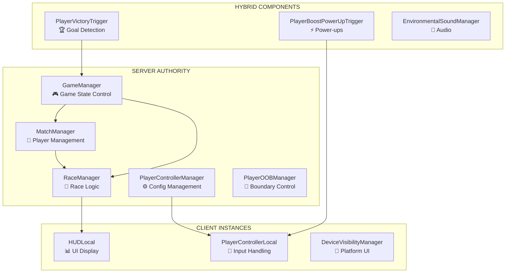
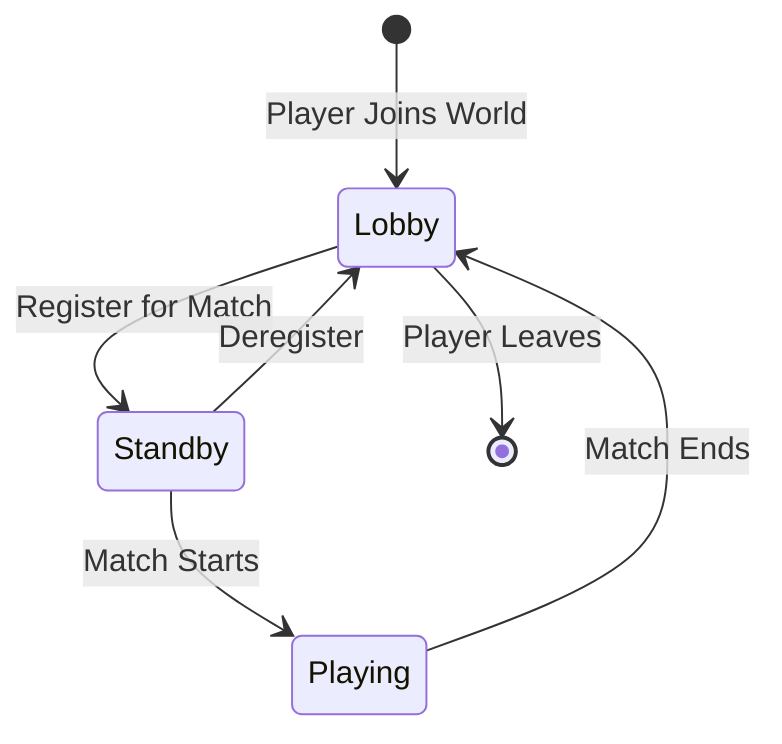
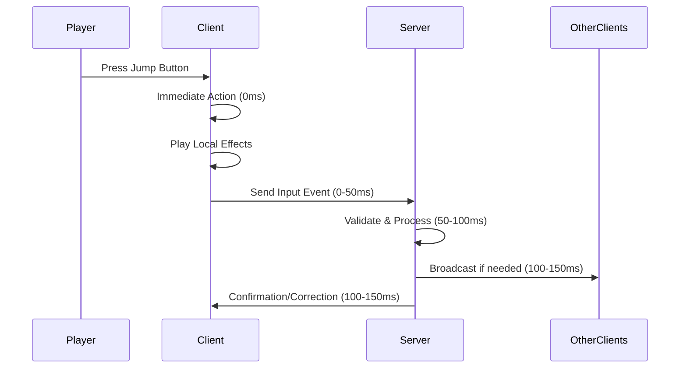
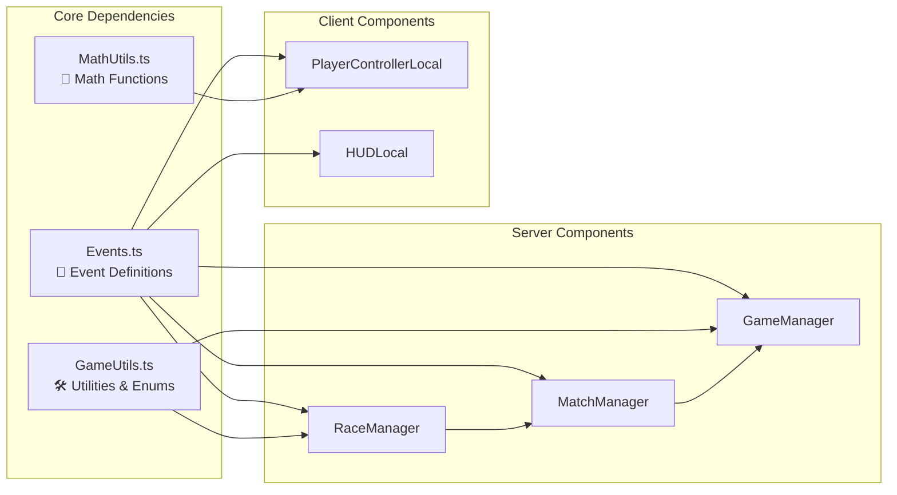

# 📖 TECHNICAL DOCUMENTATION - HORIZON WORLDS RACING GAME

## 📋 TABLE OF CONTENTS
1. [Project Overview](#project-overview)
2. [Architecture Overview](#architecture-overview)
3. [Server vs Client Scripts](#server-vs-client-scripts)
4. [Multiplayer System](#multiplayer-system)
5. [Input Flow & Latency Handling](#input-flow--latency-handling)
6. [Animation System](#animation-system)
7. [Code Structure](#code-structure)
8. [Development Guidelines](#development-guidelines)

---

## 🎮 PROJECT OVERVIEW

### **Project Type**
Multiplayer VR Racing Game built for **Meta Horizon Worlds** platform

### **Technology Stack**
- **Platform**: Meta Horizon Worlds (VR/Desktop/Mobile)
- **Language**: TypeScript 4.7.4
- **API**: Horizon Core API 2.0.0
- **Architecture**: Component-based with Event-driven communication
- **Networking**: Client-Server with Client-Side Prediction

### **Core Features**
- ✅ **Multiplayer Racing**: Up to multiple players simultaneously
- ✅ **Real-time Ranking**: Live position updates every 500ms
- ✅ **Advanced Track System**: Catmull-Rom spline-based curved tracks
- ✅ **Player Abilities**: Double jump, boost mechanics
- ✅ **State Management**: Comprehensive game flow control
- ✅ **Cross-platform**: VR, Desktop, Mobile support

---

## 🏗️ ARCHITECTURE OVERVIEW

### **System Architecture Diagram**


### **Core Managers (Singleton Pattern)**

#### **🎮 GameManager** (Server Authority)
- **Purpose**: Controls overall game state transitions
- **Responsibilities**:
  - Game state flow: `ReadyForMatch` → `StartingMatch` → `PlayingMatch` → `EndingMatch` → `CompletedMatch`
  - Timer management for each phase
  - UI updates and player notifications
  - World reset coordination

#### **👥 MatchManager** (Server Authority)
- **Purpose**: Manages player states and teleportation
- **Responsibilities**:
  - Player state tracking: `Lobby` → `Standby` → `Playing`
  - Spawn point teleportation
  - Player join/leave handling
  - State synchronization

#### **🏁 RaceManager** (Server Authority)
- **Purpose**: Handles race progress and ranking
- **Responsibilities**:
  - Real-time position calculation using curve mathematics
  - Player ranking and leaderboard
  - Race timing and completion detection
  - Winner announcement

---

## 🖥️ SERVER VS CLIENT SCRIPTS

### **🔍 Identification Patterns**

#### **Server Script Indicators:**
```typescript
// ✅ Singleton Pattern
private static s_instance: ClassName
public static getInstance(): ClassName

// ✅ Authority Checks
if (this.world.getPlayers().length === 0) {
  this.sendNetworkBroadcastEvent(Events.onResetWorld, {});
}

// ✅ Broadcast Events
this.sendLocalBroadcastEvent(Events.onGameStateChanged, data);
```

#### **Client Script Indicators:**
```typescript
// ✅ Owner Checks
if (this.owner === this.world.getServerPlayer()) {
  return; // Skip on server
}

// ✅ Input Handling
hz.PlayerControls.connectLocalInput(hz.PlayerInputAction.Jump, ...)

// ✅ Local Effects
this.doubleJumpSFX?.play(this.localSFXSettings!);
```

### **📊 Script Classification Table**

| Script | Type | Execution Context | Primary Function |
|--------|------|------------------|------------------|
| **GameManager.ts** | 🖥️ Server | Server Only | Game state authority |
| **MatchManager.ts** | 🖥️ Server | Server Only | Player state management |
| **RaceManager.ts** | 🖥️ Server | Server Only | Race progress calculation |
| **PlayerControllerManager.ts** | 🖥️ Server | Server Only | Controller pool management |
| **PlayerOOBManager.ts** | 🖥️ Server | Server Only | Out-of-bounds authority |
| **PlayerControllerLocal.ts** | 💻 Client | Client Only | Input handling & prediction |
| **HUDLocal.ts** | 💻 Client | Client Only | Personal UI display |
| **DeviceVisibilityManager.ts** | 💻 Client | Client Only | Platform-specific visibility |
| **PlayerVictoryTrigger.ts** | 🔄 Hybrid | All Contexts | Victory detection |
| **PlayerBoostPowerUpTrigger.ts** | 🔄 Hybrid | All Contexts | Power-up collection |
| **EnvironmentalSoundManager.ts** | 🔄 Hybrid | All Contexts | Audio management |

---

## 🌐 MULTIPLAYER SYSTEM

### **🎯 Player Management**

#### **Player Data Structure**
```typescript
export interface PlayerData {
  player: hz.Player;
  playerGameStatus: PlayerGameStatus; // Lobby, Standby, Playing
}

type RaceParticipant = { 
  player: hz.Player, 
  lastKnownRaceTime: number, 
  lastKnownRaceProgress: number, // 0.0 - 1.0 on track curve
  lastKnownPosition: hz.Vec3 
};
```

#### **Player State Flow**


### **📊 Real-time Ranking System**

#### **Progress Calculation Algorithm**
```typescript
// Every 500ms on server
private updateAllRacerCurveProgress(distThresholdCheckProgress: number) {
  this.raceParticipants.forEach((participant) => {
    const plyrPos = participant.player.position.get();
    
    // Only update if player moved significantly (performance optimization)
    if (plyrPos.distanceSquared(participant.lastKnownPosition) > 0.5) {
      // Use advanced curve mathematics for precise progress
      participant.lastKnownRaceProgress = this.raceCurve.findClosestPointCurveProgress(plyrPos);
      participant.lastKnownRaceTime = this.matchTime;
      participant.lastKnownPosition = plyrPos;
    }
  });
}
```

#### **Ranking Distribution**
```typescript
// Sort players by progress and send individual updates
const racePositions = Array.from(this.raceParticipants.values()).sort((a, b) => {
  return b.lastKnownRaceProgress - a.lastKnownRaceProgress;
});

racePositions.forEach((entry, index) => {
  this.sendNetworkEvent(entry.player, Events.onRacePosUpdate, {
    playerPos: (index + 1),
    totalRacers: this.raceParticipants.size,
    matchTime: this.matchTime
  });
});
```

### **🔄 State Synchronization**

#### **Event-Driven Architecture**
```typescript
// Network Events (Server ↔ Client)
onRacePosUpdate: new hz.NetworkEvent<{ playerPos: number, totalRacers: number, matchTime: number }>
onPlayerGotBoost: new hz.NetworkEvent
onResetWorld: new hz.NetworkEvent

// Local Events (Within same context)
onGameStateChanged: new hz.LocalEvent<{ fromState: GameState; toState: GameState; }>
onPlayerReachedGoal: new hz.LocalEvent<{ player: hz.Player }>
```

---

## ⚡ INPUT FLOW & LATENCY HANDLING

### **🎮 Client-Side Prediction Architecture**

#### **Input Processing Flow**


#### **Double Jump Implementation**
```typescript
// In PlayerControllerLocal.ts
this.connectedJumpInput.registerCallback((input, pressed) => {
  if (!pressed) return;
  
  this.hasJumped = true;
  
  if (!this.jump1 && !this.jump2) {
    this.jump1 = true; // First jump (built-in)
  } else if (this.jump1 && !this.jump2) {
    this.jump2 = true;
    
    // ⭐ IMMEDIATE CLIENT ACTION (0ms latency)
    let ownerVel = this.owner.velocity.get();
    this.owner.velocity.set(
      new hz.Vec3(ownerVel.x, this.doubleJumpAmount, ownerVel.z)
    );
    
    // ⭐ IMMEDIATE FEEDBACK
    this.doubleJumpSFX?.play(this.localSFXSettings!);
    
    // ⭐ NOTIFY SERVER (non-blocking)
    this.sendNetworkEvent(this.owner, Events.onPlayerUsedDoubleJump, {});
  }
});
```

### **🚀 Boost System with Server Authority**

#### **Server-Controlled Boost Availability**
```typescript
// Server grants boost ability
protected onPlayerEnterTrigger(enteredBy: hz.Player): void {
  this.sendNetworkEvent(enteredBy, Events.onPlayerGotBoost, {});
}

// Client can only boost when server allows
this.playerGotBoostSub = this.connectNetworkEvent(
  this.owner,
  Events.onPlayerGotBoost,
  () => {
    this.canBoost = true; // Server authority
    this.boostReceivedSFX?.play(this.localSFXSettings!);
  }
);
```

### **🔧 Latency Compensation Strategies**

#### **1. Immediate Local Feedback**
- ✅ Client executes action instantly (0ms perceived latency)
- ✅ Local SFX/VFX play immediately
- ✅ UI updates without waiting for server

#### **2. State Reconciliation**
```typescript
this.onUpdateSub = this.connectLocalBroadcastEvent(hz.World.onUpdate, () => {
  // Reset states when grounded (natural reconciliation point)
  if (this.hasJumped && this.owner.isGrounded.get()) {
    this.hasJumped = false;
    this.jump1 = false;
    this.jump2 = false;
    this.isBoosted = false;
  }
});
```

#### **3. Server Override Capability**
```typescript
this.connectLocalEvent(this.owner, Events.onResetLocalObjects, () => {
  this.reset(); // Server can force reset client state
});
```

---

## 🎭 ANIMATION SYSTEM

### **🤖 Built-in Locomotion (Automatic)**

Horizon Worlds automatically handles basic player animations based on physics properties:

```typescript
// These properties control automatic animations
locomotionSpeed: HorizonProperty<number>;     // Walking/Running speed
sprintMultiplier: HorizonProperty<number>;    // Sprint animation trigger
jumpSpeed: HorizonProperty<number>;           // Jump animation
isGrounded: ReadableHorizonProperty<boolean>; // Landing/Idle detection
```

#### **Automatic Animation States**
- **Idle**: `velocity = 0` && `isGrounded = true`
- **Walking**: Low `locomotionSpeed`
- **Running**: Higher `locomotionSpeed`
- **Sprinting**: `sprintMultiplier` applied
- **Jumping**: `isGrounded = false` && `velocity.y > 0`
- **Falling**: `isGrounded = false` && `velocity.y < 0`
- **Landing**: Transition from falling to grounded

### **🎯 Custom Animation API (Available but Unused)**

```typescript
// Custom avatar animations (not used in current project)
player.playAvatarAnimation(animation: Asset, options?: PlayAnimationOptions): void;
player.stopAvatarAnimation(options?: StopAnimationOptions): void;

// Grip pose animations for weapons
player.playAvatarGripPoseAnimationByName(
  avatarGripPoseAnimationName: string, 
  options?: PlayAvatarGripPoseAnimationOptions
): void;
```

### **🏗️ Entity Animations (World Objects)**

```typescript
// Used for gates and barriers
const animEnt = barrierEntity?.as(hz.AnimatedEntity);
if (animEnt) {
  if (isActivated) {
    animEnt.stop();   // Close gate
  } else {
    animEnt.play();   // Open gate
  }
}
```

### **📋 Animation Summary for Current Project**

| Animation Type | Implementation | Status |
|---------------|----------------|---------|
| **Player Idle** | 🤖 Built-in Automatic | ✅ Active |
| **Player Walking** | 🤖 Built-in Automatic | ✅ Active |
| **Player Running** | 🤖 Built-in Automatic | ✅ Active |
| **Player Jumping** | 🤖 Built-in Automatic | ✅ Active |
| **Double Jump** | 🎯 Physics-only (no custom anim) | ⚡ Physics |
| **Boost** | 🎯 Physics-only (no custom anim) | ⚡ Physics |
| **Gate Animations** | 🏗️ Entity Animations | ✅ Active |

---

## 📁 CODE STRUCTURE

### **📂 Directory Structure**
```
scripts/
├── 🖥️ Server Components
│   ├── GameManager.ts              # Game state authority
│   ├── MatchManager.ts             # Player state management
│   ├── RaceManager.ts              # Race logic & ranking
│   ├── PlayerControllerManager.ts  # Controller pool
│   └── PlayerOOBManager.ts         # Boundary management
│
├── 💻 Client Components
│   ├── PlayerControllerLocal.ts    # Input handling
│   ├── HUDLocal.ts                 # Personal UI
│   └── DeviceVisibilityManager.ts  # Platform visibility
│
├── 🔄 Hybrid Components
│   ├── PlayerVictoryTrigger.ts     # Goal detection
│   ├── PlayerBoostPowerUpTrigger.ts # Power-ups
│   ├── TeleportToSpawnPointTrigger.ts # Teleportation
│   └── EnvironmentalSoundManager.ts # Audio
│
├── 🛠️ Utilities
│   ├── Events.ts                   # Event definitions
│   ├── GameUtils.ts                # Enums, curves, utilities
│   └── MathUtils.ts                # Mathematical functions
│
└── 📝 Configuration
    ├── package.json                # Dependencies
    ├── tsconfig.json               # TypeScript config
    └── types/                      # Horizon API definitions
```

### **🔗 Component Dependencies**



### **🎯 Advanced Mathematics: Curve System**

#### **Catmull-Rom Spline Implementation**
```typescript
export class Curve {
  // Smooth interpolation between track points
  interpolate(t: number): hz.Vec3 {
    // Uses Catmull-Rom algorithm for smooth curves
    return this.interpolateCatmullRom(p0a, p1, p2a, p3, tNormalized);
  }

  // Find closest point on curve (for race progress)
  findClosestPointCurveProgress(target: hz.Vec3): number {
    // Uses Golden Section Search for optimization
    const tMin = this.goldenSectionSearch(f, 0, 1, 1e-4);
    return tMin;
  }
}
```

#### **Performance Optimizations**
- **Golden Section Search**: Statistically more efficient than binary search
- **Distance Threshold**: Only update progress when player moves significantly
- **Object Pooling**: Reuse player controllers and respawners
- **Selective Updates**: Stop sending updates to finished players

---

## 🛠️ DEVELOPMENT GUIDELINES

### **🔧 Setup Instructions**

#### **Prerequisites**
- Meta Horizon Worlds Creator Tools
- TypeScript 4.7.4
- Node.js (for development tools)

#### **Project Setup**
```bash
cd scripts/
npm install
```

#### **TypeScript Configuration**
```json
{
  "compilerOptions": {
    "allowJs": false,
    "strict": true,
    "typeRoots": ["types/"],
    "module": "CommonJS",
    "lib": ["ES2020"],
    "target": "ES2020",
    "declaration": true
  }
}
```

### **📝 Coding Standards**

#### **Component Structure**
```typescript
export class ComponentName extends hz.Component<typeof ComponentName> {
  static propsDefinition = {
    // Define properties here
  };

  // Private fields
  private field: Type;

  // Singleton pattern (for server components)
  private static s_instance: ComponentName;
  public static getInstance(): ComponentName {
    return ComponentName.s_instance;
  }

  constructor() {
    super();
    // Singleton initialization
  }

  preStart() {
    // Setup event listeners
    // Initialize properties
  }

  start() {
    // Post-initialization logic
  }

  dispose() {
    // Cleanup resources
  }
}

hz.Component.register(ComponentName);
```

#### **Event Naming Convention**
```typescript
// Network Events (cross-client communication)
onPlayerAction: new hz.NetworkEvent<DataType>("onPlayerAction")

// Local Events (same-context communication)
onLocalStateChange: new hz.LocalEvent<DataType>("onLocalStateChange")
```

#### **Error Handling**
```typescript
// Always check for null/undefined
if (!this.props.entity) {
  console.error("Required entity not found");
  return;
}

// Validate player ownership
if (this.owner === this.world.getServerPlayer()) {
  // Server-specific logic
} else {
  // Client-specific logic
}
```

### **🧪 Testing Guidelines**

#### **Multiplayer Testing**
1. **Single Player**: Test basic functionality
2. **Two Players**: Test synchronization
3. **Multiple Players**: Test scalability and edge cases
4. **Network Conditions**: Test with simulated latency

#### **Performance Testing**
- Monitor frame rate during races
- Check memory usage with multiple players
- Validate network traffic efficiency
- Test on different platforms (VR, Desktop, Mobile)

### **🚀 Deployment Process**

1. **Code Review**: Ensure adherence to standards
2. **Local Testing**: Verify functionality in Horizon Editor
3. **Staging**: Test in private Horizon World
4. **Production**: Deploy to public world
5. **Monitoring**: Watch for errors and performance issues

### **📊 Performance Metrics**

#### **Target Performance**
- **Frame Rate**: 60+ FPS on VR, 30+ FPS on mobile
- **Network Updates**: 2Hz for race positions (500ms interval)
- **Latency**: <100ms perceived input lag
- **Memory**: <500MB total usage

#### **Optimization Techniques**
- **Object Pooling**: Reuse expensive objects
- **Event Batching**: Combine multiple updates
- **Selective Broadcasting**: Only send relevant updates
- **Distance Culling**: Reduce updates for distant players

---

## 🎯 CONCLUSION

This racing game demonstrates advanced multiplayer game development on the Horizon Worlds platform, featuring:

- **Robust Architecture**: Clear separation between server authority and client prediction
- **Advanced Mathematics**: Sophisticated curve-based track system
- **Performance Optimization**: Efficient networking and resource management
- **Scalable Design**: Component-based architecture for easy extension

The codebase serves as an excellent foundation for understanding VR multiplayer game development and can be extended with additional features like custom animations, power-ups, or different game modes.

---

## 🏹 BONUS: CUSTOM ANIMATION EXAMPLE (ARCHERY SYSTEM)

### **Custom Animation Implementation**
For developers interested in implementing custom animations, here's an example of how to create an archery system with custom avatar animations:

```typescript
export class ArcheryController extends hz.Component<typeof ArcheryController> {
  static propsDefinition = {
    drawBowAnimation: { type: hz.PropTypes.Asset },
    aimBowAnimation: { type: hz.PropTypes.Asset },
    shootBowAnimation: { type: hz.PropTypes.Asset },
    reloadBowAnimation: { type: hz.PropTypes.Asset },
  };

  private currentState: ArcheryState = ArcheryState.Idle;
  private drawPower = 0.0;

  private startDrawBow() {
    this.currentState = ArcheryState.Drawing;

    // ⭐ PLAY CUSTOM ANIMATION
    this.owner.playAvatarAnimation(this.props.drawBowAnimation!, {
      looping: true,
      fadeInDuration: 0.2,
      mask: hz.AvatarAnimationMask.UpperBody,
      callback: (animation, reason) => {
        if (reason === hz.AnimationCallbackReasons.Started) {
          console.log("Draw animation started");
        }
      }
    });
  }

  private releaseBow() {
    // ⭐ TRANSITION TO SHOOT ANIMATION
    this.owner.stopAvatarAnimation({ fadeOutDuration: 0.05 });

    this.owner.playAvatarAnimation(this.props.shootBowAnimation!, {
      looping: false,
      fadeInDuration: 0.05,
      fadeOutDuration: 0.3,
      mask: hz.AvatarAnimationMask.UpperBody,
      playRate: 1.5,
      callback: (animation, reason) => {
        if (reason === hz.AnimationCallbackReasons.Started) {
          this.async.setTimeout(() => this.fireArrow(), 100);
        }
        else if (reason === hz.AnimationCallbackReasons.Completed) {
          this.startReload();
        }
      }
    });
  }
}

enum ArcheryState {
  Idle = "Idle",
  Drawing = "Drawing",
  Aiming = "Aiming",
  Shooting = "Shooting",
  Reloading = "Reloading"
}
```

### **Key Animation Features**
- **Multi-stage Animations**: Draw → Aim → Shoot → Reload
- **Animation Masks**: Target specific body parts (UpperBody)
- **Smooth Transitions**: fadeIn/fadeOut for seamless blending
- **Callback System**: Respond to animation events
- **State Management**: Clear animation state flow

---

**📞 For questions or contributions, please refer to the development team lead.**

*Last Updated: [Current Date]*
*Version: 1.0*
